# Model Serving Runbook — Onboard Any Model to TurnKey

One repeatable procedure for every model, regardless of source repo (`healthy`, `gigacast`, `carbon`).
Respect the boundary: **datasets + model ops are local; TurnKey serves + monitors** (see
`universal/rules/model-serving-boundary.md`).

```mermaid
flowchart LR
  A[Local: train + eval] --> B[Local: package .bentomodel + hash]
  B --> C[Local: push via TurnKeyClient]
  C --> D[TurnKey: register model]
  D --> E[TurnKey: push version]
  E --> F[TurnKey: promote staging → production]
  F --> G[TurnKey: wire alert config]
  G --> H[Hand out scoped consumer key]
  H --> I[Consumer app: predict + feedback]
```



## Step 0 — One-time: project + service account

- A TurnKey **project** exists for the source repo (e.g. `healthy`, slug `healthy`).
- A **service account** in that project (e.g. `healthy-svc@clearturn.tech`) holds a `train`+`predict`
  key used ONLY by the local pipeline to push models. Consumer apps get a separate `predict`-only key.

## Step 1 — Local: train (out of TurnKey scope)

Train in the source repo. Emit a bundle `joblib.dump({"model": ..., "features": [...],
"cat_features": [...], "category_maps": {...}, ...})` plus `metrics.json`.

## Step 2 — Local: package

`package_bentoml.py` must:
1. `sys.path.insert(0, <TURNKEY_REPO>)` and import the wrapper from TurnKey, e.g.
   `from turnkey.healthy_churn import HealthyChurnModel`.
2. Wrap the fitted model in that class (decode categorical codes → strings → predict).
3. `bentoml.picklable_model.save_model(name, wrapper)` then `bentoml.models.export_model(tag, out)`.
4. Write `bentoml_tag.json` (sidecar `{name, version}`) + `manifest.json` next to the `.bentomodel`.
5. Print the **bare 64-hex** `artifact_hash` = `sha256sum` of the `.bentomodel` bytes.

## Step 3 — Local: push (TurnKeyClient)

```python
from turnkey_client import TurnKeyClient
c = TurnKeyClient(url=..., api_key=...)          # reads TURNKEY_URL + TURNKEY_API_KEY
model_id = c.register_model(name="healthy-churn", model_type="custom", ...)
c.push_version(model_id, artifact_path=..., artifact_hash=..., feature_names=[...],
               framework="bentoml", framework_version="1.4.39", metrics={...})
c.promote_version(model_id, version_id, "staging")     # two-step state machine
c.promote_version(model_id, version_id, "production")
```

## Step 4 — TurnKey: serve

- Runtime needs the wrapper importable at `turnkey.<module>.<Class>` (already in the TurnKey tree).
- Artifact must be at `artifact_path` on the container FS (`/data/models/<name>/vN/<name>.bentomodel`).
- Import the BentoML tag in-container:
  `docker exec -u turnkey <container> python -c "import bentoml; bentoml.models.import_model('/data/models/<name>/vN/<name>.bentomodel')"`.

## Step 5 — TurnKey: wire monitoring

- **Accuracy snapshots** fire automatically (daily 00:00 UTC) from `PredictionLog.actual` — the
  consumer app MUST submit feedback (`POST /api/v1/feedback` `{request_id, actual}`) for this to be non-empty.
- **Drift (PSI)** fires automatically (daily 01:00 UTC) from baseline `feature_stats` saved at promotion.
- **Alerts**: create an `AlertConfig` per model (metric, threshold, consecutive_days):
  `POST /api/v1/monitor/models/{id}/alerts/configs`.

## Step 6 — Hand out consumer key (predict-only)

```bash
# as admin (JWT):
curl -sS -X POST https://turnkey.clearturn.tech/api/v1/auth/login \
  -H 'Content-Type: application/json' -d '{"email":"<ADMIN_EMAIL>","password":"<ADMIN_PASSWORD>"}'
# → {"access_token": "..."}

curl -sS -X POST https://turnkey.clearturn.tech/api/v1/accounts/<svc_account_id>/keys \
  -H 'Authorization: Bearer <access_token>' -H 'Content-Type: application/json' \
  -d '{"name":"<app>-consumer","permissions":["predict"]}'
# → {"plaintext_key": "sk-turnkey-healthy-..."}   ← shown ONCE
```

## Consumer contract

```
POST https://turnkey.clearturn.tech/api/v1/predict/{model_id}
Header: X-API-Key: <consumer key>
Body:   {"features": {"feature_name": value, ...}, "store_input": false}
→       {"prediction": <float>, "request_id": "...", ...}

POST https://turnkey.clearturn.tech/api/v1/feedback
Header: X-API-Key: <consumer key>
Body:   {"request_id": "<from predict>", "actual": <float>}   # enables accuracy monitoring
```

Notes:
- `model_id` is the 32-hex model UUID (from register/`GET /api/v1/models/`).
- Categorical features are sent as **float codes** (matching the persisted `category_maps` order).
- Every response includes `request_id` — persist it to feed back actuals later.

---

*Source: ~/ai-toolkit/shared/model-serving-runbook.md*
