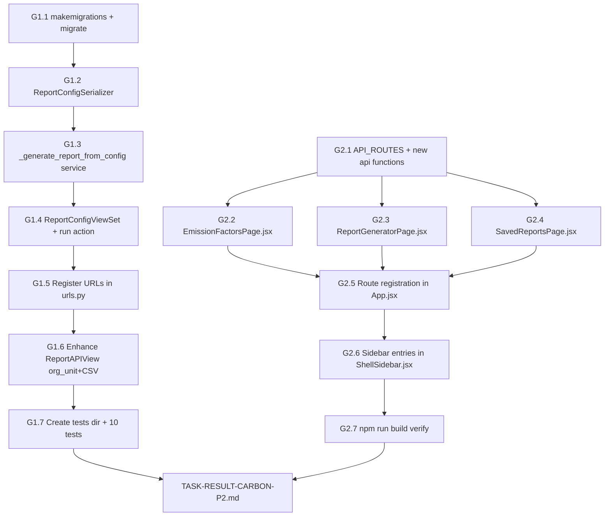

# Carbon P2 — Gap Analysis & Fresh Implementation Plan
> **Generated:** 2026-07-23  
> **Scope:** P2 Report Generator + Emission Factor Manager  
> **Reference:** `TASK-CARBON-P2-REPORT-FACTOR.md`, `docs/PLATFORM_APP_MODEL.md`, `plans/CARBON_PRODUCT_APPS_ARCHITECTURE.md`

---

## 1. Audit Results — Current State

### 1.1 P1 (Pre-requisite) — COMPLETE ✅

| Feature | Location | Status |
|---|---|---|
| `AssetProfileViewSet` org-unit scoping | `backend/catalog/views.py:200` | ✅ Done |
| `OwnerDashboardAPIView` | `backend/emissions/views.py:660` | ✅ Done |
| `DataOwnerPortalPage.jsx` | `carbon-frontend/src/pages/data-owner/` | ✅ Done |
| `DataOwnerDashboardPage.jsx` | `carbon-frontend/src/pages/data-owner/` | ✅ Done |
| `DataOwnerAssetsPage.jsx` | `carbon-frontend/src/pages/data-owner/` | ✅ Done |
| Routes: `/data-owner/*` | `carbon-frontend/src/App.jsx:162-164` | ✅ Done |
| `fetchOwnerDashboard()` | `carbon-frontend/src/api/emissions.js:173` | ✅ Done |

---

### 1.2 P2 G1 (Backend) — PARTIAL ⚠️

| Item | File | Status | Notes |
|---|---|---|---|
| `ReportConfig` model | `backend/emissions/models.py:739` | ✅ Added | Uses `accounts.User` (correct) |
| Migration `0005_reportconfig` | `backend/emissions/migrations/` | ❌ Missing | Only 4 migrations exist |
| `ReportConfigSerializer` | `backend/emissions/serializers.py` | ❌ Missing | Needs to append after line 173 |
| `_generate_report_from_config()` | `backend/emissions/views.py` | ❌ Missing | Service function not added |
| `ReportConfigViewSet` | `backend/emissions/views.py` | ❌ Missing | Class not added |
| URL registration | `backend/emissions/urls.py` | ❌ Missing | `router.register` not called |
| Enhanced `ReportAPIView` (org_unit+CSV) | `backend/emissions/views.py:468` | ❌ Missing | Only JSON, no org_unit param |
| Tests directory | `backend/emissions/tests/` | ❌ Missing | Directory doesn't exist |
| 10 tests | `backend/emissions/tests/test_report_config.py` | ❌ Missing | |

**Key technical notes:**
- `Calculation.activity_date` field EXISTS at `models.py:375` — date-range filtering will work
- `ReportConfig.include_unverified` maps to `ReportingPeriod.status` (not a `verified` flag on `Calculation`) — the service function should treat this as "include calcs from non-verified periods" or simply store as preference without filtering
- Task spec had `'auth.User'` but existing code correctly uses `'accounts.User'` — keep `accounts.User`

---

### 1.3 P2 G2 (Frontend) — NONE STARTED ❌

| Item | File | Status |
|---|---|---|
| `emissionsReportConfigs` route in `API_ROUTES` | `carbon-frontend/src/config.js` | ❌ Missing |
| `createEmissionFactor()` | `carbon-frontend/src/api/emissions.js` | ❌ Missing |
| `updateEmissionFactor()` | `carbon-frontend/src/api/emissions.js` | ❌ Missing |
| `deleteEmissionFactor()` | `carbon-frontend/src/api/emissions.js` | ❌ Missing |
| `fetchReportConfigs()` | `carbon-frontend/src/api/emissions.js` | ❌ Missing |
| `createReportConfig()` | `carbon-frontend/src/api/emissions.js` | ❌ Missing |
| `updateReportConfig()` | `carbon-frontend/src/api/emissions.js` | ❌ Missing |
| `deleteReportConfig()` | `carbon-frontend/src/api/emissions.js` | ❌ Missing |
| `runReportConfig()` | `carbon-frontend/src/api/emissions.js` | ❌ Missing |
| `generateReport()` | `carbon-frontend/src/api/emissions.js` | ❌ Missing |
| `downloadReportCsv()` | `carbon-frontend/src/api/emissions.js` | ❌ Missing |
| `EmissionFactorsPage.jsx` | `carbon-frontend/src/pages/emissions/` | ❌ Missing (dir doesn't exist) |
| `ReportGeneratorPage.jsx` | `carbon-frontend/src/pages/emissions/` | ❌ Missing |
| `SavedReportsPage.jsx` | `carbon-frontend/src/pages/emissions/` | ❌ Missing |
| Routes: `/admin/emission-factors`, `/data-owner/reports`, `/data-owner/reports/generate` | `App.jsx` | ❌ Missing |
| Sidebar entries (admin + data-owner) | `ShellSidebar.jsx` | ❌ Missing |

**What already exists (don't rebuild):**
- `fetchEmissionFactors()` at `emissions.js:78` — ✅ exists (different signature than spec but works)
- `fetchFactorCategories()` at `emissions.js:96` — ✅ exists
- `API_ROUTES.emissionsFactors`, `emissionsOwnerDashboard`, `emissionsReport`, etc — ✅ exist in `config.js`

---

### 1.4 Platform Architecture Gaps (vs `PLATFORM_APP_MODEL.md`)

These gaps are **acknowledged but deferred** to a future sprint per `Move 1 → Move 2 → Move 3` migration plan. P2 deliberately uses existing route/namespace conventions to avoid breaking changes.

| Gap | Current | Target (future) | When |
|---|---|---|---|
| Frontend route namespace | `/data-owner/*`, `/emissions/*` | `/carbon/*` | Move 2 |
| Backend API namespace | `/api/v1/emissions/*` | `/api/v1/carbon/*` for new | Move 2 |
| `manifest.js` for Carbon app | None | `carbon-frontend/src/apps/carbon/manifest.js` | Move 2 |
| App registry in Shell | None | `Shell.jsx` reads manifests | Move 2 |
| `carbon` studio in sidebar | None | Studio added to `ShellSidebar` | Move 2 |
| Ontology entity registry | None | L1 ontology layer | Move 3 |

**P2 stays on track**: The task spec routes (`/admin/emission-factors`, `/data-owner/reports/*`) are fully consistent with existing patterns. No architecture migration needed for P2.

---

## 2. Implementation Plan

### Architecture Diagram



---

## 3. G1 — Backend Track (Ordered Steps)

### G1.1 — Run migration for ReportConfig
- **File:** `backend/emissions/migrations/` (auto-generated)
- **Command:** `cd backend && python manage.py makemigrations emissions --name reportconfig && python manage.py migrate`
- **Verify:** Migration `0005_reportconfig.py` created; `python manage.py check` returns 0 issues
- **Note:** The model is already in `models.py:739` — just needs the migration created and applied

---

### G1.2 — Add ReportConfigSerializer
- **File:** `backend/emissions/serializers.py` — append after line 173 (end of file)
- **Also update:** Import `ReportConfig` from `.models` at top of serializers.py
- **Fields:** `id, name, created_by, created_by_username, reporting_period, reporting_period_name, custom_start, custom_end, org_unit, org_unit_name, ghg_scopes, categories, output_format, grouping, include_dq_status, include_unverified, last_run_at, created_at, updated_at`
- **Read-only:** `created_by, last_run_at, created_at, updated_at`
- **Extra source fields:** `created_by_username` (source: `created_by.username`), `reporting_period_name` (source: `reporting_period.name`), `org_unit_name` (source: `org_unit.name`)

---

### G1.3 — Add `_generate_report_from_config()` service function
- **File:** `backend/emissions/views.py` — insert as module-level function before `ReportConfigViewSet` (which will be before `OwnerDashboardAPIView` at line 660)
- **Signature:** `def _generate_report_from_config(config, user) -> dict`
- **Logic:**
  1. Start with `_scope_calcs(user, Calculation.objects.select_related(...))` 
  2. If `config.org_unit_id`: import `OrgUnit`, call `get_descendant_ids(include_self=True)`, filter `module__org_unit_id__in=descendant_ids`
  3. If `config.reporting_period_id`: filter `reporting_period_id`
  4. Elif `config.custom_start` and `config.custom_end`: filter `activity_date__gte/lte`
  5. If `config.ghg_scopes`: filter `scope__in`
  6. If `config.categories`: filter `category__in`
  7. Aggregate: scope breakdown, category breakdown, optional module breakdown (when `grouping == 'module'`)
  8. Return dict with: `config_id, config_name, reporting_period, date_range, org_unit_id, total_co2e_tonnes, calculation_count, scope_breakdown, category_breakdown, module_breakdown, generated_at`
- **Note on `include_unverified`:** No `verified` field on `Calculation`. Store as preference; skip filtering — it's a UI hint for future use.

---

### G1.4 — Add ReportConfigViewSet
- **File:** `backend/emissions/views.py` — insert after `_generate_report_from_config()`, before `OwnerDashboardAPIView`
- **Import needed:** Add `ReportConfig, ReportConfigSerializer` to imports at top of views.py
- **Methods:**
  - `get_queryset()`: superuser/staff → all; else → filter `created_by=user`
  - `perform_create()`: set `created_by=request.user`
  - `@action(detail=True, methods=['post']) def run()`: update `last_run_at`, call `_generate_report_from_config(config, user)`, return `Response(report_data)`
- **Permissions:** `IsAuthenticated`

---

### G1.5 — Register URLs
- **File:** `backend/emissions/urls.py`
- **Add import:** `ReportConfigViewSet` from `.views`
- **Add router registration:** `router.register(r'report-configs', ReportConfigViewSet, basename='report-config')` (after existing registrations at lines 24-28)
- **Result endpoints:**
  - `GET/POST /carbon-api/emissions/report-configs/`
  - `GET/PATCH/DELETE /carbon-api/emissions/report-configs/{id}/`
  - `POST /carbon-api/emissions/report-configs/{id}/run/`

---

### G1.6 — Enhance ReportAPIView
- **File:** `backend/emissions/views.py`, `ReportAPIView.get()` at line ~481
- **Add** before the `scope_totals` aggregation block:
  ```python
  org_unit_id = request.query_params.get('org_unit_id')
  if org_unit_id:
      from mdm.models import OrgUnit
      try:
          ou = OrgUnit.objects.get(pk=org_unit_id)
          descendant_ids = ou.get_descendant_ids(include_self=True)
          queryset = queryset.filter(module__org_unit_id__in=descendant_ids)
      except OrgUnit.DoesNotExist:
          pass
  ```
- **Add** CSV branch before final `return Response(report)`:
  ```python
  if report_format == 'csv':
      import csv, io
      from django.http import HttpResponse
      output = io.StringIO()
      writer = csv.writer(output)
      writer.writerow(['Scope', 'Category', 'CO2e (tonnes)', 'Count'])
      rows = queryset.values('scope', 'category').annotate(
          total_kg=Sum('co2e_kg'), count=Count('id')
      ).order_by('scope', 'category')
      ...
      response = HttpResponse(output.getvalue(), content_type='text/csv')
      response['Content-Disposition'] = 'attachment; filename="emissions_report.csv"'
      return response
  ```
- **Move** `report_format = request.query_params.get('format', 'json')` to top of `get()` (it's already there)

---

### G1.7 — Create Tests
- **Create directory:** `backend/emissions/tests/` with `__init__.py`
- **Create file:** `backend/emissions/tests/test_report_config.py`
- **Test class:** `class ReportConfigAPITest(TestCase)` with `APIClient` (follow pattern from `backend/catalog/tests/test_scoped_access.py`)
- **Fixtures in setUp:** Create user, superuser, org_unit (via `OrgUnit.objects.create()`), reporting_period, calculation records, `ReportConfig` instance
- **10 required tests:**
  1. `test_create_report_config` — POST creates config, `created_by=request.user`
  2. `test_list_own_configs_only` — User A cannot see User B's configs
  3. `test_staff_sees_all_configs` — Staff user can list all configs
  4. `test_run_config_returns_data` — POST to `/run/` returns `total_co2e_tonnes` + `scope_breakdown`
  5. `test_run_config_updates_last_run_at` — `last_run_at` updated after run
  6. `test_org_unit_filter` — config with `org_unit` only returns calcs from that subtree
  7. `test_ghg_scope_filter` — config with `ghg_scopes=[1]` returns only Scope 1 calcs
  8. `test_csv_export` — `GET /report/?format=csv` returns `Content-Type: text/csv`
  9. `test_unauthenticated_403` — unauthenticated user gets 403 on all config endpoints
  10. `test_delete_own_config` — user can DELETE own config; cannot DELETE others'
- **URL prefix:** `/carbon-api/emissions/` (matches test pattern from `backend/catalog/tests/test_scoped_access.py`)

---

## 4. G2 — Frontend Track (Ordered Steps)

### G2.1 — Add API route key and new functions to config.js + emissions.js

**`carbon-frontend/src/config.js`** — add to `API_ROUTES`:
```javascript
emissionsReportConfigs: "emissions/report-configs/",
```

**`carbon-frontend/src/api/emissions.js`** — add after `fetchReportingPeriodsFiltered()`:

Emission Factor mutations (CRUD — already have `fetchEmissionFactors` and `fetchFactorCategories`):
- `createEmissionFactor(token, data)`
- `updateEmissionFactor(token, id, data)`
- `deleteEmissionFactor(token, id)`

Report Config CRUD:
- `fetchReportConfigs(token)`
- `createReportConfig(token, data)`
- `updateReportConfig(token, id, data)`
- `deleteReportConfig(token, id)`
- `runReportConfig(token, id)`

Report generation:
- `generateReport(token, params)` — wraps existing `fetchEmissionsReport` with new param shape
- `downloadReportCsv(token, params)` — raw `fetch()` returning blob for browser download

---

### G2.2 — Create EmissionFactorsPage.jsx
- **File:** `carbon-frontend/src/pages/emissions/EmissionFactorsPage.jsx` (new dir `pages/emissions/`)
- **Pattern:** Follow `carbon-frontend/src/pages/catalog/AssetsPage.jsx` for DataGrid + drawer pattern
- **Components:**
  - Filter bar: search input, category select (`fetchFactorCategories`), scope select (1/2/3/All), active toggle
  - MUI DataGrid with columns: Name, Code, Category (Chip), Scope (badge), Factor Value, Activity Unit, Valid From, Active (boolean icon), Source
  - Create/Edit drawer: all factor fields (name, code, category, subcategory, scope, factor_value, factor_unit, activity_unit, valid_from, valid_to, source, source_url, country, country_code, notes, is_active)
  - Delete confirmation dialog
- **RBAC:** `const isAdmin = user?.is_staff || user?.is_superuser` — only admins see Create/Edit/Delete; data owners see read-only
- **Empty state:** "No emission factors found" + "Add Factor" button (if admin)
- **States:** loading, error (Alert), empty

---

### G2.3 — Create ReportGeneratorPage.jsx
- **File:** `carbon-frontend/src/pages/emissions/ReportGeneratorPage.jsx`
- **Pattern:** MUI `Stepper` (4 steps), state preserved across back/forward
- **Steps:**
  1. **PeriodStep** — select existing `ReportingPeriod` (from `fetchReportingPeriodsFiltered`) OR custom date range
  2. **ScopeStep** — org unit select (from `API_ROUTES.orgUnits`), GHG scopes checkboxes, categories multiselect, grouping dropdown
  3. **PreviewStep** — auto-fetch `generateReport()` on arrival; show total, scope breakdown table; Refresh button
  4. **ExportStep** — format radio (JSON/CSV), "Save Config for Reuse" → POST to `createReportConfig()` with snackbar, "Download CSV" → `downloadReportCsv()` → blob download, "Copy JSON" → clipboard
- **State shape:**
  ```javascript
  { reporting_period_id, custom_start, custom_end, org_unit_id,
    ghg_scopes: [1,2,3], categories: [], grouping: 'scope', output_format: 'json' }
  ```

---

### G2.4 — Create SavedReportsPage.jsx
- **File:** `carbon-frontend/src/pages/emissions/SavedReportsPage.jsx`
- **Pattern:** Simple list page (MUI List or DataGrid)
- **Data:** `fetchReportConfigs()` on mount
- **Columns/fields per row:** config name, created_by_username, last_run_at (relative time), reporting_period_name, org_unit_name
- **Actions per row:**
  - "Run" → `POST /report-configs/{id}/run/` → show result in expandable panel or navigate to ReportGeneratorPage pre-filled
  - "Edit" → inline rename or navigate
  - "Delete" → confirm → `deleteReportConfig()`
- **Empty state:** "No saved reports yet. Generate your first report." + button to `/data-owner/reports/generate`

---

### G2.5 — Route Registration in App.jsx
- **File:** `carbon-frontend/src/App.jsx`
- **Add imports:**
  ```jsx
  import EmissionFactorsPage from "./pages/emissions/EmissionFactorsPage";
  import ReportGeneratorPage from "./pages/emissions/ReportGeneratorPage";
  import SavedReportsPage from "./pages/emissions/SavedReportsPage";
  ```
- **Add routes** inside `<RequireAuth>` → `<RequireContext>` block:
  ```jsx
  {/* Emission Factor Manager — admin only */}
  <Route path="/admin/emission-factors" element={<AdminRoute><EmissionFactorsPage /></AdminRoute>} />

  {/* Report Generator — data owners + admins */}
  <Route path="/data-owner/reports" element={<SavedReportsPage />} />
  <Route path="/data-owner/reports/generate" element={<ReportGeneratorPage />} />
  ```

---

### G2.6 — Sidebar Entries in ShellSidebar.jsx
- **File:** `carbon-frontend/src/shell/ShellSidebar.jsx`
- **Admin studio** (`case 'admin'`) — add:
  ```javascript
  { label: 'Emission Factors', path: '/admin/emission-factors', icon: ScienceIcon },
  ```
- **Emissions studio** (`case 'emissions'`) — add:
  ```javascript
  { label: 'Emission Factors', path: '/admin/emission-factors', icon: ScienceIcon },
  { label: 'Report Generator', path: '/data-owner/reports/generate', icon: AssessmentIcon },
  { label: 'Saved Reports', path: '/data-owner/reports', icon: FolderIcon },
  ```
- **Import icons:** `ScienceIcon` from `@mui/icons-material/Science`, `FolderIcon` from `@mui/icons-material/Folder` (AssessmentIcon already imported)

---

## 5. File Change Summary

### New Files to Create
| File | Purpose |
|---|---|
| `backend/emissions/migrations/0005_reportconfig.py` | Auto-generated by makemigrations |
| `backend/emissions/tests/__init__.py` | Test package |
| `backend/emissions/tests/test_report_config.py` | 10 G1 tests |
| `carbon-frontend/src/pages/emissions/EmissionFactorsPage.jsx` | App 5 — Factor Manager |
| `carbon-frontend/src/pages/emissions/ReportGeneratorPage.jsx` | App 3 — Report Generator Wizard |
| `carbon-frontend/src/pages/emissions/SavedReportsPage.jsx` | Saved configs list |

### Files to Modify
| File | Changes |
|---|---|
| `backend/emissions/serializers.py` | Append `ReportConfigSerializer`; add `ReportConfig` to model imports |
| `backend/emissions/views.py` | Add `_generate_report_from_config()`, `ReportConfigViewSet`; enhance `ReportAPIView`; update imports |
| `backend/emissions/urls.py` | Import `ReportConfigViewSet`; add `router.register(r'report-configs', ...)` |
| `carbon-frontend/src/config.js` | Add `emissionsReportConfigs` key to `API_ROUTES` |
| `carbon-frontend/src/api/emissions.js` | Add 10 new API functions |
| `carbon-frontend/src/App.jsx` | Add 3 route imports + 3 route declarations |
| `carbon-frontend/src/shell/ShellSidebar.jsx` | Add sidebar entries to admin + emissions studios; add icon imports |

---

## 6. Acceptance Criteria (from spec)

### G1 Backend
- [ ] `python manage.py makemigrations emissions && python manage.py migrate` — no errors
- [ ] `python manage.py check` — 0 issues
- [ ] `ReportConfigViewSet` accessible at `/carbon-api/emissions/report-configs/`
- [ ] `POST /run/` returns `scope_breakdown` array and `total_co2e_tonnes` float
- [ ] `org_unit_id` param on `ReportAPIView` filters by subtree
- [ ] `GET /report/?format=csv` returns `Content-Type: text/csv`
- [ ] `created_by` auto-set; non-owners cannot see others' configs
- [ ] `python -m pytest emissions/tests/test_report_config.py -v` — 10 tests pass

### G2 Frontend
- [ ] `EmissionFactorsPage` renders data from `GET /emissions/factors/`
- [ ] Admins can create/edit/delete; data owners see read-only
- [ ] Category + scope filters work
- [ ] `ReportGeneratorPage` wizard: 4 steps, state preserved on back/forward
- [ ] Step 3 preview shows data from `GET /emissions/report/`
- [ ] Step 4 CSV download triggers browser file download
- [ ] Step 4 "Save Config" creates `ReportConfig` + snackbar
- [ ] `SavedReportsPage` lists configs; "Run" returns report data
- [ ] Routes resolve: `/admin/emission-factors`, `/data-owner/reports`, `/data-owner/reports/generate`
- [ ] Sidebar entries visible for correct roles
- [ ] `npm run build` — no errors

---

## 7. Result File

On completion: create `TASK-RESULT-CARBON-P2.md` at project root with:
- Implementation summary
- pytest output (G1)
- npm build confirmation (G2)
- New files list
- Any spec deviations and rationale
