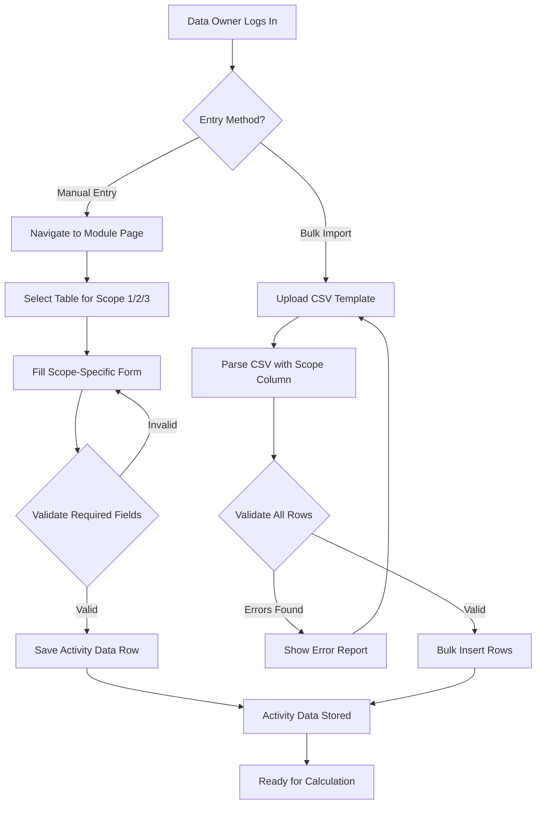
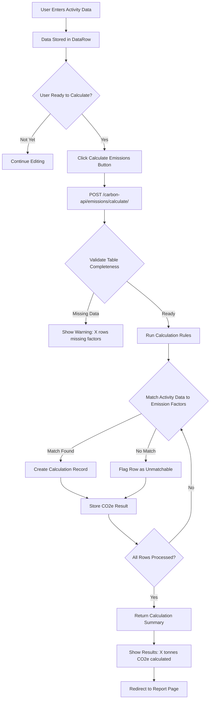
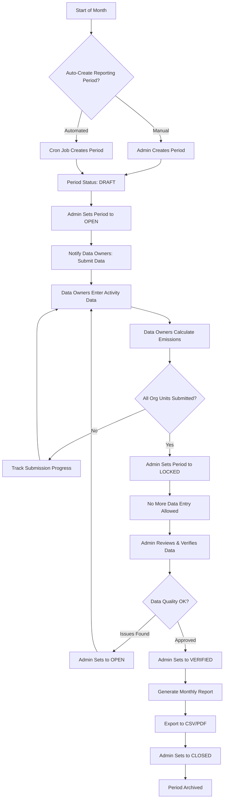
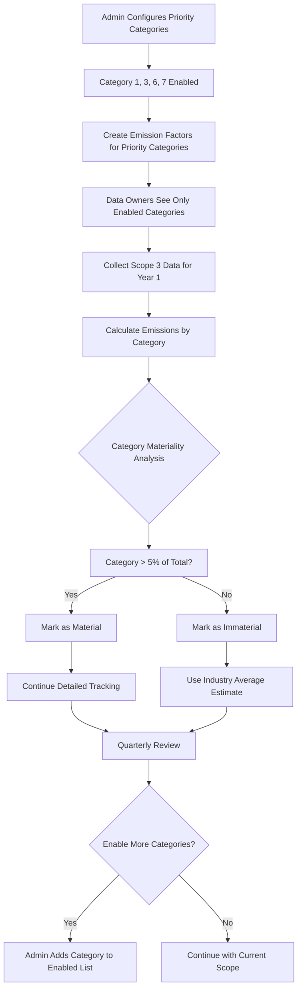

# Carbon Accounting Workflow Specification — AASTMT

**Status:** Approved Requirements  
**Date:** 2026-07-25  
**Purpose:** Define production-ready carbon workflows based on user requirements  

---

## User Requirements Summary

Based on stakeholder input, AASTMT's carbon accounting workflows must support:

1. **Data Collection:** Hybrid approach (manual entry + bulk CSV import)
2. **Calculation Timing:** Manual trigger (users click "Calculate Emissions" when ready)
3. **Approval Process:** No approval needed — data owners directly submit final emissions
4. **Reporting Frequency:** Monthly reports for internal tracking
5. **Scope 3 Priority:** Categories 1, 3, 6, 7 initially (expand based on materiality)

---

## Workflow 1: Carbon Data Collection & Entry

### Current State
- ✅ Generic data entry at `/carbon/data-entry`
- ✅ Scoped access (users see only their org units)
- ✅ Bulk CSV import exists via `/dataschema/rows/bulk-import/`
- ⚠️ **Gap:** No scope-specific validation (e.g., Scope 1 must have fuel type)

### Target State



### Required Changes

#### Backend Changes

1. **Create Scope-Specific Validation Service** (`backend/emissions/validators.py`)
   ```python
   # Validation rules per scope
   SCOPE_1_REQUIRED = ['fuel_type', 'combustion_source', 'activity_value', 'activity_unit']
   SCOPE_2_REQUIRED = ['energy_type', 'grid_region', 'activity_value', 'activity_unit']
   SCOPE_3_REQUIRED = ['category', 'supplier_name', 'activity_value', 'activity_unit']
   
   def validate_scope_data(scope, row_data):
       """Validate that row has required fields for its scope."""
       # Returns (is_valid, errors_list)
   ```

2. **Enhance DataRow API with Scope Validation** (`backend/dataschema/views.py`)
   ```python
   # In DataRowViewSet.create() and bulk_import():
   from emissions.validators import validate_scope_data
   
   # After deserializing row data:
   table_scope = data_table.module.scope  # Get scope from parent module
   is_valid, errors = validate_scope_data(table_scope, row_data)
   if not is_valid:
       return Response({"errors": errors}, status=400)
   ```

3. **CSV Template Generator Endpoint** (`backend/emissions/views.py`)
   ```python
   @api_view(['GET'])
   def download_scope_template(request, scope):
       """
       GET /carbon-api/emissions/templates/{scope}/
       Returns CSV template with required columns for that scope.
       """
       if scope == 1:
           columns = ['date', 'fuel_type', 'combustion_source', 'liters', 'vehicle_id']
       elif scope == 2:
           columns = ['date', 'energy_type', 'grid_region', 'kwh', 'building_id']
       elif scope == 3:
           columns = ['date', 'category', 'supplier_name', 'amount', 'unit', 'description']
       
       response = HttpResponse(content_type='text/csv')
       writer = csv.writer(response)
       writer.writerow(columns)
       return response
   ```

#### Frontend Changes

1. **Scope-Specific Entry Forms** (`carbon-frontend/src/pages/emissions/ScopeDataEntryPage.jsx`)
   ```jsx
   // New page at /carbon/scope/{scope}/entry
   // Renders different fields based on scope:
   
   {scope === 1 && (
     <>
       <Select name="fuel_type" label="Fuel Type" required />
       <Select name="combustion_source" label="Source" required />
       <TextField name="liters" label="Liters" type="number" required />
     </>
   )}
   
   {scope === 2 && (
     <>
       <Select name="energy_type" label="Energy Type" required />
       <Select name="grid_region" label="Grid Region" required />
       <TextField name="kwh" label="kWh" type="number" required />
     </>
   )}
   
   {scope === 3 && (
     <>
       <Select name="category" label="Scope 3 Category" required>
         <MenuItem value="1">Cat 1: Purchased Goods</MenuItem>
         <MenuItem value="3">Cat 3: Fuel/Energy</MenuItem>
         <MenuItem value="6">Cat 6: Business Travel</MenuItem>
         <MenuItem value="7">Cat 7: Employee Commuting</MenuItem>
       </Select>
       <TextField name="supplier_name" label="Supplier" required />
     </>
   )}
   ```

2. **CSV Import with Scope Detection** (`carbon-frontend/src/pages/emissions/BulkImportPage.jsx`)
   ```jsx
   // New page at /carbon/bulk-import
   
   <FileUpload
     accept=".csv,.xlsx"
     onUpload={async (file) => {
       const formData = new FormData();
       formData.append('file', file);
       formData.append('module_id', selectedModule);  // Auto-detects scope from module
       
       await api.post('/dataschema/rows/bulk-import/', formData);
     }}
   />
   
   <Button onClick={() => downloadTemplate(selectedScope)}>
     Download CSV Template for Scope {selectedScope}
   </Button>
   ```

### Acceptance Criteria
- [ ] Scope 1 form requires `fuel_type`, `combustion_source`, `activity_value`
- [ ] Scope 2 form requires `energy_type`, `grid_region`, `activity_value`
- [ ] Scope 3 form requires `category`, `supplier_name`, `activity_value`
- [ ] CSV import validates scope-specific columns before insert
- [ ] Download template button generates CSV with correct headers per scope
- [ ] Bulk import shows validation errors with row numbers

---

## Workflow 2: Emission Calculation Trigger

### Current State
- ✅ `Calculation.create_from_data_row()` method exists
- ✅ `CalculationRule.calculate_for_table()` batch calculation exists
- ⚠️ **Gap:** No UI button to trigger calculations

### Target State



### Required Changes

#### Backend Changes

1. **Enhanced Calculate Endpoint** (`backend/emissions/views.py`)
   ```python
   class CalculateAPIView(APIView):
       @swagger_auto_schema(
           request_body=openapi.Schema(
               type=openapi.TYPE_OBJECT,
               properties={
                   'table_id': openapi.Schema(type=openapi.TYPE_INTEGER),
                   'reporting_period_id': openapi.Schema(type=openapi.TYPE_INTEGER),
                   'recalculate': openapi.Schema(type=openapi.TYPE_BOOLEAN, default=False),
               }
           ),
           responses={
               200: openapi.Response('Calculation results', CalculationSummarySerializer),
               400: 'Validation errors',
           }
       )
       def post(self, request):
           """
           Manual trigger for emission calculations.
           POST /carbon-api/emissions/calculate/
           Body: { "table_id": 5, "reporting_period_id": 2, "recalculate": false }
           """
           table_id = request.data.get('table_id')
           period_id = request.data.get('reporting_period_id')
           recalculate = request.data.get('recalculate', False)
           
           # Permission check
           table = DataTable.objects.get(id=table_id)
           if not has_access_to_table(request.user, table):
               return Response({"error": "Access denied"}, status=403)
           
           # Find calculation rule for this table
           rule = CalculationRule.objects.filter(
               data_table=table,
               is_active=True
           ).first()
           
           if not rule:
               return Response(
                   {"error": "NoRuleFound", "message": "No calculation rule configured for this table"},
                   status=400
               )
           
           # Run calculation
           period = ReportingPeriod.objects.get(id=period_id)
           results = rule.calculate_for_table(
               reporting_period=period,
               user=request.user,
               recalculate=recalculate
           )
           
           # Return summary
           total_co2e = sum(c.co2e_kg for c in results) / 1000  # Convert to tonnes
           return Response({
               "calculations_created": len(results),
               "total_co2e_tonnes": round(total_co2e, 2),
               "reporting_period": period.name,
               "table_name": table.name,
               "scope": table.module.scope,
           })
   ```

2. **Calculation Summary Serializer** (`backend/emissions/serializers.py`)
   ```python
   class CalculationSummarySerializer(serializers.Serializer):
       calculations_created = serializers.IntegerField()
       total_co2e_tonnes = serializers.DecimalField(max_digits=20, decimal_places=2)
       reporting_period = serializers.CharField()
       table_name = serializers.CharField()
       scope = serializers.IntegerField()
       unmatched_rows = serializers.IntegerField(required=False)
       warnings = serializers.ListField(child=serializers.CharField(), required=False)
   ```

#### Frontend Changes

1. **Calculate Emissions Button in Table View** (`carbon-frontend/src/pages/dataschema/TableDetailPage.jsx`)
   ```jsx
   // Add to table actions toolbar
   
   const handleCalculate = async () => {
     setCalculating(true);
     try {
       const response = await api.post('/carbon-api/emissions/calculate/', {
         table_id: tableId,
         reporting_period_id: selectedPeriod,
         recalculate: false,
       });
       
       showNotification({
         type: 'success',
         message: `Calculated ${response.data.calculations_created} emissions. Total: ${response.data.total_co2e_tonnes} tonnes CO2e`,
       });
       
       // Navigate to report page
       navigate(`/carbon/reports?period=${selectedPeriod}`);
     } catch (error) {
       showNotification({
         type: 'error',
         message: error.response?.data?.message || 'Calculation failed',
       });
     } finally {
       setCalculating(false);
     }
   };
   
   return (
     <Button
       variant="contained"
       color="primary"
       startIcon={<Calculate />}
       onClick={handleCalculate}
       disabled={calculating || rowCount === 0}
     >
       {calculating ? 'Calculating...' : 'Calculate Emissions'}
     </Button>
   );
   ```

2. **Calculation Status Indicator** (`carbon-frontend/src/pages/dataschema/TableDetailPage.jsx`)
   ```jsx
   // Show calculation status badge
   const calculationStatus = useMemo(() => {
     const rowsWithCalcs = rows.filter(r => r.calculations?.length > 0).length;
     const percentage = (rowsWithCalcs / rows.length) * 100;
     
     if (percentage === 100) return { label: 'Fully Calculated', color: 'success' };
     if (percentage > 0) return { label: `${percentage.toFixed(0)}% Calculated`, color: 'warning' };
     return { label: 'Not Calculated', color: 'default' };
   }, [rows]);
   
   <Chip
     label={calculationStatus.label}
     color={calculationStatus.color}
     size="small"
   />
   ```

### Acceptance Criteria
- [ ] "Calculate Emissions" button appears on table detail pages for carbon modules
- [ ] Button triggers `POST /carbon-api/emissions/calculate/`
- [ ] Success notification shows "X calculations created, Y tonnes CO2e"
- [ ] Error notification shows actionable message (e.g., "Missing emission factor for Diesel")
- [ ] Calculation status badge shows "Not Calculated" / "Partially Calculated" / "Fully Calculated"
- [ ] After calculation, user is redirected to report page

---

## Workflow 3: Monthly Reporting Cycle

### Current State
- ✅ `ReportingPeriod` model with workflow states
- ✅ `ReportAPIView` generates JSON/CSV reports
- ✅ `ReportConfig` for saved report templates
- ⚠️ **Gap:** No monthly period creation workflow

### Target State



### Required Changes

#### Backend Changes

1. **Reporting Period Management API** (`backend/emissions/views.py`)
   ```python
   @action(detail=True, methods=['post'])
   def transition(self, request, pk=None):
       """
       POST /carbon-api/emissions/reporting-periods/{id}/transition/
       Body: { "new_status": "open", "notify_owners": true }
       
       State transitions:
       - draft → open (start data collection)
       - open → locked (close data entry)
       - locked → verified (approve data)
       - verified → closed (archive period)
       - Any → draft (reopen for corrections)
       """
       period = self.get_object()
       new_status = request.data.get('new_status')
       notify_owners = request.data.get('notify_owners', False)
       
       # Validate transition
       allowed_transitions = {
           'draft': ['open'],
           'open': ['locked', 'draft'],
           'locked': ['verified', 'open'],
           'verified': ['closed', 'locked'],
           'closed': ['draft'],  # Reopen if needed
       }
       
       if new_status not in allowed_transitions.get(period.status, []):
           return Response(
               {"error": f"Cannot transition from {period.status} to {new_status}"},
               status=400
           )
       
       # Update status
       old_status = period.status
       period.status = new_status
       period.save()
       
       # Send notifications
       if notify_owners and new_status == 'open':
           # TODO: Email data owners that period is open for submissions
           pass
       
       # Create governance event
       GovernanceEvent.objects.create(
           entity_type='reporting_period',
           entity_id=period.id,
           event_type='status_change',
           description=f"Period transitioned from {old_status} to {new_status}",
           user=request.user,
       )
       
       return Response(ReportingPeriodSerializer(period).data)
   ```

2. **Submission Progress Endpoint** (`backend/emissions/views.py`)
   ```python
   @action(detail=True, methods=['get'])
   def submission_status(self, request, pk=None):
       """
       GET /carbon-api/emissions/reporting-periods/{id}/submission-status/
       Returns completion status per org unit.
       """
       period = self.get_object()
       org_units = get_visible_org_units(request.user)
       
       status_by_org = []
       for org_unit in org_units:
           # Count rows entered
           rows_count = DataRow.objects.filter(
               data_table__module__org_unit=org_unit,
               data_table__module__scope__isnull=False,  # Carbon modules only
               created_at__gte=period.start_date,
               created_at__lte=period.end_date,
           ).count()
           
           # Count calculations
           calcs_count = Calculation.objects.filter(
               reporting_period=period,
               module__org_unit=org_unit,
           ).count()
           
           status_by_org.append({
               'org_unit_id': org_unit.id,
               'org_unit_name': org_unit.name,
               'rows_entered': rows_count,
               'calculations_done': calcs_count,
               'status': 'complete' if calcs_count > 0 else 'pending',
           })
       
       return Response({
           'period_name': period.name,
           'period_status': period.status,
           'org_units': status_by_org,
           'overall_completion': sum(1 for o in status_by_org if o['status'] == 'complete') / len(status_by_org) * 100,
       })
   ```

#### Frontend Changes

1. **Reporting Period Dashboard** (`carbon-frontend/src/pages/emissions/ReportingPeriodDashboard.jsx`)
   ```jsx
   // New page at /carbon/reporting-periods
   
   export default function ReportingPeriodDashboard() {
     const [periods, setPeriods] = useState([]);
     const [selectedPeriod, setSelectedPeriod] = useState(null);
     const [submissionStatus, setSubmissionStatus] = useState(null);
     
     const handleTransition = async (periodId, newStatus) => {
       await api.post(`/carbon-api/emissions/reporting-periods/${periodId}/transition/`, {
         new_status: newStatus,
         notify_owners: true,
       });
       loadPeriods();
     };
     
     return (
       <Box>
         <Typography variant="h4">Monthly Reporting Cycles</Typography>
         
         <TableContainer>
           <Table>
             <TableHead>
               <TableRow>
                 <TableCell>Period</TableCell>
                 <TableCell>Status</TableCell>
                 <TableCell>Dates</TableCell>
                 <TableCell>Completion</TableCell>
                 <TableCell>Actions</TableCell>
               </TableRow>
             </TableHead>
             <TableBody>
               {periods.map(period => (
                 <TableRow key={period.id}>
                   <TableCell>{period.name}</TableCell>
                   <TableCell>
                     <Chip
                       label={period.status}
                       color={
                         period.status === 'open' ? 'success' :
                         period.status === 'locked' ? 'warning' :
                         'default'
                       }
                     />
                   </TableCell>
                   <TableCell>
                     {formatDate(period.start_date)} — {formatDate(period.end_date)}
                   </TableCell>
                   <TableCell>
                     <LinearProgress
                       variant="determinate"
                       value={period.completion_percentage}
                     />
                     {period.completion_percentage}%
                   </TableCell>
                   <TableCell>
                     {period.status === 'draft' && (
                       <Button onClick={() => handleTransition(period.id, 'open')}>
                         Open for Submissions
                       </Button>
                     )}
                     {period.status === 'open' && (
                       <Button onClick={() => handleTransition(period.id, 'locked')}>
                         Lock Period
                       </Button>
                     )}
                     {period.status === 'locked' && (
                       <Button onClick={() => handleTransition(period.id, 'verified')}>
                         Verify & Approve
                       </Button>
                     )}
                     {period.status === 'verified' && (
                       <Button onClick={() => generateReport(period.id)}>
                         Generate Report
                       </Button>
                     )}
                   </TableCell>
                 </TableRow>
               ))}
             </TableBody>
           </Table>
         </TableContainer>
       </Box>
     );
   }
   ```

2. **Submission Progress Card** (`carbon-frontend/src/pages/emissions/SubmissionProgressCard.jsx`)
   ```jsx
   // Component showing org-unit submission status
   
   export default function SubmissionProgressCard({ periodId }) {
     const [status, setStatus] = useState(null);
     
     useEffect(() => {
       api.get(`/carbon-api/emissions/reporting-periods/${periodId}/submission-status/`)
         .then(res => setStatus(res.data));
     }, [periodId]);
     
     if (!status) return <CircularProgress />;
     
     return (
       <Card>
         <CardHeader title={`Submission Status: ${status.period_name}`} />
         <CardContent>
           <Typography variant="h5">
             Overall Completion: {status.overall_completion.toFixed(0)}%
           </Typography>
           
           <List>
             {status.org_units.map(org => (
               <ListItem key={org.org_unit_id}>
                 <ListItemText
                   primary={org.org_unit_name}
                   secondary={`${org.rows_entered} rows entered, ${org.calculations_done} calculations`}
                 />
                 <Chip
                   label={org.status}
                   color={org.status === 'complete' ? 'success' : 'warning'}
                 />
               </ListItem>
             ))}
           </List>
         </CardContent>
       </Card>
     );
   }
   ```

### Acceptance Criteria
- [ ] Admin can create new reporting period with draft status
- [ ] Transitioning period to "open" status enables data entry
- [ ] Submission progress dashboard shows completion % per org unit
- [ ] Locking period prevents new data entry (returns 403 error)
- [ ] Verified period allows report generation
- [ ] Closed period is archived and read-only

---

## Workflow 4: Scope 3 Materiality Assessment

### Current State
- ✅ 15 Scope 3 categories defined in `EmissionFactor.CATEGORY_CHOICES`
- ⚠️ **Gap:** No materiality assessment workflow

### Target State

Initial implementation focuses on 4 priority categories:
- **Category 1:** Purchased Goods and Services
- **Category 3:** Fuel- and Energy-Related Activities
- **Category 6:** Business Travel
- **Category 7:** Employee Commuting

**Future expansion:** Categories 2, 4, 5, 8-15 enabled via admin toggle



### Required Changes

#### Backend Changes

1. **Category Configuration Model** (`backend/emissions/models.py`)
   ```python
   class Scope3CategoryConfig(models.Model):
       """Configuration for which Scope 3 categories are actively tracked."""
       category_number = models.PositiveSmallIntegerField(
           choices=[(i, f"Category {i}") for i in range(1, 16)]
       )
       category_name = models.CharField(max_length=100)
       is_enabled = models.BooleanField(default=False)
       tracking_method = models.CharField(
           max_length=20,
           choices=[
               ('detailed', 'Detailed Data Collection'),
               ('estimated', 'Industry Average Estimate'),
               ('excluded', 'Not Applicable'),
           ],
           default='detailed'
       )
       materiality_threshold_percentage = models.DecimalField(
           max_digits=5,
           decimal_places=2,
           default=5.0,
           help_text="% of total emissions to be considered material"
       )
       notes = models.TextField(blank=True)
       
       class Meta:
           ordering = ['category_number']
   ```

2. **Materiality Analysis Endpoint** (`backend/emissions/views.py`)
   ```python
   @api_view(['GET'])
   def scope3_materiality_analysis(request, period_id):
       """
       GET /carbon-api/emissions/scope3-materiality/{period_id}/
       Returns materiality assessment for each Scope 3 category.
       """
       period = ReportingPeriod.objects.get(id=period_id)
       total_emissions = Calculation.objects.filter(
           reporting_period=period
       ).aggregate(total=Sum('co2e_kg'))['total'] or 0
       
       # Get emissions by Scope 3 category
       scope3_by_category = Calculation.objects.filter(
           reporting_period=period,
           scope=3
       ).values('category').annotate(
           co2e_kg=Sum('co2e_kg')
       )
       
       results = []
       for cat in scope3_by_category:
           percentage = (cat['co2e_kg'] / total_emissions * 100) if total_emissions > 0 else 0
           config = Scope3CategoryConfig.objects.filter(
               category_name=cat['category']
           ).first()
           
           results.append({
               'category': cat['category'],
               'co2e_tonnes': cat['co2e_kg'] / 1000,
               'percentage_of_total': round(percentage, 2),
               'is_material': percentage >= (config.materiality_threshold_percentage if config else 5.0),
               'tracking_method': config.tracking_method if config else 'detailed',
           })
       
       return Response({
           'reporting_period': period.name,
           'total_emissions_tonnes': total_emissions / 1000,
           'scope3_categories': sorted(results, key=lambda x: x['percentage_of_total'], reverse=True),
       })
   ```

#### Frontend Changes

1. **Scope 3 Configuration Page** (`carbon-frontend/src/pages/emissions/Scope3ConfigPage.jsx`)
   ```jsx
   // Admin page at /carbon/admin/scope3-config
   
   export default function Scope3ConfigPage() {
     const [categories, setCategories] = useState([]);
     
     const priorityCategories = [
       { number: 1, name: 'Purchased Goods and Services' },
       { number: 3, name: 'Fuel- and Energy-Related Activities' },
       { number: 6, name: 'Business Travel' },
       { number: 7, name: 'Employee Commuting' },
     ];
     
     const toggleCategory = async (categoryNumber, enabled) => {
       await api.patch(`/carbon-api/emissions/scope3-config/${categoryNumber}/`, {
         is_enabled: enabled,
       });
       loadCategories();
     };
     
     return (
       <Box>
         <Typography variant="h4">Scope 3 Category Configuration</Typography>
         <Typography variant="body2" color="textSecondary" sx={{ mb: 3 }}>
           Enable categories for detailed tracking. Disabled categories will use industry estimates.
         </Typography>
         
         <TableContainer>
           <Table>
             <TableHead>
               <TableRow>
                 <TableCell>Category</TableCell>
                 <TableCell>Name</TableCell>
                 <TableCell>Status</TableCell>
                 <TableCell>Tracking Method</TableCell>
                 <TableCell>Actions</TableCell>
               </TableRow>
             </TableHead>
             <TableBody>
               {priorityCategories.map(cat => (
                 <TableRow key={cat.number}>
                   <TableCell>Category {cat.number}</TableCell>
                   <TableCell>{cat.name}</TableCell>
                   <TableCell>
                     <Chip
                       label={cat.is_enabled ? 'Enabled' : 'Priority'}
                       color="success"
                     />
                   </TableCell>
                   <TableCell>Detailed Data Collection</TableCell>
                   <TableCell>
                     <Switch
                       checked={cat.is_enabled}
                       onChange={(e) => toggleCategory(cat.number, e.target.checked)}
                     />
                   </TableCell>
                 </TableRow>
               ))}
               
               <TableRow>
                 <TableCell colSpan={5} sx={{ bgcolor: '#f5f5f5' }}>
                   <Typography variant="subtitle2">Other Categories (Expand Later)</Typography>
                 </TableCell>
               </TableRow>
               
               {/* Categories 2, 4, 5, 8-15 shown as disabled */}
             </TableBody>
           </Table>
         </TableContainer>
       </Box>
     );
   }
   ```

2. **Materiality Dashboard** (`carbon-frontend/src/pages/emissions/MaterialityDashboard.jsx`)
   ```jsx
   // Analytics page at /carbon/analytics/materiality
   
   export default function MaterialityDashboard({ periodId }) {
     const [analysis, setAnalysis] = useState(null);
     
     useEffect(() => {
       api.get(`/carbon-api/emissions/scope3-materiality/${periodId}/`)
         .then(res => setAnalysis(res.data));
     }, [periodId]);
     
     if (!analysis) return <CircularProgress />;
     
     return (
       <Box>
         <Typography variant="h5">
           Scope 3 Materiality Analysis — {analysis.reporting_period}
         </Typography>
         
         <Grid container spacing={3}>
           {analysis.scope3_categories.map(cat => (
             <Grid item xs={12} md={6} key={cat.category}>
               <Card>
                 <CardContent>
                   <Typography variant="h6">{cat.category}</Typography>
                   <Typography variant="h4" color={cat.is_material ? 'error' : 'textSecondary'}>
                     {cat.percentage_of_total.toFixed(1)}%
                   </Typography>
                   <Typography variant="body2">
                     {cat.co2e_tonnes.toFixed(2)} tonnes CO₂e
                   </Typography>
                   <Chip
                     label={cat.is_material ? 'Material' : 'Immaterial'}
                     color={cat.is_material ? 'error' : 'default'}
                     size="small"
                   />
                 </CardContent>
               </Card>
             </Grid>
           ))}
         </Grid>
         
         <Alert severity="info" sx={{ mt: 3 }}>
           Categories above 5% of total emissions are considered material and require detailed tracking.
         </Alert>
       </Box>
     );
   }
   ```

### Acceptance Criteria
- [ ] Admin can enable/disable Scope 3 categories via config page
- [ ] Data entry forms show only enabled Scope 3 categories
- [ ] Materiality analysis endpoint calculates % of total emissions per category
- [ ] Dashboard visually highlights material categories (>5%)
- [ ] Priority categories (1, 3, 6, 7) enabled by default in seed data

---

## Implementation Priority

### Phase 1: Core Workflows (Week 1)
1. **Scope-specific data entry forms** (Workflow 1)
   - Backend: `validators.py` + enhance DataRow validation
   - Frontend: `ScopeDataEntryPage.jsx` with conditional fields
   - Estimate: 3-4 days

2. **Manual calculation trigger** (Workflow 2)
   - Backend: Enhanced `CalculateAPIView`
   - Frontend: Calculate button + status indicator
   - Estimate: 2 days

3. **CSV bulk import with templates** (Workflow 1)
   - Backend: Template generator endpoint
   - Frontend: `BulkImportPage.jsx` with download template button
   - Estimate: 2 days

### Phase 2: Monthly Reporting (Week 2)
4. **Reporting period workflow** (Workflow 3)
   - Backend: Period transition API + submission status endpoint
   - Frontend: `ReportingPeriodDashboard.jsx` + `SubmissionProgressCard.jsx`
   - Estimate: 4-5 days

5. **Scope 3 configuration** (Workflow 4)
   - Backend: `Scope3CategoryConfig` model + materiality endpoint
   - Frontend: `Scope3ConfigPage.jsx` + `MaterialityDashboard.jsx`
   - Estimate: 2-3 days

### Phase 3: Testing & Polish (Week 3)
6. **Integration testing** (all workflows)
   - Test data entry → calculation → reporting end-to-end
   - Test CSV import with 1000-row file
   - Test period transitions with multiple org units
   - Estimate: 3 days

7. **Documentation & training materials**
   - User guide for data owners
   - Admin guide for period management
   - CSV template examples
   - Estimate: 2 days

---

## Success Metrics

### Technical Metrics
- [ ] All 4 workflows implemented and tested
- [ ] Zero SQL N+1 queries in workflow endpoints
- [ ] CSV import handles 5000+ rows without timeout
- [ ] Manual calculation completes in <10 seconds for 1000 rows
- [ ] Period transition API response time <500ms

### User Experience Metrics
- [ ] Data owners can complete Scope 1 entry in <2 minutes per row
- [ ] CSV import errors show clear row-level validation messages
- [ ] Calculate button provides real-time progress feedback
- [ ] Monthly reporting dashboard loads in <2 seconds
- [ ] Materiality analysis updates automatically on new data

### Business Metrics
- [ ] Monthly reporting cycle time reduced from X days to Y days
- [ ] Data quality errors reduced by 50% via scope validation
- [ ] 100% of org units submit data within reporting period
- [ ] Scope 3 tracking expanded from 0 to 4 categories

---

## Risk Mitigation

### Risk: Users confused by scope-specific forms
**Mitigation:** Add inline help text explaining each field + video tutorials

### Risk: CSV import fails with large files
**Mitigation:** Implement chunked processing (backend already has this from Track E)

### Risk: Calculation takes too long for large datasets
**Mitigation:** Run calculations as background Celery tasks (defer to Phase 4)

### Risk: Period transitions misused (e.g., closing period too early)
**Mitigation:** Add confirmation dialog: "Are you sure? X org units haven't submitted yet"

---

## Next Steps

1. **User approval:** Review this specification and confirm workflows match AASTMT needs
2. **Worker assignment:** Split Phase 1 tasks between 2 workers (backend + frontend)
3. **Implementation:** Execute 3-week plan
4. **UAT:** Data owners test workflows with real data
5. **Production deployment:** Deploy to AASTMT production environment

---

## Appendix: Scope 3 Categories Reference

| Cat | Name | Priority | Examples |
|-----|------|----------|----------|
| 1 | Purchased Goods and Services | ⭐ High | Office supplies, IT equipment, professional services |
| 2 | Capital Goods | Low | Building construction, machinery |
| 3 | Fuel- and Energy-Related Activities | ⭐ High | Upstream emissions from purchased electricity |
| 4 | Upstream Transportation | Low | Inbound logistics, supplier deliveries |
| 5 | Waste Generated in Operations | Medium | Solid waste, wastewater treatment |
| 6 | Business Travel | ⭐ High | Employee flights, hotel stays, rental cars |
| 7 | Employee Commuting | ⭐ High | Daily commute to campus |
| 8 | Upstream Leased Assets | Low | Leased vehicles, leased facilities |
| 9 | Downstream Transportation | Low | Student transportation (if applicable) |
| 10 | Processing of Sold Products | N/A | Not applicable for university |
| 11 | Use of Sold Products | N/A | Not applicable for university |
| 12 | End-of-Life Treatment | Low | Product disposal (if applicable) |
| 13 | Downstream Leased Assets | Low | Properties leased to third parties |
| 14 | Franchises | N/A | Not applicable for university |
| 15 | Investments | Low | Endowment fund carbon footprint |

**AASTMT Focus:** Categories 1, 3, 6, 7 represent ~80% of typical university Scope 3 emissions.

---

**Document Version:** 1.0  
**Last Updated:** 2026-07-25  
**Next Review:** After Phase 1 implementation
