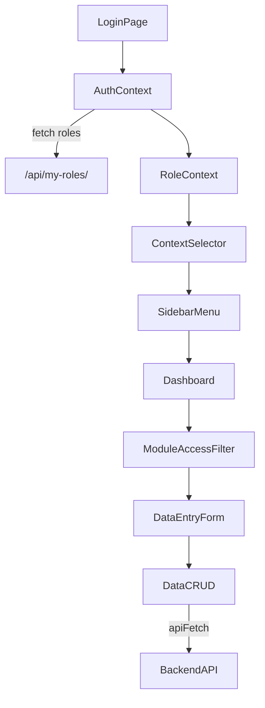
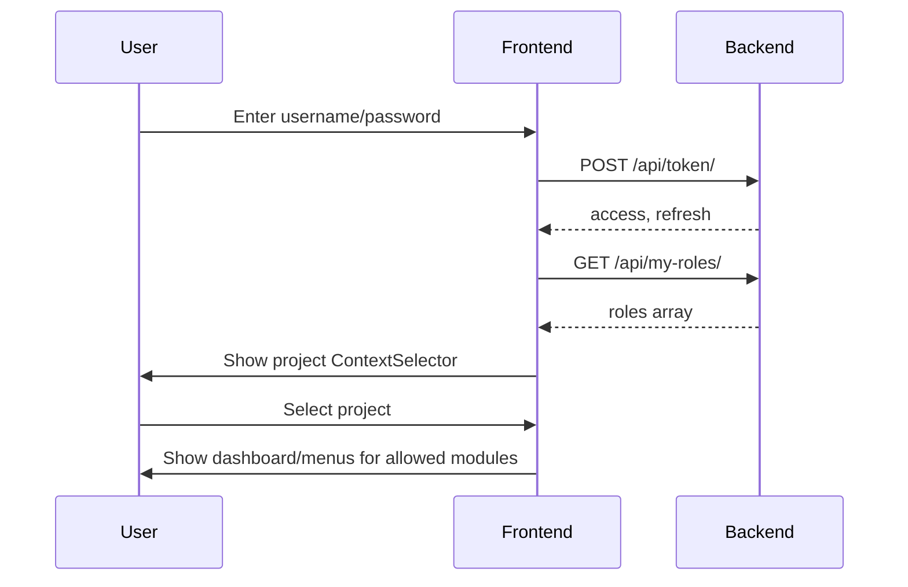
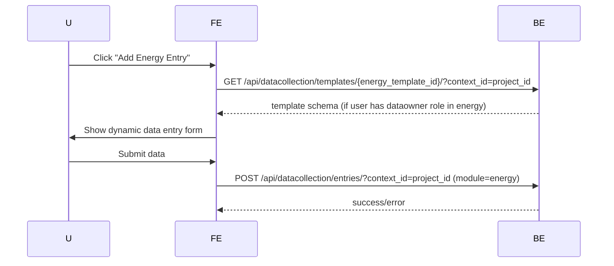

# Carbon Platform Frontend Developer Guide  
**(RBAC, Project Context, and Module-Level Access Control)**

---

## 1. **Architecture Overview**



---

## 2. **Core Concepts**

- **Project Context:**  
  Users select a **project** as their working context after login. All backend/API filtering is done by project.
- **Module-Based Access Control:**  
  Within the project, all data, templates, and permissions are organized by module (energy, water, gas, etc.).  
  *User may have roles in one or more modules of a project.*
- **RBAC:**  
  All features, menus, and data depend on the user's roles *within modules of the selected project*.

---

## 3. **Authentication & Role Fetching**

### Workflow:

1. **User logs in** → Receives tokens (JWT).
2. **Immediately fetch** `/api/my-roles/` with JWT.
3. **Store all role assignments** (including project, module, role, permissions, is_active) in `AuthContext`.
4. **Require project selection** (ContextSelector) before entering dashboards.

```js
const response = await fetch("/api/token/", { ... });
const { access, refresh } = await response.json();
localStorage.setItem("access", access);
localStorage.setItem("refresh", refresh);

const rolesRes = await fetch("/api/my-roles/", { headers: { Authorization: `Bearer ${access}` } });
const { roles } = await rolesRes.json();
setUser({ ...decoded, token: access, refresh, roles });
```

---

## 4. **Project Context Selection**

- **After login**, show a list of projects where the user has *any* active role.
- When a project is selected:
  - Save this as the working context (`currentContext`) in `AuthContext`.
  - All API calls and menus are now filtered by this project.

```jsx
const { setContext } = useAuth();
<Select
  value={selectedKey}
  onChange={e => {
    setSelectedKey(e.target.value);
    setContext(contexts.find(c => c.key === e.target.value));
  }}
>
  {contexts.map(ctx => (
    <MenuItem key={ctx.key} value={ctx.key}>{ctx.label}</MenuItem>
  ))}
</Select>
```

---

## 5. **Module Access Filter (in Dashboards)**

- **After project selection**, dashboards and sidebar menus should be filtered by the modules where the user has roles (active assignments).
- **DataOwner:**  
  Only show menu items and forms for modules where the user has an active DataOwner role.
- **Admin/Auditor:**  
  May see all modules in the project.

```js
// Example: Filter modules for DataOwner
const allowedModules = user.roles
  .filter(r =>
    r.project_id === currentContext.project_id &&
    r.role === "dataowner_role" && r.active
  )
  .map(r => r.module);
```

---

## 6. **Menu & Dashboard Routing Logic**

- **Sidebar menus** must be built from `menuConfig`, filtered by:
  - Current project context
  - Modules where user has at least one active role
  - Permissions in that module

- **Dashboards**: Load per role (Admin, Auditor, DataOwner) and only for modules the user is assigned to.

```js
// Only show menu for allowed modules
{allowedModules.includes("energy") && <MenuItem>Energy Data Entry</MenuItem>}
```

---

## 7. **API Usage Patterns**

### All API calls must:
- Use the latest access token (refresh if expired)
- Attach the `context_id` (project ID) as query param or header
- (Optionally) filter by module if needed

**Example using `apiFetch`:**
```js
const { user, currentContext } = useAuth();
const res = await apiFetch("/api/datacollection/entries/", {
  method: "POST",
  body: entryData,
  token: user.token,
  context: { context_id: currentContext.context_id }
});
```

---

## 8. **Role & Permission Logic in the UI**

- **After fetching roles**, filter sidebar/menu items, buttons, forms, etc. based on:
  - User’s roles in the current project and module
  - `is_active` flag
  - Permissions for that role (e.g., "manage_data")

**DataOwner Example:**
```js
const userRoles = user?.roles || [];
const canCRUD = (module) =>
  userRoles.some(
    r =>
      r.project_id === currentContext.project_id &&
      r.module === module &&
      r.role === "dataowner_role" &&
      r.active &&
      r.permissions.includes("manage_data")
  );
{canCRUD("energy") && <Button>Add Energy Entry</Button>}
```

---

## 9. **Data Entry Forms for DataOwners**

- DataOwners **cannot browse templates/items**.
- **Data entry forms** for modules they have access to must:
  - Use the backend template/schema for that module (fetchable only for allowed modules)
  - Not allow listing or browsing of templates/items outside the form context

**Pattern:**
- When DataOwner navigates to "Add Data" for a module, fetch the template for that module/form (using backend endpoint, permitted only if user has role).
- Do NOT show a list of all templates/items.

---

## 10. **Auditors and Admins**

- **Auditors**: Can view all modules within the selected project, view data items/templates, and CRUD data.
- **Admins**: Can CRUD data items/templates and assign roles for any module in the project.

---

## 11. **Error Handling**

- **If backend returns 401/403**, show error and force re-login or project/context change.
- **If user tries to access a module without an active role**, show “Access Denied”.

---

## 12. **Endpoint/Permission Matrix**

| Endpoint                                | Methods        | Admin       | Auditor     | DataOwner (assigned module) | Notes                        |
|------------------------------------------|---------------|-------------|-------------|-----------------------------|------------------------------|
| `/api/my-roles/`                        | GET           | ✓           | ✓           | ✓                           | Fetch user roles             |
| `/api/datacollection/entries/`           | GET/POST/PUT  | ✓           | ✓           | ✓                           | CRUD allowed per module      |
| `/api/datacollection/evidence-files/`    | GET/POST/PUT  | ✓           | ✓           | ✓                           | CRUD allowed per module      |
| `/api/datacollection/item-definitions/`  | GET/POST/PUT  | ✓           | GET only    | —                           | Create/edit: admin only      |
| `/api/datacollection/templates/`         | GET/POST/PUT  | ✓           | GET only    | —                           | Create/edit: admin only      |
| `/api/core/projects/`                    | GET           | ✓           | ✓           | ✓                           | Read-only (API)              |
| `/api/core/modules/`                     | GET           | ✓           | ✓           | ✓                           | Read-only (API)              |
| `/api/core/cycles/`                      | GET           | ✓           | ✓           | ✓                           | Read-only (API)              |
| `/api/accounts/users/`                   | GET           | ✓           | ✓           | ✓                           | Read-only (API)              |
| `/api/accounts/role-assignments/`        | GET           | ✓           | —           | —                           | Assign roles: admin only     |

---

## 13. **Secure REST API Patterns**

- **GET** is secure for data retrieval when endpoints are protected by JWT and RBAC.  
  Do not use GET for actions that change data.  
  Do not put sensitive secrets in query params.
- **POST/PUT/PATCH/DELETE** only for create/update/delete actions.

---

## 14. **Key UI/UX Patterns**

- **On login:**  
  Fetch roles, then require project selection.
- **On project change:**  
  Update menus, dashboards, and allowed modules based on new project.
- **Sidebar:**  
  Show only modules the user has roles in (active assignments).
- **Data Entry:**  
  DataOwners only see/enter data for their assigned modules within the project.
- **Templates/Items:**  
  DataOwners do not see these as standalone resources—only as part of allowed data entry forms.

---

## 15. **Example Workflows**

### **Login & Project Selection**



---

### **Module-Based Data Entry (DataOwner)**



---

### **Sidebar Filtering**

```js
const allowedModules = user.roles
  .filter(r =>
    r.project_id === currentContext.project_id &&
    r.active
  )
  .map(r => r.module);

const menuItems = menuConfig.filter(
  item => !item.moduleName || allowedModules.includes(item.moduleName)
);
```

---

## 16. **Best Practices & Notes**

- **Never hardcode roles/permissions.** Always use backend-provided roles/permissions.
- **Always check `is_active` on role assignments.**
- **All API calls must send the correct `context_id` (project id).**
- **Sidebar and dashboard logic must be dynamic, per user/project/module.**
- **DataOwners must not have access to templates/items except via allowed forms.**
- **Test users with multiple roles/modules.**
- **Always handle 401/403 with appropriate UI.**

---

## 17. **Appendix: Sample Role Object**

```js
{
  "role": "dataowner_role",
  "context_id": 12,
  "context_type": "module",
  "project": "Green HQ",
  "project_id": 3,
  "module": "energy",
  "module_id": 12,
  "permissions": ["manage_data", "view_data"],
  "active": true
}
```

---

## 18. **Resources**

- [React Router v6 Docs](https://reactrouter.com/en/main)
- [Material UI Docs](https://mui.com/)
- [JWT Decode](https://github.com/auth0/jwt-decode)
- [Mermaid Live Editor](https://mermaid.live/)

