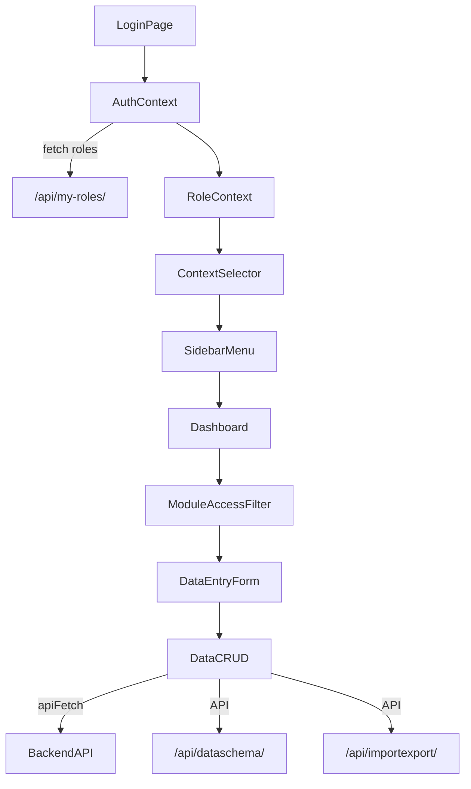
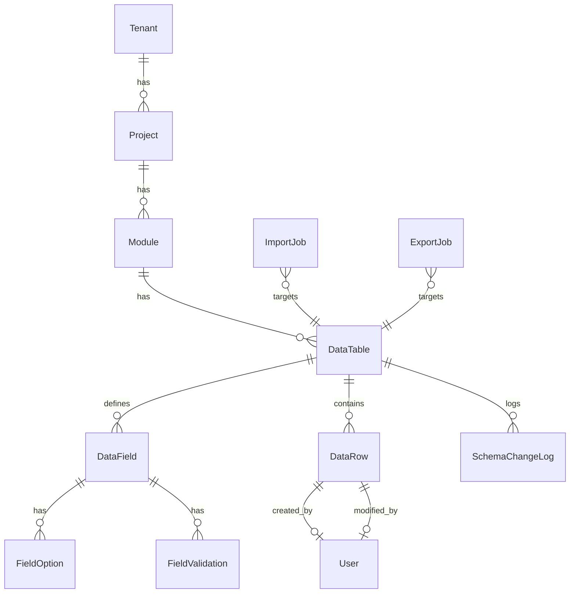
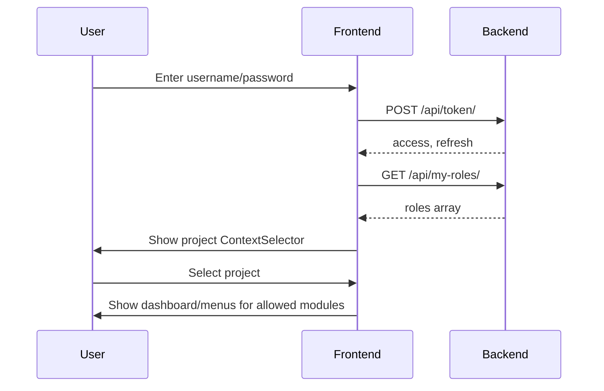

# Carbon Platform Developer Guide  
**(RBAC, Project Context, Dynamic Tables, Import/Export)**

---

## 1. **Architecture Overview**



---

## 2. **Core Concepts**

- **Tenants:**  
  Each organization (customer) is isolated as a tenant.

- **Projects & Modules:**  
  Each tenant can have multiple projects. Each project can have multiple modules (e.g., energy, water, HR).

- **RBAC (Role-Based Access Control):**  
  Roles and permissions are assigned per user, per context (project or module).

- **Project Context:**  
  After login, users must select a project context. All data and permissions are scoped to this context.

- **Dynamic Data Tables (dataschema app):**  
  Admins define custom tables/fields per module/project, with versioning, validation, and auditing.

- **Bulk Import/Export (importexport app):**  
  Large-scale data operations are handled via dedicated endpoints and job tracking.

---

## 3. **RBAC & Context System**

- **Models:**  
  - `Tenant`, `User`, `Role`, `Context`, `RoleAssignment` (`accounts/models.py`)
  - `Project`, `Module` (`core/models.py`)
- **Permissions:**  
  - RBAC is enforced everywhere via centralized utilities (`HasRBACPermission`, `user_has_permission`, etc.).
  - Views extract `project_id` using `ContextExtractorMixin`.
  - Roles have a `permissions` JSON list (e.g., `"manage_schema"`, `"manage_data"`, `"import_data"`).

- **API Example:**  
  ```python
  class MyViewSet(ContextExtractorMixin, viewsets.ModelViewSet):
      permission_classes = [HasRBACPermission]
      required_permission = "manage_data"
      ...
  ```

---

## 4. **App Responsibilities**

| App           | Responsibilities                                                            |
|---------------|-----------------------------------------------------------------------------|
| accounts/core | Tenants, projects, modules, users, cycles, RBAC, context selection          |
| dataschema    | Dynamic tables, fields, schema versioning, data rows, validation, audit     |
| importexport  | Bulk import/export of dataschema tables, job tracking, async, error logging |

---

## 5. **Frontend Workflow**

1. **Login:**  
   User logs in, receives JWT tokens.

2. **Role Fetching:**  
   Immediately fetch `/api/my-roles/` to load all active roles, permissions, and context.

3. **Project Context Selection:**  
   User must select a project (from those where they have a role).  
   All UI (menus, dashboards) and API calls are now filtered by this context.

4. **Module Filtering:**  
   Sidebar and dashboards show only the modules (within the selected project) where the user has a role.

5. **Permissions in UI:**  
   Buttons, forms, and menus are shown/hidden based on the user’s roles/permissions in the current project/module.

---

## 6. **API Endpoint Map**

### **accounts/core**

- `/api/accounts/users/` — List users (read-only)
- `/api/accounts/role-assignments/` — List role assignments
- `/api/accounts/my-roles/` — Get roles/permissions for current user
- `/api/core/projects/` — List projects
- `/api/core/modules/` — List modules

### **dataschema**

- `/api/dataschema/tables/` — CRUD data tables (admin only)
- `/api/dataschema/fields/` — CRUD fields (admin only)
- `/api/dataschema/rows/` — CRUD rows (per module RBAC)
- `/api/dataschema/schema-logs/` — View schema/audit logs
- `/api/dataschema/tables/{id}/archive/` — Soft-archive table
- `/api/dataschema/fields/{id}/archive/` — Soft-archive field

### **importexport**

- `/api/importexport/import/` — Upload file to import data
- `/api/importexport/import/{job_id}/status/` — Check import status
- `/api/importexport/import/{job_id}/log/` — See import errors/logs
- `/api/importexport/export/` — Start export job
- `/api/importexport/export/{job_id}/download/` — Download exported file

---

## 7. **Entity Relationships**



---

## 8. **Permissions & Roles (Typical)**

| Role     | Permissions                                                      |
|----------|------------------------------------------------------------------|
| Admin    | manage_project, manage_schema, manage_data, import_data, export_data, assign_roles |
| DataOwner| manage_data, export_data                                         |
| Auditor  | view_data, export_data                                           |

- **Project-level** or **module-level** roles are possible.
- Assign via the admin or the API.
- Extend by adding new permission strings to roles as your platform grows.

---

## 9. **Backend Best Practices**

- **Always use RBAC in every view:**  
  Use `HasRBACPermission` + `required_permission` + `ContextExtractorMixin`.
- **Never hardcode permissions in app logic.**
- **Always filter queries by tenant and project context.**
- **Audit all permission checks and data changes.**
- **Migrations:**  
  No changes needed for new apps—just add new permission strings to roles if needed.

---

## 10. **Frontend Best Practices**

- **On login:**  
  Fetch all user roles/permissions and store in context.
- **Require project selection before showing any data.**
- **Sidebar/dashboard:**  
  Show only modules/tables the user is allowed to access.
- **Data entry:**  
  DataOwners access only their modules/tables; admins see all.
- **Never expose template or schema management to DataOwners.**
- **Handle 401/403 errors with a clear UI and force re-login or project switch.**

---

## 11. **Example Workflows**

### **Login & Project Context**



### **Admin Creates Table & Imports Data**

1. Admin defines new table/fields for a module via `/api/dataschema/`.
2. Admin uploads a CSV via `/api/importexport/import/` with target table.
3. System validates, imports, logs results.
4. Users access/CRUD data rows via dataschema endpoints (with proper RBAC).

### **DataOwner Enters Data**

1. DataOwner accesses allowed tables via sidebar (filtered by module/project/roles).
2. DataOwner adds/edits rows via `/api/dataschema/rows/`.
3. Can export data if permitted via `/api/importexport/export/`.

---

## 12. **Extending the Platform**

- **Add new permissions** by updating the `permissions` list in the `Role` model.
- **Add new apps** by enforcing RBAC/context patterns (no model changes needed).
- **Add new import/export formats** by extending the importexport app.
- **Reference fields between tables** can be implemented in the dataschema app (future).

---

## 13. **Sample Role Object (API)**

```json
{
  "role": "dataowner_role",
  "context_id": 12,
  "context_type": "module",
  "project": "Green HQ",
  "project_id": 3,
  "module": "energy",
  "module_id": 12,
  "permissions": ["manage_data", "view_data"],
  "active": true
}
```

---

## 14. **Resources**

- [React Router v6 Docs](https://reactrouter.com/en/main)
- [Material UI Docs](https://mui.com/)
- [JWT Decode](https://github.com/auth0/jwt-decode)
- [Mermaid Live Editor](https://mermaid.live/)

---

## 15. **Appendix: Key Patterns**

### **Backend View Example (DRF + RBAC)**
```python
class DataTableViewSet(ContextExtractorMixin, viewsets.ModelViewSet):
    queryset = DataTable.objects.all()
    serializer_class = DataTableSerializer
    permission_classes = [HasRBACPermission]
    required_permission = "manage_schema"
    # ...rest of CRUD logic
```

### **Frontend API Call Example**
```js
const { user, currentContext } = useAuth();
const res = await apiFetch("/api/dataschema/rows/", {
  method: "POST",
  body: entryData,
  token: user.token,
  context: { context_id: currentContext.context_id }
});
```

---

**This guide is now your single reference for current and future Carbon Platform features and integrations.**  