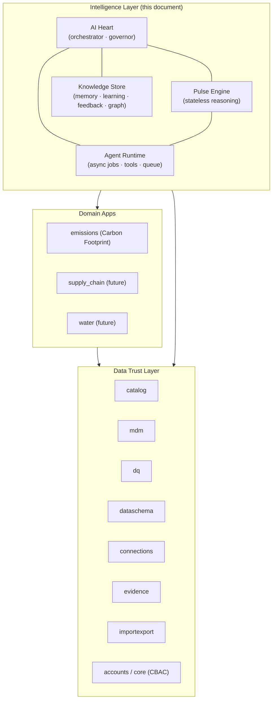
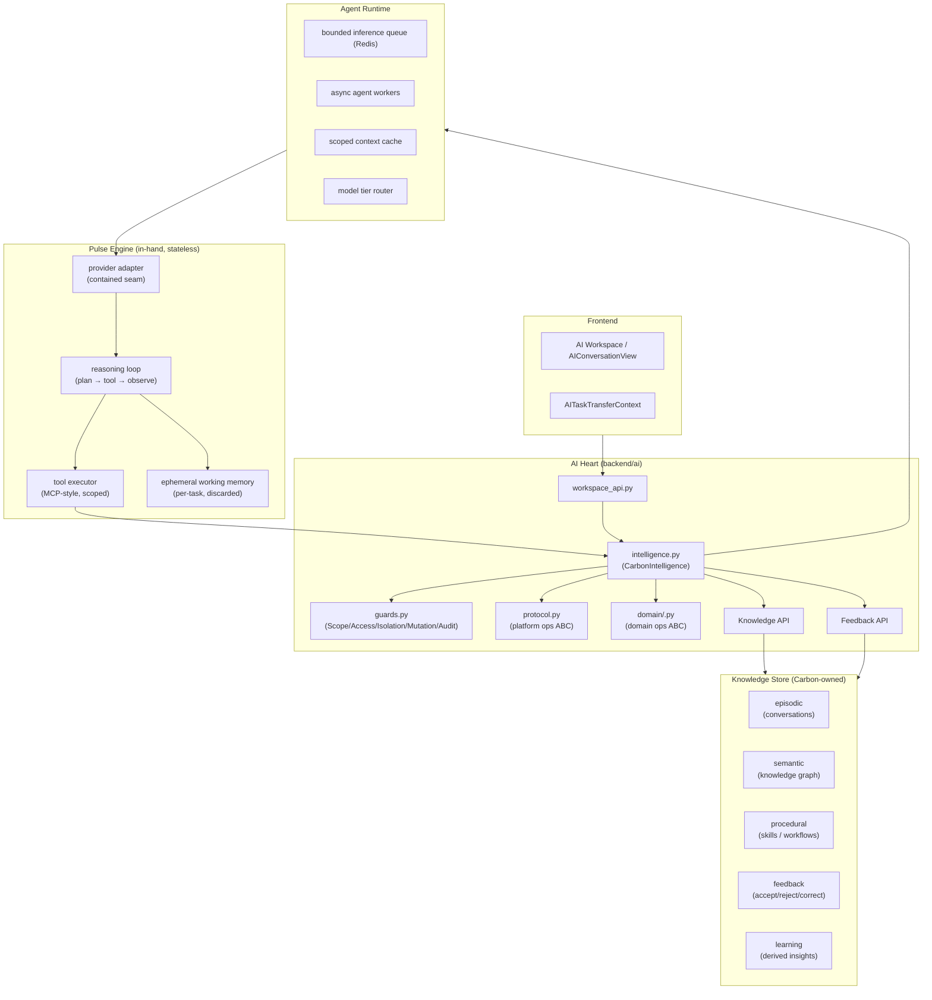
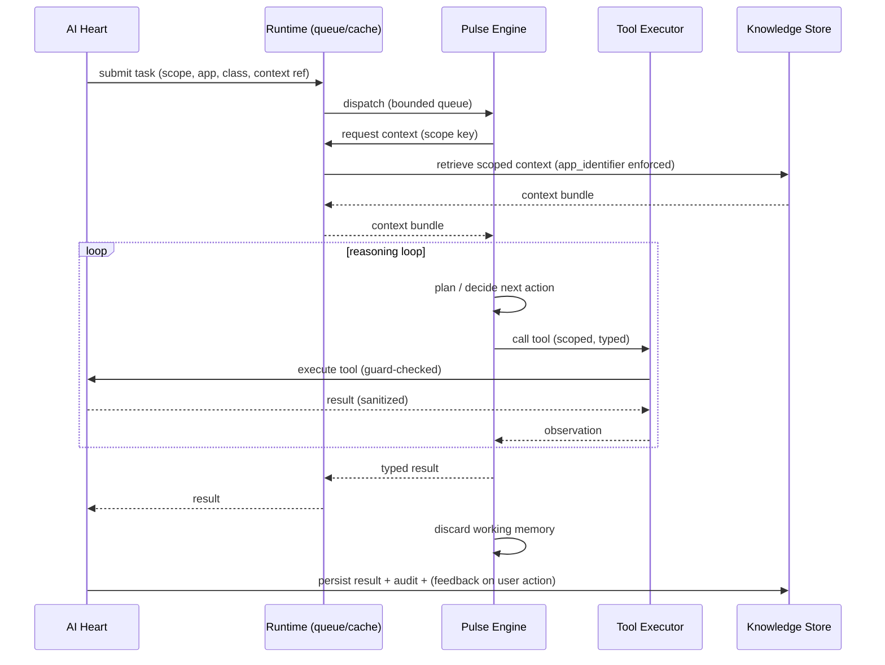
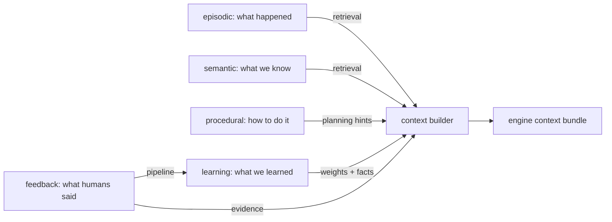
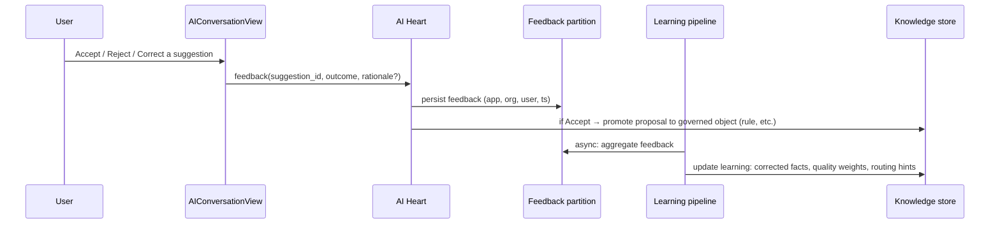
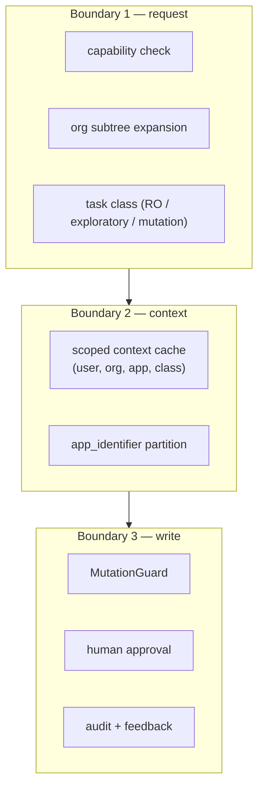

# Carbon Intelligence Layer — Deep Architecture

**Type:** Architecture (ADR-0007 companion)
**Scope:** Carbon Intelligence Layer only — the reasoning engine, the knowledge/memory/learning subsystem, the agent runtime, and the feedback loop. This is the layer that sits **above** the Data Trust Layer and **alongside** Domain Apps.
**Status:** Adopted direction (settled), implementation sequenced
**Last updated:** 2026-08-13
**Supersedes:** the "Pulse is external/swappable" framing in `docs/AI_WORKSPACE_ARCHITECTURE.md` §2, §4.2 and ADR-0004 §Decision (provider swappability clause only).

---

## 0. TL;DR

Carbon is a **System of Intelligence**, not a chat assistant bolted onto a database.

- **Carbon owns everything durable**: identity, scope, data, policy, knowledge, memory, learning, feedback, and the knowledge graph.
- **Pulse is an in-hand reasoning engine**: a genuine, co-deployed part of Carbon. It is **stateless** — it holds no memory, does no learning, stores no graphs. It *reasons* and *generates*; Carbon *remembers* and *learns*.
- **No provider swappability.** The engine is not a pluggable third-party abstraction. It is one component of one system with a first-class internal contract.
- **Every AI action is CBAC-scoped**: capability + org subtree + task type + policy. Multi-user isolation is a hard boundary, not a filter after the fact.
- **Performance is designed, not hoped for**: orchestration (Carbon) is decoupled from inference (Pulse engine); a bounded inference queue, model tiering, async agent jobs on Redis, and a scoped context cache keep latency and cost predictable.

This document is the deep reference. It explains *what each component is*, *why it is shaped that way* (grounded in prior art), *how data flows*, *what can go wrong*, and *how we sequence it*.

---

## 1. Positioning: where the Intelligence Layer sits

Carbon is three layers. The Intelligence Layer is the top one.



**Boundary rules (hard):**

| Layer | Owns | Never owns |
|-------|------|-----------|
| Data Trust Layer | raw/metadata truth, profiles, rules, lineage, CBAC identities | domain semantics, AI reasoning |
| Domain Apps | domain logic (GHG math, emission factors), app-specific services | cross-app knowledge, AI state |
| Intelligence Layer | reasoning, memory, learning, feedback, knowledge graph | raw row truth, domain-specific business rules of record |

A consequence: the Intelligence Layer may **read** everything (scoped), but may **write** only to its own knowledge store and to explicitly-approved domain objects (via human-approved actions, never auto-mutation).

---

## 2. Architectural axioms (settled, non-negotiable)

These encode the decisions the user drove. Every later section is a consequence.

1. **Carbon is the system of intelligence.** All durable AI state — memory, learning, feedback, knowledge — is Carbon's. Nothing durable lives "inside the model" or inside the engine.
2. **The engine is stateless.** Pulse holds per-task working memory only, and discards it when the task ends. No cross-task memory, no model fine-tuning, no graph ownership.
3. **The engine is in-hand, not swappable.** One engine, one contract, co-deployed. Remove `AI_PROVIDER_CLASS`-style runtime swapping. (Rule RULE_6 "no Pulse SDK" is reinterpreted: *no vendor SDK leaks into domain/core code*; the engine adapter is a single contained seam.)
4. **Knowledge is partitioned by `app_identifier`.** Emission knowledge cannot leak into supply-chain context and vice versa. Partitioning is the primary data-isolation mechanism above CBAC.
5. **CBAC is the gate, not a suggestion.** Capability + org subtree + task class (read-only / exploratory / mutation) + policy are resolved *before* any engine call. The context cache is scoped per (user, org subtree, app) — a cache miss on the wrong scope is a *denial*, not a fallback.
6. **No auto-mutation.** The engine proposes; Carbon persists; a human approves. Accept/reject/correct is the only path from proposal to action.
7. **Feedback is a first-class learning signal.** Every accept, reject, and correction is captured, attributed, and folded back into the knowledge store to improve future proposals.

---

## 3. Prior art and what we borrow (light research)

The design is intentionally not novel. It composes patterns proven in production systems. Key sources and the specific thing each contributes:

### 3.1 Anthropic — "Building effective agents" (Dec 2024)

> "Success in the LLM space isn't about building the most sophisticated system. It's about building the right system for your needs."

Borrowed principles:

- **Workflows vs agents are different things.** *Workflows* = LLM + tools orchestrated through predefined code paths. *Agents* = LLM dynamically directs its own process. We use **workflows for governance-critical tasks** (DQ validate, schema analyze) and **agents only for open-ended tasks** (exploratory analysis, report drafting), where a bounded loop + human checkpoints apply.
- **The augmented LLM** = model + retrieval + tools + memory. Our engine is exactly this; the "memory" augmentation is *Carbon-owned*, not engine-owned.
- **Orchestrator-workers** for tasks whose sub-steps can't be predicted (our async agent runtime).
- **Evaluator-optimizer** maps directly to our feedback loop: a critic evaluates a proposal, and human accept/reject is the optimization signal.
- **Routing** maps to model tiering: cheap model for classification/summarization, capable model for hard reasoning.
- **Three principles we adopt verbatim:** (1) simplicity, (2) transparency (show planning steps in the UI), (3) invest in the agent-computer interface — tool docs matter as much as prompts.

### 3.2 OpenAI Agents SDK

Borrowed concepts (we implement the *patterns*, not the SDK):

- **Guardrails run in parallel with execution and fail fast** — maps to our `guards.py` chain (`ScopeGuard`, `AccessGuard`, `DataIsolationGuard`, `MutationGuard`).
- **Handoffs vs manager-style orchestration** — we choose manager-style (AI Heart as single orchestrator) to preserve a single CBAC choke point.
- **Sessions as a persistent memory layer** — confirms the "persistent memory" primitive; in our case the *session* is Carbon's, not the engine's.
- **Tracing built in** — every task emits spans so the audit trail is continuous, not just endpoint logs.

### 3.3 Model Context Protocol (MCP)

> "Think of MCP like a USB-C port for AI applications."

Borrowed: a **uniform tool surface**. Every domain capability the engine may touch (read tables, read profiles, read rules, read lineage) is exposed as a **typed tool** with a schema, description, and CBAC-bound handler. The engine never touches Postgres directly; it calls tools through AI Heart. This is the single most important mechanism for both data isolation and auditability.

### 3.4 Ataccama ONE — the closest analog

Ataccama describes itself as *"the data trust layer regulated enterprises need"* and positions its **ONE AI Agent** as a *"digital data steward"* that *"plans and executes entire workflows autonomously."*

Borrowed concepts, mapped to Carbon:

| Ataccama concept | Carbon equivalent |
|------------------|-------------------|
| Data Trust Index (per-dataset trust score) | catalog `AssetProfile.quality_status` + `quality_score` |
| Central rule library (single source of truth for governed rules) | `dq` rules + the **knowledge store's procedural partition** |
| AI-powered rule creation → human review | `dq_suggest` workflow → `needs_input` → accept/reject |
| Augmented data lineage | catalog lineage + the knowledge graph |
| MCP server | our uniform tool surface (§3.3) |

The key lesson: **Ataccama couples an agentic steward to a governed trust layer, and every AI-proposed change passes through human approval.** Carbon is the same shape, with one addition Ataccama doesn't center: an *institutional memory* that learns from accept/reject.

### 3.5 Palantir Foundry — ontology + AIP

Borrowed: the **ontology** idea — a single semantic layer of objects, properties, and links that both humans and AI operate over, with security (markings + scopes) applied *on the ontology objects themselves*.

Carbon equivalent: the **knowledge graph** (semantic memory) is our lightweight ontology. CBAC scoping is applied at the graph-node level, so an agent resolving a node already walks a scope-checked traversal.

### 3.6 DataHub / OpenMetadata

Borrowed: catalog-as-graph with lineage and ownership. Carbon's catalog is the seed of the knowledge graph; the Intelligence Layer consumes it rather than re-inventing metadata.

**Synthesis — what makes Carbon's design distinct:**
1. The engine is genuinely stateless (most "AI platforms" let the agent stack own memory).
2. Learning is a *governed feedback loop*, not a model fine-tune — it is auditable, revertible, and scoped.
3. CBAC is enforced at the *context-cache* boundary, so even the context the model sees is multi-tenant-safe.

---

## 4. Component model (the full inventory)



### 4.1 AI Heart (orchestrator + governor)

Django app `backend/ai/`. This is the **only** place with authority to:

- receive task-transfer requests and resolve user scope/capability
- create/persist conversations and tasks
- run the guard chain
- decide sync vs async execution
- call the engine (through the runtime) and never vice versa
- persist engine output as Carbon-owned state
- record audit + feedback
- enforce the no-auto-mutation rule

**AI Heart is not the model.** It is the governor, mediator, and workflow controller (this role is unchanged from `AI_WORKSPACE_ARCHITECTURE.md` §4.1 — only its relationship to the engine changes).

### 4.2 Pulse Engine (in-hand, stateless)

The reasoning engine. Responsibilities:

- execute reasoning/generation/retrieval-assisted tasks
- run the reasoning loop: plan → call tools → observe → replan
- call **typed tools** exposed by AI Heart (never Postgres directly)
- return typed, structured results
- hold **ephemeral working memory** for the lifetime of one task

The engine must **never**:

- mutate Carbon state directly (all writes go through tool calls that are mutation-guarded)
- persist anything across tasks
- hold a knowledge graph or model fine-tune
- widen scope beyond what AI Heart passed in

**Contract shape** (single internal seam): the adapter in `backend/ai/providers/pulse.py` is the *only* module that speaks the engine's wire format. If the engine is ever replaced, only that adapter changes — but this is an implementation seam, not a runtime swappability guarantee. There is no `AI_PROVIDER_CLASS` setting.

### 4.3 Knowledge Store (Carbon-owned)

The durable brain. Five partitions, each with distinct write/read semantics:

| Partition | What it stores | Written by | Read by | Scope key |
|-----------|----------------|-----------|---------|-----------|
| **episodic** | conversation + task history, messages | AI Heart (append-only) | engine (retrieval), UI | `(user, org, app)` |
| **semantic** | knowledge graph: entities, links, lineage, glossary | ingestion + human curation | engine (retrieval), UI | `(app, org)` node-level |
| **procedural** | reusable skills/workflows/tool recipes | human + accepted proposals | engine (planning) | `app` |
| **feedback** | accept/reject/correct events with rationale | AI Heart on user action | learning pipeline | `(user, org, app)` |
| **learning** | derived insights: corrected facts, quality weights, routing hints | learning pipeline (async) | engine (context build) | `(org, app)` |

Key property: **`app_identifier` is a mandatory field on every record.** Cross-app reads are structurally impossible at query time (the retrieval query always carries `app_identifier`).

### 4.4 Agent Runtime (performance substrate)

Decouples *thinking* from *waiting*:

- **Bounded inference queue (Redis):** engine calls are jobs; the queue has a max depth. When full, new tasks are queued with backpressure (not dropped silently — they surface as `queued`).
- **Async agent workers:** long/open-ended tasks run on workers; short deterministic tasks run synchronously.
- **Model tier router:** classification/summarization → small model; reasoning/generation → capable model; NL→SQL → capable model. Routing is data-driven (task class + complexity heuristic + feedback-derived hints).
- **Scoped context cache:** the assembled prompt context for `(user, org subtree, app, task class)` is cached with a strict scope key. **A cache entry is never shared across org subtrees or apps.** Invalidation on any scope-relevant change (rule edit, profile update, feedback event).

### 4.5 Guards (unchanged in role, extended in scope)

From `backend/ai/guards.py`:

- `ScopeGuard` — scope non-empty; `app_identifier` matches operation
- `AccessGuard` — CBAC capability check for the target app + data
- `DataIsolationGuard` — sanitize provider responses; strip cross-app / out-of-scope data
- `MutationGuard` — block any mutation when `is_read_only: True`
- `AuditTrail` — every task transition + every tool call is recorded

**New:** guards now also enforce the **context-cache scope boundary** and the **knowledge-partition `app_identifier`** (§7).

---

## 5. The stateless-engine contract in detail

The engine's entire lifecycle, in one picture:



What "stateless" means, precisely:

1. **No cross-task memory.** Each task starts with context assembled fresh by AI Heart from the Knowledge Store. The engine does not "remember" a previous user.
2. **No learning.** The engine never updates weights or preferences. Learning happens in Carbon's async learning pipeline from the feedback partition.
3. **No graph ownership.** The engine queries the semantic partition through retrieval tools; it never writes nodes.
4. **Working memory is per-task and discarded.** Anything the loop needs mid-task lives in ephemeral memory, destroyed on completion/failure.

Why this shape (rather than a memoryful agent): it makes the engine **interchangeable, testable, and safe**. Memory is the highest-risk surface for data leakage and drift; by keeping it out of the engine, all leakage surface is concentrated in Carbon, where CBAC and `app_identifier` can be enforced deterministically.

---

## 6. Knowledge, memory, and the learning loop

This is the part that was **missing** in the prior architecture, and the core of the new direction.

### 6.1 Memory taxonomy

The prior architecture had only **episodic** memory (conversation history) and Pulse's opaque internals. The gap: no **semantic** (what do we *know* about the data), no **procedural** (what *skills* do we have), no **feedback** (what did users *accept/reject*), no **learning** (what *changed* as a result).



### 6.2 Feedback → learning loop

The UI today discards outcomes (`handleAcceptSuggestion` / `handleRejectSuggestion` in `AIConversationView.jsx` return without persisting). This is the single highest-value fix.



Loop properties:

- **Feedback is attributed** (user, org, app) — never anonymous, so it can be scoped and audited.
- **Accept promotes, reject demotes, correct overrides.** A "correct" carries the user's correction text and becomes a high-weight learning signal.
- **Learning is async and idempotent.** The pipeline runs off Redis; replaying it must converge (no drift).
- **Learning is revertible.** Insights are versioned; a bad generalization can be rolled back.

### 6.3 What learning improves (concretely)

| Signal | Improves |
|--------|----------|
| accepted DQ rules | the procedural partition — future `dq_suggest` proposes similar shapes first |
| rejected rules + reason | routing hints — avoid that shape for that table/org |
| corrected NL→SQL | semantic partition — the correct mapping is stored, so the same question next time is right |
| corrected facts | semantic partition — corrected entity attributes |
| per-org accept rate | model tiering — orgs with high rejection may get a more conservative path |

---

## 7. CBAC multi-user isolation (the hard part)

Multi-user correctness is the biggest risk in any shared-knowledge system. Three distinct isolation boundaries:



1. **Request boundary.** `CarbonIntelligence` resolves capability + org subtree + task class. If any is missing, fail closed.
2. **Context boundary.** The context cache and knowledge retrieval are keyed by `(user_id, org_subtree_hash, app_identifier, task_class)`. A user's context bundle is *never* reused for another user, another org, or another app. This is the boundary that prevents "the model saw another tenant's data."
3. **Write boundary.** No write without human approval; every write is audited and feeds feedback.

**Org subtree rule:** scope is expanded to the user's allowed org subtree once at request time and frozen into the task. Engine tool calls may only touch objects whose `org_unit_id` is in that frozen subtree. `DataIsolationGuard` re-checks every tool *result* and strips anything outside scope.

**The context cache as a CBAC boundary (new, important):** caching prompt context is a performance necessity, but an unscoped cache is a data-leak bug waiting to happen. The rule is: *the cache key includes the scope hash; a scope miss is a cache miss; and cache entries are invalidated on any scope-relevant mutation.* This makes the cache a **correctness mechanism**, not just a speedup.

---

## 8. Performance model

Four levers, each addressing a specific failure mode.

### 8.1 Decouple orchestration from inference

| Concern | Owner | Latency profile |
|---------|-------|-----------------|
| scope/capability resolution, persistence, guards, audit | AI Heart (Django, sync) | ms |
| reasoning, generation, tool loop | Pulse engine (async workers) | s–min |
| learning aggregation | learning pipeline (async) | off-peak |

The UI never blocks on inference. Short deterministic tasks (DQ validate, NL→SQL against cached context) may run synchronously only when the queue is empty and the model tier is "small/fast."

### 8.2 Bounded inference queue

- Redis-backed queue with `MAX_QUEUE_DEPTH` and per-org fairness.
- Backpressure is **visible**: a task shows `queued` with position, never a silent spinner.
- Saturation policy: shed the cheapest-to-recompute class first (cacheable NL queries), never drop mutation-relevant tasks.

### 8.3 Model tiering (routing)

| Task class | Tier | Rationale |
|------------|------|-----------|
| intent classification, summarization, field-type inference | small/fast | high volume, low stakes |
| DQ validate, rule suggestion, NL→SQL | capable | needs precision |
| anomaly analysis, report drafting, open-ended agents | capable + bounded loop | highest value, highest cost |

Routing is a **policy table in the knowledge store's learning partition**, so it can be tuned by feedback without code changes.

### 8.4 Scoped context cache

- Cache the assembled prompt context (tool schemas + retrieved knowledge + profile snippets).
- Key: `(user, org_subtree_hash, app, task_class, context_version)`.
- Invalidated by any scope-relevant write (rule edit, profile update, feedback event) via a version bump.

**Expected numbers (targets, not promises):** short deterministic tasks < 500 ms p50 (context cache hit + small tier); agentic tasks bounded by `MAX_AGENT_STEPS` and a wall-clock timeout; cache hit rate ≥ 70% for repeated NL queries within a scope.

---

## 9. Processes and workflows (end-to-end)

### 9.1 Task-transfer (entry)

Unchanged in spirit from `AI_WORKSPACE_ARCHITECTURE.md` §5, with one addition: transfer now also computes the **scope hash** and **task class** and stamps them on the conversation for later CBAC + cache use.

### 9.2 Suggest-rules workflow (the canonical loop, with feedback)

```mermaid
sequenceDiagram
  participant U as User
  participant UI as DQ Workspace
  participant H as AI Heart
  participant R as Runtime
  participant E as Engine
  participant K as Knowledge Store
  participant FB as Feedback

  U->>UI: "Suggest rules with AI"
  UI->>H: transferTask(dq_suggest, table context)
  H->>H: resolve capability + org subtree + class; freeze scope
  H->>R: submit task (scoped)
  R->>E: dispatch (bounded queue)
  E->>K: retrieve scoped context (profiles + procedural skills)
  K-->>E: context bundle
  E-->>R: suggestions + rationale + confidence
  R-->>H: typed result
  H->>K: persist suggestions as reviewable objects (needs_input)
  H-->>UI: render suggestions
  U->>UI: Accept / Reject / Correct
  UI->>H: feedback(outcome)
  H->>FB: persist feedback
  H->>K: if Accept → promote to governed rule
  FB-->K: async learning update
```

### 9.3 Open-ended agent (anomaly / report)

Uses the **orchestrator-workers** pattern within the engine loop, bounded by `MAX_AGENT_STEPS`. Every tool call is a typed, scoped, guard-checked call back through AI Heart. The engine pauses at checkpoints for human input (`needs_input`) when it hits ambiguity or a mutation proposal.

### 9.4 Learning pipeline (background)

Off-peak job: read the feedback partition, aggregate by `(org, app)`, update the learning partition (weights, corrected facts, routing hints), bump the context-cache version for affected scopes.

---

## 10. Issues, risks, and failure modes

The known failure modes — each with a mitigation. This is the "all the issues" section.

| # | Issue | Severity | Mitigation |
|---|-------|----------|-----------|
| I1 | Context-cache cross-scope leak (user A's context served to user B) | **Critical** | cache key includes scope hash; scope miss = miss; test with two orgs asserting zero shared entries |
| I2 | Knowledge partition leak across apps | **Critical** | `app_identifier` mandatory; retrieval query always carries it; `DataIsolationGuard` re-strips |
| I3 | Engine drift (stateless assumption violated by a future engine change) | High | adapter is the only engine seam; contract tests assert no engine persistence |
| I4 | Feedback loop poisoning (bad accept/reject data corrupts learning) | High | learning is versioned + revertible; per-org attribution; anomaly-flag feedback spikes |
| I5 | Inference queue starvation (one org floods the queue) | Medium | per-org fairness + backpressure + saturation policy |
| I6 | Cost blowup from unbounded agent loops | Medium | `MAX_AGENT_STEPS` + wall-clock timeout + model tiering |
| I7 | Silent failure / infinite polling in UI | Medium | terminal-state handling (unchanged from §12 of AI_WORKSPACE_ARCHITECTURE); queue position visible |
| I8 | Suggestions lose ids between response and accept/reject | Medium | persist before render (existing rule); feedback references the persisted id |
| I9 | Model tier mis-routing degrades precision | Low | routing is a data-driven policy table, tunable by feedback |
| I10 | Stale procedural knowledge (rules changed but skills not updated) | Medium | context-cache version bump on any procedural write |
| I11 | Learning pipeline non-idempotent (replay drifts) | Medium | pipeline is idempotent; replay converges |
| I12 | Multi-user CBAC wrong on dashboard-style aggregates | High | (inherited) aggregate scoping must be server-side; intelligence layer reads only scoped views |

**The two Critical items (I1, I2) are the reason for §7.** They must be covered by dedicated tests before anything else ships.

---

## 11. Governance and security guards (summary table)

| Guard | Enforces | Runs |
|-------|----------|------|
| `ScopeGuard` | scope non-empty, `app_identifier` matches | before dispatch |
| `AccessGuard` | CBAC capability for app + data | before dispatch |
| `DataIsolationGuard` | strip cross-app / out-of-scope from results | on every tool result + engine result |
| `MutationGuard` | block mutation when `is_read_only` | on every tool call |
| `AuditTrail` | every transition + tool call recorded | always |
| **context-cache scope** | no cross-scope context reuse | retrieval |
| **`app_identifier` partition** | no cross-app knowledge reads | retrieval |

---

## 12. Migration path from current code

Current state → target, in dependency order.

1. **Freeze the seam.** Remove `AI_PROVIDER_CLASS` runtime swapping; `backend/ai/providers/pulse.py` becomes the sole engine adapter. No behavior change yet.
2. **Persist feedback.** Wire `handleAcceptSuggestion` / `handleRejectSuggestion` / (new) `handleCorrectSuggestion` in `AIConversationView.jsx` to a feedback endpoint; persist `(suggestion_id, outcome, rationale)` in the feedback partition. *This unlocks the learning loop and is the highest-value, lowest-risk change.*
3. **Introduce the knowledge store.** Add `ai` models for the five partitions (episodic already exists as conversations; add semantic/procedural/feedback/learning). Migrations with `app_identifier` mandatory.
4. **Scoped context cache + retrieval.** Context builder reads from the store with `app_identifier` + scope hash; cache with scope key + version invalidation.
5. **Bounded queue + async workers.** Move agentic tasks off the request path onto Redis workers; add backpressure + fairness.
6. **Model tiering + routing policy table.**
7. **Learning pipeline** (async, idempotent, versioned).
8. **I1/I2 isolation tests** land with step 4, before any multi-user rollout.

Steps 2 and 3 are the "knowledge/learning phase" that should be inserted as **Phase 2.5** in the phased plan so the UX builds on top of the feedback loop rather than retrofitting it.

---

## 13. Decision record summary

| Item | Decision |
|------|----------|
| Engine location | in-hand, co-deployed |
| Engine state | stateless; per-task working memory only |
| Provider swappability | removed |
| Durable memory/learning/graph | Carbon-owned (Knowledge Store) |
| Knowledge partitioning | by `app_identifier` (mandatory) |
| Multi-user isolation | CBAC at request + context + write boundaries |
| Performance | decouple orchestration/inference; bounded queue; model tiering; scoped cache |
| Feedback | first-class; accept/reject/correct → learning pipeline |
| Mutation | never automatic; human-approved only |

**ADR status:** this document is the deep companion to **ADR-0007** (to be filed). ADR-0004's provider-swappability clause and `AI_WORKSPACE_ARCHITECTURE.md` §2/§4.2's "external, swappable" language are superseded by §2 above. `project.config.md` RULE_6 and RULE_13 require amendment to reflect the in-hand engine and the feedback obligation.

---

## 14. References

- Anthropic, *Building Effective Agents* (Dec 2024) — workflow/agent split, augmented LLM, orchestrator-workers, evaluator-optimizer, ACI.
- OpenAI Agents SDK docs — guardrails, handoffs, sessions, tracing, MCP tool calling.
- Model Context Protocol — uniform tool surface for AI apps.
- Ataccama ONE — "data trust layer", ONE AI Agent as digital data steward, Data Trust Index, central rule library.
- Palantir Foundry — ontology + AIP, security on ontology objects.
- Carbon internals: `docs/AI_WORKSPACE_ARCHITECTURE.md`, `docs/PULSE_CONTRACT_SPEC.md`, `backend/ai/intelligence.py`, `backend/ai/guards.py`, `backend/ai/protocol.py`, `backend/ai/domain_protocol.py`, `backend/ai/providers/pulse.py`, `backend/ai/providers/_http.py`, ADR-0004/0005/0006.
