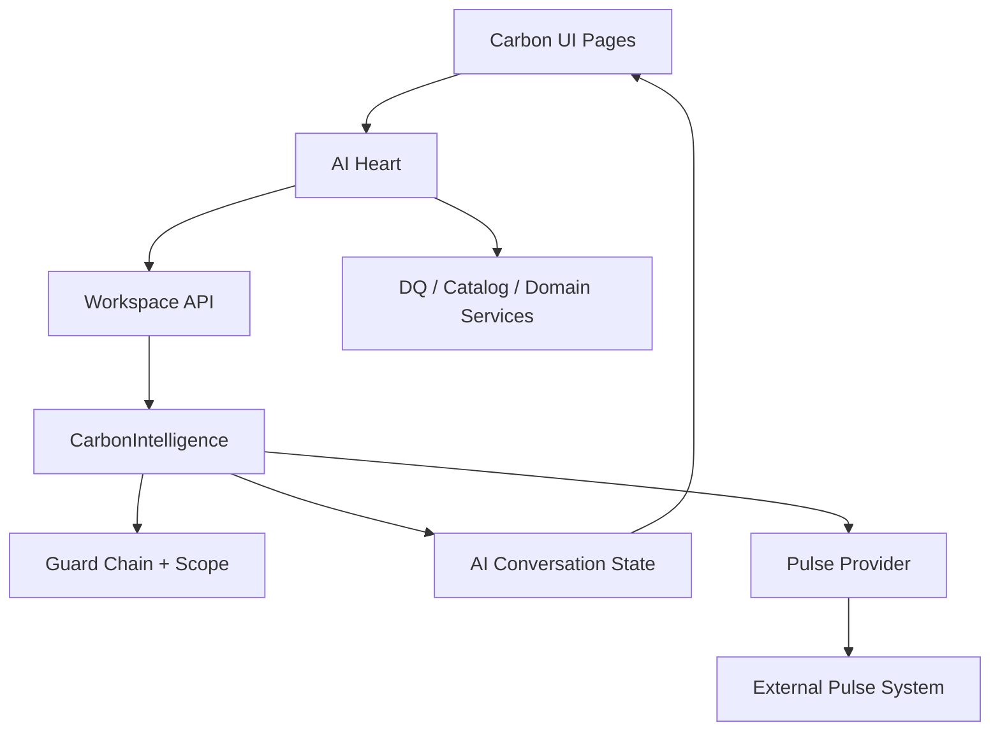
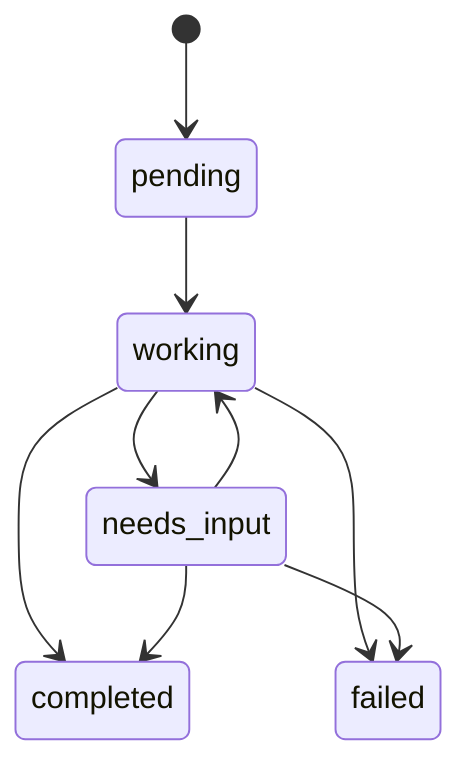
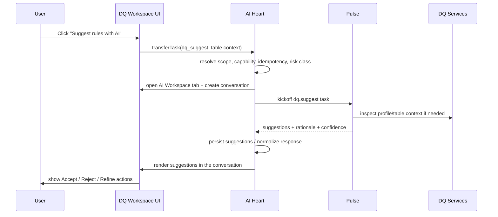
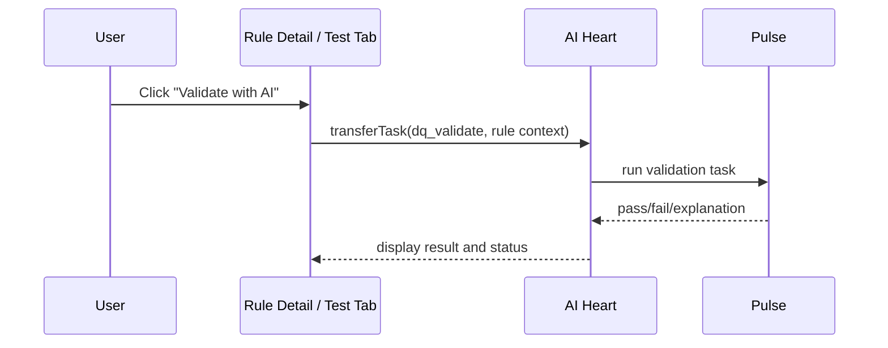
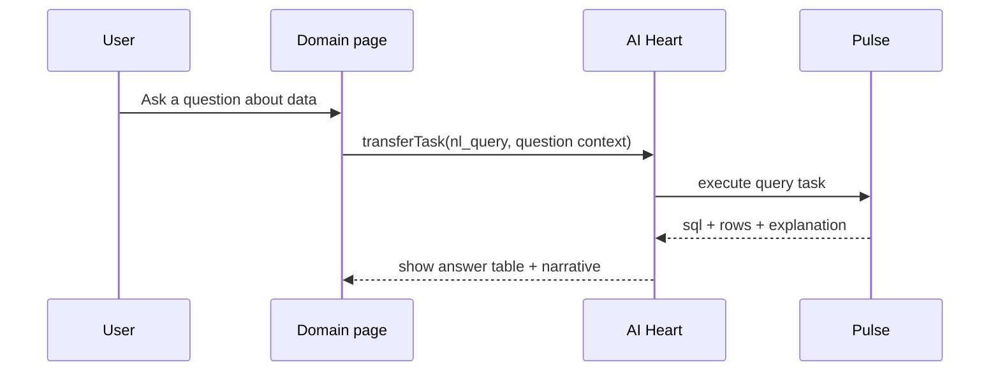
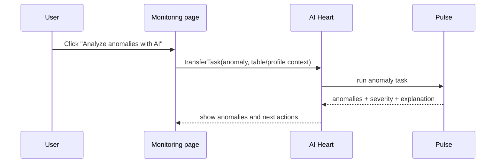

# AI Workspace Architecture

**Status:** Draft architecture standard
**Scope:** Carbon AI Workspace, AI Heart, Pulse, task transfer, conversation workflows, human-in-the-loop AI operations
**Last updated:** 2026-08-12

## 1. Purpose

AI Workspace is not a chat panel. It is the governed human interface to AI-assisted work across Carbon.

It is the place where a user can:
- transfer a task from a domain page into AI
- open a dedicated AI conversation tab
- ask AI to inspect existing data, rules, profiles, anomalies, and workflows
- request suggestions for new rules or changes
- review AI output before any human-approved action is taken
- continue a multi-turn, auditable interaction with AI

The AI Workspace is a control surface for AI-enabled work. It should feel closer to VS Code Copilot than a chatbot, but with stricter governance, richer task context, and explicit state transitions.

## 2. Architectural Principle

Carbon is the system of record for identity, scope, workflow state, conversation history, approvals, and audit.

Pulse is the external AI provider that performs reasoning, generation, retrieval-assisted analysis, and specialized AI tasks.

The core rule is:

- Carbon owns the trigger, data, policy, and workflow state
- Pulse owns the reasoning, model execution, and AI task result
- the UI is a governed workspace, not a direct model interface

This matches the platform direction already stated in [docs/STRATEGY_DATA_TRUST_PLATFORM.md](docs/STRATEGY_DATA_TRUST_PLATFORM.md) and the task contract in [docs/PULSE_CONTRACT_SPEC.md](docs/PULSE_CONTRACT_SPEC.md).

## 3. Control Model: CBAC, not plain RBAC

Carbon should be described as using CBAC in the practical sense: capability-driven, org-scoped, and context-aware.

That means:
- the user must have the required capability to initiate a task
- the user’s org scope and module scope must be injected into every AI call
- the task type determines whether the action is read-only, exploratory, or mutation-capable
- AI is never allowed to widen access beyond the user’s current scope
- every AI action is bounded by policy, not just role labels

So for AI Workspace, access is not merely “who can open the page.” It is “who can initiate which AI action on which data, with which capability, within which scope, under which approval policy.”

## 4. System Roles

### 4.1 Carbon AI Heart

AI Heart is the orchestration brain inside Carbon. It is implemented by the backend `ai/` app, especially [backend/ai/intelligence.py](backend/ai/intelligence.py) and [backend/ai/workspace_api.py](backend/ai/workspace_api.py).

AI Heart is responsible for:
- receiving task-transfer requests from the UI
- resolving the current user scope and capability context
- creating and persisting AI conversations
- deciding which task type can run and how
- composing canonical task payloads
- enforcing guard chains and data-isolation rules
- recording audit metadata and state transitions
- translating provider responses into Carbon-owned workflow state
- preserving conversation history
- determining whether a task needs user input, completed, or failed
- mediating all access to Pulse

AI Heart is not the model. It is the governor, mediator, and workflow controller.

### 4.2 Pulse

Pulse is the AI service provider. It is external, swappable, and stateless from Carbon’s perspective.

Pulse is responsible for:
- executing reasoning and generation tasks
- handling LLM prompts and agentic workflows
- performing retrieval-assisted analysis where applicable
- returning typed, structured results
- surfacing intermediate or final status
- preserving provider-side task idempotency

Pulse must not:
- mutate Carbon state directly
- call Carbon back as part of the normal flow
- decide business approvals
- bypass Carbon’s scope or policy boundaries
- become the source of truth for workflow state

Pulse is the engine. Carbon is the governor.

## 5. What “Transfer Task to AI” Means

Task transfer is a formal handoff of a user-intent bundle into AI Workspace.

A task transfer includes:
- intent type, such as `dq_validate`, `dq_suggest`, `nl_query`, `anomaly`, or `chat`
- contextual payload, such as table id, rule id, metrics, columns, or prompt text
- frozen scope snapshot for auditing
- current capability and policy context
- idempotency and trace metadata
- a target AI conversation to continue in

A transfer is not complete when a tab opens. It is complete when the AI workflow has been created, the task has been accepted by AI Heart, and the conversation enters a real state such as `working`, `needs_input`, `completed`, or `failed`.

In other words:
- opening the tab is navigation
- creating the conversation is enrollment
- sending the kickoff is execution start
- returning structured output is AI result delivery

## 6. Architectural Layers

### 6.1 UI Layer

The UI is a task-launch and task-review surface.

Examples:
- DQ Workspace “Suggest rules with AI”
- Rule detail “Analyze trend with AI”
- Monitoring “Analyze anomalies with AI”
- general chat / question prompts

The UI should:
- expose only task-relevant entry points
- show task state clearly
- keep the user anchored to the data they were already working on
- never require them to restate context that Carbon already knows

### 6.2 AI Heart Layer

AI Heart is where the workflow contract lives.

It owns:
- request normalization
- scope capture
- policy enforcement
- provider selection
- conversation persistence
- state transition logic
- response shape normalization

### 6.3 AI Provider Layer

Pulse is accessed through a thin provider adapter.

This layer owns:
- wire format translation
- retries and timeouts
- provider-specific task envelopes
- typed response parsing
- provider-unavailable fallback handling

### 6.4 Domain Services Layer

Carbon domain services own the actual business data and operational logic.

For DQ this means:
- rule retrieval
- table profiles
- anomaly payload construction
- suggestion persistence
- acceptance/rejection flows
- rule creation and execution

## 7. Conversation Types and Intended Behaviors

### 7.1 `chat`

Free-form conversation.

Use when the user wants general guidance, explanation, or follow-up discussion.

Properties:
- manual input is expected
- no default mutation intent
- should be low-risk and exploratory

### 7.2 `dq_validate`

Validate a rule or sample data against a DQ rule.

Use when the user wants a rule checked against rows, definition, or test data.

Properties:
- should run against a specific rule context
- can return pass/fail/explanation/confidence
- may ask for more data if the payload is incomplete

### 7.3 `dq_suggest`

Generate candidate rules from existing profiles and statistics.

Use when the user clicks Suggest Rules or asks for help inventing rules.

Properties:
- should inspect table/profile context first
- should return candidate rules with rationale and confidence
- should persist the suggestions as reviewable objects
- must not auto-create rules
- should transition into `needs_input` when there are suggestions to approve or reject

### 7.4 `nl_query`

Ask a natural-language question about data.

Use when the user wants an answer, SQL, or a summary from governed data.

Properties:
- should produce structured rows and explanatory output
- should honor scope restrictions
- should remain read-only unless a separate mutation task type exists

### 7.5 `anomaly`

Detect anomalous behavior in profile history or trends.

Use when the user wants drift, spikes, or abnormal patterns analyzed.

Properties:
- should use existing profile history
- should return anomalies, severity, and explanation
- should often end in `needs_input` if action is required

## 8. Canonical Task Lifecycle

### State meanings
- `pending`: task has been accepted and queued
- `working`: AI is actively processing
- `needs_input`: AI requires user review, approval, or a follow-up question
- `completed`: task produced a terminal useful answer
- `failed`: task cannot continue

A task should not remain visually silent. Every state must be observable in the UI.

## 9. Clean Workflow Definitions

### 9.1 Suggest Rules Workflow

This is the workflow the user described.

Expected behavior:
- the tab opens immediately
- the task starts automatically
- the first response is a structured suggestion set
- the user reviews, rejects, accepts, or refines

### 9.2 Validate Rule Workflow

Expected behavior:
- the user can validate a rule against sample data or real context
- AI output is structured and reviewable
- if the payload is incomplete, AI Heart must explain what is missing

### 9.3 Ask Data Workflow

Expected behavior:
- question is answered within scope
- SQL is visible if useful
- result rows are rendered clearly

### 9.4 Anomaly Workflow

Expected behavior:
- anomalies are tied to a known table or profile
- results should support a next action, not just a note

## 10. UI Design Contract for AI Workspace

AI Workspace should feel like a live operational workspace, not a generic chat transcript.

Minimum elements:
- task tabs for each active conversation
- visible task title and source context
- status indicator per tab
- structured result cards for suggestions, query results, anomalies, and validations
- input bar only when human input is needed
- clear “what happened” and “what to do next” presentation

The key principle is context continuity.

The user should never feel that AI forgot the thing they just asked it to do.

## 11. Required Data and Policy Envelope

Every AI task should carry:
- user identifier
- org unit scope
- module scope
- read-only vs mutation intent
- task type
- source page
- idempotency key
- trace id
- policy tier
- frozen context snapshot

If any of these are missing, AI Heart should either derive them or fail closed with a clear explanation.

## 12. Failure Modes to Avoid

1. Opening a tab without starting the task
2. Allowing manual chat UI to become the only entry point for machine workflows
3. Letting Pulse create or mutate Carbon records directly
4. Losing suggestion ids between AI response and accept/reject actions
5. Using runtime metadata as a substitute for canonical task context
6. Re-asking the user for context Carbon already has
7. Returning raw model output without schema normalization
8. Allowing AI to run outside the user’s scope
9. Silent failures with no visible state
10. Infinite polling without terminal-state handling
11. UI that hides the source table, rule, or profile behind generic text
12. Too many task types without a clear default behavior

## 13. Recommended System Rules

1. Every task transfer must create or link a persisted conversation.
2. Every non-chat task must auto-start.
3. Every task must be idempotent.
4. Every response must be normalized into Carbon-owned state.
5. Every suggestion must be persisted before the user can act on it.
6. Every action button must point to a real, auditable object id.
7. Every provider call must be scope-checked and guard-checked.
8. Every task type must have a documented terminal-state behavior.
9. Every AI workspace screen must show source context.
10. Every mutation must stay human-approved.

## 14. Practical Mapping to Current Code

- AI Heart entry points: [backend/ai/workspace_api.py](backend/ai/workspace_api.py), [backend/ai/intelligence.py](backend/ai/intelligence.py)
- Conversation storage: [backend/ai/models.py](backend/ai/models.py)
- Conversation UI: [carbon-frontend/src/shell/AIWorkspace.jsx](carbon-frontend/src/shell/AIWorkspace.jsx), [carbon-frontend/src/shell/AIConversationView.jsx](carbon-frontend/src/shell/AIConversationView.jsx)
- Transfer context: [carbon-frontend/src/shell/AITaskTransferContext.jsx](carbon-frontend/src/shell/AITaskTransferContext.jsx)
- Structured message rendering: [carbon-frontend/src/shell/AIMessageBubble.jsx](carbon-frontend/src/shell/AIMessageBubble.jsx)
- DQ-facing task sources: [carbon-frontend/src/pages/dq/DQWorkspacePage.jsx](carbon-frontend/src/pages/dq/DQWorkspacePage.jsx)
- Provider contract: [docs/PULSE_CONTRACT_SPEC.md](docs/PULSE_CONTRACT_SPEC.md)

## 15. Decision Summary

AI Workspace means:
- a human-visible engagement medium for AI
- a controlled task execution surface
- a persistent conversation workspace
- a place to inspect, review, approve, and act on AI output
- a bridge between domain context and external reasoning

AI Heart means:
- orchestration
- policy
- state
- scope
- audit
- guardrails

Pulse means:
- reasoning
- task execution
- model output
- structured AI result generation

If you keep those three roles distinct, the architecture stays clean and extensible.
