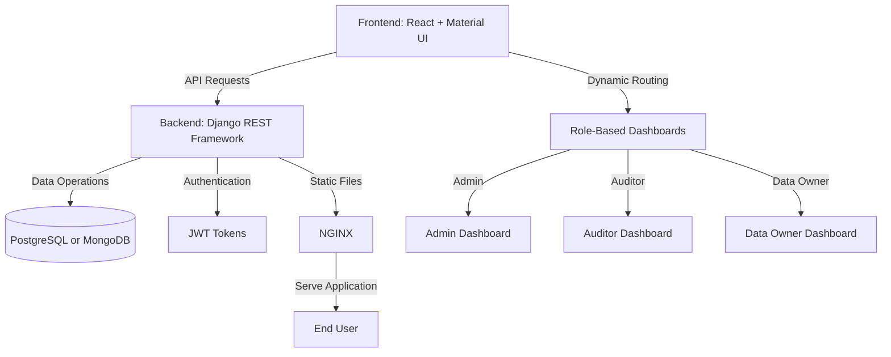
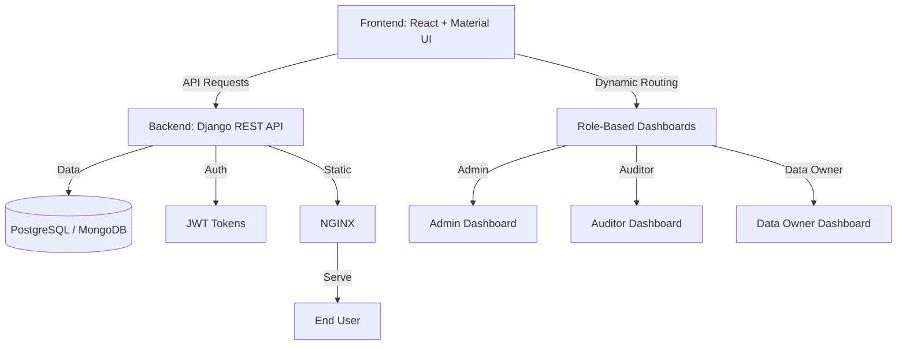
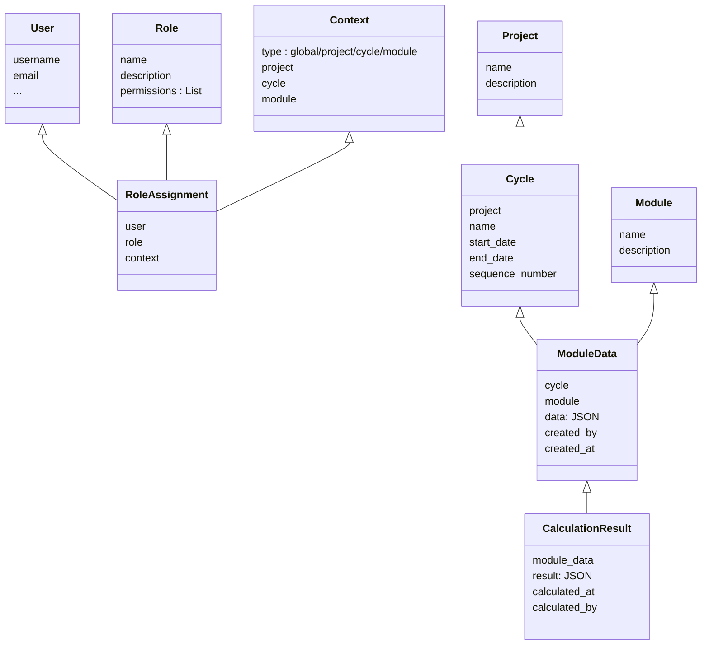
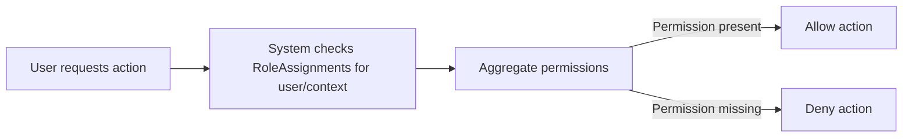
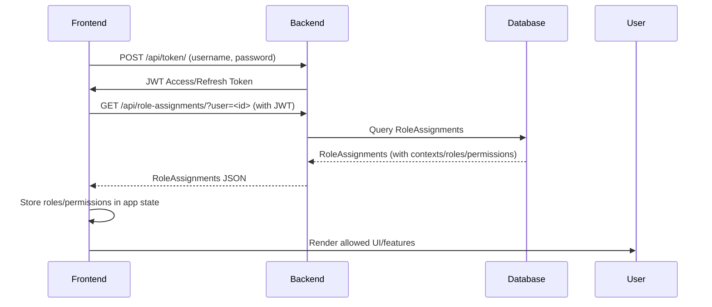
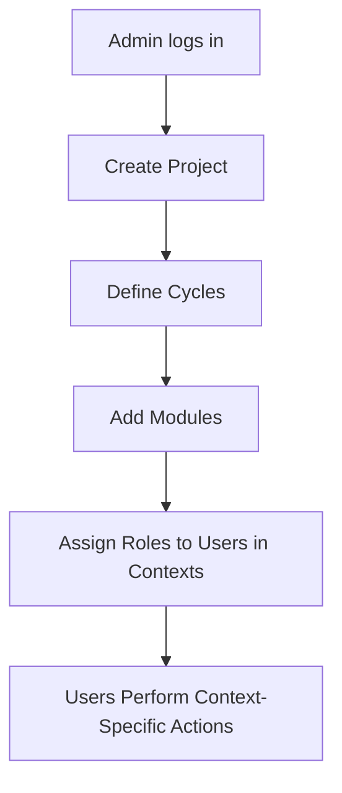
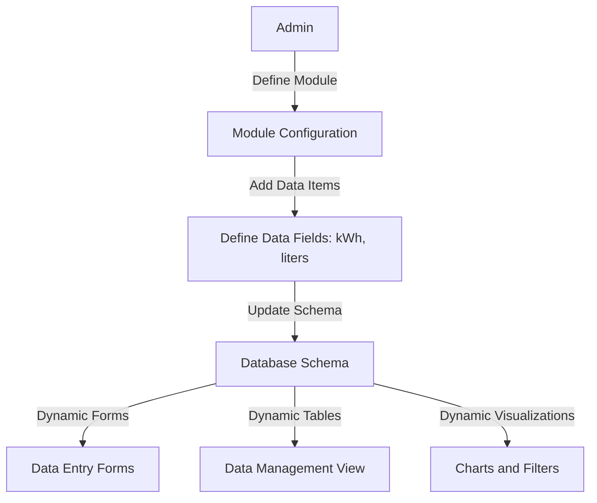
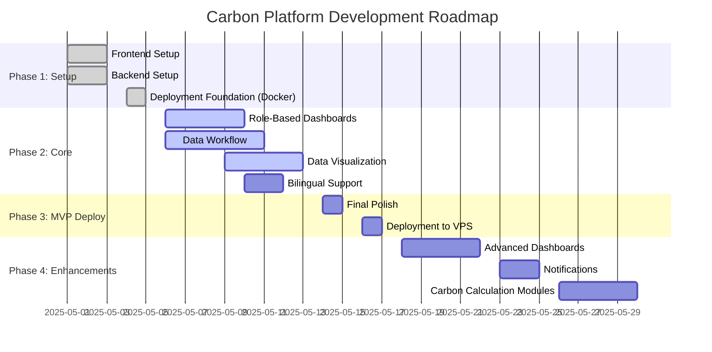
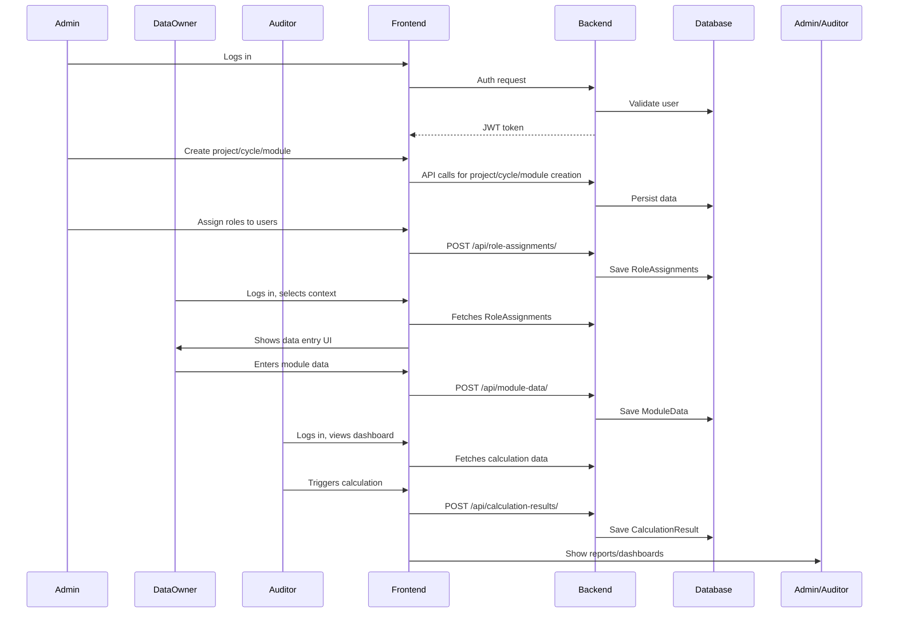

Certainly! Here is a complete, production-grade **design document** for your Carbon Management Platform, covering all critical layers: RBAC, context, cycles, modules, data, calculations, audit/logging, and frontend/backend integration. I will break it into logical sections and continue in follow-ups as needed.

---

# Carbon Management Platform – Design Document

---

## 1. **System Overview**

The Carbon Management Platform enables organizations to track, manage, and report environmental data (water, electricity, etc.) across projects and reporting cycles, with strong security, flexibility, and auditability. The platform supports:
- Multi-project, multi-cycle, and multi-module data collection.
- Fine-grained, context-aware RBAC (roles per project/cycle/module).
- Verified, auditable calculation and reporting workflows.
- Future scalability to multi-tenant, NoSQL data storage.

---

## 2. **Core Concepts**

### 2.1. Terminology

- **Tenant**: An organization using the platform (future multi-tenancy).
- **Project**: An accreditation or data collection project (e.g., "Acme Corp GHG Inventory 2024").
- **Cycle**: A reporting period within a project (e.g., 2024, Q1-2025), non-overlapping.
- **Module**: A data type/category (Water, Electricity, Vehicles, etc.).
- **Module Data**: Actual submitted data for a module in a given cycle.
- **Calculation Result**: Carbon calculations or derived metrics, stored per module/cycle.
- **Role**: A set of permissions (Admin, Auditor, Data Owner, etc.).
- **Context**: The scope (global, project, cycle, module) for a role assignment.
- **Role Assignment**: Assigns a user a role within a context.

---

### 2.2. High-Level Workflow

1. **Admin** creates projects and cycles, defines modules.
2. **Admin** assigns roles to users per context (project/cycle/module).
3. **Data Owners** enter or upload module data for assigned cycles/modules.
4. **Auditors** review data and trigger calculations.
5. **Calculation Results** are stored and auditable.
6. **Dashboards** and reports are generated per project/cycle/module.

---

### 2.3. System Architecture



---

## 3. **Data Model**

### 3.1. Relational Model (Django ORM)

#### **User**

```python
class User(AbstractUser):
    # Username, email, etc. from AbstractUser
    pass
```

#### **Role**

```python
class Role(models.Model):
    name = models.CharField(max_length=50, unique=True)
    description = models.TextField(blank=True)
    permissions = models.JSONField(default=list)  # ["add_data", "view_dashboard"]
```

#### **Project**

```python
class Project(models.Model):
    name = models.CharField(max_length=100)
    description = models.TextField(blank=True)
    created_at = models.DateTimeField(auto_now_add=True)
```

#### **Cycle** (was Period)

```python
class Cycle(models.Model):
    project = models.ForeignKey(Project, on_delete=models.CASCADE, related_name='cycles')
    name = models.CharField(max_length=50)
    start_date = models.DateField()
    end_date = models.DateField()
    sequence_number = models.IntegerField()
    class Meta:
        unique_together = ('project', 'sequence_number')
```

#### **Module**

```python
class Module(models.Model):
    name = models.CharField(max_length=50)
    description = models.TextField(blank=True)
```

#### **Context**

```python
class Context(models.Model):
    CONTEXT_TYPES = [
        ('global', 'Global'),
        ('project', 'Project'),
        ('cycle', 'Cycle'),
        ('module', 'Module'),
    ]
    type = models.CharField(max_length=10, choices=CONTEXT_TYPES)
    project = models.ForeignKey(Project, null=True, blank=True, on_delete=models.CASCADE)
    cycle = models.ForeignKey(Cycle, null=True, blank=True, on_delete=models.CASCADE)
    module = models.ForeignKey(Module, null=True, blank=True, on_delete=models.CASCADE)
```

#### **RoleAssignment**

```python
class RoleAssignment(models.Model):
    user = models.ForeignKey(User, on_delete=models.CASCADE, related_name='role_assignments')
    role = models.ForeignKey(Role, on_delete=models.CASCADE)
    context = models.ForeignKey(Context, on_delete=models.CASCADE)
    class Meta:
        unique_together = ('user', 'role', 'context')
```

#### **ModuleData**

```python
class ModuleData(models.Model):
    cycle = models.ForeignKey(Cycle, on_delete=models.CASCADE)
    module = models.ForeignKey(Module, on_delete=models.CASCADE)
    data = models.JSONField()  # Flexible fields per module
    created_by = models.ForeignKey(User, on_delete=models.SET_NULL, null=True)
    created_at = models.DateTimeField(auto_now_add=True)
```

#### **CalculationResult**

```python
class CalculationResult(models.Model):
    module_data = models.ForeignKey(ModuleData, on_delete=models.CASCADE)
    result = models.JSONField()  # e.g., carbon_kg, notes
    calculated_at = models.DateTimeField(auto_now_add=True)
    calculated_by = models.ForeignKey(User, on_delete=models.SET_NULL, null=True)
```

---

### 3.2. Key Constraints & Rules

- **Cycles**: Must not overlap within a project. Enforce in business logic.
- **RoleAssignment**: Unique per (user, role, context).
- **ModuleData**: One per (cycle, module, unique key fields if needed).
- **CalculationResult**: One per (module_data).

---

## 4. **RBAC & Contextual Permissions**

### 4.1. RBAC Model

- **Role**: Defines permissions (add_data, edit_data, perform_calculation, etc.).
- **Context**: Specifies where a role applies (global, project, cycle, module).
- **RoleAssignment**: Assigns a user a role within a context.

### 4.2. Permission Checking Utility

```python
def user_has_permission(user, permission, context):
    assignments = RoleAssignment.objects.filter(user=user, context=context)
    for assignment in assignments:
        if permission in assignment.role.permissions:
            return True
    return False
```

---

### 4.3. Example Role Assignments

- **Admin**: Global, can manage all.
- **Auditor**: Project or cycle scope, can view/trigger calculation.
- **Data Owner**: Module, cycle, or project scope, can enter/edit data.

---

### 4.4. Context Granularity

- Assignments can be as broad as "global" (all projects/cycles/modules) or as narrow as a single module in a single cycle of a project.

---

Certainly! Here is the next part of the comprehensive design document for the Carbon Management Platform.

---

## 5. **Frontend Integration & Workflow**

### 5.1. Authentication & Role Discovery

- **Login:**  
  - User logs in via frontend (`/api/token/`), receives JWT.
  - JWT is stored and attached to subsequent API requests.

- **Role & Capability Fetch:**  
  - After login, frontend calls `/api/role-assignments/?user=<user_id>` to fetch all RoleAssignments (including context and permissions).
  - Optionally, a `/api/me/contexts/` or `/api/me/permissions/` endpoint can provide a summary for UI consumption.

- **Frontend State:**  
  - Store user’s roles/assignments in app state (e.g., Redux).
  - Use this state to determine:
    - Which dashboards/pages to show.
    - Which actions are enabled (e.g., add/edit data, trigger calculations).

- **UI Enforcement:**  
  - Show/hide buttons, forms, and links based on user’s permissions in the current context (project, cycle, module).
  - For example, if the user has `add_data` on "Water" module in "2024" cycle, show the "Add Data" button only in that view.

- **Context Selection:**  
  - If a user has roles in multiple projects/cycles/modules, allow them to select the active context (e.g., dropdown selectors).
  - Update the UI to reflect permissions for the selected context.

---

### 5.2. API Usage Patterns

- **Data Entry:**  
  - `POST /api/module-data/` with context (cycle, module) and data fields.
  - Check permission (`add_data`) before enabling form submission.

- **Calculation:**  
  - `POST /api/calculation-results/` or `POST /api/calculate/` endpoint.
  - Only show/enable for users with `perform_calculation` in context.

- **Role Management:**  
  - Admin dashboard (`/api/role-assignments/`): Assign or modify user roles per context.

- **Data Visualization:**  
  - Fetch module data, calculation results, and aggregates per context for charts/dashboards.

---

### 5.3. Bilingual/UI Support

- Use `react-i18next` for language switching.
- Ensure all UI labels, messages, and data fields are internationalized.
- Implement RTL styles for Arabic.

---

## 6. **Backend API Design**

### 6.1. Key Endpoints

- **Authentication:**
  - `POST /api/token/` (login, returns JWT)
  - `POST /api/token/refresh/`
- **User Info:**
  - `GET /api/me/`
  - `GET /api/me/contexts/` (optional; returns effective contexts/permissions)
- **Role Assignments:**
  - `GET /api/role-assignments/?user=<id>`
  - `POST /api/role-assignments/` (admin only)
  - `DELETE /api/role-assignments/<id>/`
- **Projects, Cycles, Modules:**
  - Standard CRUD endpoints.
- **Context:**
  - CRUD for defining new contexts.
- **Module Data:**
  - `GET/POST/PUT/DELETE /api/module-data/`
- **Calculation Results:**
  - `GET/POST /api/calculation-results/`
- **Admin Functions:**
  - User management, role/permission management.

### 6.2. Permission Enforcement

- All endpoints require JWT auth.
- Decorators or custom DRF permissions check `user_has_permission(...)` before mutating or accessing sensitive data.
- RBAC is always enforced server-side.

---

## 7. **Audit Logging & History**

### 7.1. Audit Log Model

```python
class AuditLog(models.Model):
    user = models.ForeignKey(User, on_delete=models.SET_NULL, null=True)
    action = models.CharField(max_length=100)
    target_collection = models.CharField(max_length=100)
    target_id = models.CharField(max_length=100)
    timestamp = models.DateTimeField(auto_now_add=True)
    details = models.JSONField(default=dict)
    ip_address = models.GenericIPAddressField(null=True, blank=True)
    user_agent = models.TextField(blank=True)
```

### 7.2. Logging Strategy

- Log all create/update/delete actions on ModuleData, CalculationResult, RoleAssignment, etc.
- Include old/new values in `details` for traceability.
- Consider a separate history/versioning table for ModuleData if regulatory requirements demand it.

---

## 8. **NoSQL Readiness & Multi-Tenancy**

### 8.1. Document Model Overview (for MongoDB, future)

- Every document includes a `tenantId` and context keys (`projectId`, `cycleId`, `moduleId`).
- Collections: Tenants, Users, Projects, Cycles, Modules, ModuleSchemas, ModuleData, CalculationResults, AuditLogs, ModuleDataHistory.

### 8.2. API Enforcement

- All queries filter by `tenantId` (SaaS security).
- Indexes on `{tenantId, projectId, cycleId, moduleId}` for efficient queries.

---

## 9. **Security Considerations**

- **Backend is the source of truth:** Never trust frontend-only permission checks.
- **JWT tokens:** Short-lived access, refresh tokens; rotate secrets regularly.
- **Data validation:** All inputs are validated server-side, including uploaded files (CSVs).
- **Rate limiting:** To prevent brute-force or abuse.
- **Audit logs:** Immutable or append-only if possible for compliance.
- **Sensitive Data:** Encrypt at rest/transport, especially in multi-tenant environments.

---

## 10. **Deployment & DevOps**

- **Docker Compose** for local stack (frontend, backend, DB).
- **Kubernetes manifests** for production cluster.
- **CI/CD:** Automated tests, linting, build, and deploy pipelines.
- **NGINX** as reverse proxy and SSL terminator in production.
- **Monitoring:** Use Prometheus/Grafana or similar for health and usage metrics.

---

Certainly! Here is the continuation of the Carbon Management Platform design document.

---

## 11. **Reporting & Calculation Pipelines**

### 11.1. Calculation Workflow

- **Trigger:**  
  - Calculations can be triggered by an authorized user (e.g., Auditor) or automatically after data submission.
- **Process:**  
  - Fetch all relevant `ModuleData` for the selected cycle/module.
  - Apply business logic/formulas to compute carbon or other metrics.
- **Result Storage:**  
  - Store output in `CalculationResult` linked to the input `ModuleData`.
  - Include metadata: calculated_at, calculated_by, version of formula.

```python
class CalculationResult(models.Model):
    module_data = models.ForeignKey(ModuleData, on_delete=models.CASCADE)
    result = models.JSONField()
    calculated_at = models.DateTimeField(auto_now_add=True)
    calculated_by = models.ForeignKey(User, on_delete=models.SET_NULL, null=True)
    formula_version = models.CharField(max_length=20, blank=True)
```

### 11.2. Reporting

- **Reports** are generated from stored `CalculationResult` and `ModuleData`.
- **Export Options:**  
  - CSV, PDF, and possibly integration with regulatory submission formats.
- **Filters:**  
  - By project, cycle, module, date range, user, or calculation status.

### 11.3. Example Calculation Flow

```mermaid
flowchart TD
    A[User enters Module Data] --> B[Data Validated and Saved]
    B --> C[Calculation Triggered (manual or auto)]
    C --> D[CalculationResult Saved]
    D --> E[Report Generation / Dashboard Update]
```

---

## 12. **Example Workflows and Seeding**

### 12.1. Initial Data Seeding

- **Roles:**  
  - Create Admin, Auditor, Data Owner roles with appropriate permissions.
- **Modules:**  
  - Seed global modules (Water, Electricity, Vehicles, etc.).
- **Projects & Cycles:**  
  - Create sample Project(s) and Cycles for demonstration/testing.
- **RoleAssignments:**  
  - Assign users to roles in relevant contexts.

### 12.2. Example User Journey

1. **Admin** logs in, creates a new Project "Acme GHG 2024".
2. **Admin** creates a Cycle "2024".
3. **Admin** adds modules to the project (e.g., Water, Electricity).
4. **Admin** assigns Data Owners to Water/Electricity for the 2024 cycle.
5. **Data Owners** log in and enter or upload data.
6. **Auditor** reviews data and triggers calculation.
7. **Results** are stored and available for dashboard/report export.

---

## 13. **Extensibility & Future Enhancements**

### 13.1. Multi-Tenancy

- Add `tenant` ForeignKey to all core models.
- Scope all API and DB queries by tenant.
- Prepare for tenant-aware authentication and RBAC.

### 13.2. Flexible Schemas

- Adopt a “ModuleSchema” model for defining data fields per module and version.
- Support dynamic forms on the frontend driven by schema definition from the backend.

### 13.3. NoSQL Migration

- Architect Django models to support JSONField for flexible data now.
- Plan MongoDB collections for future scaling, as outlined previously.

### 13.4. Logging & Compliance

- Consider append-only audit tables or external log storage for regulatory compliance.
- Periodically export or archive logs/history as needed.

### 13.5. Advanced Analytics

- Integrate with data science tools or BI dashboards for predictive analytics, anomaly detection, etc.

### 13.6. IoT & Real-Time Data

- Design APIs for device data ingestion (with authentication and validation).
- Real-time dashboards and alerts for live monitoring.

---

## 14. **Summary of Best Practices**

- **RBAC:** Always context-aware, enforced at both UI and API.
- **Cycles:** Strictly non-overlapping, sequential, and flexible in unit.
- **Module:** Supports global and project-specific definitions.
- **Audit:** Every data change/action is logged and traceable.
- **Scalability:** Ready to migrate core data to NoSQL for high-volume SaaS use.
- **Security:** JWT-based, backend-enforced, all sensitive actions logged.

---

## 15. **Recommended Next Steps**

1. **Implement RBAC models and permissions as described.**
2. **Build context-aware APIs and frontend role discovery.**
3. **Set up seeding scripts for quick project/module/cycle/role setup.**
4. **Develop and enforce audit logging for all sensitive actions.**
5. **Iteratively build dashboards and workflows per the roadmap.**

---

**This concludes the full design document for the Carbon Management Platform.**  
If you need specific code scaffolding, example API schemas, or seed data scripts, let me know which area to tackle next!

Absolutely! Here are comprehensive **Mermaid.js diagrams** for your Carbon Management Platform, covering system architecture, entity relationships, workflows, frontend/backend story, and RBAC enforcement. These can be rendered in markdown viewers that support Mermaid, or pasted into tools like [Mermaid Live Editor](https://mermaid.live).

---

## 1. **System Architecture**



---

## 2. **Entity Relationship Diagram (RBAC, Cycles, Modules, Data, Results)**



---

## 3. **RBAC Enforcement Workflow**



---

## 4. **Frontend-Backend Authentication & Capability Discovery**



---

## 5. **Data Entry and Calculation Workflow**

```mermaid
flowchart TD
    A[User (Data Owner) enters Module Data] --> B[Data Validated and Saved]
    B --> C[Calculation Triggered (manual/auto by Auditor)]
    C --> D[CalculationResult Saved]
    D --> E[Dashboard/Report Updated]
```

---

## 6. **Admin Workflow: Project, Cycle, Role Assignment**



---

## 7. **Audit Logging and History**

```mermaid
flowchart TD
    A[User performs action (e.g., edit data)]
    A --> B[Action processed by backend]
    B --> C[Create AuditLog Entry]
    B --> D[Update/Version Data if needed]
    C --> E[Logs available for compliance/reporting]
```

---

## 8. **Dynamic Module & Data Schema Workflow**



---

## 9. **Feature Roadmap Gantt**



---

## 10. **End-to-End User Story (Sequence)**



---

### If you need any diagram in a different style, more detail, or want specific user stories or workflows visualized, just let me know!

Absolutely! Here’s how we’ll proceed, step by step:

---

## 1. UX Complete Design (High-Level)

### **Core Principles**
- **Modern, clean, and light:** MUI-driven, environmental color palette, beautiful but minimal.
- **Responsive:** Works seamlessly on web, tablet, and mobile.
- **Theming:** Light/dark switch; custom themes in future.
- **Bilingual-ready:** Structure for RTL and language switcher.
- **Role-based navigation:** Dashboards and modules adapt to user role.

---

### **Page & Component Breakdown**

#### **1. Login Page**
- Centered card, welcome message, logo
- Username, password fields (MUI TextField)
- Login button (MUI Button)
- "Forgot password?" link (future)
- Language switcher (future, top-right)
- Light/dark mode toggle (top-right)

#### **2. Context Selection Page**
- Header/toolbar: logo, language switcher (future), profile dropdown, theme toggle
- List/grid of available contexts (card per project/period/role)
- Click to select context and enter dashboard

#### **3. Main App Layout**
- **Sidebar/Drawer:**  
  - Role-based menu items (Dashboard, Modules, Settings)
  - Collapsible (burger menu on mobile)
- **Header/AppBar:**  
  - App name/logo
  - Theme toggle
  - Profile menu (logout, future profile/settings)
- **Content area:**  
  - Responsive, scrollable

#### **4. Dashboard Pages**
- **Home:**  
  - Stat widgets (cards) for key metrics (dummy now)
  - Placeholder chart (dummy)
- **Modules:**  
  - List of modules (cards)
  - Click to enter data entry/review (dummy for now)
- **Settings/Profile:**  
  - Placeholder

#### **5. Role-Based Dashboards**
- Admin, Auditor, Data Owner dashboards share the same layout but menu/options/widgets adapt by role.

#### **6. Notifications**
- Toast/snackbar for success/error actions

---
## 4. File-by-File Implementation Plan

Here’s the order we’ll go in, and for each, I’ll provide a full MUI-based sample:

1. **src/pages/LoginPage.jsx:**  
   - Centered card, branding, theme toggle, (future: language switcher), MUI TextFields, Button.
2. **src/pages/ContextSelectionPage.jsx:**  
   - Header, context cards/grid, select context, theme toggle.
3. **src/layouts/MainLayout.jsx:**  
   - Sidebar/Drawer, header, responsive, role-based menu.
4. **src/pages/DashboardHome.jsx:**  
   - Stat cards, dummy chart, responsive grid.
5. **src/pages/ModulesPage.jsx:**  
   - Dummy module cards/links.
6. **src/pages/SettingsPage.jsx:**  
   - Placeholder.
7. **src/components/RoleDashboards.jsx:**  
   - Role-based dashboards (Admin, Auditor, Data Owner).
8. **src/components/Notifications.jsx:**  
   - Snackbar/toast.
9. **src/theme/index.js:**  
   - ThemeProvider setup, light/dark toggle, RTL support structure.

---

### Next Step

**Let's start with `src/pages/LoginPage.jsx`.**  
Would you like a full code sample and explanation for this file first?  
Or do you want visual mockups/wireframes before diving into code?  
Let me know your preference!