## **Updated Roadmap for Carbon Management Platform**

### **Phase 1: Project Setup and Foundation**
#### **Objective**: Establish a robust foundation for the platform, ensuring flexibility for future enhancements.

1. **Frontend Setup**:
   - Initialize a React project (Vite) with Material UI.
   - Set up a **role-based routing system** using React Router.
   - Configure Material UI theme with:
     - **Primary Palette**: Green (sustainability).
     - **Secondary Palette**: Blue (contrast).
   - Create a **base folder structure**:
     ```
     src/
     ├── components/       # Reusable UI components
     ├── layouts/          # Layouts for role-based dashboards
     ├── pages/            # Role-based views (Admin, Auditor, Data Owner)
     ├── services/         # API and authentication services
     ├── styles/           # Global styles and Material UI theme
     ├── utils/            # Utility functions
     ├── App.jsx           # Main App component
     └── index.jsx         # Entry point
     ```

2. **Backend Setup**:
   - Create a Django project with Django REST Framework (DRF).
   - Set up the database (PostgreSQL) and create schemas for:
     - **Users and Roles**: Admin, Auditor, Data Owner (with flexibility for future roles).
     - **Projects**: Metadata for each project.
     - **Modules and Data Items**: A flexible schema to support any type of data input in the future.
   - Implement **JWT-based authentication** with role-based access control.

3. **Deployment Setup**:
   - Configure **Docker** for containerization (frontend, backend, database).
   - Create base **Kubernetes manifests** for future scalability.
   - Set up **CI/CD pipelines** for automated builds and deployments.

4. **Milestone**:
   - A running, containerized platform with basic routing, authentication, and role-based access control.

---

### **Phase 2: Core Features**
#### **Objective**: Build the key features for data entry, dashboards, and visualization.

1. **Role-Based Dashboards**:
   - **Admin Dashboard**:
     - Metrics: Total projects, users, tasks.
     - Visualizations: Trends for all data (e.g., power, water, waste).
     - Actions: Create projects, assign roles, and manage permissions.
   - **Auditor Dashboard**:
     - Metrics: Assigned projects, latest submissions.
     - Visualizations: Trends and compliance status.
     - Read-only access.
   - **Data Owner Dashboard**:
     - Metrics: Tasks and submissions for the assigned module (e.g., power, water, waste).
     - Actions: Enter/import data.

2. **Flexible Data Workflows**:
   - **Dynamic Modules and Data Items**:
     - Design a schema to allow Admins to define new **modules** (e.g., power, water) and data items (e.g., kWh, liters, metadata).
     - Build a UI for admins to create/edit modules.
   - **Manual Data Entry**:
     - Create forms that dynamically adjust based on the defined modules and data items.
     - Add real-time validation for all fields (e.g., duplicates, unusual data).
   - **Raw CSV Uploads**:
     - Build a file upload system for bulk submissions.
     - Validate CSVs (e.g., format correctness, duplicate rows).
   - **Data Management**:
     - Create a tabular view for viewing, filtering, and editing data.

3. **Data Visualization**:
   - Use **Recharts** to implement:
     - Line charts for time-series trends (e.g., power usage over time).
     - Bar charts for comparisons (e.g., power vs. water usage by project).
   - Add basic filters (e.g., by date range, project).

4. **Bilingual Support**:
   - Add **English and Arabic** support:
     - Backend: Use `django-modeltranslation` to translate fields.
     - Frontend: Use `react-i18next` for language switching.
   - Implement **RTL (Right-to-Left)** styles for Arabic.

5. **Milestone**:
   - Fully functional dashboards with role-based views.
   - Data workflows (manual entry, CSV upload, validation).
   - Basic visualizations with filter support.
   - Bilingual support for both frontend and backend.

---

### **Phase 3: MVP Deployment**
#### **Objective**: Polish the platform and make it production-ready.

1. **Frontend Polish**:
   - Add animations (e.g., smooth transitions for navigation and dropdowns).
   - Ensure responsive design for all layouts (desktop, tablet, mobile).

2. **Backend Enhancements**:
   - Optimize database queries (e.g., for large datasets).
   - Add logging and error handling for APIs.

3. **Containerized Deployment**:
   - Finalize **Docker Compose** for local development.
   - Deploy the platform to your **VPS** using Kubernetes.
   - Configure **NGINX** as a reverse proxy and SSL termination.

4. **Milestone**:
   - A live MVP accessible on a public URL.

---

### **Phase 4: Enhancements and Scaling**
#### **Objective**: Add advanced features and ensure scalability.

1. **Advanced Dashboards**:
   - Add dynamic filters (e.g., project, date range).
   - Build advanced visualizations (e.g., stacked bar charts for combined metrics).

2. **Notifications**:
   - Add in-app notifications (e.g., "Task assigned to you").
   - Add email notifications for critical events (e.g., overdue submissions).

3. **Carbon Calculation Modules**:
   - Design formulas to calculate carbon equivalence based on raw data.
   - Build forms and dashboards for carbon analysis.

4. **Authentication Enhancements**:
   - Add **Multi-Factor Authentication (MFA)**.
   - Support **Single Sign-On (SSO)** with Google or Microsoft.

5. **IoT Integration**:
   - Design APIs for real-time data streaming from IoT devices.
   - Build dashboards for live monitoring.

6. **AI-Powered Analytics**:
   - Use AI/ML to predict trends, detect anomalies, and provide insights.
   - Build interactive reports for decision-making.

7. **Scalability**:
   - Optimize Kubernetes manifests for horizontal scaling.
   - Add support for multi-tenancy (e.g., multiple organizations/projects).

8. **Milestone**:
   - A fully scalable, feature-rich platform with advanced dashboards and analytics.

---

### **Timeline and Priorities**

| **Phase**               | **Tasks**                                   | **Estimated Time** |
|-------------------------|---------------------------------------------|--------------------|
| **Phase 1**             | Project setup, authentication, deployment. | 3 days            |
| **Phase 2**             | Core features: dashboards, data workflows. | 7 days            |
| **Phase 3**             | MVP polish and deployment.                 | 2 days            |
| **Phase 4**             | Advanced features and scaling.             | 10+ days          |

---

### **Next Steps**
1. **Start Phase 1**:
   - Set up the React frontend and Django backend.
   - Create the base folder structure and establish role-based access control.
   - Containerize the project using Docker.

2. **Track Progress**:
   - Use this roadmap to remind me about the next steps after each milestone.
   - Let me know when you're ready to proceed with a specific phase, and I’ll assist with designing and coding.

-----------

Here is a set of **Mermaid.js diagrams** to represent the workflows and designs for the **Carbon Management Platform**. These include the system architecture, role-based workflows, data workflows, and a general feature roadmap.

---

### **1. System Architecture Diagram**
This shows the high-level architecture of the platform, including frontend, backend, and database interactions.

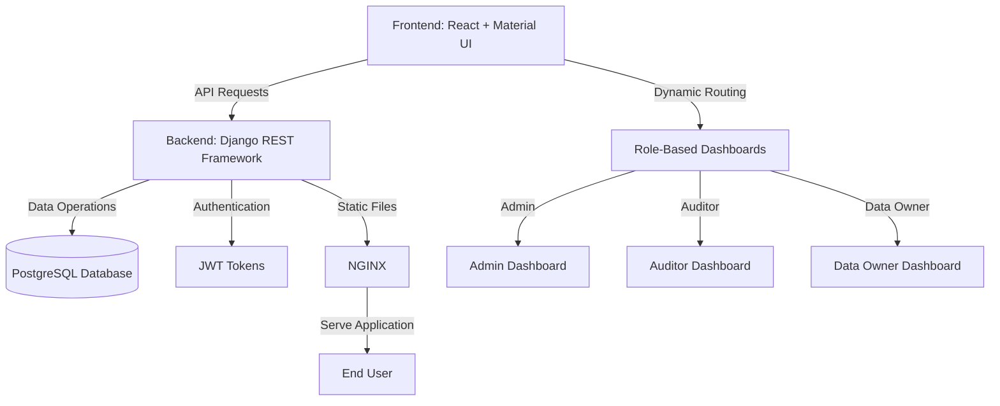

---

### **2. Role-Based Workflows**
This diagram illustrates how users with different roles interact with the system.

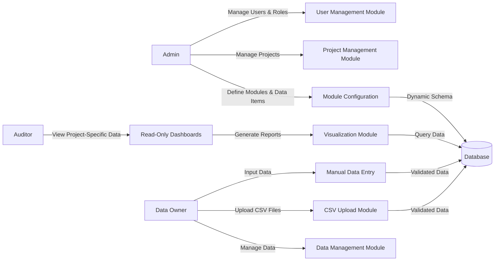

---

### **3. Data Workflow**
This diagram represents the process of data entry, validation, storage, and visualization.

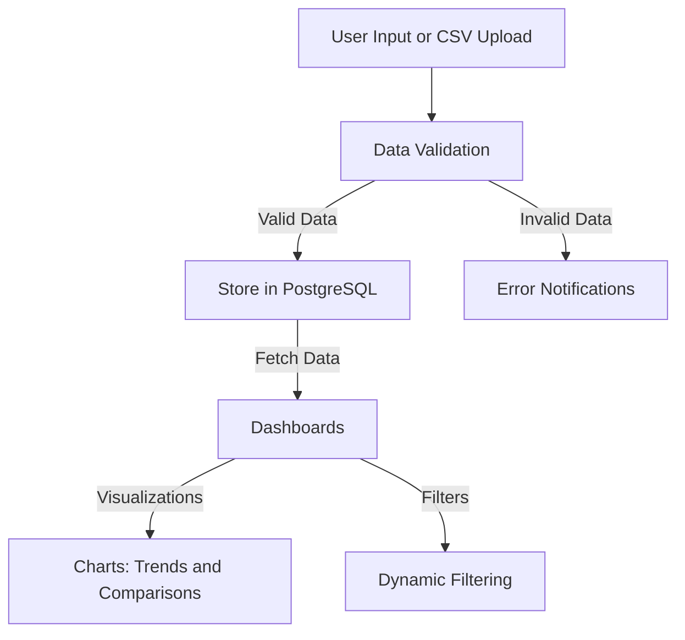

---

### **4. Dashboard Workflows**
This diagram outlines the key workflows within each dashboard.

#### **Admin Dashboard**
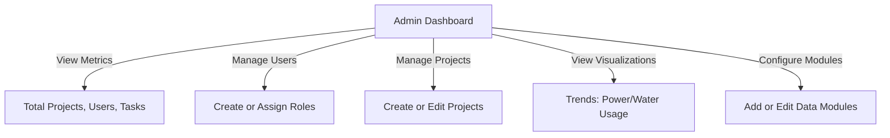

#### **Auditor Dashboard**
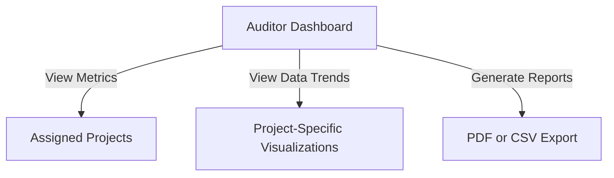

#### **Data Owner Dashboard**
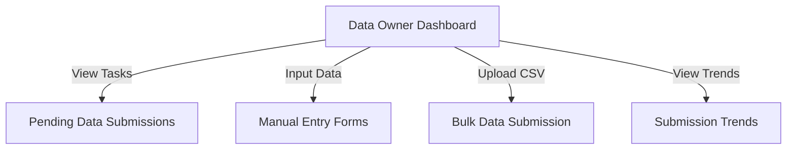

---

### **5. Feature Roadmap Workflow**
This diagram represents the phases and their dependencies.

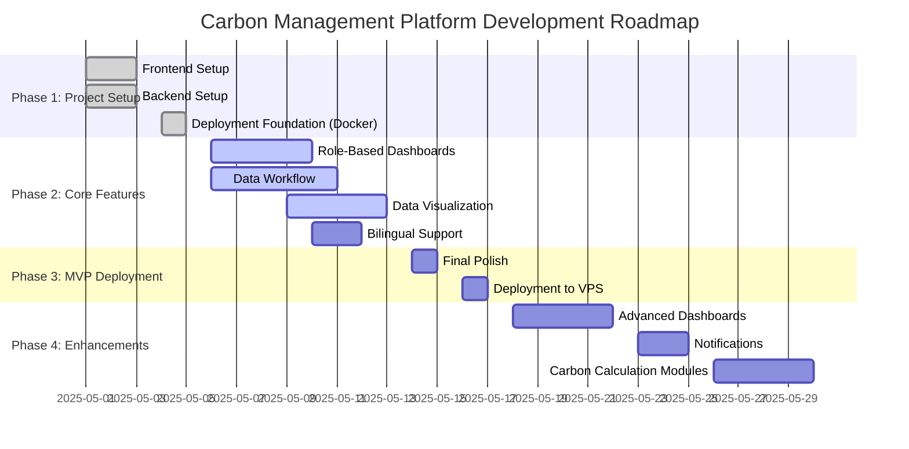

---

### **6. Dynamic Module & Data Schema Workflow**
This shows how flexible modules and data items will be managed.

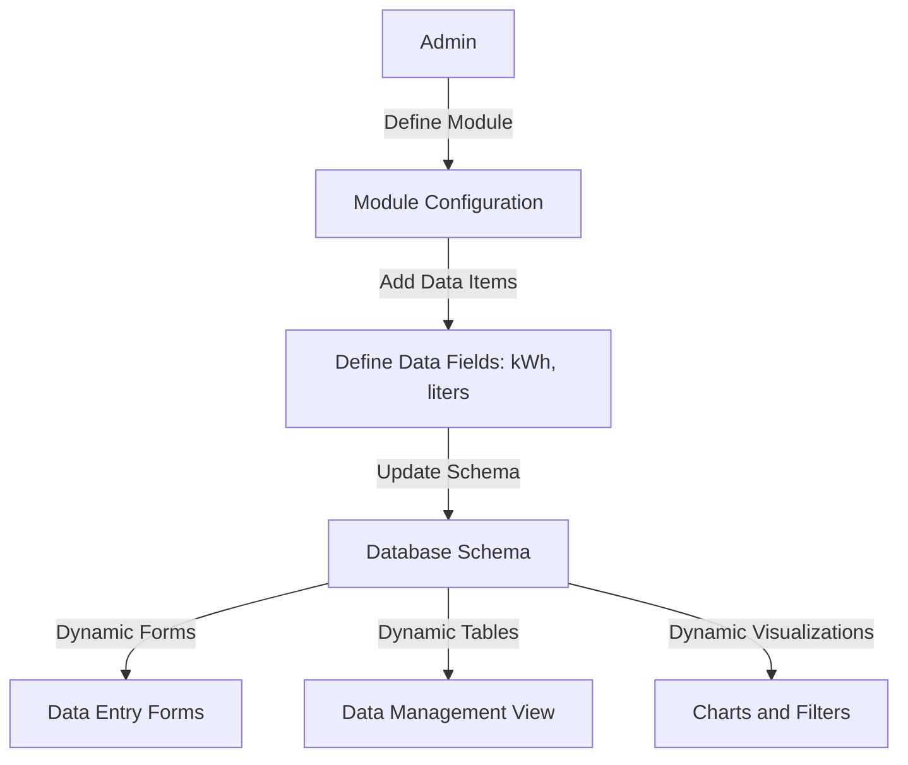

---


# Contextual RBAC & Periodic Project Design

## 1. Overview

This design enables the Carbon platform to:

- Support **recurring (periodic) projects** with non-overlapping, sequential calculation periods (e.g., annual, but flexible).
- Collect and store **module data** (e.g., water, electricity, vehicle fuel) for each period.
- Store and manage **calculation results per period** for traceability and reporting.
- Enforce permissions using a **contextual RBAC** system, with roles such as VVB auditor empowered for active data lookup and calculations.

---

## 2. Core Concepts & Workflows

### 2.1. Entity Relationships

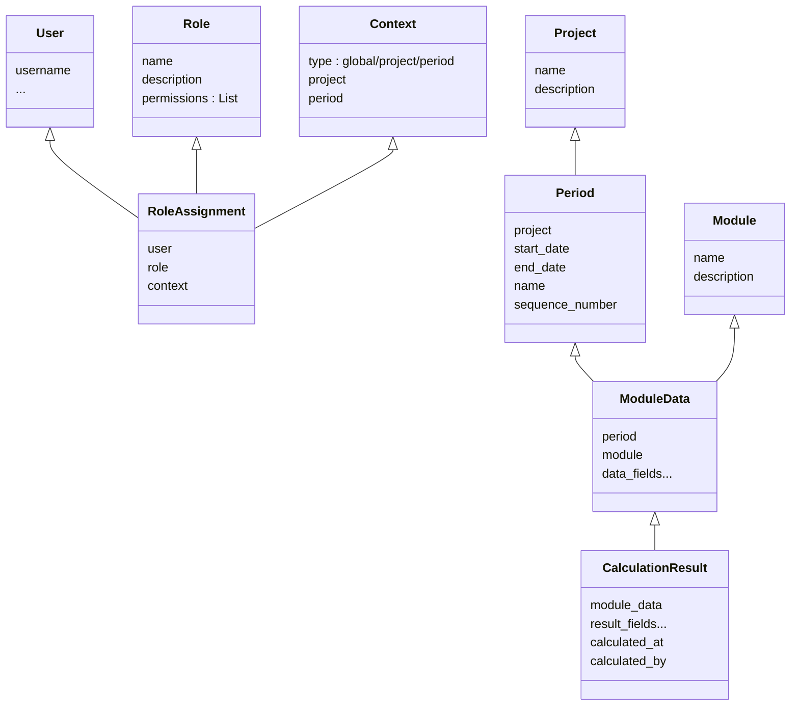

---

### 2.2. Workflows

#### **Data Collection and Calculation**

```mermaid
flowchart TD
    A[Project created] --> B[Period(s) created for project (no overlaps)]
    B --> C[User with appropriate role enters Module Data for each period]
    C --> D[System/Auditor triggers Calculation]
    D --> E[CalculationResult stored for period/module]
    E --> F[Report generation for accreditation]
```

#### **RBAC Enforcement**

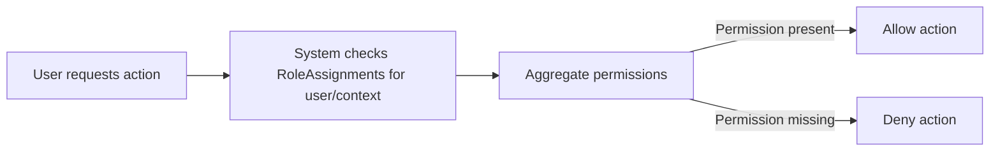

---

## 3. Model Summaries

| Model              | Key Fields                                                                                           | Purpose                                                     |
|--------------------|------------------------------------------------------------------------------------------------------|-------------------------------------------------------------|
| **Role**           | name, description, permissions (JSONField)                                                           | Defines role and capabilities                               |
| **Project**        | name, description                                                                                    | Represents a VVB project                                    |
| **Period**         | project, name, start_date, end_date, sequence_number                                                 | Non-overlapping, sequential calculation periods             |
| **Module**         | name, description                                                                                    | Global list (water, electricity, etc.)                      |
| **ModuleData**     | period, module, data fields (e.g., readings, measurements)                                           | Stores module-specific data for each period                 |
| **CalculationResult** | module_data, result fields, calculated_at, calculated_by                                         | Stores results per period/module for reporting              |
| **Context**        | type (global/project/period), project, period                                                        | Defines RBAC assignment scope                               |
| **RoleAssignment** | user, role, context                                                                                  | Assigns role to user in context                             |

---

## 4. Permission Model

- Example VVB auditor permissions:
  - `lookup_data`
  - `perform_calculation`
  - `generate_report`
- Permissions are checked per context (global, project, or period).

---

## 5. Key Rules for Periods

- **Non-overlapping**: Each period within a project must not overlap with others.
- **Sequential**: Periods are ordered (e.g., 2022, 2023, 2024).
- **Flexible unit**: Typically annual, but can be set as required (support for future flexibility).

---

## 6. Calculation & Reporting

- **CalculationResults** are stored for every (Period, Module) pair after data acquisition and calculation.
- **Reports** can be generated from stored CalculationResults to meet accreditation standards.

---

## 7. Example Scenarios

- A project for “Company X 2023” has a Period: Jan 1–Dec 31, 2023.
- Modules (Water, Electricity, Vehicles) are filled with data for this period.
- VVB auditor enters and reviews data, triggers calculations, and reviews stored results.
- At year end, a report is generated for accreditation, based on CalculationResults.

---

## 8. Advantages

- **Auditable & Compliant**: All calculations are tied to specific periods and users.
- **Traceable**: Historical results and data are preserved for each period.
- **Modular**: Adding new modules or period types is straightforward.
- **Role-based**: Clear, context-aware access for each user and role.

---

## 9. Next Steps

1. Implement and migrate models as specified.
2. Enforce period non-overlap in model/business logic.
3. Register admin interfaces for management.
4. Protect workflows via RBAC utility.
5. Build calculation and reporting pipelines for accreditation.

---

**End of section.**

---

Absolutely! Here’s a comprehensive design document for using a NoSQL document database (like MongoDB) for flexible, large-scale module data storage in a multi-tenant, multi-user carbon data platform. This design also covers logging, history/audit, and brings up some critical architectural considerations for SaaS platforms at scale.

---

# NoSQL Data Model & Logging Design for Carbon Platform

## 1. Overview

- **Goal:**  
  Use MongoDB (or equivalent document store) for storing flexible, high-volume module data, plus logs and history for a multi-tenant, multi-user SaaS carbon platform.
- **Scope:**  
  Covers data modeling, multi-tenancy, audit logging, historical records, and SaaS best practices.

---

## 2. Core Data Model in MongoDB

### 2.1. Key Collections

1. **Tenants (Customers)**
   - Each organization/customer is a “tenant.”
   - Example:  
     ```json
     {
       "_id": "tenantId",
       "name": "Acme Corp",
       "settings": {...}
     }
     ```

2. **Users**
   - Linked to tenant via `tenantId`.
   - Stores roles, login info, metadata.

3. **Projects**
   - Belong to a tenant.
   - Example:  
     ```json
     {
       "_id": "projectId",
       "tenantId": "tenantId",
       "name": "2024 GHG Inventory",
       "description": "...",
       "createdAt": "...",
       "createdBy": "userId"
     }
     ```

4. **Periods**
   - Sequential, non-overlapping periods within a project.
   - Example:  
     ```json
     {
       "_id": "periodId",
       "projectId": "projectId",
       "startDate": "2024-01-01",
       "endDate": "2024-12-31",
       "sequenceNumber": 1,
       "name": "2024"
     }
     ```

5. **Modules**
   - Global definitions (water, electricity, etc.), referenced by data.

6. **ModuleSchemas**
   - Defines per-project/per-module data fields (stored as JSON).
   - Example:  
     ```json
     {
       "_id": "moduleSchemaId",
       "tenantId": "tenantId",
       "projectId": "projectId",
       "moduleId": "water",
       "fields": [
         {"name": "usage_m3", "type": "number", "required": true},
         {"name": "meter_id", "type": "string", "required": false}
       ],
       "version": 2,
       "createdAt": "...",
       "createdBy": "userId"
     }
     ```

7. **ModuleData**
   - The main, scalable, flexible document collection.
   - Example:  
     ```json
     {
       "_id": "moduleDataId",
       "tenantId": "tenantId",
       "projectId": "projectId",
       "periodId": "periodId",
       "moduleId": "water",
       "schemaVersion": 2,
       "data": {
         "usage_m3": 150,
         "meter_id": "W-123"
       },
       "createdAt": "...",
       "createdBy": "userId",
       "lastModifiedAt": "...",
       "lastModifiedBy": "userId"
     }
     ```

8. **CalculationResults**
   - Stores calculation output per (period, module).
   - Example:  
     ```json
     {
       "_id": "calcResultId",
       "tenantId": "tenantId",
       "projectId": "projectId",
       "periodId": "periodId",
       "moduleId": "water",
       "result": {
         "carbon_kg": 120,
         "notes": ""
       },
       "calculatedAt": "...",
       "calculatedBy": "userId"
     }
     ```

---

## 3. Logging & History (Audit Trail)

### 3.1. Logging/Audit Collections

1. **AuditLogs**
   - Stores every change, access, or action for compliance and traceability.
   - Example:  
     ```json
     {
       "_id": "logId",
       "tenantId": "tenantId",
       "userId": "userId",
       "action": "UPDATE_MODULE_DATA",
       "targetCollection": "ModuleData",
       "targetId": "moduleDataId",
       "timestamp": "...",
       "details": {
         "oldValue": {...},
         "newValue": {...}
       },
       "ip": "...",
       "userAgent": "..."
     }
     ```

2. **History Versions (Optional)**
   - For important data (like ModuleData), keep a history array, or a separate `ModuleDataHistory` collection:
     ```json
     {
       "_id": "historyId",
       "moduleDataId": "moduleDataId",
       "version": 3,
       "data": {...},
       "modifiedAt": "...",
       "modifiedBy": "userId"
     }
     ```
   - Allows for “undo,” regulatory audits, and full change tracking.

---

## 4. Multi-Tenancy & Security

- **Every document** includes a `tenantId`.
- All queries must be filtered/scoped by `tenantId`—enforced at the API/service layer.
- **Indexes:** Add composite indexes (e.g. `{tenantId, projectId, periodId}`) for fast, secure queries.

---

## 5. SaaS Considerations & Best Practices

- **RBAC Enforcement:**  
  Continue to enforce RBAC at the service/API layer, not at the DB level.
- **Schema Versioning:**  
  Every `ModuleData` references the `ModuleSchema` version used for validation.
- **Reporting:**  
  Build aggregations and reporting queries as needed—MongoDB supports rich aggregation pipelines.
- **Scalability:**  
  MongoDB scales horizontally via sharding; plan schema and index design for scale.
- **Backup & DR:**  
  Use managed MongoDB (like Atlas) or robust backup tools for disaster recovery and compliance.
- **Data Retention & GDPR:**  
  Design for easy data purging, user/account deletion, and data export.

---

## 6. What Else Should You Consider?

- **API rate limiting** (per tenant) to prevent abuse.
- **Data encryption** at rest and in transit.
- **Automated alerting** for suspicious actions (from AuditLogs).
- **Multi-region** deployment if your customers are international.
- **Billing/usage tracking** for true SaaS monetization.
- **Data anonymization** for test/sandbox environments.
- **Search:** Consider integrating with Elasticsearch if you need full-text or complex search on module data.

---

## 7. MongoDB: Is it good for logs/history?

**YES.**  
MongoDB is widely used for audit logs and historical versioning due to:
- Flexible, nested document model.
- High write throughput.
- Good for append-only and time-series data.
- Easy to index and query by user, targetId, or action.

For compliance, regulatory, and troubleshooting needs, MongoDB is a strong choice for storing logs and history alongside your main data.

---

## 8. Example: Collection Relationships

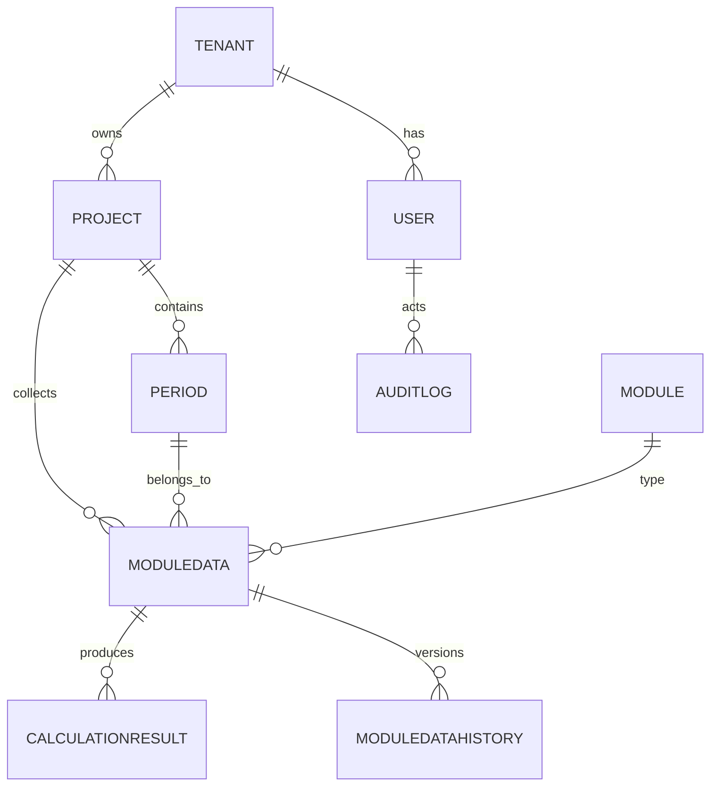

---

## 9. High-Level Workflow

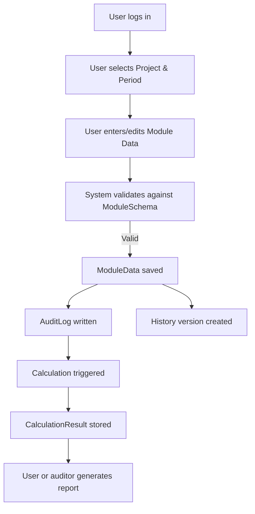

---

## 10. Summary Table

| Collection         | Purpose                                       | Multi-Tenant? | Versioned? | Indexed by          |
|--------------------|-----------------------------------------------|---------------|------------|---------------------|
| Tenants            | Customer orgs                                 | N/A           | No         | _id                 |
| Users              | Platform users                                | Yes           | No         | tenantId, email     |
| Projects           | GHG projects                                  | Yes           | No         | tenantId, name      |
| Periods            | Calculation periods                           | Yes           | No         | projectId, dates    |
| Modules            | Global module definitions                     | N/A           | Yes        | name                |
| ModuleSchemas      | Schema per project/module/version             | Yes           | Yes        | tenantId, projectId |
| ModuleData         | Actual collected data (flexible/document)     | Yes           | Optional   | tenantId, periodId  |
| CalculationResults | Store calculations for reporting              | Yes           | Yes        | periodId, moduleId  |
| AuditLogs          | Actions, changes, access for traceability     | Yes           | N/A        | tenantId, userId    |
| ModuleDataHistory  | Data versioning (optional, or history array)  | Yes           | Yes        | moduleDataId        |

---

## 11. Final Recommendations

- Use MongoDB for both main data and logs/history.
- Implement strong RBAC and tenant isolation at the API/service layer.
- Plan schema versioning for flexibility.
- Index for your most frequent queries (by tenant, project, period).
- Regularly review audit logs and support compliance use cases.
- Prepare for future growth (multi-region, sharding, backup).

---

**Let me know if you want sample MongoDB document schemas, aggregation examples, or API patterns for this architecture!**