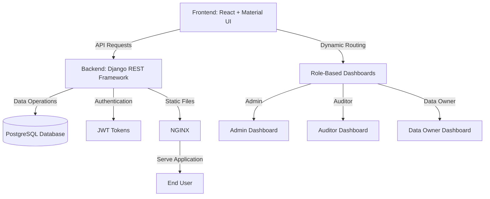
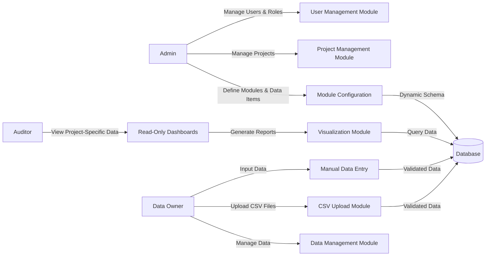
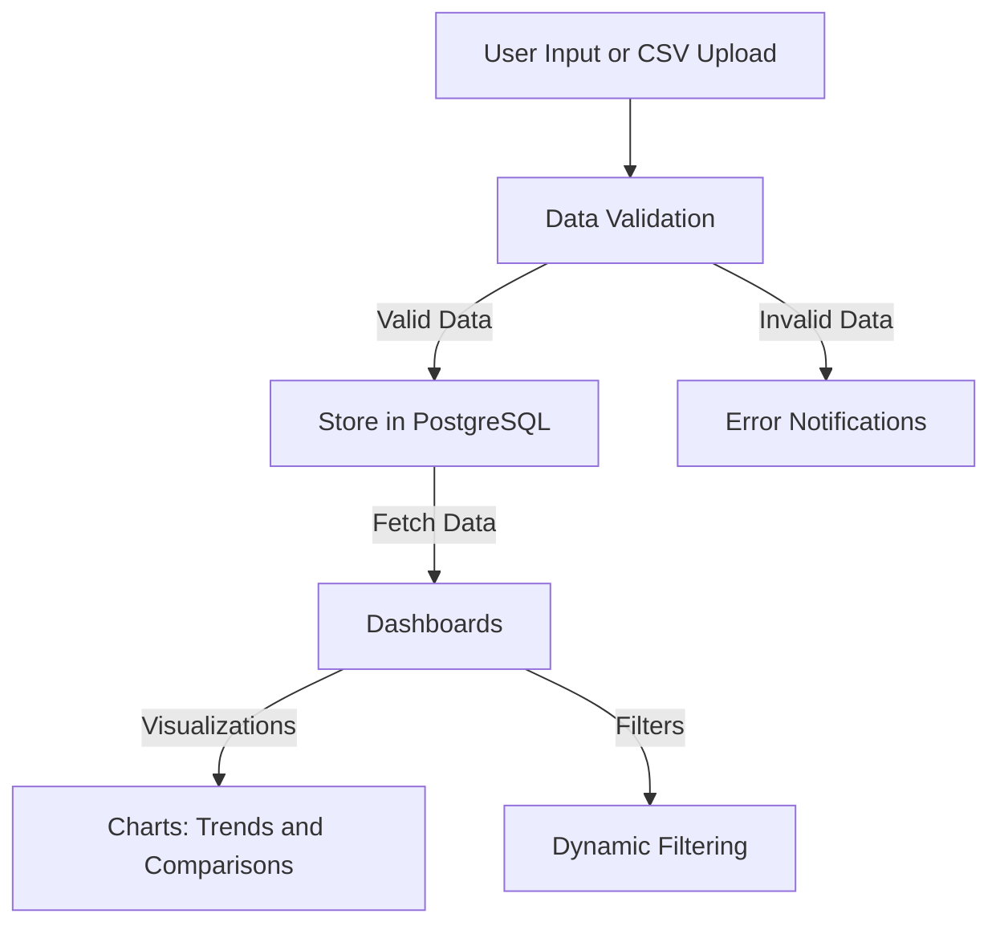
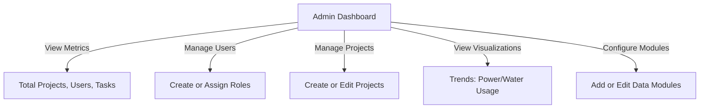
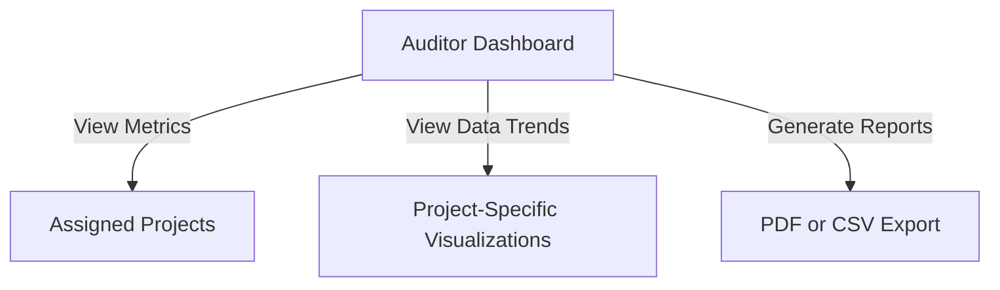
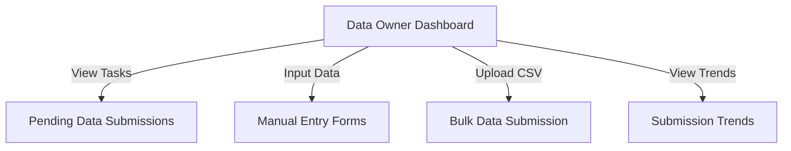
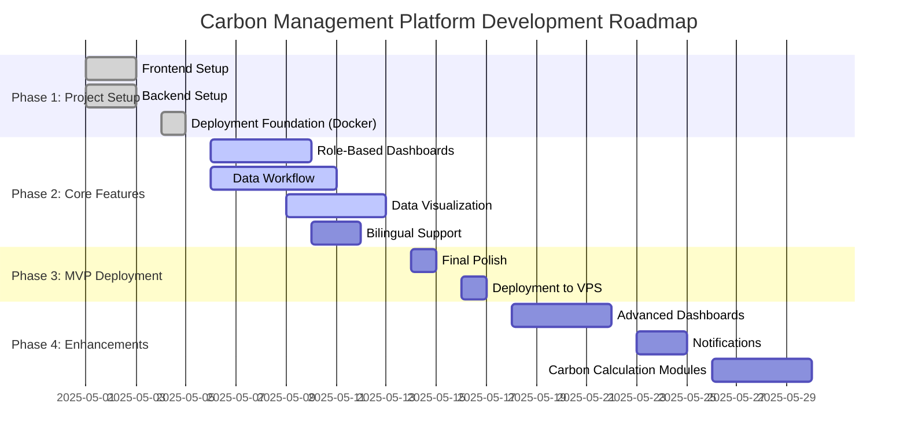
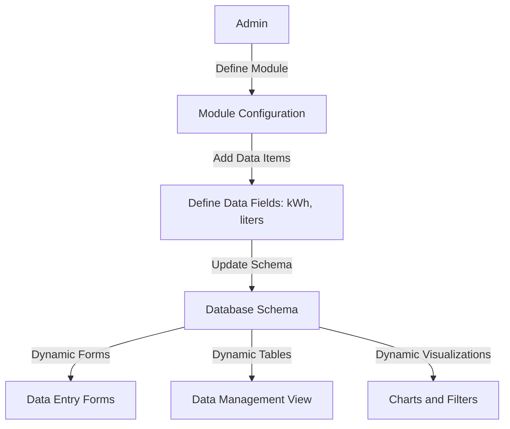

## **Updated Roadmap for Carbon Management Platform**

### **Phase 1: Project Setup and Foundation**
#### **Objective**: Establish a robust foundation for the platform, ensuring flexibility for future enhancements.

1. **Frontend Setup**:
   - Initialize a React project (Vite) with Material UI.
   - Set up a **role-based routing system** using React Router.
   - Configure Material UI theme with:
     - **Primary Palette**: Green (sustainability).
     - **Secondary Palette**: Blue (contrast).
   - Create a **base folder structure**:
     ```
     src/
     ├── components/       # Reusable UI components
     ├── layouts/          # Layouts for role-based dashboards
     ├── pages/            # Role-based views (Admin, Auditor, Data Owner)
     ├── services/         # API and authentication services
     ├── styles/           # Global styles and Material UI theme
     ├── utils/            # Utility functions
     ├── App.jsx           # Main App component
     └── index.jsx         # Entry point
     ```

2. **Backend Setup**:
   - Create a Django project with Django REST Framework (DRF).
   - Set up the database (PostgreSQL) and create schemas for:
     - **Users and Roles**: Admin, Auditor, Data Owner (with flexibility for future roles).
     - **Projects**: Metadata for each project.
     - **Modules and Data Items**: A flexible schema to support any type of data input in the future.
   - Implement **JWT-based authentication** with role-based access control.

3. **Deployment Setup**:
   - Configure **Docker** for containerization (frontend, backend, database).
   - Create base **Kubernetes manifests** for future scalability.
   - Set up **CI/CD pipelines** for automated builds and deployments.

4. **Milestone**:
   - A running, containerized platform with basic routing, authentication, and role-based access control.

---

### **Phase 2: Core Features**
#### **Objective**: Build the key features for data entry, dashboards, and visualization.

1. **Role-Based Dashboards**:
   - **Admin Dashboard**:
     - Metrics: Total projects, users, tasks.
     - Visualizations: Trends for all data (e.g., power, water, waste).
     - Actions: Create projects, assign roles, and manage permissions.
   - **Auditor Dashboard**:
     - Metrics: Assigned projects, latest submissions.
     - Visualizations: Trends and compliance status.
     - Read-only access.
   - **Data Owner Dashboard**:
     - Metrics: Tasks and submissions for the assigned module (e.g., power, water, waste).
     - Actions: Enter/import data.

2. **Flexible Data Workflows**:
   - **Dynamic Modules and Data Items**:
     - Design a schema to allow Admins to define new **modules** (e.g., power, water) and data items (e.g., kWh, liters, metadata).
     - Build a UI for admins to create/edit modules.
   - **Manual Data Entry**:
     - Create forms that dynamically adjust based on the defined modules and data items.
     - Add real-time validation for all fields (e.g., duplicates, unusual data).
   - **Raw CSV Uploads**:
     - Build a file upload system for bulk submissions.
     - Validate CSVs (e.g., format correctness, duplicate rows).
   - **Data Management**:
     - Create a tabular view for viewing, filtering, and editing data.

3. **Data Visualization**:
   - Use **Recharts** to implement:
     - Line charts for time-series trends (e.g., power usage over time).
     - Bar charts for comparisons (e.g., power vs. water usage by project).
   - Add basic filters (e.g., by date range, project).

4. **Bilingual Support**:
   - Add **English and Arabic** support:
     - Backend: Use `django-modeltranslation` to translate fields.
     - Frontend: Use `react-i18next` for language switching.
   - Implement **RTL (Right-to-Left)** styles for Arabic.

5. **Milestone**:
   - Fully functional dashboards with role-based views.
   - Data workflows (manual entry, CSV upload, validation).
   - Basic visualizations with filter support.
   - Bilingual support for both frontend and backend.

---

### **Phase 3: MVP Deployment**
#### **Objective**: Polish the platform and make it production-ready.

1. **Frontend Polish**:
   - Add animations (e.g., smooth transitions for navigation and dropdowns).
   - Ensure responsive design for all layouts (desktop, tablet, mobile).

2. **Backend Enhancements**:
   - Optimize database queries (e.g., for large datasets).
   - Add logging and error handling for APIs.

3. **Containerized Deployment**:
   - Finalize **Docker Compose** for local development.
   - Deploy the platform to your **VPS** using Kubernetes.
   - Configure **NGINX** as a reverse proxy and SSL termination.

4. **Milestone**:
   - A live MVP accessible on a public URL.

---

### **Phase 4: Enhancements and Scaling**
#### **Objective**: Add advanced features and ensure scalability.

1. **Advanced Dashboards**:
   - Add dynamic filters (e.g., project, date range).
   - Build advanced visualizations (e.g., stacked bar charts for combined metrics).

2. **Notifications**:
   - Add in-app notifications (e.g., "Task assigned to you").
   - Add email notifications for critical events (e.g., overdue submissions).

3. **Carbon Calculation Modules**:
   - Design formulas to calculate carbon equivalence based on raw data.
   - Build forms and dashboards for carbon analysis.

4. **Authentication Enhancements**:
   - Add **Multi-Factor Authentication (MFA)**.
   - Support **Single Sign-On (SSO)** with Google or Microsoft.

5. **IoT Integration**:
   - Design APIs for real-time data streaming from IoT devices.
   - Build dashboards for live monitoring.

6. **AI-Powered Analytics**:
   - Use AI/ML to predict trends, detect anomalies, and provide insights.
   - Build interactive reports for decision-making.

7. **Scalability**:
   - Optimize Kubernetes manifests for horizontal scaling.
   - Add support for multi-tenancy (e.g., multiple organizations/projects).

8. **Milestone**:
   - A fully scalable, feature-rich platform with advanced dashboards and analytics.

---

### **Timeline and Priorities**

| **Phase**               | **Tasks**                                   | **Estimated Time** |
|-------------------------|---------------------------------------------|--------------------|
| **Phase 1**             | Project setup, authentication, deployment. | 3 days            |
| **Phase 2**             | Core features: dashboards, data workflows. | 7 days            |
| **Phase 3**             | MVP polish and deployment.                 | 2 days            |
| **Phase 4**             | Advanced features and scaling.             | 10+ days          |

---

### **Next Steps**
1. **Start Phase 1**:
   - Set up the React frontend and Django backend.
   - Create the base folder structure and establish role-based access control.
   - Containerize the project using Docker.

2. **Track Progress**:
   - Use this roadmap to remind me about the next steps after each milestone.
   - Let me know when you're ready to proceed with a specific phase, and I’ll assist with designing and coding.

-----------

Here is a set of **Mermaid.js diagrams** to represent the workflows and designs for the **Carbon Management Platform**. These include the system architecture, role-based workflows, data workflows, and a general feature roadmap.

---

### **1. System Architecture Diagram**
This shows the high-level architecture of the platform, including frontend, backend, and database interactions.



---

### **2. Role-Based Workflows**
This diagram illustrates how users with different roles interact with the system.



---

### **3. Data Workflow**
This diagram represents the process of data entry, validation, storage, and visualization.



---

### **4. Dashboard Workflows**
This diagram outlines the key workflows within each dashboard.

#### **Admin Dashboard**


#### **Auditor Dashboard**


#### **Data Owner Dashboard**


---

### **5. Feature Roadmap Workflow**
This diagram represents the phases and their dependencies.



---

### **6. Dynamic Module & Data Schema Workflow**
This shows how flexible modules and data items will be managed.



---

### **What's Next?**
- Let me know if you need additional details or modifications to these diagrams.
- These workflows can guide us as we develop the **Carbon Management Platform** step by step. When you're ready, we can start implementing **Phase 1: Project Setup**.