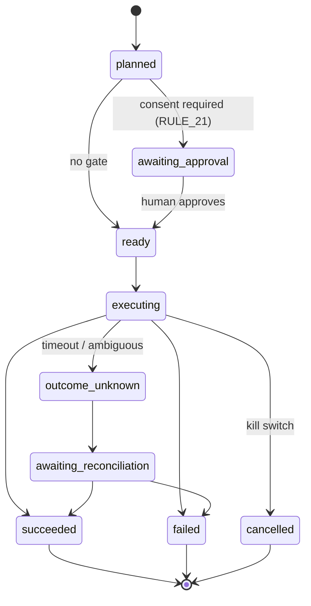
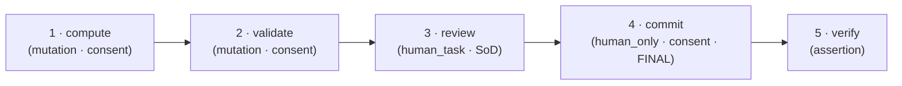
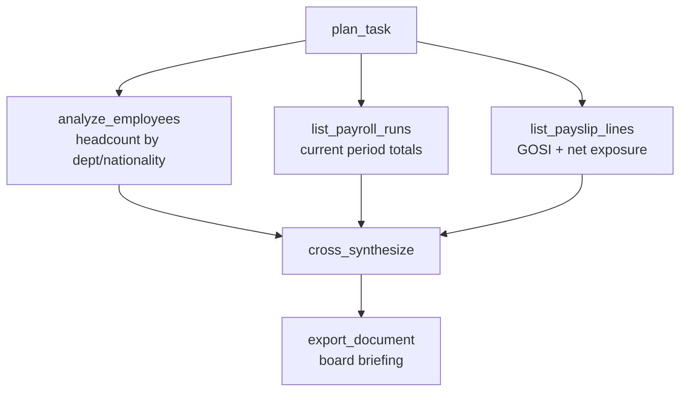

# Pulse as an Enterprise Coworker — Agentic Workflow Demo

**Instance:** Nibras (GOFSCO — Kuwait oilfield services, ~529 employees)
**Audience:** executive / design-partner demo
**Duration:** ~25 min (4 scenarios × ~6 min)
**What this proves:** Pulse is not a chatbot. It is a *supervised, task-oriented
coworker* that plans multi-step work, executes it against real systems under a
fail-closed governance boundary, and stays resilient when reality gets messy —
branching on conditions, pausing for human sign-off, retrying failures, and
escalating on unknown outcomes.

> Every capability shown here is real and running on `nibras.clearturn.tech`.
> The three lifecycle processes (`payroll.run`, `leave.request`, `loan.request`)
> are seeded as governed `ProcessDefinition` rows and validated by the test
> suite. The step state machine, consent gates, and step controls are the
> production surfaces exercised by `journey-14-nibras-pulse-coworker.spec.ts`.

---

## How to read every scenario

Each demo follows the same anatomy so the audience learns the pattern once:

| Beat | What the presenter shows | The "power" moment |
|------|--------------------------|--------------------|
| **The ask** | A plain-English instruction typed into Pulse | No forms, no clicks |
| **The plan** | Pulse decomposes it into a step DAG | It reasons about dependencies |
| **The run** | Live execution trace (SSE frames) | You watch it work, step by step |
| **The twist** | A branch / retry / conditional / gate fires | It handles the messy real world |
| **The proof** | Grounded output + evidence trail | Every number is traceable |

### The state machine behind every run



This is a **closed** transition table (`backend/ai/run_machine.py`): any edge not
drawn above is rejected. `cancelled` is reachable from every non-terminal state
(the kill switch). That closure is what makes the coworker *auditable* — it can
never end up in a state nobody defined.

### Step controls the supervisor always has (Phase W-7)

| Control | From state | To state | Meaning |
|---------|-----------|----------|---------|
| **approve** | `awaiting_approval` | `ready` | Consent to a staged mutation |
| **decline** | `awaiting_approval` | *held* | Refuse; run pauses, nothing executes |
| **retry** | `failed` | `pending` (`retry_count++`) | Re-queue after a fix |
| **skip** | `pending`/`failed`/`awaiting_approval`/`paused` | `skipped` | Satisfy dependents without running |
| **cancel** | `running` | `skipped` | Abandon a step; run continues |
| **pause / resume** | `running` → `paused` → `pending` | | Hold and release |
| **fork** | any | new plan | Branch a variant without touching the original |
| **rerun** | terminal | `approved` | Re-execute a whole plan from a clean slate |

---

## Scenario 1 — Monthly payroll run (the flagship)

**Showcases:** multi-step DAG · conditional variance branching (`ask_if`) ·
separation-of-duties human review · consent gate on an irreversible action ·
idempotency · resilience on unknown outcome.

### Business context
It is the 25th. GOFSCO must run October payroll for 529 employees, validate it
against Kuwait Labour Law + GOSI, get the Finance Manager's sign-off, and emit
the **WPS SIF** file the bank ingests to pay salaries. One wrong number is a
regulator problem.

### The ask
> **Ahmed (Payroll Preparer):** "Run October 2026 payroll for all GOFSCO
> employees, validate it, and get it ready for Finance to approve."

### The plan Pulse builds
Pulse resolves the governed `payroll.run.lifecycle` process and lays it out as a
dependency graph — it does **not** improvise the order:



### The run — trace as the audience sees it

```
▶ Plan #P-8841  "October 2026 payroll — GOFSCO"  status: approved → executing

  ✓ step 1  compute            529 employees → payslip lines generated      2.9s
              gross KWD 412,730 · GOSI KWD 21,140 · loans KWD 8,300
              status: computed

  ⏸ step 2  validate           running variance + statutory checks…
              ⚠ FINDING: 3 employees — overtime > 60h (KLL Art. 66 cap)
              ⚠ FINDING: 1 employee — net pay variance +38% vs Sep
              → policy ask_if: "validation findings contain unresolved variance"
              status: awaiting_approval  (paused for supervisor)
```

### The twist — a conditional branch fires
The process policy says:

```yaml
policies:
  ask_if:
    - validation findings contain unresolved variance
    - run period overlaps an already-committed run
```

Because validation surfaced unresolved variance, Pulse **does not barrel ahead**.
It pauses on `awaiting_approval` and hands the supervisor a real decision with
three governed exits:

- **Retry after fix** — the preparer corrects the 3 overtime records in People,
  then hits **retry** on step 2. `retry_count` increments, the step re-queues,
  and validation re-runs. (`retry_after_fix` is the declared recovery in
  `api_catalog.yaml`.)
- **Skip** — mark the finding as accepted (documented) and let step 2 satisfy
  its dependents. The skip is journaled as evidence.
- **Decline** — stop. Nothing downstream executes.

Presenter picks **retry**:

```
  ↻ step 2  validate (retry #1)  variance re-checked after correction
              ✓ overtime within cap · net-pay variance now +4% (explained: promotion)
              status: validated
```

### The human gate — separation of duties
Step 3 is `human_task` with `separation_of_duties: [preparer, approver]`. Pulse
**cannot** approve its own work. It creates a durable task in the **Finance
Manager's** inbox:

```
  ⏸ step 3  review    HumanTask #HT-2207 → Finance Manager (Layla)
              "October payroll validated, variance clean. Approve to commit."
              status: suspended · waiting on human_decision
```

Layla opens the inbox, sees the two findings and their resolutions, and approves.

### The point of no return — consent gate
Step 4 (`commit`) is `human_only` **and** `consent: true`. It is the irreversible
action (generates the WPS SIF, tells the bank to pay). Pulse stages it and waits
for an explicit, separate confirmation — approving the *review* is not the same
as consenting to the *commit*:

```
  ⏸ step 4  commit    STAGED — awaiting explicit consent
              "This posts October payroll as FINAL and generates the WPS SIF
               for salary disbursement. This cannot be undone."
              [ Approve & Commit ]   [ Decline ]
```

Layla consents:

```
  ✓ step 4  commit    posted FINAL · WpsSifFile generated → WPS-GOFSCO-202610.sif
              idempotency: run_id P-8841 — a committed run cannot be re-committed
  ✓ step 5  verify    predicate payroll.run.committed_and_variance_clean → TRUE
▲ Plan #P-8841  status: succeeded   (evidence: PayslipLines · Validations · ApprovalGrant · WpsSifFile)
```

### Resilience note (say this out loud)
If `commit` had timed out mid-write, the run would move to `outcome_unknown`
→ `awaiting_reconciliation`, **not** to `failed`. A payment either happened or
it didn't; the coworker refuses to guess. `recovery: manual_reconciliation` puts
a human in the loop before any retry — exactly what you want on money movement.

### Why this is hard
A naive script would blast all five steps. Pulse enforced a **DAG**, branched on
a **runtime condition**, respected **who is allowed to approve**, demanded
**separate consent for the irreversible step**, made the commit **idempotent**,
and left a **complete evidence trail**. That is the difference between automation
and a coworker.

---

## Scenario 2 — Leave request with an entitlement conditional

**Showcases:** `ask_if` conditional branch · `refuse_if` hard block
(separation of duties) · human review · entitlement-decrement verification.

### Business context
A field supervisor requests 18 days of annual leave. His remaining balance is
12. Under Kuwait Labour Law that overage needs a decision, not silent approval.

### The ask
> **Employee:** "Submit 18 days annual leave for Khaled Al-Rashidi, 2–19 Nov."

### The plan
`leave.request.lifecycle`: `submit → review (human) → record → verify`.

### The twist — conditional escalation
```yaml
policies:
  refuse_if:
    - requester equals approver          # hard block — SoD
    - request is not reviewed before record
  ask_if:
    - requested days exceed remaining entitlement   # soft branch — escalate
```

```
▶ Plan #P-9014  "Leave — Khaled Al-Rashidi (18d)"

  ✓ step 1  submit    LeaveRequest #LR-551 created                    status: recorded
  ⏸ step 2  review    ask_if fired: requested 18d > remaining 12d
              → escalated to line manager with the 6-day overage flagged
              HumanTask #HT-2231 · separation_of_duties enforced
```

Two governed outcomes the presenter can show live:

- **Manager is the requester?** `refuse_if: requester equals approver` → Pulse
  **hard-refuses** to let them self-approve and re-routes to the next authority.
  This is a guard, not a suggestion.
- **Manager approves the overage** (unpaid for 6 days) → step 3 `record` runs
  under consent, decrements the entitlement, and step 4 verifies the predicate
  `leave.request.recorded_and_entitlement_decremented`.

```
  ✓ step 3  record   entitlement 12 → 0 (12 paid) + 6 unpaid noted   status: recorded
  ✓ step 4  verify   predicate TRUE · LeaveEntitlementDelta = −12
▲ Plan #P-9014  status: succeeded
```

### Why this is hard
The same request takes **two different governed paths** depending on a number
Pulse read at runtime — and a self-approval attempt is **structurally
impossible**, not just discouraged.

---

## Scenario 3 — Loan request with threshold-based approval routing

**Showcases:** conditional approval *routing* (`ask_if` on principal) ·
separation of duties · schedule generation as verifiable evidence · `fork` for
"what-if".

### Business context
GOFSCO offers staff salary-advance loans. Small loans clear at line-manager
level; large ones must go to Finance. The threshold is policy, not code.

### The ask
> **Employee:** "Request a KWD 6,000 staff loan for Mariam Al-Otaibi, repaid
> over 12 months."

### The plan
`loan.request.lifecycle`: `submit → review (human) → activate → verify`.

### The twist — the principal changes *who* approves
```yaml
policies:
  ask_if:
    - principal exceeds configured approval threshold
```

```
▶ Plan #P-9102  "Loan — Mariam Al-Otaibi (KWD 6,000 / 12m)"

  ✓ step 1  submit     LoanRequest #LN-118 created                    status: recorded
  ⏸ step 2  review     ask_if: principal KWD 6,000 > threshold KWD 5,000
              → routed to FINANCE approver (not line manager)
              HumanTask #HT-2244 · SoD: requester ≠ approver
```

**Live "what-if" with `fork`:** the presenter forks the plan to a KWD 4,500
variant to show the *other* branch — same process, principal under threshold,
routes to the line manager — without disturbing the real request.

On approval:

```
  ✓ step 3  activate   loan activated · LoanInstallmentSchedule generated
              12 × KWD 500 · first deduction Nov payroll · last Oct 2027
  ✓ step 4  verify     predicate loan.request.activated_and_scheduled → TRUE
▲ Plan #P-9102  status: succeeded  (evidence: LoanActivation · LoanInstallmentSchedule)
```

### Why this is hard
The **approval authority is data-dependent**. Pulse routed a KWD 6,000 loan to
Finance and a KWD 4,500 loan to a line manager from the *same* process
definition — and the repayment schedule is generated evidence, not a promise.

---

## Scenario 4 — Cross-domain workforce briefing (agentic multi-tool)

**Showcases:** autonomous ReAct planning (no predefined process) · parallel
tool fan-out · retry on a transient failure · graceful degradation (fail-visible,
never fabricated) · scope isolation · export as artifact.

### Business context
The GM wants a board-ready snapshot before a cost review — headcount shape,
payroll cost, GOSI exposure, and any compliance risk — in one pass.

### The ask
> **GM:** "Give me a workforce cost and compliance briefing for GOFSCO this
> month, and export it as a document I can send to the board."

### The plan Pulse builds *itself*
No canned process here — Pulse plans the read/synthesis DAG and fans out the
independent reads in parallel (worker fan-out, `max_parallel`):



### The run — with a transient failure and recovery

```
▶ Plan #P-9200  "GOFSCO workforce briefing — Oct 2026"

  ⇉ parallel wave (3 reads dispatched)
  ✓ analyze_employees    529 employees · 33 org units · 198 positions        1.4s
                          top depts: Drilling 141 · HSE 63 · Logistics 58
  ✗ list_payroll_runs    upstream timeout (transient)                        FAILED
  ✓ list_payslip_lines   GOSI KWD 21,140 · net KWD 383,290                   1.1s

  ↻ retry list_payroll_runs (#1)   re-dispatched
  ✓ list_payroll_runs    Oct run P-8841 · gross KWD 412,730 · committed      0.8s

  ✓ cross_synthesize     3 grounded sources reconciled
  ✓ export_document      → GOFSCO-Workforce-Briefing-Oct2026.pdf
▲ Plan #P-9200  status: succeeded
```

### The twist — resilience without hallucination
One read failed on a transient timeout. Pulse **retried the single failed step**
(not the whole plan) and continued. Say this explicitly: *if the retry had also
failed, Pulse would have delivered the briefing with that section marked
"unavailable" — it degrades visibly and never invents a number.* Grounding is
enforced: totals trace back to `analyze_employees` / `list_payslip_lines`, and
answers cite their tool sources (`backend/ai/engine/llm/prompts.py` forbids
counting rows by hand — it must use an `analyze_*` endpoint).

### The guardrail — scope isolation
Ask the same Pulse *"what's our carbon footprint?"* and it **refuses** — the
Carbon app is not active on the Nibras instance. The coworker knows the edges of
its own authority. (This is asserted in Part B of the E2E journey.)

### Why this is hard
This wasn't a scripted pipeline — Pulse **planned** it, ran independent reads
**in parallel**, **recovered** from a real failure, kept every figure
**grounded**, and produced a **shareable artifact** — all inside the same
governance boundary as the mutating workflows above.

---

## The governance boundary (the sidebar that wins the room)

Every mutating step in every scenario passes through the same fail-closed command
boundary before anything touches a real record:

```
validate → PDP (policy decision) → consent (RULE_21) → budget → idempotency → execute → verify
```

- **PDP** — capability-scoped authorization; the user must hold the permission.
- **Consent** — irreversible/mutating actions are *staged* and require explicit
  human confirmation; approving one step ≠ consenting to the next.
- **Idempotency** — deduped by `run_id` / `request_id`; a committed payroll run
  cannot be double-committed.
- **Verify** — each step asserts a predicate (e.g.
  `payroll.run.committed_and_variance_clean`) before the run is called done.
- **Evidence** — every step emits typed evidence (`PayslipLines`,
  `ApprovalGrant`, `WpsSifFile`, `LoanInstallmentSchedule`, …) into an auditable
  journal. A replay of the journal is deterministic.

---

## Capability → scenario matrix (for Q&A)

| Capability | S1 Payroll | S2 Leave | S3 Loan | S4 Briefing |
|------------|:---:|:---:|:---:|:---:|
| Multi-step DAG (`depends_on`) | ✅ | ✅ | ✅ | ✅ |
| Conditional branch (`ask_if`) | ✅ | ✅ | ✅ | — |
| Hard refusal (`refuse_if` / SoD) | ✅ | ✅ | ✅ | — |
| Human-in-the-loop review (inbox) | ✅ | ✅ | ✅ | — |
| Consent gate on mutation (RULE_21) | ✅ | ✅ | ✅ | — |
| Retry after failure | ✅ | — | — | ✅ |
| Skip / cancel / pause / resume | ✅ | ✅ | — | — |
| Fork ("what-if" branch) | — | — | ✅ | — |
| Parallel tool fan-out | — | — | — | ✅ |
| Idempotency on re-run | ✅ | ✅ | ✅ | — |
| Unknown-outcome → reconciliation | ✅ | — | — | ✅ |
| Grounded reads / no-hallucination | — | — | — | ✅ |
| Scope isolation (refuse out-of-app) | — | — | — | ✅ |
| Typed evidence trail | ✅ | ✅ | ✅ | ✅ |

---

## Presenter run-sheet (fast path)

1. **Open with S1 payroll.** It has every muscle: DAG, branch, human gate,
   consent, irreversibility. Land the line: *"It refused to guess on money."*
2. **S2 leave** — show the self-approval **hard block**. One sentence: *"That's
   structurally impossible, not a warning."*
3. **S3 loan** — `fork` the KWD 4,500 variant live to show the *other* branch.
   *"Same process, different approver — decided by the data."*
4. **S4 briefing** — trigger the transient failure, show the **single-step
   retry**, then ask for carbon footprint and show the **refusal**. *"Resilient,
   grounded, and it knows its limits."*
5. **Close on the governance sidebar.** *"Everything you saw ran through one
   fail-closed boundary, with an evidence trail you can audit."*

---

## Grounding index (so nothing here is hand-waved)

| Claim | Source in repo |
|-------|----------------|
| Payroll lifecycle & policies | `domain_packs/nibras/processes/payroll.run.lifecycle.yaml` |
| Leave lifecycle & policies | `domain_packs/nibras/processes/leave.request.lifecycle.yaml` |
| Loan lifecycle & policies | `domain_packs/nibras/processes/loan.request.lifecycle.yaml` |
| Capability contracts (compute/validate/commit…) | `domain_packs/nibras/api_catalog.yaml` |
| Closed run/step state machine | `backend/ai/run_machine.py` |
| Step controls (retry/skip/cancel/pause/resume) | `backend/ai/plans_service.py`, `backend/ai/tests/test_step_controls.py` |
| Consent gate / `awaiting_approval` + token | `backend/ai/plans_service.py`, `backend/ai/durable_service.py` |
| Parallel worker fan-out | `backend/ai/engine/agent/workers.py` |
| Agent tools/plugins | `backend/ai/engine/agent/plugins.py`, `backend/ai/host_executor.py` |
| Grounding / no manual counting | `backend/ai/engine/llm/prompts.py` |
| End-to-end proof (all four parts) | `carbon-frontend/e2e/journeys/journey-14-nibras-pulse-coworker.spec.ts` |
| Process-artifact tests | `backend/ai/tests/test_nibras_{payroll,leave,loan}_process.py` |

> **Data realism:** figures (KWD amounts, headcount 529 / 198 positions / 33 org
> units, GOSI/WPS) are representative of the GOFSCO dataset for demo readability.
> The *mechanics* — every state, gate, branch, and evidence type — are real.
