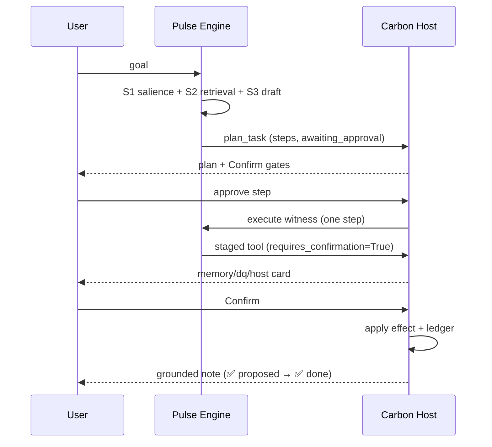

# DESIGN — Generalized Intelligence & Sustainable Pulse ("The Separate Brain")

- **Status:** Active design — principles + boundary contract + capability stack + growth model
- **Author:** Master Architect
- **Date:** 2026-08-21
- **Audience:** Backend Worker, Frontend Worker, QA Validator, DevOps Worker, future agents
- **Supersedes:** nothing (new dimension). **Complements** `docs/DESIGN_AI_WORKSPACE_NEXTGEN.md`
  (v3 — the *shell/UX/workflow* layer) and `docs/DESIGN_AI_WORKSPACE_V4.md`. This doc owns the
  *reasoning / reflection / growth* layer — how Pulse becomes a genuinely general coworker without
  ever being coupled to Carbon.
- **Binding rules referenced:** RULE_6 (engine holds NO durable state), RULE_18, RULE_20 (no upward
  imports), RULE_21 (no auto-mutation), RULE_23 (no implementation leakage), RULE_24/25/26 (model routing).

---

## 0. TL;DR

Pulse must grow from a *thin Q&A shell* into a **true coworker**: it plans, reasons, reflects,
learns from feedback, and extends itself — but it is and must remain a **separate brain**.

Three non-negotiables drive everything below:

1. **Separate brain (RULE_6).** The engine `backend/ai/engine/` holds **zero durable state**. It is
   pure reasoning. Carbon owns persistence (`AIConversation`, `AIMessage`, `MemoryLongTerm`,
   `KgFeedbackRecord`, `ConversationCheckpoint`); Pulse owns inference. The two touch only at
   *integration surfaces* (`engine_runtime.py`, `providers/pulse.py`, serializers).
2. **Never tightly couple.** No `from carbon.catalog import …`, no Carbon model imports, no app
   awareness inside the engine. Carbon is *one host* among many; Pulse is host-agnostic.
3. **Sustainable growth.** New capabilities come through a **registry + plugin/tool/skill contract**,
   never by editing the core reasoning loop. The engine's inner loop should rarely change; the
   *periphery* (tools, skills, archetypes, MCP servers) grows forever.

---

## 1. The Boundary Contract (what Pulse owns vs what Carbon owns)

This is the contract that keeps Pulse a "separate brain". Violating it is the #1 way to make the
platform unsustainable.

| Concern | Pulse (engine) | Carbon (host) |
|---------|----------------|---------------|
| Reasoning | ✅ Six-witness pipeline (`TurnPipelineRunner`), salience, retrieval, draft, critic, execute, ledger | ❌ none |
| Truthfulness gates | ✅ `apply_anti_hallucination_gate`, `_classify_pending`, `_grounded_outcome_note` | ❌ none |
| Tool *execution* | ✅ declares which tool + params (via `execute` witness) | ✅ owns the actual effect (creates DQ rule, writes memory row, runs query) |
| Durable state | ❌ **forbidden** (RULE_6) | ✅ all models, migrations, PostgreSQL |
| Memory | ✅ *retrieves* memory in-context (S2) | ✅ owns `MemoryLongTerm`, learn/forget, `KgFeedbackRecord` |
| Identity / auth | ❌ none | ✅ RBAC, org isolation, `GuardChain` |
| Observability | ✅ emits ledger/trace frames | ✅ persists `EngineLedger`/`RunRecord`, `/admin/ai/*` panels |
| Cost/budget | ✅ requests budget from host | ✅ enforces token/cost budget, `AIBudget` |
| Capability list | ✅ introspects its registered tools/skills (`list_my_capabilities`) | ✅ gates which tools an org/user may call |

**Integration surfaces (the ONLY allowed touch points):**
```
backend/ai/engine_runtime.py   # deterministic surfacing: gates, grounded note, classification
backend/ai/providers/pulse.py  # LLM transport + progress frames (generalized stream)
backend/ai/serializers.py      # request/response shapes
backend/ai/workspace_api.py    # lifecycle, pagination, stop, export, confirm
```
No other file in Carbon may import from `ai/engine/` internals; no file in `ai/engine/` may import
from Carbon apps (RULE_20). The engine remains a self-contained, host-agnostic package.

---

## 2. The Capability Stack (how "generalized" is achieved, honestly)

Generalized intelligence is **not** a bigger prompt. It is a *separable capability stack* where each
layer is independently testable, replaceable, and measurable. The six-witness pipeline is the
*reasoning spine*; the layers below are the *muscles* that make it general.

```
┌─────────────────────────────────────────────────────────────┐
│ L5 REFLECTION   — feedback flywheel, distill, self-correction │  ← growth loop
├─────────────────────────────────────────────────────────────┤
│ L4 ACTION       — tools/skills/MCP, confirm gates (RULE_21)   │  ← agentic
├─────────────────────────────────────────────────────────────┤
│ L3 MEMORY       — episodic (conversation) + semantic (facts)  │  ← host-owned
├─────────────────────────────────────────────────────────────┤
│ L2 REASONING    — TurnPipelineRunner S1..S6 (salience→ledger) │  ← the spine
├─────────────────────────────────────────────────────────────┤
│ L1 PERCEPTION   — context assembly, scope, retrieval (S2)     │  ← grounding
└─────────────────────────────────────────────────────────────┘
```

Each layer's *ownership* is pinned to the boundary contract in §1. The engine implements L1/L2 and
the *decision* half of L4; Carbon implements L3 and the *effect* half of L4; L5 is co-owned but
**initiated by Carbon** (Pulse must never mutate its own memory or re-write its own rules).

### 2.1 What "generalized" does and does NOT mean

| Claim | Truth |
|-------|-------|
| "Answers any domain" | Only if a skill/tool/context for that domain is *registered*. Generality = *registry-driven*, not *magic*. |
| "Learns by itself" | Learning is **feedback-driven and host-approved** (KgFeedbackRecord). No unsupervised self-modification. |
| "Reasons step-by-step" | Yes — but reasoning is *surfaced truthfully* (F3 gates forbid fabricated "I ran the audit"). |
| "Remembers everything" | No — memory is *scoped, confirm-gated, and budgeted*. Forgetting is first-class. |
| "Acts autonomously" | Only through **staged + confirmed** tools (RULE_21). Plans are plans until approved. |

---

## 3. True Coworker — Agentic Workflow

A coworker, not a chatbot: it holds a **plan**, executes **one approved step at a time**, and shows
**provenance** for every claim. This builds on NEXTGEN §10–§12 but adds the *reasoning* contract.

### 3.1 The agentic loop (canonical)



### 3.2 Rules that make it a *trusted* coworker

- **Plans are plans** (F6): `plan_task` creates `awaiting_approval` steps; it never narrates completion.
- **No auto-mutation** (RULE_21): every write is `requires_confirmation=True`; the engine only
  *proposes*, the host only *effects* after explicit Confirm.
- **Provenance is mandatory** (NEXTGEN §12): every claim carries its source (retrieved fact / tool
  result / model inference), never a bare assertion.
- **Truthfulness gates always on** (F1–F3): success-claim, false-denial, and reasoning-narration
  gates run on every assistant turn, before the grounded note is appended.

### 3.3 "Really truly" coworker — the bar

A coworker must be able to: (1) ask clarifying questions when the goal is ambiguous, (2) break work
into steps, (3) pause at a confirm gate, (4) admit "I don't know", (5) correct itself when corrected.
Each maps to a QA category in the companion plan (§F1–F8 of `TASK-QA-ANTI-FABRICATION-GATES.md`).

---

## 4. The Reflection Engine (sustainable learning)

The current feedback flywheel (`outcome → learn_from_message → KgFeedbackRecord`) is correct but
*thin*. Sustainability requires closing the loop **without** letting the engine mutate itself.

### 4.1 Three loops (fast → slow)

| Loop | Cadence | Mechanism | Who writes |
|------|---------|-----------|------------|
| **R1 — immediate** | per turn | truthfulness gates + grounded note + ledger | engine (read-only on state) |
| **R2 — episodic** | per session | `learn_from_message` on outcome (👍/👎, edit, correct) → `KgFeedbackRecord` | host, user-triggered |
| **R3 — consolidation** | daily/weekly | distill feedback + successful turns → skill/tool/context improvements | host (scheduled), human- or agent-reviewed |

### 4.2 Reflection is *read-only* for Pulse

Pulse may **propose** (e.g. "this correction seems worth remembering") but must **never** write
memory, rules, or its own config. Every learning artifact is created by Carbon with audit trail.
This is the sustainable guardrail: a self-modifying agent is a liability; a *proposing* agent with a
host-side governance gate is a system.

### 4.3 Metrics that make growth measurable

| Metric | Signal | Panel |
|--------|--------|-------|
| Truthfulness hit-rate | % turns with zero gate flags | ledger flags |
| Confirm rate | % staged tools confirmed (signal quality) | workspace stats |
| Correction rate | % turns corrected by user (R2) | KgFeedbackRecord |
| Retrieval hit-rate | S2 recall of memory/facts | engine trace |
| Cost per useful turn | budget / (turns − corrected) | AIBudget |

---

## 5. Registry-Driven Extension (sustainable growth)

The single most important sustainability lever: **grow the periphery, freeze the spine.**

### 5.1 The plugin/tool/skill/archetype contract

Everything new arrives as a **registered capability** with a manifest — never an edit to the
reasoning loop:

```
capability:
  id: "dq_suggest"
  kind: tool | skill | archetype | mcp_server
  intent: "suggest a data-quality rule"
  requires_confirmation: true        # RULE_21
  input_schema: { ... }
  output_schema: { ... }
  capability_claim: "I can suggest DQ rules"   # feeds list_my_capabilities (F5)
```

The engine's `execute` witness **introspects the registry** — it does not know about DQ, memory, or
emissions specifically. That is what makes it *general*: adding a "legal-review" tool makes Pulse a
legal coworker without touching a single engine file.

### 5.2 Growth invariants

1. **No new tool = no new engine code.** A tool is data (manifest) + a host-side handler.
2. **`list_my_capabilities` is derived from the registry** (truthful by construction — F5-03).
3. **Every capability declares `requires_confirmation`** — no silent new mutation surface.
4. **MCP servers** are the external edge: they bring tools/skills from *outside* Carbon, keeping the
   coupling boundary at the adapter, not the core.
5. **Deprecate, don't delete.** Registry entries version; retired capabilities are gated off, not
   removed from ledgers.

### 5.3 The growth staircase (maturity levels)

| Lvl | Name | Capability | Marker |
|-----|------|-----------|--------|
| 0 | Responder | single-turn Q&A | today (thin shell) |
| 1 | Truthful responder | gates F1–F8 hold | companion QA plan |
| 2 | Planner | plan_task + confirm gates | F6 |
| 3 | Coworker | multi-step + provenance + corrections | §3.3 bar |
| 4 | Self-extending | registry/MCP-driven new skills | §5.1 |
| 5 | Reflective system | R3 consolidation + measured improvement | §4.3 |

Each level is a **gate**, not a date. Do not open L4 until L2 (truthfulness) is green — a dishonest
agent that learns is the worst outcome.

---

## 6. Sustainability — Governance, Budget, Observability

Growth without governance is decay. Four guardrails keep Pulse growing sustainably.

1. **No-state rule enforced in CI.** A `verify.sh` check that greps `ai/engine/` for any
   `.objects.` / model import / DB write and fails the build (RULE_6/RULE_20). This is the
   *automatic* proof Pulse stays a separate brain.
2. **Budget discipline.** Every turn is cost-attributed (NEXTGEN G8); budgets are per-user/org;
   the engine *requests* budget and the host *enforces* it. No unbounded agent loops.
3. **Observability as first-class.** Ledger/trace is not debug logging — it is the evidence layer
   for QA (the companion plan depends on it). Every gate flag is recorded.
4. **Confirmation everywhere a write exists.** The audit trail for "what did the agent do" is the
   confirm log — the single source of truth for a coworker's actions.

---

## 7. Roadmap (phased, gated — additive to NEXTGEN §16)

| Phase | Scope | Exit gate |
|-------|-------|-----------|
| **G-A** | Truthfulness gates + memory trust | ✅ **GATE MET** — F1–F8 live-verified green (see `docs/TASK-RESULT-QA-ANTI-FABRICATION-GATES.md`); backend `ai` 1074 passed, frontend `AIMessageBubble.actions` 16 passed. Residuals: none open (P3 persona wording resolved). |
| **G-B** | Reflection R2 hardening + `list_my_capabilities` truthfulness | ✅ **GATE MET** — R2 correction-rate metric surfaced in the rollup (`KgFeedbackRecord`, §4.3) so the reflection loop is measurable; `list_my_capabilities` stays registry-derived + RBAC-scoped (F5 green). See `docs/TASK-RESULT-G-B-R2-LIST-CAPABILITIES.md`. |
| **G-C** | Registry/plugin contract + first MCP adapter | ✅ **GATE MET** — plugin registry is the single extension seam; `chat_tool_names()`/`capability_claims()` derive the chat surface + `list_my_capabilities` truthfully; first non-carbon tool (`unit_converter`) landed with zero engine edits (see `docs/TASK-RESULT-G-C-REGISTRY.md`). Backend `ai` 1080 passed (+1 known order-dependent flake, passes in isolation). |
| **G-D** | plan_task confirm workflow end-to-end + provenance surface | ✅ **GATE MET** — chat-native confirm workflow proven end-to-end (`plan_task` → `edit_plan` → `approve_plan` → run → completed) with an audit ledger; provenance surfaced at message / KG / tool-outcome layers (see `docs/TASK-RESULT-G-D-PLAN-CONFIRM.md`). F6 green. |
| **G-E** | R3 consolidation (scheduled distill, human/agent-reviewed) | ✅ **GATE MET** — §4.3's first metric (truthfulness hit-rate) is now recorded per-turn (`turn_ledger` stage `truthfulness_gate`) and aggregated per-user in the Pulse rollup (see `docs/TASK-RESULT-G-E-R3-CONSOLIDATION.md`). R3 distill itself stays host-side + human/agent-reviewed per §4.2. |

---

## 8. Anti-Goals (what we are explicitly NOT doing)

- ❌ Giving Pulse a standing background process that mutates state on its own.
- ❌ Importing Carbon models into the engine (tight coupling).
- ❌ "More context = smarter" — unbounded prompt stuffing (RULE_23 leak risk, budget blowup).
- ❌ Self-modifying prompts/rules without a host-side governance gate.
- ❌ A second, divergent "Pulse brain" that duplicates Carbon's DQ/emissions logic.
