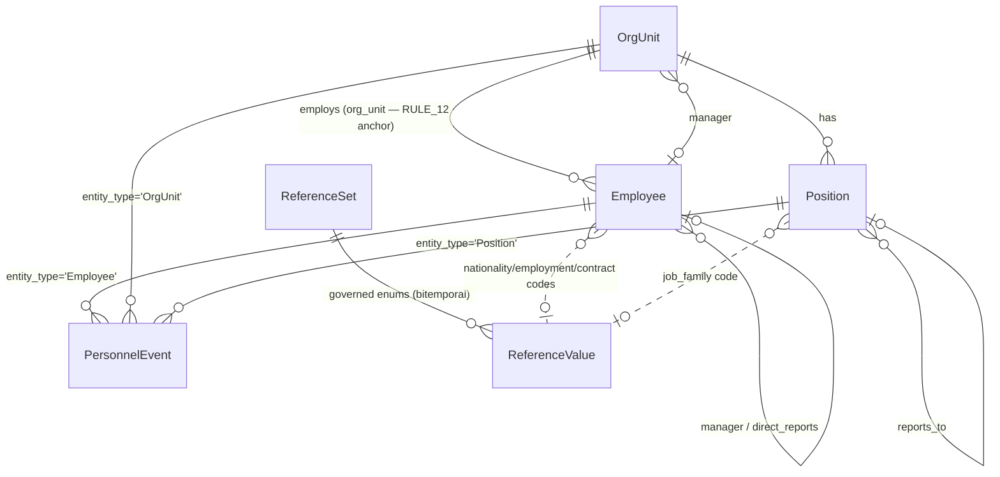

# DESIGN — Org Metadata & People Profiles (Nibras / People app)

> **Status:** Design v1.0 — 2026-09-01. Author: Master Architect.
> **Scope:** Organisation metadata (OrgUnit structure) + Employee profiles + a
> queryable change **chronicle**. Anchor customer: GOFSCO (see
> `docs/NIBRAS-MASTER-STRATEGY.md`). Umbrella: `docs/CLEARTURN-PLATFORM-ARCHITECTURE.md`.
> **Supersedes:** the two chat design drafts (2026-09-01) and their over-scoped
> Person/Assignment/CostCenter/Location proposal — corrected here after a critical audit.

---

## 0. WHY THIS DOCUMENT EXISTS

The first drafts over-scoped (Person split, EmployeeAssignment, CostCenter, Location,
Project — five phases) against the project's own **"land narrow"** constitution, ignored
platform facilities that already exist (EOSI engine, bitemporal reference data, the
OrgUnit detail UI, three audit systems), and contained a concrete breakage (moving
`Employee.full_name` breaks the WPS export). This design is the corrected, in-scope,
**reuse-first, non-breaking** version.

**In scope:** OrgUnit metadata, Employee profile enrichment, the change chronicle.
**Explicit non-goals (deferred, see §9):** Person/identity split, EmployeeAssignment
history table, CostCenter/Location/Project dimensions.

---

## 1. GROUND TRUTH (verified against code, 2026-09-01)

| Fact | Location | Consequence for this design |
|------|----------|-----------------------------|
| `OrgUnit` is a self-ref tree with `ORG_TYPE_CHOICES` (academic) | `mdm/models.py` | Extend types additively; do NOT add a parallel `Location` table |
| OrgUnit create/update/delete **already** emit `GovernanceEvent` | `mdm/views.py:549,586,602` | Org audit exists — chronicle *reads* it, doesn't duplicate it |
| `Employee` is the FK anchor for M3–M7 + payroll pipeline | `people/models.py` | `Employee` stays the anchor; enrich in place, never split |
| `Employee` writes emit governance events **only on delete** | `people/views.py` (post/patch don't emit) | Add create/update chronicle for Employee — the real gap |
| WPS export reads `employee.full_name`, `employee.basic_salary` | `people/payroll_service.py` | Moving name off `Employee` = breakage. Keep them. |
| EOSI engine exists with `as_of` temporal support | `people/services.py:21`, `calculation_engine.calculate_eosi` | EOSI is NOT missing — only its HTTP endpoint is (§8) |
| Reference data is bitemporal (`valid_from`/`valid_to` + `get_current_values(as_of=)`) | `mdm/models.py:56` | Reuse `ReferenceValue` for governed enums; don't invent temporal refs |
| Detail pages use `BaseDetailPage` + inspector tabs + Notes | `components/detail/BaseDetailPage.jsx`, `inspector/tabs/*` | Profile/org pages are *tabs on the existing framework*, not new pages |
| Three audit systems exist: `GovernanceEvent`, `RequestAuditLog`, `RoleAssignmentAuditLog` | `catalog/`, `core/`, `accounts/` | A 4th table needs justification (§4.2) — it earns it via `effective_date` + domain vocabulary |

---

## 2. THE CORE / GOFSCO-SPECIFIC CUT

**Test:** *if customer #2 (a Saudi industrial firm) onboards tomorrow, does this need a
code change?* If yes → it's config/data, not code.

| Layer | Content | Where it lives | Core or GOFSCO |
|-------|---------|----------------|----------------|
| **Code (platform IP)** | `PersonnelEvent` model + emission mixin; `OrgUnit` extended types; `Employee` profile fields; profile/org UI tabs | migrations + components | **CORE** |
| **Compliance seam (data)** | Kuwait min-wage, GOSI rates, KLL Art.51 EOSI base, leave split, WPS spec | `ComplianceRule` records (`jurisdiction='KW'`) | domain data |
| **Governed enums (`ReferenceSet`)** | `nationality`, `employment_type`, `contract_type`, `grade`, `job_family`, `identity_doc_type`, `termination_reason` | seed + admin UI (no deploy) | **CORE schema, config values** |
| **Seed commands (data)** | GOFSCO org tree (Ahmadi base, Drilling/CT/PCP yards, 4 stores), G-grades, rotation patterns, KOC cert types | `seed_gofsco_org.py` | **GOFSCO-specific** |

**One-line rule:** the engine and the chronicle are always **code**; the values they
operate on are always **data**. Customer #2 is a different seed command + rule set, never a
different code path. No `if company == 'GOFSCO'` anywhere.

---

## 3. WHAT CHANGES — THE MODEL

Additive only. No field is moved or removed. Every existing test keeps its shape.

### 3.1 `OrgUnit` — extend types + supervisory link (additive)

```python
# mdm/models.py — ORG_TYPE_CHOICES gains industrial types (additive; academic kept)
ORG_TYPE_CHOICES = [
    # ...existing academic types kept for AASTMT instance...
    ('company', 'Company'), ('division', 'Division'), ('section', 'Section'),
    ('crew', 'Crew'), ('base', 'Base'), ('yard', 'Yard'), ('store', 'Store'),
    ('cost_center', 'Cost Center'),
]
# New optional field — supervisory org (who runs this unit):
manager = models.ForeignKey('people.Employee', null=True, blank=True,
                            on_delete=models.SET_NULL, related_name='managed_org_units')
```

> `manager` is a nullable cross-app FK (mdm → people). This is the ONE place core points
> at a hosted app. Justified: supervisory org is platform-generic. Guard with `SET_NULL`
> so deleting an employee never cascades org loss. (If the import-boundary audit flags
> mdm→people, use a soft `PositiveIntegerField` id instead — decided at build time.)

Frontend hardcoded type lists to update (4 files): `OrgUnitsPage.jsx`,
`tabs/OrgUnitEditTab.jsx`, `tabs/OrgUnitOverviewTab.jsx`, `tabs/OrgUnitSummaryMetrics.jsx`,
`pages/catalog/MDMPage.jsx`. Prefer sourcing the list from one shared constant.

### 3.2 `Employee` — enrich in place (additive)

```python
# people/models.py — Employee gains structured profile fields (all nullable/blank)
name_en_given   = models.CharField(max_length=100, blank=True)
name_en_family  = models.CharField(max_length=100, blank=True)
name_ar_given   = models.CharField(max_length=100, blank=True)
name_ar_family  = models.CharField(max_length=100, blank=True)
# full_name STAYS — WPS + payslip read it. Populate from parts via save() if parts given.
civil_id        = models.CharField(max_length=32, blank=True, db_index=True)
date_of_birth   = models.DateField(null=True, blank=True)
gender          = models.CharField(max_length=16, blank=True)
# Governed enums → existing bitemporal ReferenceValue (store the code string, validate on write)
nationality_code     = models.CharField(max_length=40, blank=True)  # ReferenceSet 'nationality'
employment_type_code = models.CharField(max_length=40, blank=True)  # ReferenceSet 'employment_type'
contract_type_code   = models.CharField(max_length=40, blank=True)  # ReferenceSet 'contract_type'
kuwaitization        = models.BooleanField(default=False)
manager = models.ForeignKey('self', null=True, blank=True,
                            on_delete=models.SET_NULL, related_name='direct_reports')
```

> `nationality` (free CharField) is kept for back-compat and deprecated in favour of
> `nationality_code`. Do NOT drop it in this phase (a passing test asserts it).
> Enums are stored as the ReferenceValue **code** (string), validated at the serializer
> boundary against `ReferenceSet.get_current_values()`. This reuses the platform's
> governed-enum pattern without a hard FK per enum.

### 3.3 `Position` — status + governed refs (additive)

```python
# people/models.py — Position gains lifecycle + FTE + governed job classification
STATUS_CHOICES = [('proposed','Proposed'),('open','Open'),('filled','Filled'),
                  ('frozen','Frozen'),('closed','Closed')]
status          = models.CharField(max_length=20, choices=STATUS_CHOICES, default='filled')
fte             = models.DecimalField(max_digits=4, decimal_places=2, default=1)
job_family_code = models.CharField(max_length=40, blank=True)  # ReferenceSet 'job_family'
# grade already exists as CharField; keep. reports_to already exists; keep.
```

### 3.4 `PersonnelEvent` — the chronicle (the one genuinely new table)

```python
# people/models.py — append-only domain chronicle for replay / timelines / KPIs
class PersonnelEvent(models.Model):
    ENTITY = [('Employee','Employee'),('OrgUnit','OrgUnit'),('Position','Position')]
    KIND = [  # domain vocabulary — the reason GovernanceEvent (create/update/delete) is insufficient
        ('hired','Hired'),('transferred','Transferred'),('promoted','Promoted'),
        ('salary_change','Salary Change'),('grade_change','Grade Change'),
        ('contract_renewed','Contract Renewed'),('rotation_changed','Rotation Changed'),
        ('deactivated','Deactivated'),('reactivated','Reactivated'),
        ('profile_updated','Profile Updated'),
        ('org_created','Org Created'),('org_restructured','Org Restructured'),
        ('org_renamed','Org Renamed'),('manager_changed','Manager Changed'),
        ('position_opened','Position Opened'),('position_filled','Position Filled'),
        ('position_frozen','Position Frozen'),('position_closed','Position Closed'),
    ]
    entity_type  = models.CharField(max_length=20, choices=ENTITY, db_index=True)
    entity_id    = models.PositiveIntegerField(db_index=True)
    event_kind   = models.CharField(max_length=32, choices=KIND, db_index=True)
    effective_date = models.DateField(db_index=True,   # real-world date the change took effect
                       help_text="When the change is TRUE in the world (drives EOSI/KPIs)")
    recorded_at  = models.DateTimeField(auto_now_add=True,  # when it was entered
                       help_text="When the change was entered into the system (audit)")
    recorded_by  = models.ForeignKey('accounts.User', null=True, blank=True,
                                     on_delete=models.SET_NULL, related_name='personnel_events')
    before       = models.JSONField(null=True, blank=True)
    after        = models.JSONField(null=True, blank=True)
    notes        = models.TextField(blank=True)

    class Meta:
        ordering = ['-effective_date', '-recorded_at']
        indexes = [
            models.Index(fields=['entity_type','entity_id','effective_date']),
            models.Index(fields=['event_kind','effective_date']),
        ]
```

### 3.5 ERD



---

## 4. THE CHRONICLE — DESIGN DECISIONS

### 4.1 Two timestamps (bitemporal), non-negotiable

```
effective_date : the date the change is TRUE in the world  → EOSI, headcount KPIs, cost history
recorded_at    : the date the change was ENTERED            → audit, "who knew what when"
```

A backdated transfer entered today has `effective_date < recorded_at`. Every point-in-time
question (service length, headcount on date D) reads `effective_date`; the audit trail reads
`recorded_at`. This mirrors the platform's existing `as_of` convention (`ReferenceValue`,
`calculate_eosi(as_of=)`), so it is a **consistent** extension, not a new paradigm.

### 4.2 Why a 4th audit table (and not extend `GovernanceEvent`)

| Need | `GovernanceEvent` | `RequestAuditLog` | `PersonnelEvent` |
|------|-------------------|-------------------|------------------|
| Domain event vocabulary (`promoted`, `transferred`) | ✗ (create/update/delete) | ✗ (HTTP verbs) | ✓ |
| `effective_date` (real-world vs entry time) | ✗ | ✗ | ✓ |
| Persistence (best-effort + CRITICAL) | ✗ (swallows errors) | ✗ | ✓ (best-effort + CRITICAL) |
| Queryable timeline for KPIs/replay | partial | ✗ | ✓ (indexed) |

Decision: **new domain table.** `GovernanceEvent` remains the generic compliance audit
(and still fires); `PersonnelEvent` is the domain chronicle powering timelines/KPIs. They
are complementary, not duplicative — the chronicle is the HR-semantic layer, governance is
the platform-generic layer.

### 4.3 Persistence philosophy — CORRECTED (best-effort + CRITICAL)

`emit_governance_event` is intentionally best-effort (never breaks the request). The
chronicle follows the **same** discipline: the `PersonnelEvent` write happens inside the
**same `transaction.atomic()`** block as the model mutation, but is wrapped in
`try/except`. If the event can't be written, the mutation **SUCCEEDS** and a CRITICAL log
entry is recorded. Rationale: never convert a log warning into a user-visible 500 — a
payroll/EOSI chronicle with holes is loudly logged (CRITICAL) for investigation, but a
failed edit the user cannot see is worse. *(corrected from the initial draft — see P1
implementation)*

### 4.4 Append-only enforcement (not a hand-wave)

`PersonnelEvent` has **no update/delete API surface** (no PATCH/DELETE views). The model
overrides `delete()` to raise, and admin registration is read-only. Corrections are new
events (`event_kind='profile_updated'` with a correcting `after`), never edits — same
discipline as a general ledger.

### 4.5 Emission seam

```python
# people/chronicle.py  (core, importable by people views/services only)
def record_event(*, entity, event_kind, effective_date, user, before, after, notes=""):
    """Write a PersonnelEvent. MUST be called inside the caller's transaction.atomic()."""
```

Wired at the service/view layer for Employee, Position, OrgUnit create/update/deactivate.
Helper computes `before`/`after` from a small allow-list of tracked fields per entity
(no full-row dumps — PII-minimised, KPI-relevant fields only).

---

## 5. API SURFACE (additive; existing routes unchanged)

| Method | Path | Purpose |
|--------|------|---------|
| GET | `people/employees/<id>/timeline/` | Chronicle for one employee (ordered by `effective_date`) |
| GET | `people/org-units/<id>/timeline/` | Chronicle for one org unit |
| GET | `people/positions/<id>/timeline/` | Chronicle for one position |
| GET | `people/timeline/?entity_type=&kind=&from=&to=` | Cross-entity chronicle feed (dashboards) |
| GET | `people/employees/<id>/eosi/?as_of=` | EOSI provision (wraps existing engine — §8) |

All read endpoints are CBAC-gated (`people:view`) and RULE_12 org-scoped, matching the
existing `_Gated*View` pattern. No new write endpoints for the chronicle (append-only).

---

## 6. FRONTEND — REUSE MAP (satisfies "must reuse components")

Nothing bespoke. Everything hangs off the existing detail framework.

| Concern | Reused component | New work |
|---------|------------------|----------|
| Employee profile page | `BaseDetailPage` + `DetailHeader` | `EmployeeDetailPage` (compose only) |
| Profile / overview tab | `mainTabs` prop pattern | `EmployeeProfileTab` (accordion sections with per-section + one-shot edit-all CRUD) |
| **Timeline tab** | `mainTabs` + existing MUI `Timeline`/list | `EmployeeTimelineTab` (reads `/timeline/`) |
| Inspector (metrics) tabs | `inspector/tabs/*` registration | `employeeTabs.jsx` (mirror `orgUnitTabs.jsx`) |
| Notes / comments | `useNotes().setContexts` | wire `entity_type='Employee'` context |
| Org page enrichment | existing `OrgUnitDetailPage` + tabs | add Timeline tab + new org types |
| Governed enum dropdowns | existing `ReferenceSet` values API | fetch `nationality`/`grade`/… codes |
| Forms/dialogs | `SystemDialog`, `PageHeader`, `EmptyState` | reuse (People CRUD pattern, repo memory) |

i18n: dual EN/AR flat camelCase keys, parity gate (ADR-0018). RTL handled by shell.
No hex, theme tokens only (RULE_8). `apiFetch` only (RULE_10).

---

## 7. CODE vs CONFIG vs REFERENCE-DATA (the trichotomy)

```
IN CODE (breaking to change)          COMPLIANCE SEAM (data = law)       REFERENCE DATA (admin, no deploy)
────────────────────────────         ──────────────────────────         ────────────────────────────────
• PersonnelEvent append-only         • ComplianceRule (KW) records      • ReferenceSet: nationality,
• event fires in same txn as write   • min-wage, GOSI, EOSI base,          employment_type, contract_type,
• Employee soft-delete only            leave split, WPS spec               grade, job_family, identity_doc,
• RULE_12 org scoping                • engine code generic; values         termination_reason
• effective_date ≤ today for `hired`   loaded later, no code change       • bitemporal (valid_from/valid_to)
• ORG_TYPE_CHOICES keys (stable)                                         SEED (data): GOFSCO org tree,
• two-timestamp chronicle model                                            G-grades, rotation patterns,
                                                                           KOC cert types  → customer #2 = new seed
```

---

## 8. THE ONE REAL BACKEND GAP — EOSI ENDPOINT

The EOSI *engine* exists (`CalculationService.calculate_eosi(employee, as_of=)`). The gap is
only a **view**: `GET people/employees/<id>/eosi/?as_of=YYYY-MM-DD` → wraps the service,
returns `{value, lineage, as_of}`, CBAC+RULE_12 gated, 409 if no authoritative `eosi`
`ComplianceRule`. This is thin (mirror `PayrollRunWPSExportView`), not the "net-new backend"
the earlier drafts implied.

---

## 9. NON-GOALS (explicitly deferred — avoid the earlier over-scope)

| Deferred item | Why deferred | Gate to revisit |
|---------------|--------------|-----------------|
| `Person`/identity split | Breaks WPS `full_name`; no need for identity-without-employment yet | When recruiting (pre-hire persons) or dependents are in scope |
| `EmployeeAssignment` history table | `Employee.org_unit` + `PersonnelEvent(transferred)` already give org history + replay | When a person must hold *multiple concurrent* positions, or matrix reporting is required |
| `CostCenter` / `Location` / `Project` dimensions | Out of "org + profiles" scope; OrgUnit `facility`/`cost_center` types cover sites for now | Job-costing / KOC billing phase |
| `current_org_unit` denorm rename | `Employee.org_unit` already IS the anchor; a rename adds a 3rd source of truth | Never (rejected) |

---

## 10. MIGRATION SAFETY & TEST IMPACT

- **All model changes are additive & nullable** → `makemigrations` produces additive
  migrations; existing rows valid without back-fill.
- **`Employee.full_name` / `basic_salary` / `org_unit` unchanged** → WPS export, payroll
  service, and the 95 passing people tests keep their shape.
- **Serializer additions are new optional fields** → existing `EmployeeSerializer` field
  assertions in `test_api.py` still pass (new fields are additive; assert-by-inclusion).
- **Chronicle is purely additive** → no existing path depends on it; wiring it into
  create/update is new emission, not changed behaviour.
- **Cross-app FK (`OrgUnit.manager` → people.Employee)** → the only boundary risk; verify
  against `.ai-toolkit/scripts/audit-imports.sh`. Fallback: soft id field.

Gate every phase: `pytest people` (95→) green, then `verify.sh all`. Frontend: lint →
i18n parity → vitest → build → verify.

---

## 11. PHASING (land narrow, additive, each independently shippable)

| Phase | Deliverable | Risk | Enables |
|-------|-------------|------|---------|
| **P1** | `PersonnelEvent` model + `chronicle.record_event` + wire into existing Employee/Position/OrgUnit create/update/delete; timeline read endpoints | Low (additive) | Replay, timelines, KPIs for everything already built |
| **P2** | `OrgUnit` industrial types + `manager`; update 4 FE type lists; `seed_gofsco_org.py` | Low | GOFSCO org tree (Ahmadi/yards/stores) |
| **P3** | `Employee` profile fields + governed enum validation + `EmployeeDetailPage` (BaseDetailPage) with Overview/Edit/Timeline tabs | Low–Med | Real people profiles, bilingual names, Kuwaitization |
| **P4** | `Position` status/FTE/job_family + incumbent resolution on the org page | Low | Vacancy/headcount, org chart by incumbent |
| **P5** | EOSI endpoint (wrap existing engine) | Low | One-click indemnity provision with lineage |

**Recommended start: P1** — highest ROI (chronicle for the entire existing People module),
lowest risk (purely additive), and it is the one capability the platform genuinely lacks.

---

## 12. KPI / DASHBOARD SEEDS (what the chronicle unlocks later)

Derivable from `PersonnelEvent` without new tables:
headcount trend (hired − deactivated by month) · time-to-fill (position_opened →
position_filled) · promotion velocity · salary-mass over time · grade distribution drift ·
org-restructure history · rotation-pattern mix · contract-renewal / cert-expiry pipelines.
All are `GROUP BY effective_date` aggregations over one indexed table.
