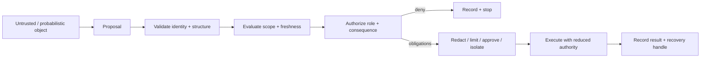
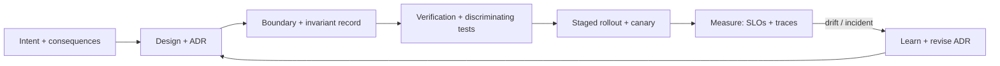

# The ClearTurn Enterprise System Framework (CESF)
## A boundary-first, verification-dominant method for building and auditing enterprise platforms

> **Status:** v1.0 (2026-09-13)
> **Owner:** Master Architect (ClearTurn)
> **Source material:** `DrHazemAli/enterprise-system-design` (cloned to `/tmp/enterprise-system-design`), Azure Well-Architected Framework, Google SRE, NIST SP 800-207/53/160, OWASP LLM Top 10, TOGAF/Zachman/C4, and the production patterns of world-class systems (SAP, Oracle, Workday, Salesforce, ServiceNow, Databricks, Palantir, Amazon, Netflix, Google, Uber, LinkedIn, Stripe).
> **Audience:** architects, principal engineers, platform owners, security leads, senior operators.
> **Sibling document:** `docs/AUDIT-ENTERPRISE-FRAMEWORK-GAPS.md` (Carbon + Nibras gap audit against this framework).

---

## 0. What this is (and is not)

This is a **method**, not a tech stack. It does not tell you which database, queue, or
cloud to pick. It tells you *what must remain true* while you build, and *what evidence*
you owe before you can claim a system is safe to release and possible to operate.

It synthesizes two bodies of knowledge:

1. **Hazem Ali's principles** (the `enterprise-system-design` repo): boundary-first design,
   verification-dominant engineering, contracts/invariants/state transitions, safe-state
   and failure containment, idempotency and ambiguous outcomes, admission control and
   backpressure, zero-trust AI execution, capability-scoped authorization, representation/
   authority/memory, determinism envelopes, consequence-oriented SLOs, and causal
   observability.
2. **The production record of world-class systems and enterprises**, distilled into what
   to copy and what to avoid (see §8 and §9).

The one-line thesis:

> **Do not trust the visible artifact. Trust the engineered path that can prove how an
> object changed representation, scope, authority, execution state, and consequence.**

Every other rule in this document is a consequence of that sentence.

---

## 1. First principles

These are the axioms. They are not negotiable; trade-offs happen below them, never at them.

| # | Principle | In one sentence |
|---|-----------|-----------------|
| F1 | **Boundary-first** | Model every change in representation or authority as a boundary with an explicit contract, invariant, evidence record, and failure response. |
| F2 | **Verification-dominant** | Scale generation only as fast as the organization can *preserve and verify* system invariants. |
| F3 | **Consequence-first** | Begin with the forbidden outcome, then locate every authority transition that could reach it — not the other way around. |
| F4 | **Explicit state** | Unnamed state ("accepted but not committed", "committed but response lost") is how duplicate effects and contradictory ownership are born. |
| F5 | **Independent authority** | The component that proposes an effect must never be the only component that authorizes it. |
| F6 | **Evidence over assurance** | A control that exists only in a document and not in measurable runtime evidence is "governance theater." |
| F7 | **Safe degradation** | Loss of confidence reduces authority; it never silently expands fallback behavior. |
| F8 | **Owned recovery** | Every uncertain outcome has an owner, a deadline, a budget, and a reconciliation path. |

---

## 2. The boundary model (the core vocabulary)

A **boundary** is any point where the receiver cannot safely inherit every assumption
made by the sender. It may be a process, protocol, queue, database, cache, parser, policy
gate, human approval, model call, or hardware interface. Physical separation is neither
necessary nor sufficient — two functions in one process can cross an authority boundary.

### 2.1 The boundary record

For every consequential boundary, record:

$$
B = (O_{in},\ C,\ T,\ O_{out},\ A,\ S,\ E,\ F)
$$

| Symbol | Meaning |
|--------|---------|
| $O_{in}$ | the input object's exact operational type (bytes, code points, token IDs, vectors, decoded text, a proposal, committed state). |
| $C$ | the consuming contract and version (parser, schema, tokenizer, model revision, policy, runtime, protocol). |
| $T$ | the transformation applied. |
| $O_{out}$ | the resulting object's exact operational type. |
| $A$ | the authority granted after the transformation. |
| $S$ | scope: identity, tenant/purpose, environment, classification, freshness. |
| $E$ | evidence sufficient to reconstruct the decision without retaining unnecessary sensitive content. |
| $F$ | failure behavior: denial, degradation, containment, recovery. |

### 2.2 Four boundary classes

1. **Representation boundary** — the object changes form (glyphs → code points → bytes →
   tokens → embeddings → assembled context → logits → decoded text). Invariant: downstream
   logic binds to the operational identity it actually consumes, not the human-visible rendering.
2. **Authority boundary** — an object gains ability to influence policy, memory, execution,
   or external state. Invariant: passive content never becomes instruction, evidence, or
   committed action *solely because a probabilistic component selected it*.
3. **Isolation boundary** — state is shared, reused, moved, or multiplexed across identities
   or failure domains. Invariant: reuse occurs only when ownership, compatibility, lifetime,
   and cleanup are provable.
4. **Consequence boundary** — an internal result affects a person, account, payment,
   production environment, physical device, or regulated record. Invariant: generation
   termination ≠ answer admission ≠ action authorization.

### 2.3 The six questions (run on any design)

1. **Object** — what exact object exists at this boundary?
2. **Contract** — which parser/schema/tokenizer/model/policy/runtime gives it meaning?
3. **Authority** — what can it influence now, and did authority increase here?
4. **Scope** — which user, tenant, task, environment, time window, classification constrain it?
5. **Evidence** — what record proves the transformation and decision?
6. **Recovery** — if the decision is wrong, how is execution stopped, contained, reversed, and learned from?

A design that cannot answer one of these has an *unspecified boundary* — it is not
automatically broken, but it cannot yet be defended.

### 2.4 The promotion-gate pattern

Three properties every gate must have:

1. It runs **outside** the object being evaluated (a prompt cannot be the sole enforcement
   boundary for prompt-derived action).
2. It evaluates the **exact object that will cross** (authorizing a tool name does not
   authorize arbitrary arguments or targets).
3. It returns **obligations, not just allow/deny** (redact, read-only, lower limits,
   isolation, approval, enhanced evidence).

---

## 3. The five pillars (workload quality)

Adopted from the Azure Well-Architected Framework and refined with consequence-first framing.
Every architectural decision is judged against all five; the framework is explicit that each
decision carries trade-offs.

| Pillar | The question | The failure it prevents |
|--------|-------------|--------------------------|
| **Reliability** | What must remain available, resilient, and recoverable for each critical user flow? | A green dashboard hiding wrong outcomes. |
| **Security** | Which identities, data, actions, and boundaries require explicit verification, least privilege, and containment? | Ambient authority; a compromised producer expanding privilege. |
| **Cost Optimization** | Which expenses produce workload value, and how does cost change with usage and operations? | Over-provisioning and un-attributed cost. |
| **Operational Excellence** | Can the team deploy, observe, diagnose, recover, and improve predictably? | Incidents nobody can reconstruct, so they repeat. |
| **Performance Efficiency** | What user-facing targets, demand model, capacity, tests, and feedback loop govern performance? | Overload collapse; retry storms. |

---

## 4. Engineering discipline

### 4.1 Contracts, invariants, and state transitions

Model a subsystem as states $S$, transitions $T$, guards $G$, and invariants $I$:

$$
t: (s, input) \xrightarrow{guard,\ effect} s'
$$

A transition is valid only when its precondition and guard hold, its effect is atomic at
the declared boundary, and every invariant holds in the resulting state.

**Invariants that always apply:**

- A transition never increases authority without an external authorization decision.
- A retry never creates a second logical effect for the same idempotency identity.
- A stale precondition cannot overwrite newer state.
- An event is not acknowledged before durable ownership of its next state is established.
- Recovery does not bypass validation that normal execution requires.

**Contract types** (do not collapse them):

| Type | Defines |
|------|---------|
| Data | shape, encoding, units, ranges, optionality, compatibility |
| Behavioral | allowed operations and observable effects |
| Temporal | ordering, deadlines, leases, expiry, retry windows |
| Authority | who may request which transition on which resource for what purpose |
| Evidence | what proves the transition occurred under the expected version |

A JSON schema proves `amount` is syntactically a string; it does **not** prove it is
refundable, current, authorized, or uncommitted.

### 4.2 Verification-dominant engineering

Estimate a change by the *proof it requires*, not its line count:

$$
V = S \times I \times A \times C \times R
$$

- $S$ — specifications/contracts touched
- $I$ — cross-component invariants affected
- $A$ — adversarial exposure
- $C$ — consequence severity
- $R$ — recovery difficulty

This explains why a ten-line change in a parser, policy gate, or memory manager can require
more evidence than a thousand-line isolated feature. **Change classification:**

| Class | Typical change | Verification expectation |
|-------|----------------|--------------------------|
| Mechanical | rename, formatting, generated binding | compile + focused tests + structural diff |
| Local behavioral | pure calculation behind a stable interface | unit + property tests, boundary cases |
| Contractual | schema, parser, protocol, serialization | compatibility matrix, malformed input, version skew |
| Cross-boundary | identity, IPC, cache, tool, process, tenant | threat model, negative tests, receiving-side enforcement |
| Consequential | payment, access, deployment, safety, regulated data | independent verifier, staged release, rollback proof, named approver |

**The release gate for high-risk change** requires five artifacts: (1) invariant map,
(2) authority diff, (3) evidence plan, (4) containment plan, (5) ownership record.
"Tests pass" is rejected when the test set cannot observe the relevant failure class.

### 4.3 Discriminating tests

Prefer tests that can *prove the design wrong*:

- Send a valid-looking message with an origin the sender does not own.
- Replay a state-changing request after a timeout with the same idempotency key.
- Change Unicode representation while preserving visual appearance.
- Restore state under a different model, tokenizer, runtime, or policy version.
- Force policy, telemetry, retrieval, or approval dependencies to fail.
- Introduce a stale but highly ranked source into retrieval.

---

## 5. Mission-critical discipline

### 5.1 Safe state and failure containment

A **safe state** is a bounded operating condition in which specified unacceptable
consequences remain prevented. It is *not* necessarily shutdown:

- a rail signal → **stop**;
- a financial ledger → **append-only** while reconciliation catches up;
- a document service → serve a **labeled stale copy** when disclosure remains authorized;
- an AI assistant → remain **conversational while tool execution is disabled**;
- a device → hold last validated command for a bounded interval, then **physical interlock**.

For each hazard record: unsafe control action, triggering conditions, detection signal and
max detection delay, containment boundary, safe-state transition, authority required to
resume, and maximum tolerated exposure.

**Containment dimensions:** scope, time, rate, authority, resource, data.

### 5.2 Idempotency and ambiguous outcomes

A distributed write can succeed after its caller stops receiving evidence. The unsafe
shortcut is to translate uncertainty into failure and retry blindly — turning a
communication fault into a duplicate business action.

Rules:

- Assign one **durable identity** to one **normalized intent**.
- **Reserve it before dispatch** (durably own the key before external side effects).
- Represent **`unknown` as a first-class state** (owner, deadline, budget, reconciliation).
- Reconcile against **authoritative evidence** (a receipt from the effect owner).
- Treat **compensation as another idempotent intent** (it does not erase history).

**Vocabulary:** *attempt* (one transmission), *intent* (business operation wanted once),
*idempotency key* (stable identifier for the intent), *request hash* (digest of the
normalized operation), *reservation* (durable ownership before dispatch), *side effect*
(externally visible state change), *receipt* (authoritative evidence), *ambiguous outcome*
(no proof of commit or non-commit), *reconciliation* (query authoritative state),
*compensation* (a new action that offsets a prior one).

Exactly-once **delivery** is a claim within a defined messaging boundary; exactly-once
**consequence** requires cooperation from every effect boundary.

### 5.3 Admission control and backpressure

> Do not accept work the system cannot finish inside declared memory, latency,
> correctness, and recovery budgets. Admission is a correctness decision, not a
> performance optimization.

First-principles model — Little's Law $L = \lambda W$ — shows how rising service time with
sustained arrival rate produces overload collapse, amplified by retries.

Required elements:

- classify work into **consequence tiers** (safety, interactive, batch);
- evaluate admission at ingress **and** before high-cost internal stages;
- **structured rejection** (machine-readable reason + retry contract);
- **retry budget** and **retry-amplification ceiling**;
- **safety lane** and **recovery lane** with protected capacity;
- **incident policy mode** (no bypass for expensive traffic);
- mutating-operation replay requires **idempotency**.

---

## 6. AI discipline (zero-trust AI execution)

> **The model may propose, but only an independent control plane may authorize consequence.**

### 6.1 Control plane vs data plane

The model, orchestrator, and execution capsule are **data-plane**. The policy decision
point (PDP), enforcement point (PEP), and audit store are **control-plane**. Only the
control plane authorizes consequence.

### 6.2 Capability-scoped authorization

A capability is *not* a role:

$$
Capability = (subject, operation, target, constraints, expiry)
$$

A role may authorize *issuance* of certain capabilities, but execution always checks the
capability object. Target systems never infer scope from prompt text.

**Scope calculus:** $D$ (delegated scope) ⊇ $C$ (issued capability scope) ⊇ $R$ (runtime
request scope). The admitted operation scope must always be a subset of delegated scope.

### 6.3 Representation, authority, and memory

An AI request is **not one string** — it is a typed state transition: bytes → normalization
→ tokenization → instruction envelope → retrieval → **promotion gate** (ACL, freshness,
deletion, classification) → final context hash → prefill → decode → termination →
**output admission**. Each step has an identity surface, a failure surface, and must emit
evidence.

Key invariants:

- Every high-consequence action links to an **admitted output record** → **final context hash** → **promotion decision set**.
- Retrieval rank is recall optimization, **not authorization proof**.
- Cache namespaces always include **tenant boundary fields**.
- If admission fails, the user-visible response carries a **machine-readable reason code**.
- If deletion status changes, future promotions from affected lineage are **blocked**.

### 6.4 Determinism envelopes

Determinism is a **declared tier**, not a default property:

| Tier | Meaning |
|------|---------|
| D0 | best effort |
| D1 | statistically similar over sample sets |
| D2 | stable under fixed seeds and controlled backends |
| D3 | bitwise reproducible on same architecture + versions (when supported) |
| D4 | certified replay package with full envelope + policy evidence for audit |

The **execution envelope** binds: model artifact, tokenizer artifact, framework/runtime,
CUDA toolkit + driver, kernel policy, precision/quantization, deterministic flags, GPU
architecture/SM count, scheduling mode, decode policy, prompt/context hashes, promotion +
admission policy versions, guardrail snapshot. `K_env` = hash of all envelope fields; any
change invalidates D3 claims.

### 6.5 Consequence levels select the control, not model confidence

| Level | Review posture | Required evidence |
|-------|----------------|-------------------|
| **Advisory** | output informs a person, no side effect | input/output identity, citations, model + prompt version |
| **Assisted** | proposes a bounded operation for confirmation | advisory + exact diff, target, policy decision, approver |
| **Delegated** | runtime executes reversible, low-impact actions | capability scope, idempotency, limits, trace, rollback, kill switch |
| **Consequential** | can affect money, access, safety, production, regulated data | independent verifier, human/deterministic admission, immutable audit, tested containment, named owner |

---

## 7. Reliability & operations discipline

### 7.1 Consequence-oriented SLOs

Reliability targets derive from **consequences**, not averages, and never copied from
another company. Consequence classes:

- **C0** — life/safety/legal/irreversible financial impact
- **C1** — major customer workflow unavailable
- **C2** — degraded but usable
- **C3** — internal inconvenience

Invariants: every external endpoint maps to exactly one consequence class; every class has
≥1 availability/correctness SLI; every SLI has an owner and escalation path; every SLO has
a **burn-based action policy** (page-level and ticket-level conditions); every incident
updates the endpoint↔class mapping.

### 7.2 Causal observability and trace evidence

Logs say *what*, metrics say *how much*, traces say *why this request failed in this path
at this time*. Five guarantees:

1. **Identity continuity** — a stable trace identity crosses every boundary.
2. **Boundary visibility** — every trust-boundary crossing emits an explicit span transition.
3. **Decision evidence** — impactful branch decisions attach causal attributes.
4. **Time integrity** — durations are comparable despite distributed execution.
5. **Queryability** — evidence is queryable under incident pressure without post-hoc parsing.

Invariants: every externally visible request has one root span; every async handoff records
a child span or link; every retry attempt is a distinct span with attempt index; every
irreversible side effect has an event carrying idempotency key + outcome; trace sampling
never drops all evidence for high-consequence classes.

### 7.3 Governed change, canaries, and incident command

- **Change is governed**: canary → progressive rollout → freeze on budget burn → rollback.
- **Rollback restores everything**: code *and* changed data, cache, policy, compiled artifacts.
- **Incident command**: named roles, blameless postmortem, durable corrective learning.
- **Recovery rehearsal**: tested kill switch with measured activation latency; fault
  injection for every safe-state transition; resume gated on health + policy evidence.

---

## 8. What world-class systems teach (copy)

| System / company | The wisdom to copy |
|------------------|--------------------|
| **SAP S/4HANA / Oracle Fusion** | A single source of truth for master data and a versioned rule engine for regulated figures. The anti-pattern is the customization that turns a product into a bespoke fork. |
| **Workday** | Single version, object-oriented domain model, strict tenant isolation. One upgrade path for every customer. |
| **Salesforce / ServiceNow** | Metadata-driven extensibility: build customer specifics as *configuration of a general engine*, never `if company == X`. Governor limits as admission control. |
| **Databricks Unity Catalog / Palantir Foundry / Purview** | Governed, lineage-backed data as the trust anchor for everything — including AI. No lineage ⇒ no defensible answer. |
| **Amazon** | "You build it, you run it"; two-pizza teams; explicit API contracts; fitness functions; correction-of-errors over sunk-cost. |
| **Netflix** | Chaos engineering, bulkheads, cell-based architecture, SLOs, canary by default. Failure is a design input. |
| **Google SRE** | Error budgets, multi-window burn-rate alerts, blameless postmortems, "hope is not a strategy." |
| **Uber** | Domain-oriented microservices; a durable workflow engine (Temporal-style) where idempotency and compensation are first-class. |
| **LinkedIn** | Event-driven core (Kafka) and full data lineage; the event log is the integration contract. |
| **Stripe** | `Idempotency-Key` on every state-changing API; idempotency as a product-level guarantee, not an afterthought. |
| **Azure Well-Architected** | Five-pillar review + ADRs + POC validation for critical assumptions + continuous optimization. |

The meta-lesson: **world-class systems externalize the hard invariants** (versioned rules,
idempotency keys, SLOs, lineage, admission limits) instead of keeping them as tribal
knowledge inside one team's heads.

---

## 9. Flaws to avoid (antipattern catalog)

| Antipattern | The failure | The fix |
|-------------|-------------|---------|
| **Ambient authority** | roles/API keys alone gate dynamic, target-varying agent actions | capability-scoped authorization (§6.2) |
| **Governance theater** | controls live in docs, not runtime evidence | evidence over assurance (F6) |
| **Blind retry on timeout** | uncertainty → failure → retry ⇒ duplicate refund/payroll | idempotency + `unknown` state (§5.2) |
| **Dual-write without outbox/CDC** | DB commit and event publish diverge ⇒ lost events or inconsistent reads | transactional outbox / change-data-capture |
| **2PC across networks** | distributed transactions without compensation ⇒ lock orphans | sagas + compensating actions |
| **Distributed monolith / nanoservices** | premature microservices without contracts ⇒ "death by a thousand timeouts" | modular monolith first, split on real seams |
| **Green-dashboard confidence** | CPU/mem/200s as "SLIs" while users experience outages | consequence-oriented SLOs (§7.1) |
| **Copied SLO** | 99.9% inherited with no risk model | derive from consequence class |
| **"Tests pass" as release gate** | test set cannot observe the failure class | five-artifact release gate (§4.2) |
| **Vector score as authorization** | similarity rank grants access or authority | promotion gate (§2.4) |
| **Model name as execution identity** | endpoint health conflated with behavioral correctness | determinism envelope + verifier (§6.4) |
| **Silent corruption** | healthy endpoint, wrong results (hardware/runtime drift) | execution capsules + discriminating checks |
| **Alert fatigue** | every metric pages; no budget policy | burn-rate alerting + paging policy |
| **Big-bang rewrite** | Strangler-pattern ignored; sink-cost fallacy | incremental extraction, contract-first |
| **Resume-driven architecture** | technology chosen for the CV, not the problem | consequences and reversibility select the design |
| **Hardcoded customer logic** | `if company == GOFSCO` instead of configurable engine | general engine + parameterization |

---

## 10. The enterprise operating model

The framework is only as good as the loop that runs it.

**Roles (accountability, not titles):**

| Role | Owns |
|------|------|
| **Architect** | the boundary record, the invariant map, the dependency direction. |
| **Security lead** | the authority diff, the threat model, the containment plan. |
| **Platform owner** | the SLOs, the error budget, the kill switch. |
| **Incident commander** | the runbook, the recovery rehearsal, the postmortem. |
| **Domain owner** | the business invariant, the consequence class, the reconciliation path. |

**Decision records (ADR):** every consequential decision records context, options,
trade-offs, the invariant it preserves, the falsifier that would prove it wrong, and the
rollback trigger.

**Monthly retrospective (Curator):** recurring bugs (3+ hits) become rules; rules that
stop being exercised are retired; the framework evolves from the team's *actual* mistakes,
not from a textbook.

---

## 11. The review procedure (30-minute architecture gate)

1. Select one consequential user journey (not the whole platform).
2. Trace the exact operational object at each hop.
3. Mark every representation / authority / isolation / consequence boundary.
4. Name the contract and owner at each boundary.
5. Write one failure invariant for each promotion.
6. Identify the enforcement point that can deny the transition.
7. Define the minimum evidence needed to prove the decision.
8. Simulate: stale data, duplicate delivery, policy outage, identity loss, runtime drift.
9. Reject any design where the producer also supplies the only proof its output is safe.
10. Record residual risk, owner, expiry date, and rollback trigger.

---

## 12. Maturity model

| Level | Name | Observable signature |
|-------|------|----------------------|
| L0 | **Ad hoc** | no named boundaries; retries are blind; "works on my machine." |
| L1 | **Documented** | boundaries and invariants are written; enforcement is manual. |
| L2 | **Enforced** | guards/gates run in code; idempotency keys exist; fail-closed paths tested. |
| L3 | **Measured** | consequence-oriented SLOs, causal traces, burn-rate policy; admission control. |
| L4 | **Verified** | discriminating tests, determinism envelopes, independent verifiers, chaos drills. |
| L5 | **Self-correcting** | incidents auto-update the invariant map; the framework evolves from production evidence. |

Most platforms reach L2 quickly and stall there. The jump from L2 → L3 is *operational*,
not technical: it is the decision to measure consequences instead of components, and to
spend error budget deliberately.
