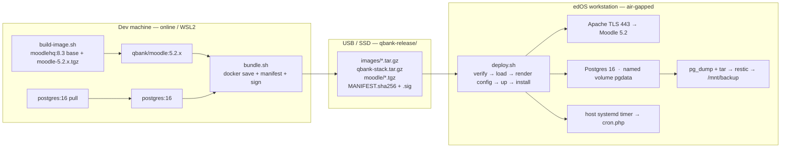

# DESIGN — Self-contained Moodle + PostgreSQL (air-gapped Docker)

**Purpose:** one Docker stack for Moodle (latest 5.2.x) + PostgreSQL that is built **once on an online machine** and shipped to the air-gapped edOS workstation (Ubuntu 24.04, `docs/EDOS.md`) via USB/SSD, where it runs with **zero internet**.

**Companion docs:** `docs/MOODLE.md` (what runs *inside* Moodle), `docs/EDOS.md` (the hardened host). This doc is the glue: the Docker packaging + transport + deployment layer.

**Dev machine status (2026-09-02):** Docker Engine 29.7.2, Compose v5.3.1, overlayfs, systemd PID 1. The same runtime on bare-metal Ubuntu makes one bundle work on both.

---

## 1. Architecture



Two containers, one network:

| Service | Image | Data | Host port |
|---|---|---|---|
| `db` | `postgres:16` | named volume `pgdata` | none (container-only) |
| `moodle` | `qbank/moodle:5.2.x` | bind `moodledata`, `config.php`, `tls/` | 443 (HTTPS) + 8080 (HTTP→301) |

## 2. Locked decisions

| Decision | Choice | Why / source |
|---|---|---|
| Moodle version | **5.2.x latest patch** now → 5.3.1 Dec 2026 freeze | `MOODLE.md §1` |
| Moodle image | `FROM moodlehq/moodle-php-apache:8.3` + `moodle-5.2.x.tgz` (sha256-verified) | `MOODLE.md §1` — not Bitnami |
| Database | `postgres:16` (official) | `MOODLE.md §1` |
| TLS | **Apache in-container** terminates TLS on 443 (offline-CA cert) | self-contained; no host nginx |
| `sslproxy` | **`false`** (was `true` in MOODLE.md §2) | TLS is *not* host-proxied anymore — corrected |
| Cron | host systemd timer → `docker compose exec -T moodle php admin/cli/cron.php` | `MOODLE.md §2` |
| Backup | nightly `pg_dump -Fc` + `moodledata` tar → restic; **`pgdata/` excluded** (dumps are portable) | `EDOS.md §10` |
| `moodledata` | bind mount (host path via `QBANK_ROOT`) so restic can read it | `EDOS.md §10` |

## 3. Portability — Ubuntu bare-metal ↔ Ubuntu WSL

One compose file, one `.env` schema, one set of scripts. All per-host drift is isolated to `.env` + one `/etc/hosts` line:

| Concern | Bare-metal (edOS) | WSL2 (dev) |
|---|---|---|
| Docker runtime | docker-ce (apt) | docker-ce (same) |
| systemd | yes | yes (enabled here) |
| `QBANK_ROOT` | `/srv/qbank` | `./data` (project-local) |
| `WWWROOT` | `https://qbank.local` | `https://qbank.local` (or `:8443` if 443 busy) |
| TLS cert | offline-CA cert (EDOS §7) | self-signed (auto-generated by `deploy.sh`) |
| `/etc/hosts` | `127.0.0.1 qbank.local` | same |
| Docker images | loaded via `docker load` | built/pulled directly |
| Data backup | restic → `/mnt/backup` | local `./data` |

The only non-portable thing is *how images arrive* (pull/build on dev vs `docker load` on the workstation) and *where data lives* — both already env-parameterised.

## 4. Bundle layout (what lands on the stick)

```
qbank-release/
├── images/
│   ├── moodle.tar.gz       # docker save | gzip  (~0.8–1.2 GB)
│   └── postgres.tar.gz     # docker save | gzip  (~150–250 MB)
├── qbank-stack.tar.gz      # deploy/moodle/ source (compose, scripts, Dockerfile, apache, cron, config template)
├── moodle/                 # moodle-5.2.x.tgz + .sha256 (source of truth, for image rebuilds)
├── MANIFEST.sha256
└── MANIFEST.sha256.sig     # minisign/GPG — public key baked into edOS
```

Fits comfortably on the 32 GB blue stick.

## 5. Build (dev machine, online)

```bash
cd deploy/moodle

# 1. Download latest 5.2.x tarball + checksum into build/
#    from https://download.moodle.org/ (e.g. moodle-5.2.10.tgz + moodle-5.2.10.tgz.sha256)

# 2. Build the image (extracts, verifies sha256, builds, tags)
./scripts/build-image.sh

# 3. Assemble the signed bundle (saves images, tars the stack, writes MANIFEST)
./scripts/bundle.sh ./release

# 4. Sign the manifest
minisign -S -m release/MANIFEST.sha256
```

Prereqs on dev: `docker`, `docker compose`, `gettext-base` (for `envsubst`), `minisign`.

## 6. Deploy (workstation, air-gapped)

```bash
# 1. copy qbank-release/ to /srv/qbank/ and unpack
sudo mkdir -p /srv/qbank && cd /srv/qbank
tar -xzf /media/.../qbank-release/qbank-stack.tar.gz -C /srv/qbank/moodle
mkdir -p /srv/qbank/moodle/release && cp -r /media/.../qbank-release/{images,moodle,MANIFEST.sha256*} /srv/qbank/moodle/release/

# 2. verify + deploy (loads images, generates secrets, renders config.php, self-signs TLS if no CA cert, up, install)
cd /srv/qbank/moodle
./scripts/deploy.sh

# 3. install host cron timer
./scripts/deploy.sh --cron
```

`deploy.sh` does, in order: verify manifest (if present) → `docker load` → ensure TLS cert → render `config.php` (secrets from `.env`) → `docker compose up -d` → first-run `install.php` (idempotent — skipped if `mdl_config` already exists) → purge caches.

Install the offline-CA cert (EDOS §7) as `tls/tls.crt` + `tls/tls.key` **before** first deploy; otherwise a self-signed dev cert is generated as a bootstrap and must be replaced.

## 7. Dev (WSL2) quick start

```bash
cd deploy/moodle
cp .env.example .env          # set QBANK_ROOT=./data, MOODLE_IMAGE/… as needed
./scripts/dev-up.sh           # render config → deploy → up → install
# add: 127.0.0.1 qbank.local  to /etc/hosts
```

Then open `https://qbank.local` (accept the self-signed cert in the kiosk browser).

## 8. Backup / restore (workstation)

```bash
./scripts/qbank backup            # pg_dump -Fc + moodledata tar → $QBANK_ROOT/backups/nightly/
./scripts/qbank snapshot pre-5.3  # manual pre-upgrade snapshot
./scripts/qbank status            # ps + pg_isready + moodle CLI check
```

Nightly 02:00 systemd timer runs `./scripts/qbank cron` (Moodle cron). The `backup` output is picked up by restic (EDOS §12) → `/mnt/backup`. `pgdata/` named volume is deliberately excluded from restic; restore = fresh volume + `pg_restore` from the dump (drill in MOODLE.md §10).

## 9. Upgrade path (Dec 2026 → 5.3.1 LTS)

Rebuild `qbank/moodle:5.3.1` on dev, produce a new bundle, on edOS: `qbank-release verify` → `./scripts/qbank snapshot pre-5.3.1` → `docker load` new image → `docker compose up -d moodle` → `docker compose exec moodle php admin/cli/upgrade.php --non-interactive`. Same flow, no workstation internet (MOODLE.md §11).

## 10. Verification / acceptance

- `docker compose ps` → `db` healthy + `moodle` healthy.
- `curl -k https://qbank.local/login/index.php -o /dev/null -w "%{http_code}"` → 200.
- `./scripts/qbank status` → `pg_isready` accepting, moodle CLI ok.
- Create a test bank + one question; `./scripts/qbank backup` succeeds.

## 11. Files index

```
deploy/moodle/
├── docker-compose.yml
├── .env.example
├── Dockerfile
├── config.php.template
├── .dockerignore / .gitignore
├── apache/{000-default.conf, moodle-ssl.conf}
├── cron/{qbank-cron.service, qbank-cron.timer}
└── scripts/{lib.sh, build-image.sh, bundle.sh, render-config.sh, deploy.sh, dev-up.sh, qbank}
```

## 12. Notes & deliberate changes from earlier docs

- **`sslproxy` `true`→`false`** in `MOODLE.md §2`: TLS now terminates in Apache inside the container (self-contained; no host nginx to maintain on the hardened host).
- **`dbcollation` removed** from `$CFG->dboptions`: `utf8mb4_unicode_ci` is MySQL-only; PostgreSQL needs no collation key.
- **Docker-in-dev exception:** this is a deliberate, scoped use of Docker as a *packaging/transport format* for an air-gapped deliverable. It does **not** change the "never Docker in dev" rule for Carbon/Gigacast workflows.
