# GradeVance Learn — UI/UX Audit Pack (live EduOS)

**Purpose.** Evidence-backed review of **Learn** (student-facing) for consistency, reproducibility, expectation management, and next-gen ease/user-centrism — with **Teach** and **engine** as contrast. Screenshots captured live on EduOS (`:5179` / `:8009`, brand `eduos`, student `gv_student`, demo assignment *NAA Cycle 1 — Exam prep*).

**Audience.** External UX / product reviewers (Fable, Sol, design crit). Pair with `docs/eduos/GRADEVANCE-KNOWLEDGE-BASE-AUDIT.md` for algorithm/HITL depth.

**Capture date.** 2026-09-20 · Playwright headless Chromium · viewport 1440×900 (mobile 390×844 where noted).

**How to use.** Read §0–§2 for the verdict; walk §3 screens in order; use §4–§6 as the critique charge; treat §7 as fix backlog, not claims of shipped polish.

---

## 0. Verdict (one screen)

Learn’s **copy and IA intend** a calm, private student desk (“just for you”). The **shell is consistent** across Learn / Teach / engine. Live use shows three systemic gaps that break that promise:

1. **First impression is wrong.** After login, a student lands on Platform Home with *“No Data Products Assigned”* — not Learn.
2. **Coaching is not reproducible on return.** Results (bands, strengths, LCT table, wave) appear after “Get formative coaching,” then **vanish on reload** even though Progress still shows the wave.
3. **Student language leaks engine jargon.** Rubric keys (`task_achievement`), LCT stage codes (`so_what` / `now_what`), and SG/SD tables sit next to “calm, private” marketing copy.

Teach/calibration are dense and expert-appropriate; Learn must not look like a thinner copy of the engine room.

---

## 1. Surfaces in scope

| Surface | Route | Persona job |
|---------|-------|-------------|
| Login | `/login` | Authenticate |
| Platform landing | `/` | Should route student to studies — currently empty data-products |
| Learn home | `/learn` | Join, due soon, latest coaching |
| My assignments | `/learn/assignments` | Browse by course |
| Assignment desk | `/learn/assignments/:id` | Draft → coach → submit → appeal |
| Progress | `/learn/progress` | Wave / band trajectory |
| Teach (contrast) | `/teach`, `/teach/marking`, `/teach/calibration` | Marker / professor HITL |
| Engine (contrast) | `/apps/gradevance` | Packs, QA, LTI, a11y |

---

## 2. Journey map (what we actually walked)

```text
Login → / (empty data products) → /learn → assignments list
  → NAA desk → write draft → Get formative coaching
  → Results + wave (in-session) → Progress (wave persists)
  → reload desk → Results gone  ← reproducibility break
```

Admin contrast: Teach overview → Marking queue → Calibration → GradeVance engine room.

---

## 3. Screen evidence

### 3.0 Sign-in

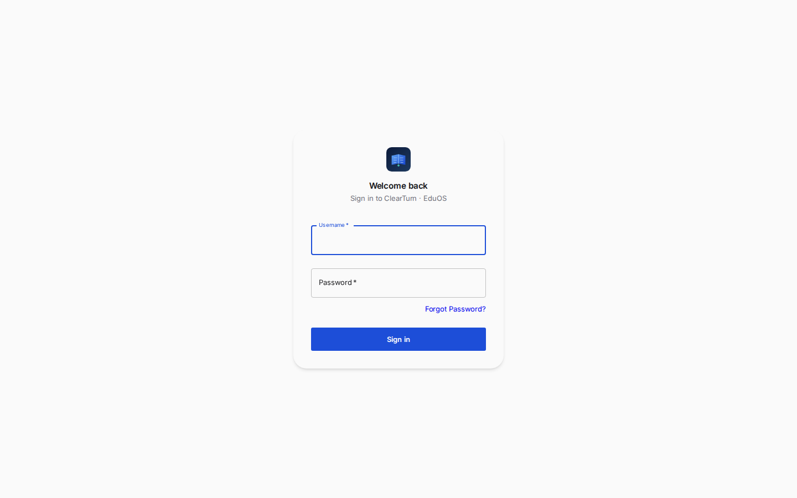

**What works.** Clear brand (“Sign in to ClearTurn · EduOS”), strong focus ring, single primary CTA, no clutter.

**Concern.** Login is the cleanest “next-gen ease” surface; post-login drops the student into an unrelated empty state (next shot).

---

### 3.1 After login — wrong first screen

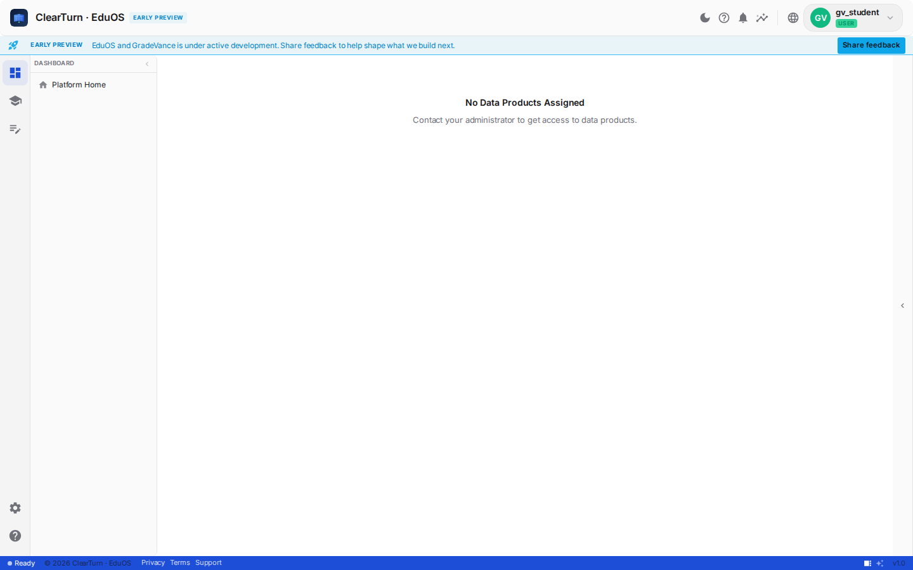

**Finding (P0 expectations).** Student `gv_student` sees **Dashboard → Platform Home → “No Data Products Assigned.”** Learn is one icon away on the rail, but the default destination violates “student-centric.” No CTA to `/learn`.

**Expected.** Role-aware home: Learn for students, Teach for markers/professors, engine only when entitled.

---

### 3.2 Learn home (desktop)

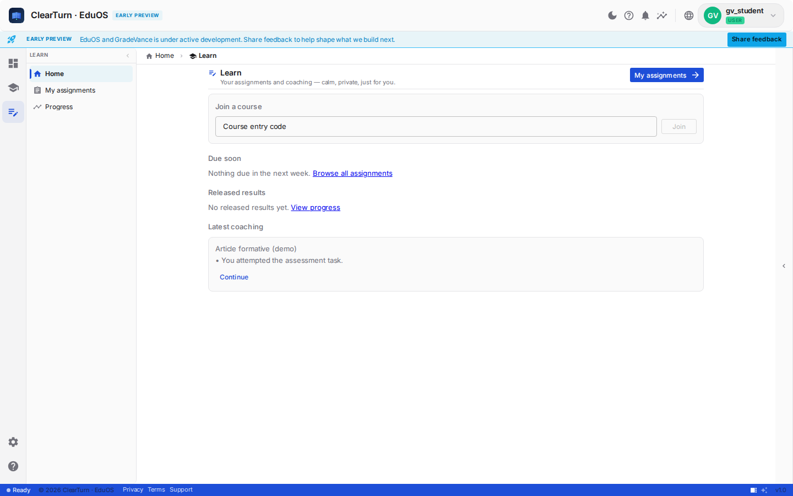

**What works.** Subtitle sets tone: *“Your assignments and coaching — calm, private, just for you.”* Join-by-code, Due soon, Released results, Latest coaching — correct IA. Primary CTA **My assignments →**.

**Concerns.**
- Dual **EARLY PREVIEW** (header chip + banner) + Share feedback = preview chrome competes with content.
- **Latest coaching** card showed *Article formative* (“You attempted…”) while the live coach journey was on *NAA Cycle 1* — home coaching feed feels stale / wrong assignment.
- Empty due/results copy is fine; coaching card content quality is not.

---

### 3.3 My assignments

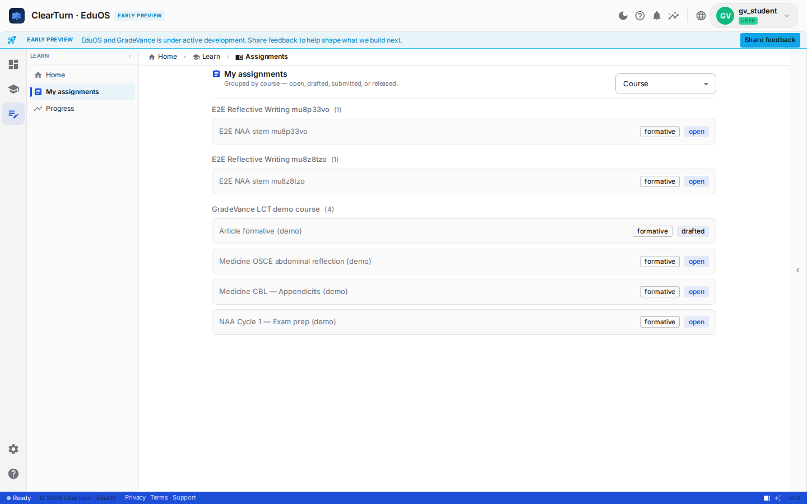

**What works.** Grouped by course; mode chip (`formative`) + status (`open` / `drafted`); calm Papers, not a data grid (matches PHASE-D).

**Concerns.**
- **E2E noise** (`E2E Reflective Writing mu8p33vo`) pollutes a student list in demo — ruins “calm” and trust for external demos.
- Status language: list says `drafted` / `open`; desk chips say `open` while draft text exists — **status vocabulary not aligned**.
- `formative` repeated on every row adds little once the course is known.

---

### 3.4 Assignment desk — before coach

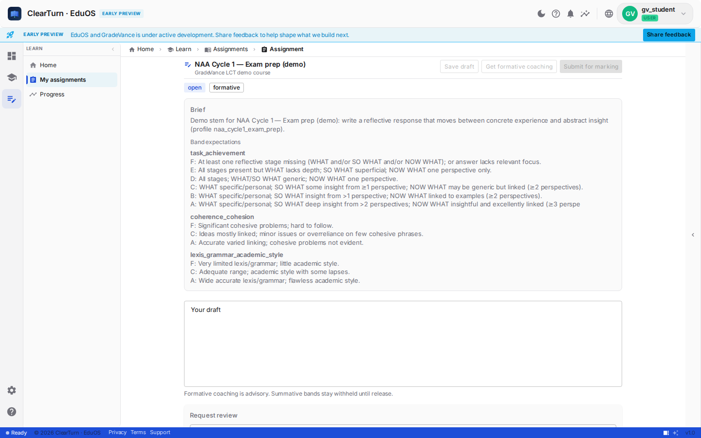

**What works.** Clear header actions: Save draft | Get formative coaching | Submit for marking. Advisory caption under draft. Brief + band expectations on-page (transparency).

**Concerns.**
- **Band expectations** dump snake_case criterion IDs and multi-band prose — high cognitive load; draft field pushed below the fold.
- Actions disabled until ≥40 characters — no visible hint *why* until you type (affordance gap).
- `open` + `formative` chips don’t explain “drafted locally but not saved.”

---

### 3.5 After formative coaching (in-session)

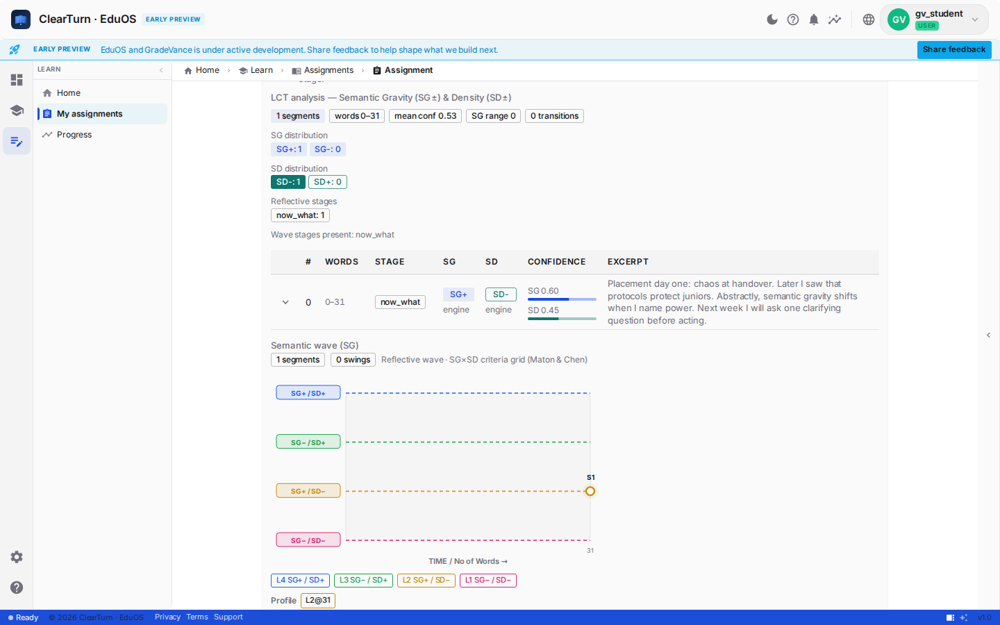

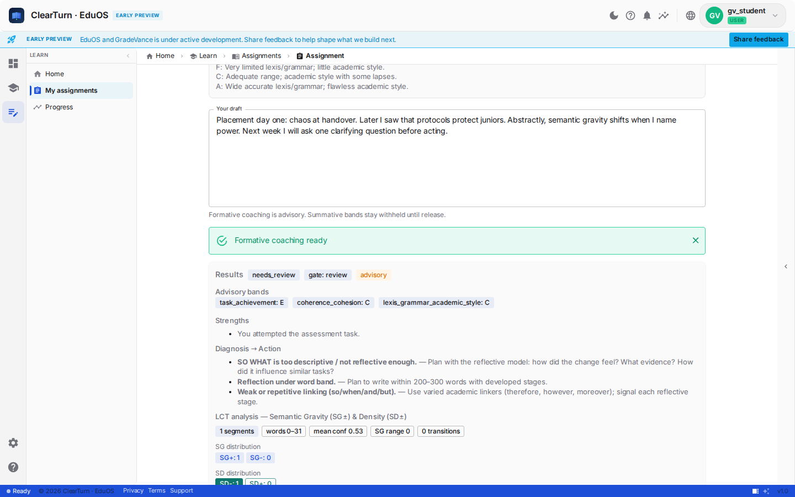


**What works (when run state is in memory).**
- Success toast: *Formative coaching ready*.
- **Results**: advisory bands, Strengths, Diagnosis → Action, watermark chip `advisory`.
- Wave chart + segment cards (same visual language as Progress).

**Concerns (P0–P1).**
- **Engine table on the student desk:** columns STAGE / SG / SD / CONFIDENCE / EXCERPT with codes like `so_what`, `now_what`, `SG+ engine` — this is Teach/engine density, not Learn calm.
- Diagnosis uses raw criterion `task_achievement` in payload (shown or implied via bands).
- Toast can fire while user is still above the fold — Results need **scroll-into-view** or a sticky “View coaching” link.
- **Request review** sits below Results with enabled path after coaching — OK for formative appeals, but visually competes with “read your coaching first.”

---

### 3.6 Progress

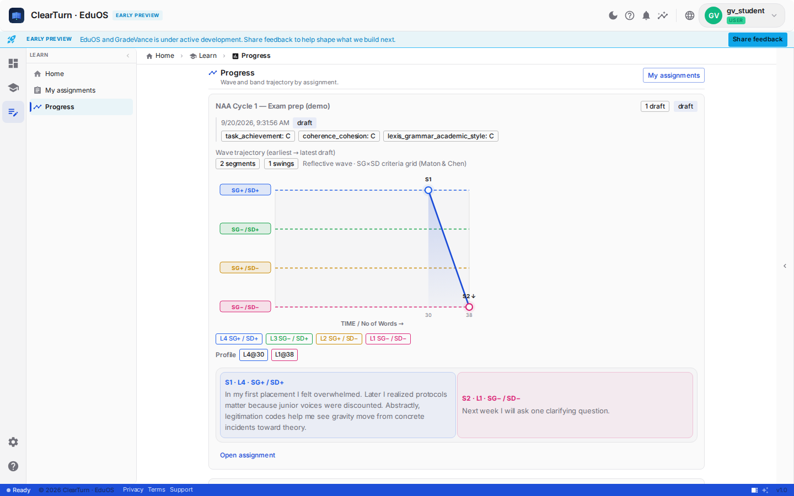

**What works.** Wave trajectory with L1–L4 SG×SD bands, segment quotes, profile tags (`L4@30`, `L1@38`). Explicit Maton & Chen framing for transparency.

**Concerns.**
- Advisory bands shown as `task_achievement: C` etc. **without a strong “advisory / not final grade” banner** on Progress (desk caption does better).
- Progress and desk **diverge after reload**: Progress keeps the story; desk loses Results (§4.1).

---

### 3.7 Learn home — mobile

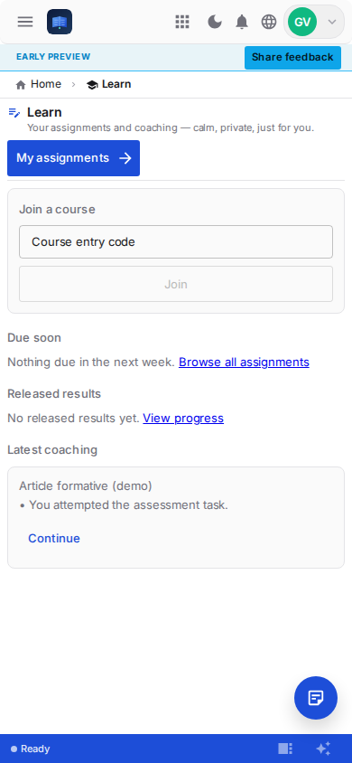

**What works.** Stacked sections; large **My assignments** CTA; join field usable.

**Concerns.**
- Brand wordmark weak in header (icon-heavy).
- Unexplained **FAB** (document/chat) — mystery affordance.
- Preview banner still consumes vertical space on small screens.

---

### 3.8 Teach contrast — overview

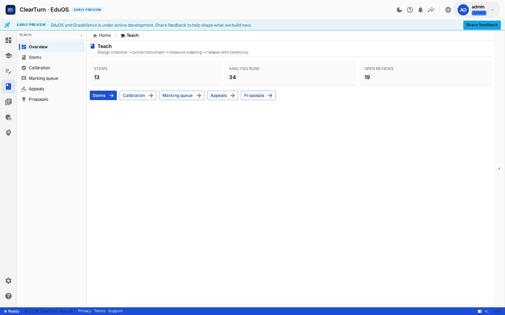

Professor philosophy line + STEM / RUNS / REVIEWS stats. Same shell, denser job-to-be-done. Appropriate for Teach; **must not leak into Learn Results**.

---

### 3.9 Teach — marking queue (HITL)

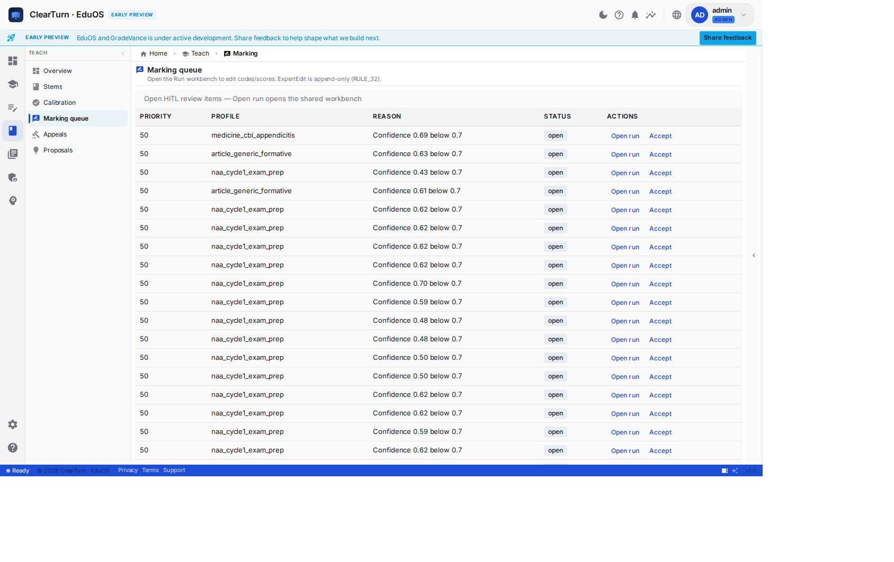

Priority / profile / “Confidence below 0.7” / Open run / Accept. Expert language is correct here. **RULE_32 ExpertEdit** note is Teach-only — good.

---

### 3.10 Engine room contrast

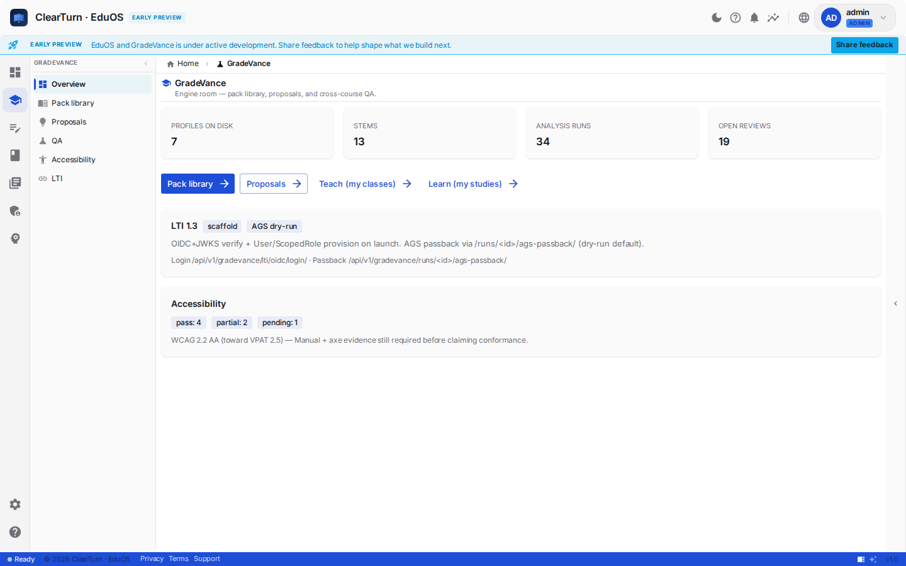

Pack library, proposals, LTI scaffold badges, accessibility counts. Explicit cross-links to Teach and Learn. This is the **instrument** surface — students should never see STAGE/CONFIDENCE tables that look like this room.

---

### 3.11 Calibration (instrument trust)

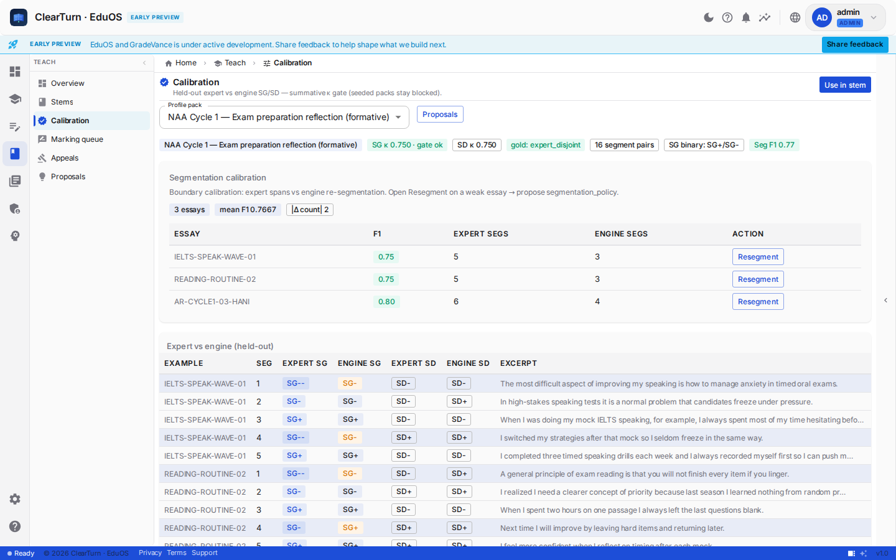

Expert vs engine SG/SD, F1, Resegment. Gold standard for **reproducibility of measurement** — faculty-facing. Learn should consume calibrated trust, not display calibration chrome.

---

### 3.12 Broken Teach path (capture note)

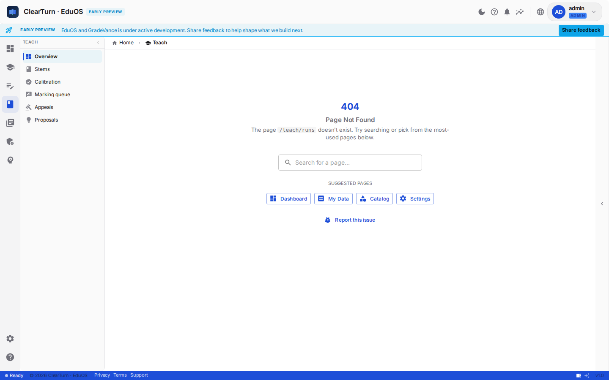

`/teach/runs` → **404** while sidebar still highlights Overview. Shows shell recovery UI, but also that **route expectations** across personas are not fully aligned (capture used a guessed path; still a product smell if deep-links or docs mention it).

---

## 4. Cross-cutting concerns

### 4.1 Reproducibility — coaching Results do not hydrate on reload

**Observed.** After coach, `#coaching-heading` Results render. Navigate away / hard reload desk → **no Results**. Progress still shows wave + advisory bands for the same assignment.

**Root cause (code/API contract).** Desk load uses:

```text
latest?.latest_run_id || latest?.run?.id || latest?.run
```

`GET me/submissions/?assignment=` returns **`latest_run`** (object with `id` + `coaching`), **not** `latest_run_id` / `run`. Hydration fails silently → `setRun(null)`.

**UX impact.** Student cannot “come back tomorrow and re-read coaching.” Breaks trust, appeals (“Request review” helper says available after coaching), and any claim of reproducible formative experience.

**Severity.** P0 for Learn.

---

### 4.2 Consistency — three personas, one shell, mixed languages

| Layer | Learn | Teach | Engine |
|-------|-------|-------|--------|
| Shell (brand, preview, rail) | Same | Same | Same |
| Density | Calm cards | Tables + HITL | Metrics + packs |
| Vocabulary | “coaching”, “draft” | Confidence, ExpertEdit | LTI, WCAG, proposals |
| Leak risk | **High** — LCT table + snake_case on desk | Low | N/A |

Shell consistency is good. **Content-language consistency for students is not.**

---

### 4.3 Expectations — formative vs summative

**Strengths.** Desk caption: *“Formative coaching is advisory. Summative bands stay withheld until release.”* Coaching watermark chip `advisory` when Results show.

**Gaps.**
- Progress shows letter bands without equal prominence of advisory framing.
- Home “Latest coaching” under-explains Strengths → Diagnosis → Action (PHASE-D L1 acceptance).
- Disabled primary actions lack inline “need ~40 characters” / “save when dirty” hints.
- Preview chrome is honest but **over-broadcast** (chip + banner + button).

---

### 4.4 Next-gen ease & user-centrism

**Intent (good).** Private desk, join code, due soon, coaching over grade anxiety.

**Friction (live).**
1. Wrong post-login home.
2. Rubric / results as developer IDs and engine tables.
3. Demo E2E courses in the assignment list.
4. Coaching success without guaranteed scroll to Results.
5. Mobile FAB without label/purpose.
6. Status chip thesaurus (`open` / `drafted` / `draft` / `unsaved`).

“Next-gen” here should mean **fewer concepts visible**, not fewer features — hide STAGE/CONFIDENCE behind “Show analysis detail,” surface Strengths → Action first.

---

### 4.5 Accessibility & polish notes (from screens)

- Focus on login username is strong.
- Learn primary buttons `size="small"` per PHASE-D — OK on desktop; verify tap targets on mobile desk actions.
- Footer copyright years differ across shots (2024 / 2025 / 2026) — minor consistency bug.
- 404 recovery suggests Dashboard / Catalog — not Teach/Learn — weak persona recovery.

---

## 5. Spec vs live (PHASE-D)

| Spec acceptance | Live |
|-----------------|------|
| Desk: brief, draft, Save, Coach, Submit | Yes |
| Results: coaching + LctCodesTable + WaveChart | Yes **in-session**; **No on reload** |
| Home Latest coaching strengths | Partial / stale card |
| Assignments grouped by course | Yes (plus E2E noise) |
| Progress wave trajectory | Yes |
| Student never sees calibration | Yes (good) |

---

## 6. Audit charge (for external reviewer)

Answer without charity:

1. Would a first-year student understand **what to do in 10 seconds** after login? (Evidence: §3.1.)
2. After coaching, can they **reliably re-open** the same feedback tomorrow? (Evidence: §4.1.)
3. Does Learn Results feel like **coaching** or like an **instrument dashboard**? (Evidence: §3.5 vs §3.10–3.11.)
4. Are formative bands clearly **not final grades** on every surface that shows letters? (Evidence: §3.5–3.6.)
5. Is Teach density appropriately **walled off** from Learn, or leaking? (Evidence: LCT table on desk.)
6. What is the **minimum language layer** (criterion labels, stage names, SG/SD) a student must see vs optional “Show detail”?

---

## 7. Recommended fix backlog (product, not this doc’s scope)

| Pri | Item |
|-----|------|
| P0 | Role-aware post-login redirect → `/learn` for students |
| P0 | Hydrate desk `run` from `submission.latest_run` (+ `fetchMyRun(id)` for full wave/segments) |
| P0 | After coach: scroll/focus Results; don’t toast-only |
| P1 | Student-facing labels for criteria & stages; engine table behind progressive disclosure |
| P1 | Advisory banner on Progress whenever bands show |
| P1 | Align status vocabulary across list/desk/progress |
| P2 | Hide seed/E2E courses from demo student lists (or separate demo tenant) |
| P2 | Explain or remove mobile FAB; reduce stacked preview chrome |
| P2 | Home Latest coaching = most recent formative run with strengths |

---

## 8. Screenshot index

| File | Scene |
|------|--------|
| `screenshots/00-login-eduos.png` | Sign in |
| `screenshots/01-after-login-landing.png` | Student lands on empty Platform Home |
| `screenshots/02-learn-home.png` | Learn home desktop |
| `screenshots/03-learn-assignments.png` | My assignments by course |
| `screenshots/04-learn-assignment-desk.png` | Desk before/ready to coach |
| `screenshots/05-learn-desk-after-coach.png` | Full desk after coaching |
| `screenshots/05b-learn-results-panel.png` | Results / advisory bands / strengths |
| `screenshots/05c-learn-lct-wave-detail.png` | LCT table + semantic wave |
| `screenshots/06-learn-progress.png` | Progress wave trajectory |
| `screenshots/07-learn-home-mobile.png` | Learn home mobile |
| `screenshots/08-teach-home-contrast.png` | Teach overview |
| `screenshots/09-teach-marking-contrast.png` | HITL marking queue |
| `screenshots/10-engine-gradevance-contrast.png` | Engine room |
| `screenshots/11-calibration-or-settings.png` | Calibration instrument |
| `screenshots/12-teach-runs-list.png` | `/teach/runs` 404 recovery |

---

## 9. Related docs

- `docs/eduos/GRADEVANCE-KNOWLEDGE-BASE-AUDIT.md` — algorithms, HITL, LCT
- `docs/eduos/screens/PHASE-D-SCREEN-SPECS.md` — Learn screen contracts
- Frontend: `carbon-frontend/src/apps/learn/AssignmentPage.jsx`, `LearnHome.jsx`, `ProgressPage.jsx`
