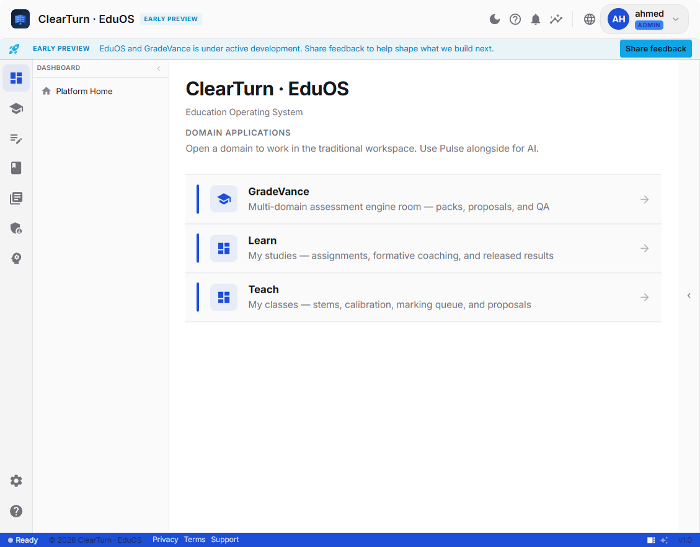
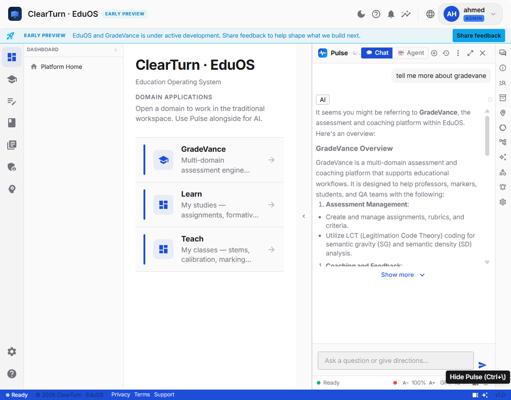
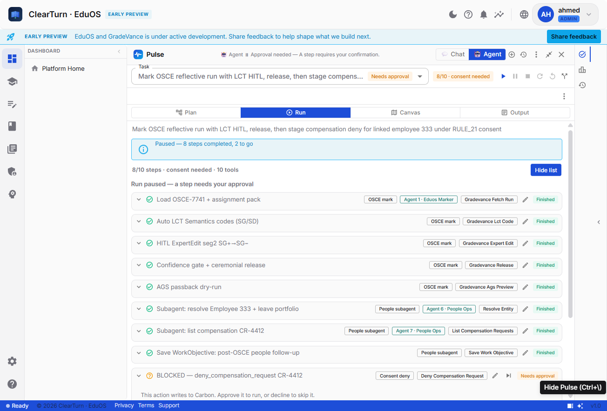
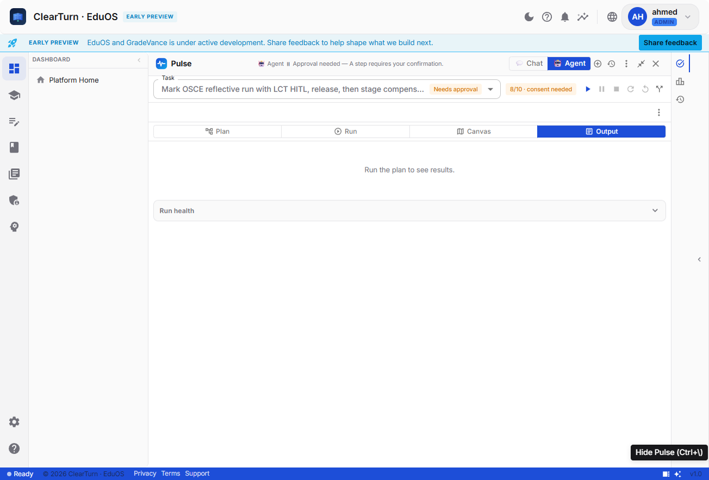
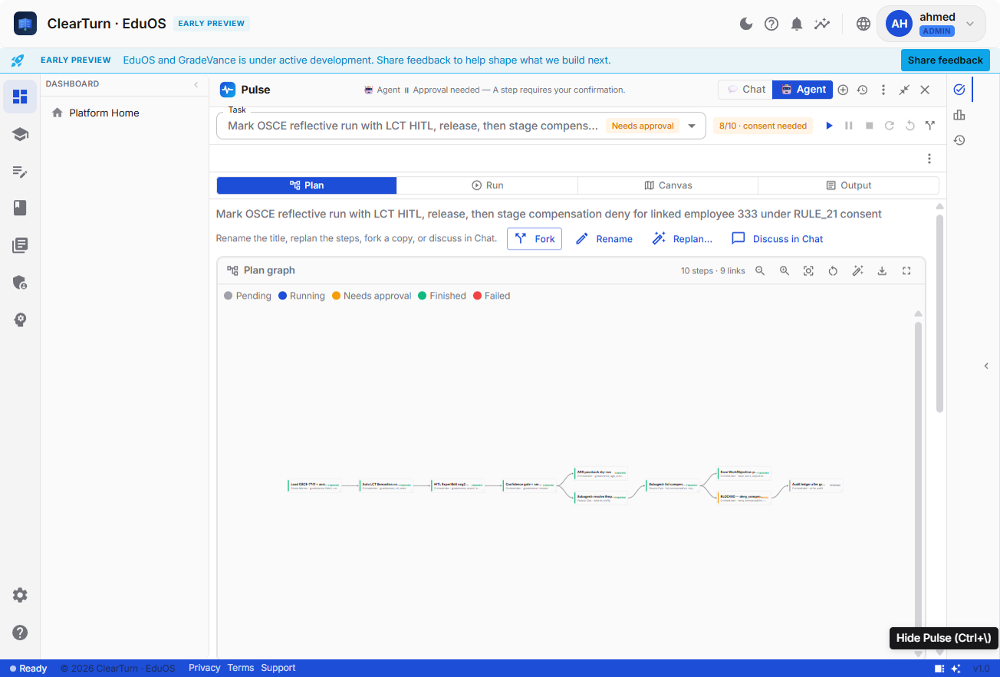
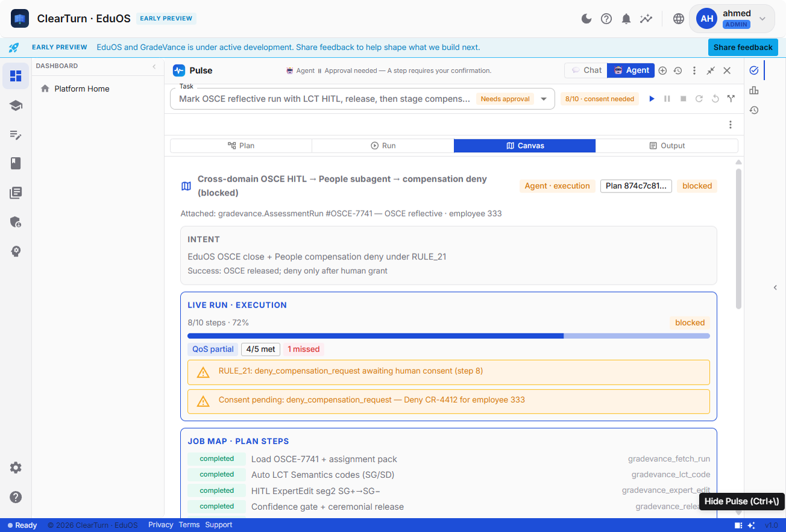
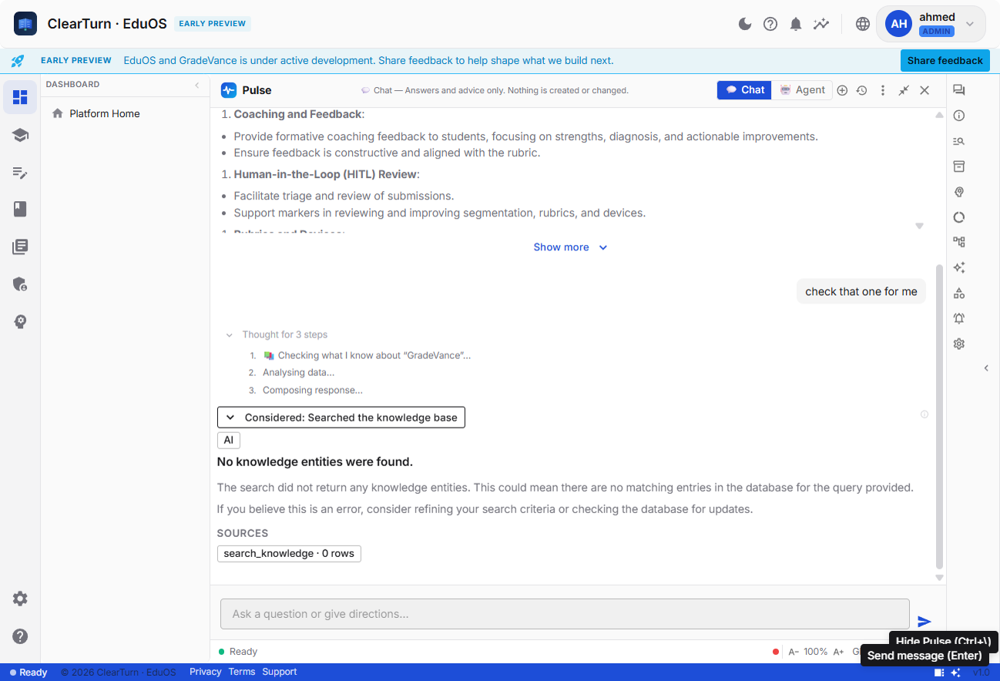
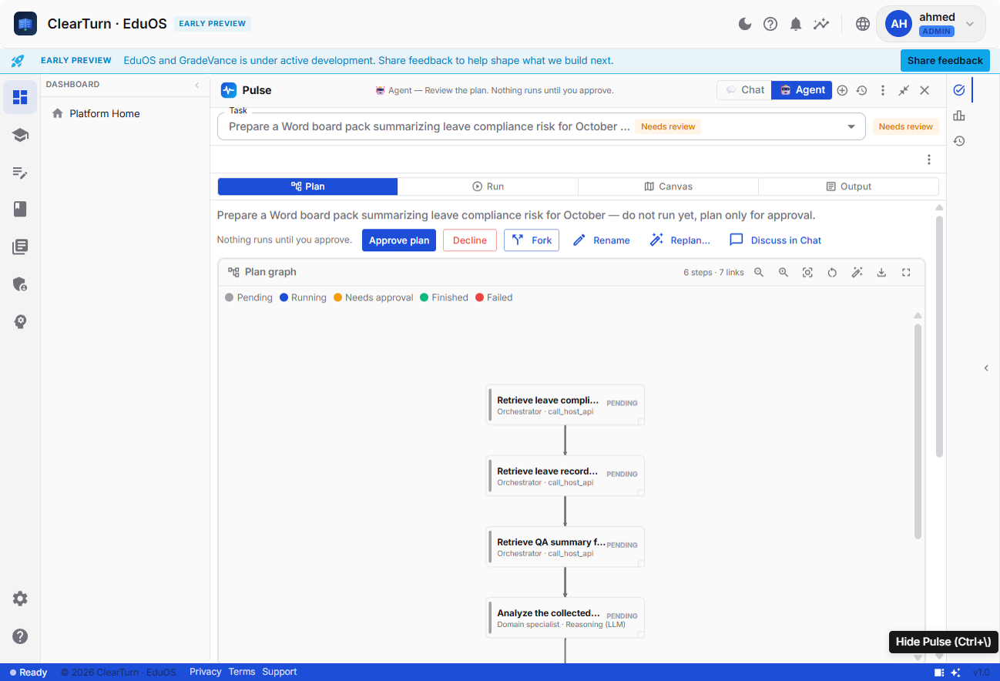
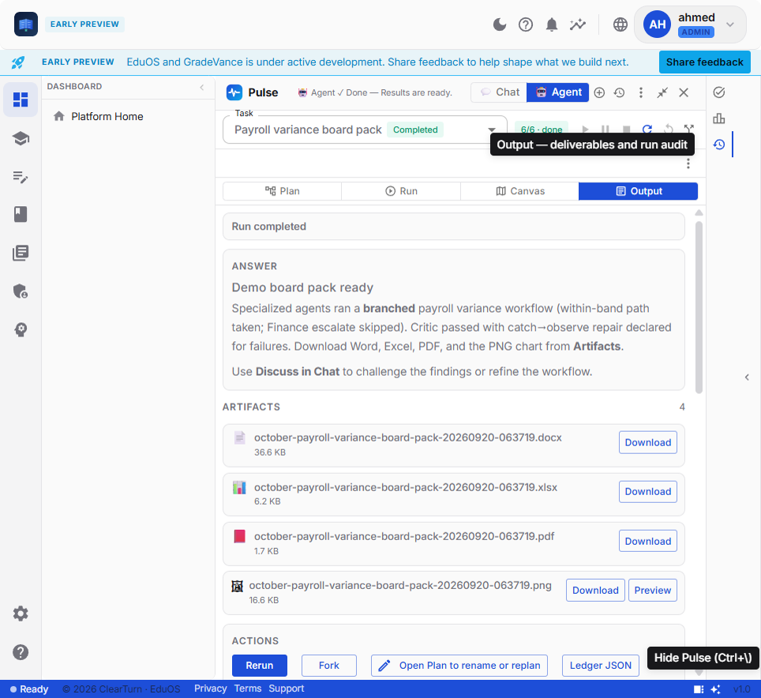

# Pulse Agentic UI/UX — Audit Knowledge Base (with live screenshots)

> **Purpose:** Upload this document **together with** the folder `docs/pulse/ux-audit-shots/` to Fable/Sol (or any reviewer model). Ask them to critique **regular-user experience**, consistency, reproducibility of expectations, and “next-generation ease / user-centric” quality — not just architecture.  
> **Companion:** [`PULSE-AGENTIC-WORKFLOW-AUDIT-KB.md`](./PULSE-AGENTIC-WORKFLOW-AUDIT-KB.md) (engine / safety / lifecycle).  
> **Spec intent:** [`PULSE-UX.md`](./PULSE-UX.md) · Screen: `docs/SCREEN-SPEC-AGENT-FOUR-VIEW-COCKPIT.md` · ADR-0014 / ADR-0043.  
> **Evidence date:** 2026-09-20 · live local app `http://localhost:5179/` (ClearTurn · EduOS / Nibras brand) · user `ahmed` (admin).  
> **No credentials** in this file.

---

## How to use (instructions for the reviewing model)

You are an independent **principal product designer + UX researcher** auditing an enterprise agentic assistant.

Using **only** this document + the attached screenshots (and optionally the architecture companion):

1. **Executive UX read** — What does a regular user think Pulse is from the screens alone?
2. **Expectation contract** — What mental model does Chat vs Agent set? Where does the UI break that model?
3. **Consistency audit** — Dual navigations, status chips, empty states, jargon leakage, progressive disclosure.
4. **Reproducibility** — Can a user re-run / fork / discuss / recover with predictable outcomes? What’s missing?
5. **Benchmark vs industry (2025–2026)** — Intent preview, autonomy dial, receipts, progressive disclosure, taskboard-not-chat-only (cite patterns below).
6. **Severity-ranked UX risks** (top 10) tied to screenshots.
7. **Next-gen recommendations** (top 10) for Operator / Analyst / Admin postures from PULSE-UX pillars.
8. **Questions for the product team** that need live user tests.

Be blunt. Prefer “what the screens show” over “what the ADR promises.”

---

## 0. Stated experience philosophy (from product)

From `PULSE-UX.md` (canonical feel-spec):

> Pulse should feel like a brilliant, trustworthy colleague… calm and clear enough that you forget it’s software.

Pillars (must be checkable): **Crystal clear · Storylike · Easy · Intuitive · Robust · Highly exceptional.**

Three postures: **Operator** (fast outcomes), **Analyst** (provenance), **Admin** (oversight). Progressive disclosure serves all three.

Four-beat narrative for every interaction: Acknowledge → Think (visible) → Answer → Carry forward.

Four-view Agent cockpit (ADR-0043): **Plan · Run · Canvas · Output** — one exclusive hero.

---

## 1. Industry benchmark patterns (web research, 2025–2026)

Sources (summarized for the auditor):

| Pattern | Industry consensus | Why it matters for Pulse |
|---------|-------------------|---------------------------|
| **Intent Preview / Plan-first** | Smashing Magazine 2026; Institute PM; AIUX Design Guide — show plan before consequential action; Edit / Approve / Cancel | Matches Pulse `pending_approval` — must *feel* like consent, not a secondary tab |
| **Autonomy dial / Run modes** | Cursor Auto-review / Allowlist; Copilot granular approvals | Pulse has RULE_21 gates but **no user-visible autonomy dial** (always “plan & propose” + per-mutation confirm) |
| **Chat ≠ primary control surface** | Hatchworks: chat-first demoware fails for long async work; prefer taskboard + receipts | Pulse correctly splits Chat/Agent — **must not** re-bury Agent inside Chat chrome |
| **Progressive disclosure** | Agentic UX Patterns / AI UX Playground — Operator simple; Advanced reveals tools/traces | Pulse Run still shows dense chips (agent role, tool name) by default — Operator overload risk |
| **Receipts + undo** | Hatchworks Level-2 guided agent | Artifacts = receipts; rollback/undo for mutations still thin |
| **State-bound approval** | Enterprise AI Interface Kit / Agent Workflow Canvas | Consent must bind to exact step state; UI must make “what am I approving?” unmistakable |
| **Answer-first Output** | Claude Artifacts, Perplexity | Output must show **outcome** before health/metrics/raw steps |

---

## 2. Screenshot catalog (live evidence)

Folder: `docs/pulse/ux-audit-shots/`

| File | Moment | What to notice |
|------|--------|----------------|
| `ux-01-home-after-login.png` | Platform home | “Use Pulse alongside for AI” — Pulse is a **companion dock**, not the home |
| `ux-02-pulse-chat-dock.png` | Chat mode docked | Chat|Agent toggle; chat thread; domain apps still visible |
| `ux-03-agent-mode-tasks.png` | Agent **Run** mid-consent | Plan\|Run\|Canvas\|Output; paused 8/10; Approve/Decline on mutation; dense step chips |
| `ux-04-agent-output-empty-while-paused.png` | Agent **Output** same run | Empty: “Run the plan to see results.” while header says Needs approval / 8/10 |
| `ux-05-agent-plan-dag.png` | Agent **Plan** DAG | Graph + Fork/Rename/Replan/Discuss; status legend |
| `ux-06-agent-canvas.png` | Agent **Canvas** Job Map | Intent, live progress, QoS, RULE_21 alerts, job-map steps |
| `ux-07-chat-clarify.png` | Chat after ambiguous “check that one for me” | Thought steps + KB search; **no clarifying question** — answers with “No knowledge entities” |
| `ux-08-pending-approval-plan.png` | Agent **Plan** before any run | “Needs review”; Approve / Decline; DAG all Pending; trust line “Nothing runs until you approve” |
| `ux-09-output-word-artifacts.png` | Agent **Output** completed demo | Answer (“Demo board pack ready”) + Artifacts: DOCX / XLSX / PDF / PNG with Download |

### Embedded previews (for Markdown viewers)



















---

## 3. Observed user journey (what actually showed on screen)

### Pass A — paused HITL Agent (shots 01–06)

1. User lands on **Platform Home** (EduOS domains). Pulse is **closed** until “Show Pulse”.
2. Opening Pulse defaults to **Chat** (advisory). Trust text / mode is header Chat|Agent.
3. Switching to **Agent** loads a **pre-existing long HITL task** (OSCE → People compensation deny) already **paused for consent**.
4. **Run** view: rich step list, Approve/Decline, subagents strip, playback controls.
5. **Output** view: **blank placeholder** despite 8 finished steps — expectation break.
6. **Plan** view: DAG of the same job with review actions (Fork / Replan / Discuss).
7. **Canvas** view: Job Map with intent, QoS “4/5 met · 1 missed”, explicit RULE_21 banners.
8. **Dual chrome observed:** Cockpit tabs Plan|Run|Canvas|Output **and** a side rail **Tasks|Monitor|Results** pressed at the same time — IA inconsistency risk.

### Pass B — clarify / pending_approval / completed Output (shots 07–09)

9. **Chat clarify probe:** User sends ambiguous “check that one for me” in Chat. UI shows Thought for 3 steps → `search_knowledge` → “No knowledge entities were found” — **does not ask which “that one”**. Clarification UX gap vs PULSE-UX “Ask when unsure.”
10. **pending_approval before run:** Fresh plan “Prepare a Word board pack…” lands on Plan with **Needs review**, Approve / Decline, all steps Pending. Trust copy matches intent: nothing runs until approve. (Strong Intent Preview evidence.)
11. **Completed Output + Word artifacts:** Task picker → “Payroll variance board pack” (Completed). Output shows Answer first, then four artifacts (`.docx` / `.xlsx` / `.pdf` / `.png`) with Download — receipt-first pattern when the run is done.

---

## 4. Consistency / expectation findings (evidence-based)

### P0 — Broken expectation contracts

| ID | Finding | Evidence |
|----|---------|----------|
| UX-E1 | **Output says “Run the plan to see results” while the run is mid-flight (8/10, consent needed).** Operator expects partial Answer / interim artifacts / “paused — waiting on you.” | `ux-04` vs `ux-03` / header “Needs approval” |
| UX-E2 | **Dual navigation vocabularies** (Plan/Run/Canvas/Output vs Tasks/Monitor/Results) on one surface. Regular users cannot form a stable map. | Snapshots show both sets of controls |
| UX-E3 | Header trust line uses **engine rule id** (“RULE_21”) in Canvas alerts and briefs — violates RULE_23 / Operator-calm promise for regular users. | `ux-06`, task title in `ux-03` |
| UX-E4 | **Chat does not clarify ambiguous deixis** (“check that one for me”) — invents a KB search and returns empty-tool prose instead of asking which item. Breaks “Ask when unsure.” | `ux-07` |

### P1 — Density & progressive disclosure

| ID | Finding | Evidence |
|----|---------|----------|
| UX-D1 | Run list shows **phase + Agent N · role + tool label** on every row by default — Analyst-grade density as Operator default. | `ux-03` |
| UX-D2 | Canvas Job Map repeats step narrative already on Run/Plan — ADR-0043 warned against “same job three times”; density partially mitigated by tabs but still heavy on Canvas. | `ux-06` vs `ux-03` vs `ux-05` |
| UX-D3 | Chat dock keeps **far-right utility icon rail** + domain home — cognitive split between “work in GradeVance” and “talk to Pulse.” | `ux-02` |

### P2 — Reproducibility & recovery

| ID | Finding | Evidence |
|----|---------|----------|
| UX-R1 | **Fork / Replan / Discuss / Rerun** exist (good) — but paused Output emptiness makes “what did we already produce?” non-reproducible without Run/Canvas archaeology. | `ux-04`, `ux-05` |
| UX-R2 | Playback metaphors (Resume/Pause/Stop) coexist with Approve/Decline — risk of users clicking **Resume** thinking it replaces consent. | `ux-03` controls |
| UX-R3 | No visible **autonomy dial** / preview-only mode for first-time Operators — industry recommends graduated trust. | Absent across shots |

### Positives to preserve

| ID | Strength | Evidence |
|----|----------|----------|
| UX+1 | Clear **Chat vs Agent** mode toggle (ADR-0014) | `ux-02`, `ux-03` |
| UX+2 | Consent CTA **Approve / Decline** on mutation step with outcome copy about writing to Carbon | `ux-03` |
| UX+3 | Plan DAG + status legend readable | `ux-05` |
| UX+4 | Canvas surfaces **intent + success condition + QoS** (Analyst/Admin value) | `ux-06` |
| UX+5 | Companion dock model (“alongside” domain apps) is coherent for EduOS | `ux-01`, `ux-02` |
| UX+6 | **pending_approval Plan** is a clear Intent Preview: Needs review + Approve/Decline + idle DAG | `ux-08` |
| UX+7 | **Completed Output** is Answer-first with Word/Excel/PDF/PNG artifact receipts (Download / Preview) | `ux-09` |

---

## 5. Mapping to PULSE-UX pillars (scorecard)

| Pillar | Live score (1–5) | Notes from screenshots |
|--------|------------------|------------------------|
| Crystal clear | **2.5** | Header status good; mid-run Output empty; Chat ambiguity silent |
| Storylike | **3** | Plan→Run→Canvas→Output arc exists; beat 3 fails mid-run; completes well on `ux-09` |
| Easy | **2.5** | Consent/`ux-08` clear; density + dual chrome + Chat clarify miss tax Operators |
| Intuitive | **2** | Two vocabularies for the same lifecycle |
| Robust | **3.5** | Pre-run approve (`ux-08`) + completed receipts (`ux-09`) strong; mid-run Output weak |
| Highly exceptional | **2.5** | Graph + HITL + pack artifacts strong; clarify + IA debt block polish |

---

## 6. Next-generation “ease & user-centric” targets (proposed)

These are **recommendations for the auditor to pressure-test**, not claimed shipped work:

1. **Single IA vocabulary** — kill Tasks/Monitor/Results (or hide behind Advanced) when cockpit is on.
2. **Output always tells the truth of lifecycle** — mid-run: “Paused — waiting for your approval on step X” + partial Answer/artifacts; never “run the plan” when already running.
3. **Operator default / Analyst expand** — collapse tool/agent chips behind “Details”; keep intent + status + one CTA.
4. **Consent card as hero on Run** — when `awaiting_approval`, scroll-lock the Approve/Decline panel above the fold; demote playback until resolved.
5. **Humanize Canvas alerts** — “This changes payroll data — confirm to continue” instead of `RULE_21: deny_compensation_request`.
6. **Autonomy dial** — Preview → Confirm each write → Confirm high-risk only (enterprise pattern).
7. **Receipt-first Output** — Answer + Artifacts first; Run health collapsed (already partially true when complete).
8. **Reproducibility pack** — one-click “Replay brief”, “Fork as new”, “Export audit PDF” with identical step graph.
9. **Expectation banner when opening Agent** — “Agent will propose a plan; nothing writes until you approve.”
10. **Chat clarify on deixis** — when the referent is ambiguous (“that one”, “the last thing”), ask one short question before tool calls; never dump empty-tool prose as the Answer (`ux-07`).
11. **Measure** — task success, time-to-consent, Output empty-state rate, dual-chrome confusion, clarify-miss rate in moderated tests.

---

## 7. Suggested prompt to paste with this pack

Use the **deep dual-track prompt** in the chat / `docs/pulse/` companion (architecture + UX). Short version if token-limited:

```
Attached: PULSE-AGENTIC-UIUX-AUDIT-KB.md + ux-audit-shots/ (ux-01…ux-09)
+ optionally PULSE-AGENTIC-WORKFLOW-AUDIT-KB.md.

Principal product designer + UX researcher. Screens > ADR promises.
Operators first. Cite screenshot filenames. Deliver: executive UX read,
expectation contract (Chat vs Agent), consistency, reproducibility,
2025–2026 agentic UX benchmark, top 10 risks, top 10 next-gen recs,
user-research questions. Cross-check architecture KB for safety claims
that the UI over/under-promises.
```

---

## 8. Open questions for user research

1. Do Operators understand Chat vs Agent without training?
2. When paused for consent, do they go to Output looking for “the answer”?
3. Does Approve/Decline feel safer than Resume?
4. Is Canvas valuable for Operators or only Analysts/Admins?
5. Does jargon (`RULE_21`, tool names, Agent N) erode trust or build it?
6. After Rerun, do they expect identical Output — and can they tell what changed?
7. Is the companion dock (alongside GradeVance) preferred to a full-screen Agent workspace?

---

## 9. File pack for upload

```
docs/pulse/PULSE-AGENTIC-WORKFLOW-AUDIT-KB.md          # architecture / safety
docs/pulse/PULSE-AGENTIC-UIUX-AUDIT-KB.md              # this file
docs/pulse/ux-audit-shots/
  ux-01-home-after-login.png
  ux-02-pulse-chat-dock.png
  ux-03-agent-mode-tasks.png
  ux-04-agent-output-empty-while-paused.png
  ux-05-agent-plan-dag.png
  ux-06-agent-canvas.png
  ux-07-chat-clarify.png
  ux-08-pending-approval-plan.png
  ux-09-output-word-artifacts.png
```

Zip tip: zip `docs/pulse/PULSE-AGENTIC-*` + `ux-audit-shots/` and upload that archive to Fable/Sol.

---

*End of UI/UX knowledge base. Screenshots are observational evidence from live Chat + Agent sessions (paused HITL, pending_approval, and a completed board-pack Output), not marketing mocks.*
