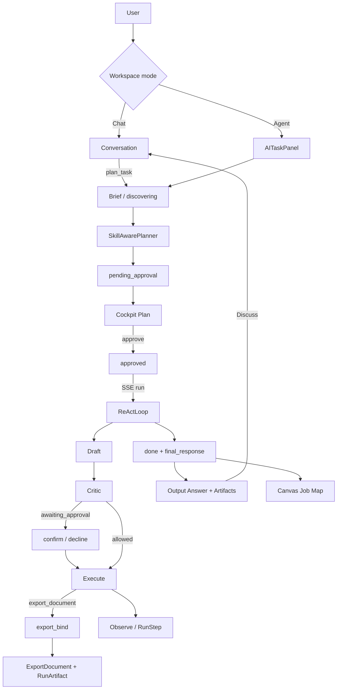

# Pulse → Agentic Workflow — Knowledge Base for External Audit

> **Purpose:** Upload this single document to another model (Fable, Sol, Claude, GPT, etc.) and ask it to audit, critique, and reason aloud about architecture, safety, honesty of claims, and product gaps.  
> **Product:** Carbon / Pulse AI (internal name “Pulse”; user-facing copy says “AI” / “the assistant”).  
> **Repo root:** `carbon` (monorepo: `backend/ai/`, `backend/ai/engine/`, `carbon-frontend/`).  
> **Canonical SSOT:** `docs/pulse/PULSE-CANONICAL.md` (wins on conflict).  
> **KB compiled:** 2026-09-20 · grounded in code + ADRs + Sep 2026 Deliverable/Output contract.  
> **Honesty rule:** Prefer “what the code does” over marketing. Call out gaps explicitly.  
> **UI/UX companion (upload together):** [`PULSE-AGENTIC-UIUX-AUDIT-KB.md`](./PULSE-AGENTIC-UIUX-AUDIT-KB.md) + folder [`ux-audit-shots/`](./ux-audit-shots/) (live screenshots).

---

## How to use this document (instructions for the reviewing model)

You are an independent senior architect reviewing an enterprise **agentic workflow** product.

Please respond with:

1. **Executive read** — In one paragraph: what is this system, really? Coworker, advisory assistant, or UI wrapper?
2. **Architecture critique** — Strengths, over-complexity, seam risks (Chat vs Agent, ReAct vs workflow graph, host vs engine).
3. **Safety audit** — RULE_20 / RULE_21 / RULE_23 / CBAC / CommandBoundary: where claims may exceed enforcement.
4. **Honesty check** — Multi-agent, learning, proactivity, graph runtime: which claims are overstated?
5. **Deliverable path** — Word/Excel export + Answer surface: is the Sep 2026 contract sound? Residual failure modes?
6. **Top 10 risks** ranked by severity × likelihood.
7. **Top 10 recommendations** (concrete, ordered).
8. **Questions back to the team** that cannot be answered from this KB alone.

Do **not** invent APIs or files not listed here. If evidence is missing, say so.

---

## 0. One-line verdict (from canonical docs)

Pulse is a **host-agnostic reasoning engine** under `backend/ai/engine/`, wrapped by a Carbon host (`backend/ai/`) that owns durable state, identity, CBAC, and effects. It is a **genuinely grounded, consent-gated advisory assistant with a real reasoning spine** — **not yet** a self-improving 24/7 coworker. Anatomy (memory, learning, proactive) exists; **metabolism is dormant** (no deployed heartbeat/scheduler fleet-wide as of canonical 2026-09-15).

---

## 1. Product concept

### 1.1 Layers

| Layer | Owns | Must not |
|-------|------|----------|
| **Pulse `engine/`** | Inference, tool *decision*, witnesses, ReAct loop, workflow graph *schema* | Import Django domain apps (`catalog`/`mdm`/`dq`/…) — RULE_20 |
| **Carbon `ai/` host** | Durable `Run`/`RunStep`/`RunArtifact`, auth, CBAC, CommandBoundary/PDP, HTTP APIs, SSE | Leak engine jargon to users — RULE_23 |

**Instances:** One engine; many tenants (Carbon/AASTMT, Nibras/HRMS, …) via `instance.yaml` + `instance_id` partition — not engine forks.

### 1.2 Chat vs Agent (ADR-0014)

| Mode | Contract | Surface |
|------|----------|---------|
| **Chat** | Advisory; should not auto-mutate | Conversation UI, memory, artifacts browser |
| **Agent (Tasks)** | Plan → approve → run → consent → audit | `AITaskPanel` + four-view cockpit |

- Mode is **workspace-level** (`localStorage carbon-ai-mode`), not a composer pill.
- Bridge: Chat tool `plan_task` creates a **`pending_approval` plan** without executing it.
- Discuss (Agent → Chat): seeds composer with brief; must not paste outcome verbs that re-trigger tools.

### 1.3 Four-view cockpit (ADR-0043 — Implemented V1–V4)

Exclusive heroes (one at a time):

| View | Operator question | Primary UI |
|------|-------------------|------------|
| **Plan** | What will we do? | `PlanDagGraph`, edit / approve / fork |
| **Run** | Where are we now? | Progress, RULE_21 consent CTA, step I/O |
| **Canvas** | Durable job story | Ops Canvas Job Map (ADR-0041) |
| **Output** | What did we produce? | Answer prose, artifacts, run health |

Soft defaults: `pending_approval` → Plan; running/paused → Run; completed/failed → Output; explicit board → Canvas.

---

## 2. Plan lifecycle (Agent path)

```
brief → pending_approval → approve → SSE run → per-step consent → durable ledger
```

### 2.1 Statuses

| Run status | Meaning |
|------------|---------|
| `discovering` | Discovery conversation before finalize |
| `pending_approval` | Reviewable; **nothing executes** |
| `approved` | Runnable |
| `running` / `paused` | Live / paused for consent or operator |
| `completed` / `completed_with_gaps` / `failed` / `cancelled` | Terminal |

Step statuses include: `pending`, `running`, `completed`, `failed`, `skipped`, `awaiting_approval`.

### 2.2 Service & API

- **Service:** `backend/ai/plans_service.py` — create, approve, run (SSE frames), confirm/decline step, ledger, artifacts.
- **HTTP:** `backend/ai/plans_api.py` under `/carbon-api/ai/plans/`.
- **Ownership (CBAC):** `_get_owned_run(user, plan_id)` via `Run.host_user_id`.
- **Contract:** The approved plan **is** the executed plan (`resume_run_id=plan_id` — no duplicate ledger row).

### 2.3 SSE frames (product terms — RULE_23)

`plan_start` → `step_start` → `step_result` | `step_confirm` → `step_end` → `done` (includes `final_response`) | `error`

---

## 3. Engine path

### 3.1 Chat spine — six witnesses

Under `backend/ai/engine/cognition/turn/`:

| Stage | Module | Role |
|-------|--------|------|
| S1 | `salience.py` (+ intent/clarify) | Route / clarify |
| S2 | `retrieve.py` | Grounding context |
| S3 | `draft.py` | Draft; may emit `tool_calls` |
| S4 | `critic.py` | Grounding / mutation veto |
| S5 | `execute.py` | Run tools via host executor |
| S6 | `runner.py` + ledger/verify | Synthesis + record |

Orchestrator: `TurnPipelineRunner` (`turn/runner.py`).

### 3.2 Agent path — planner + ReActLoop

```
SkillAwarePlanner.decompose
  → optional skill match / invoke_skill / coerce export_document
  → plan_json (+ optional workflow_graph compile)
  → ReActLoop.run  (per step: Draft → Critic → Execute → Observe)
  → optional FlightDirector hooks (additive)
  → final_response + Run / RunStep ledger
```

| Component | Path |
|-----------|------|
| Planner | `engine/cognition/plan/planner.py` — `SkillAwarePlanner` |
| Loop | `engine/cognition/plan/loop.py` — `ReActLoop` |
| Export bind | `engine/cognition/plan/export_bind.py` |
| Workflow graph | `engine/workflow/{graph,guards,driver,retry,heal,compensate}.py` |
| Flight Director | `ai/flight_director.py` (host; never auto-mutates) |

**ADR-0034 honesty:** Graph schema + driver exist; **ReActLoop remains the primary executor**. Dual representation: legacy steps + `plan_json.workflow_graph`. Full driver cutover is incomplete.

---

## 4. Tools and plugins

### 4.1 Registration

- Static tools + executors: `engine/agent/tools.py` (`call_host_api`, `invoke_skill`, …).
- Plugins: `ToolPlugin` ABC + `register_plugin()`; builtins via `ai/plugins/__init__.py` at Django `AIConfig.ready`.
- Host effects should pass **CommandBoundary** (`ai/command_boundary.py`, ~14 stages) + **PDP** (`ai/pdp.py`, default-deny).

### 4.2 Critical tools

| Tool | Kind | Behavior | Consent |
|------|------|----------|---------|
| `call_host_api` | Static | Host APIs (analyze/list/get …) | Mutations staged; many GETs live |
| `code_execute` | Plugin | Sandboxed Python; returns `stdout`, `table_rows`, `image_b64` | No confirm (sandbox) |
| `export_document` | Plugin | docx/xlsx/pdf/png; store `RunArtifact` | No confirm; **hollow refuse** |
| `invoke_skill` | Static | Named skill via boundary | Via boundary |
| `plan_task` | Plugin | Creates pending Agent plan from Chat | Creates plan only |

Planner may append `export_document` when the brief asks for Word/Excel/PDF (`_ensure_export_deliverable`).

---

## 5. Deliverable + Output contract (Sep 2026)

### Problem that motivated the fix

Operators saw “Completed” runs where:

1. Word files were title + `[Placeholder…]` skeletons.
2. Output Answer said “No final response”.
3. Artifact Preview dumped Office ZIP bytes as text (`PK…`) because mime regex matched `xml` inside `openxmlformats`.
4. Run UI dumped huge JSON / `image_b64` from `code_execute`.

### Fixes (architectural, not hotfixes)

| Seam | Mechanism |
|------|-----------|
| **Deterministic bind** | Before `export_document` execute, `export_bind.apply_bind_to_tool_calls` merges prior step `table_rows` / API `breakdown` / chart PNGs into `content` / `table` / `images`. Pure engine (RULE_20). |
| **Hollow refuse** | Plugin returns `error` if content is placeholder-only and no table/images. |
| **Answer DTO** | `PlansService._serialize_run` includes `final_response`; loop has `_fallback_final_response` if synthesis empty; FE applies SSE `done.final_response`. |
| **UI sanitize** | `_ui_tool_output` on serialize + SSE: redact `image_b64` → `{present, bytes_est}`; infer `chart`/`table`/`artifact`. **DB keeps raw** for audit. |
| **Mime allowlist** | `artifactMime.js` — Office/PDF never text-previewable. |
| **Step renderer** | `StepOutputRenderer` shows chart/table summaries, never base64 walls. |

### Residual risks (for auditor)

- Bind only sees prior `StepResult.tool_output` shapes it knows how to parse; exotic API payloads may still yield thin Word bodies.
- LLM synthesis of Answer can still be weak; fallback is operator-summary, not deep insight.
- Rebuild/restart required for production to pick up engine changes (baked images).

---

## 6. Frontend map

| Surface | Path | Role |
|---------|------|------|
| `AITaskPanel` | `carbon-frontend/src/shell/AITaskPanel.jsx` | Agent hub |
| `AgentCockpit` | `…/AgentCockpit.jsx` | Plan/Run/Canvas/Output |
| `AgentRunSurface` | `…/AgentRunSurface.jsx` | Live Run |
| `AgentCanvasSurface` | `…/AgentCanvasSurface.jsx` | Job Map |
| `AgentReviewSurface` | `…/AgentReviewSurface.jsx` | Plan review / Discuss |
| `PlanDagGraph` | `…/components/graph/PlanDagGraph.jsx` | Force DAG |
| `StepOutputRenderer` | `…/components/ai/StepOutputRenderer.jsx` | Typed step I/O |
| `artifactMime.js` | `…/shell/artifactMime.js` | Preview allowlist |
| `buildDiscussDraft.js` | `…/shell/buildDiscussDraft.js` | Agent → Chat seed |

Debug: `localStorage carbon-ai-cockpit=off` restores classic multi-tab IA.

---

## 7. Safety model

| Rule | Intent | How it shows up |
|------|--------|-----------------|
| **RULE_20** | Engine isolation; no upward domain imports | Documented; `INVARIANTS.md` historically lists **partial/violated** — do not assume perfect |
| **RULE_21** | No silent mutation | Plan approve + step confirm; `requires_confirmation`; CommandBoundary consent stage |
| **RULE_23** | Outcome copy only | SSE product terms; UI sanitize; no engine jargon in operator copy |
| **RULE_34** | Process YAML ≠ host ACL | ADR-0045: Nibras SoD dials vs Correspondence/host gate; honesty matrix CI |
| **CBAC** | Capability / ownership | Plan owner; People capabilities; PDP permits |
| **dry_run** | Preview vs commit | Critic / pending ToolExecution patterns |

**Nibras process SoD:** Leave/loan host SoD = Correspondence (ADR-0030). Payroll / GOSI /
onboarding / attendance irreversibles = org-scoped `people:manage` until shared host SoD
gate (ADR-0045). Pulse consent alone does not close DRF.

**Effect-path inventory:** `docs/pulse/EFFECT-PATHS.md` lists residual PARTIAL/NO paths (some GETs, MCP, skills, export outside plan path). Treat as first-class auditor input.

---

## 8. Honesty table (claims vs reality)

| Claim | Reality |
|-------|---------|
| “Multi-agent platform” | **Agent roles + handoffs in registry**; workers with tool allowlists. Not free-form multi-agent debate. Subagents ≈ conversation-scoped workers. |
| “Workflow graph runtime” | Schema/driver **real**; primary execution still **ReActLoop**. |
| “Self-improving coworker” | Learning/promotion **implemented + unit-tested**; heartbeat **not deployed** → dormant metabolism. |
| “Always rich Word reports” | Depends on prior tools + **deterministic bind**; hollow exports **refused**. |
| LLM vs bind | Draft may invent placeholders; **bind is deterministic**. Answer synthesis is LLM (+ fallback). |
| Chat Job Brief vs Agent Job Map | Different modes (ADR-0041); do not merge. |
| “Process YAML SoD = secured” | **False** unless host enforces (ADR-0045). Leave/loan yes; payroll/GOSI/onboard/attendance dial-only. |

---

## 9. End-to-end flow



---

## 10. Glossary

| Term | Meaning |
|------|---------|
| Pulse | Internal name for the AI engine + coworker product |
| Host | Carbon `backend/ai/` durable/auth/effect layer |
| Plan / Run | User-facing task; durable Django `Run` |
| pending_approval | Plan exists; RULE_21 gate before run |
| ReActLoop | Multi-step agent executor |
| Witness | Turn-pipeline stage |
| Flight Director | Additive QoS / acceptance supervisor |
| workflow_graph | Declarative control-flow JSON (ADR-0034) |
| export_bind | Deterministic prior-output → export args |
| RunArtifact | Durable downloadable file for a plan step |
| CBAC | Capability-/owner-based access control |
| PDP | Policy Decision Point (default-deny) |
| CommandBoundary | Single door for host effects |
| Job Map | Ops Canvas durable board (ADR-0041) |
| final_response | Agent run outcome prose on Run / DTO / SSE |

---

## 11. File index (relative to repo root)

### Backend — lifecycle & safety
- `backend/ai/plans_service.py`
- `backend/ai/plans_api.py`
- `backend/ai/command_boundary.py`
- `backend/ai/pdp.py`
- `backend/ai/host_executor.py`
- `backend/ai/flight_director.py`
- `backend/ai/models/core.py` (`Run`, `RunStep`, `RunArtifact`)
- `backend/ai/ops_canvas.py`

### Backend — engine
- `backend/ai/engine/cognition/plan/planner.py`
- `backend/ai/engine/cognition/plan/loop.py`
- `backend/ai/engine/cognition/plan/export_bind.py`
- `backend/ai/engine/cognition/turn/` (salience, retrieve, draft, critic, execute, runner, …)
- `backend/ai/engine/agent/{tools,plugins,registry,workers}.py`
- `backend/ai/engine/workflow/`
- `backend/ai/plugins/{export_document,code_execute,plan_task}.py`

### Frontend
- `carbon-frontend/src/shell/AITaskPanel.jsx`
- `carbon-frontend/src/shell/AgentCockpit.jsx`
- `carbon-frontend/src/shell/AgentRunSurface.jsx`
- `carbon-frontend/src/shell/AgentCanvasSurface.jsx`
- `carbon-frontend/src/shell/AgentReviewSurface.jsx`
- `carbon-frontend/src/shell/artifactMime.js`
- `carbon-frontend/src/shell/buildDiscussDraft.js`
- `carbon-frontend/src/components/graph/PlanDagGraph.jsx`
- `carbon-frontend/src/components/ai/StepOutputRenderer.jsx`

### Docs / ADRs
- `docs/pulse/PULSE-CANONICAL.md` — SSOT
- `docs/pulse/INVARIANTS.md`
- `docs/pulse/EFFECT-PATHS.md`
- `docs/pulse/PULSE-UX.md` / `PULSE-UX-DESIGN.md`
- `docs/pulse/PULSE-ROADMAP.md`
- `docs/DESIGN-AGENT-WORKFLOW-AND-UI.md`
- `docs/SCREEN-SPEC-AGENT-FOUR-VIEW-COCKPIT.md`
- `.ai-toolkit/decisions/0014-pulse-chat-agent-mode-split.md`
- `.ai-toolkit/decisions/0034-resilient-agent-workflow-graph.md`
- `.ai-toolkit/decisions/0041-pulse-ops-canvas-job-map.md`
- `.ai-toolkit/decisions/0043-agent-four-view-cockpit.md`

### Contract tests
- `backend/ai/tests/test_export_bind.py`
- `backend/ai/tests/test_export_document_pack.py`
- `backend/ai/tests/test_artifacts.py`
- `carbon-frontend/src/shell/__tests__/artifactMime.test.js`
- `carbon-frontend/src/features/ai/test/StepOutputRenderer.test.jsx`

---

## 12. Suggested prompt to paste with this file

```
Attached is a knowledge base for Carbon/Pulse agentic workflow.

Act as an independent principal engineer. Audit the system using only this document.
Follow the "How to use this document" section: executive read, architecture critique,
safety audit, honesty check, deliverable path, top 10 risks, top 10 recommendations,
and questions back to the team.

Be skeptical of multi-agent / coworker marketing. Prefer fail-closed safety.
Call out where documentation admits gaps (INVARIANTS, EFFECT-PATHS, dormant heartbeat,
ReAct vs workflow graph). Propose what you would verify in a live environment next.
```

---

## 13. Open questions already known (seed for the auditor)

1. Accepted residual risk for EFFECT-PATHS PARTIAL/NO rows vs “all mutations through CommandBoundary”?
2. Is RULE_20 import lint **blocking in CI** or report-only?
3. Which production plans execute via `workflow.driver` vs ReAct `depends_on`? Sunset date for dual representation?
4. Is any instance deploying a Pulse heartbeat/scheduler, or is dormant metabolism still fleet-wide?
5. Do Admin “Agents / Topology” UIs overstate runtime handoff vs catalog edges?
6. Org-unit Scope on every `call_host_api` GET for non-superusers?
7. Artifact retention / size caps / URL leakage for `MEDIA_ROOT` exports?
8. Can skill promotion / CRUD bypass `skills/gate.py` on any admin path?
9. When is Answer LLM vs fallback? How is hollow-export refuse shown when a run “completes”?
10. Live golden eval for Agent deliverable + consent in routine CI?
11. Flight Director always on plan run, or flag? Can acceptance repairs re-run mutations?
12. Discovery/`agent_brief` path completeness vs immediate decompose — which is default live?

---

*End of knowledge base. No confidential credentials included. Paths are relative to the carbon monorepo.*
