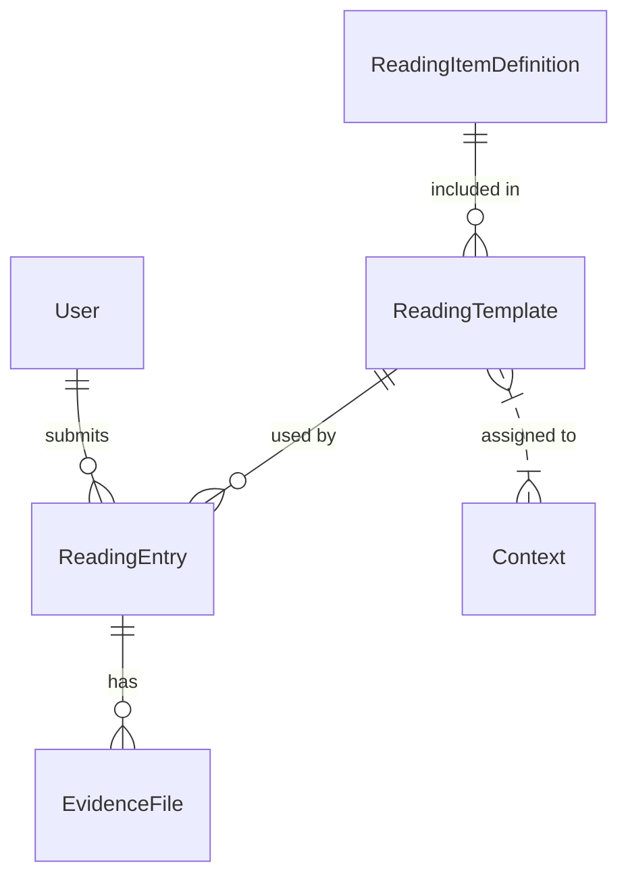
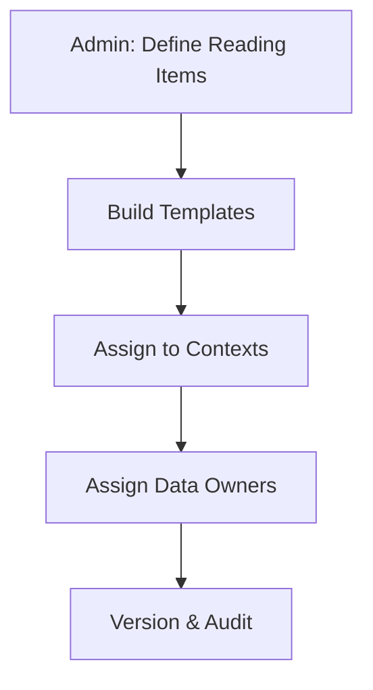
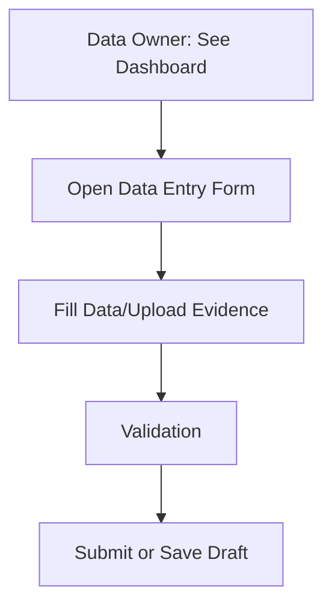
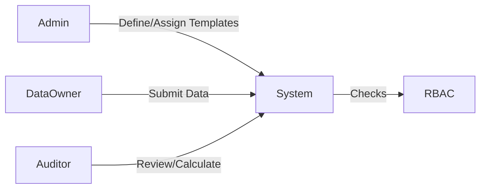
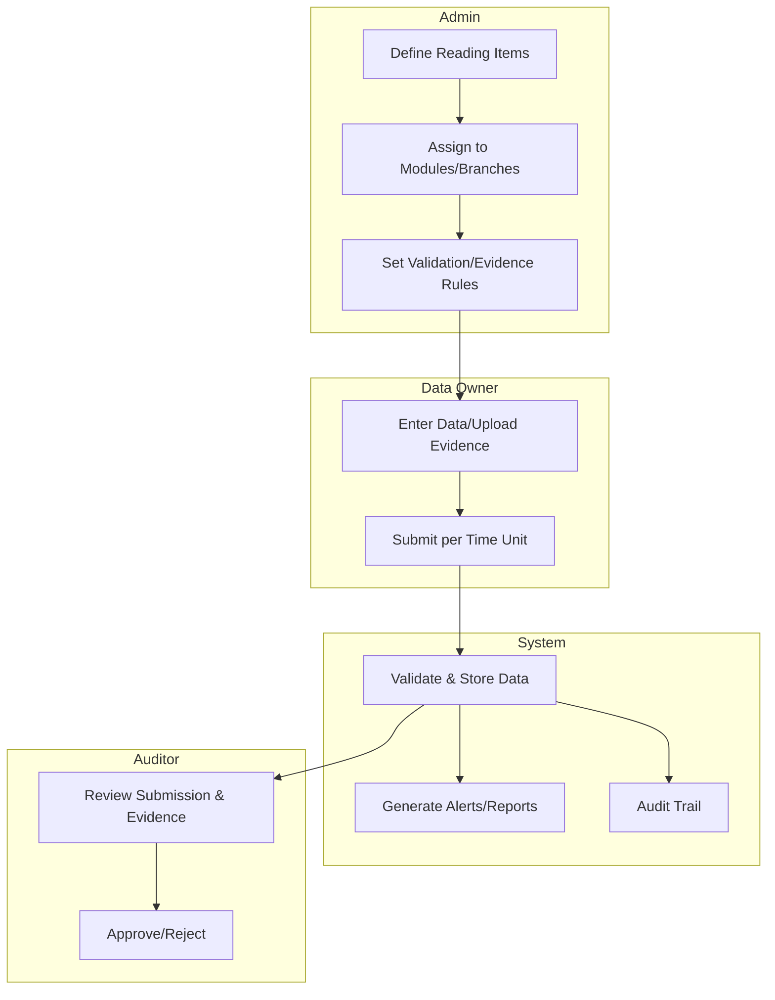

# Dynamic Data Collection & Configuration — Full Design Document

## 1. Overview

This document details the architecture and workflows for a dynamic, admin-configurable data collection solution in the Carbon Management Platform. The design supports flexible "reading items" (data fields), template assignment by context (project, branch, department, etc.), dynamic validation (including measurement units), multi-evidence handling, RBAC, comprehensive reporting, full auditability, and extensibility for future integrations. This enables organizations to adapt quickly to operational and regulatory changes, while maintaining robust security and traceability [[3]](https://poe.com/citation?message_id=395415503247&citation=3).

---

## 2. Core Concepts & Data Model

### 2.1. Entities

- **ReadingItemDefinition**
  - Defines a data field (e.g., "Electricity Usage", "Water Meter Reading").
  - **Attributes:**  
    - `name`, `description`, `data type` (number, string, date, file, select),  
    - **default validation rules** (e.g., min/max, **units**),  
    - required/optional, category, tags, evidence rules, editable flag for admin override.
  - **Measurement Unit Handling:**  
    - The expected measurement unit for each data field (e.g., 'kWh' for electricity, 'm³' for water) is explicitly set within the `validation rules` attribute (as a JSON property, e.g., `"unit": "kWh"`). This unit is enforced at data entry, referenced in analytics and reporting, and can be overridden per context if necessary [[2]](https://poe.com/citation?message_id=395415503247&citation=2)[[3]](https://poe.com/citation?message_id=395415503247&citation=3).
- **ReadingTemplate**
  - A form made up of ReadingItemDefinitions, assigned to specific contexts (module, project, branch, department).
  - **Attributes:** name, description, version, status, assigned contexts, fields (with order).
- **ReadingEntry**
  - A submission instance by a Data Owner, referencing a template and context (e.g., "March 2024 — Branch X — Electricity").
  - **Attributes:** template, template version, context, data (JSON), submitted_by, submitted_at, status (draft/submitted), audit log.
- **EvidenceFile**
  - An uploaded document/image related to an entry or field, possibly covering a range of readings.
  - **Attributes:** reading_entry, reading_item, file_path, file_type, uploaded_at, covers_period_start, covers_period_end.

### 2.2. Relationships (ERD)

- Contexts include project, module, branch/location, department, and time period [[3]](https://poe.com/citation?message_id=395415503247&citation=3).

---

## 3. Workflows

### 3.1. Admin: Configure Data Collection

1. **Define Reading Items:** Admins define reading items for each module (e.g., electricity, water, gas), setting default validation (range, **units**, non-negative, etc.), which can be overridden per project/branch as needed. Units are a critical part of the validation rules for each data item and must be specified to ensure consistency and accuracy in data collection and reporting [[2]](https://poe.com/citation?message_id=395415503247&citation=2).
2. **Build Templates:** Group reading items into templates, assign to contexts (module + branch/location + department as appropriate). Common reading items can be reused or duplicated and customized, including their unit settings.
3. **Assign Staff:** For each context (e.g., Branch A of Project X), assign the Data Owner (staff who will enter data).
4. **Version Control:** All template changes are versioned for auditability.

---

### 3.2. Data Owner: Data Entry

1. **Dashboard:** Data Owner sees assigned tasks (per time unit: month, quarter, etc.) for each context (e.g., their branch and module).
2. **Dynamic Form:** System renders a form based on the assigned template, with contextual fields and validation. The unit for each field is displayed and enforced based on its ReadingItemDefinition validation rules.
3. **Evidence Upload:** Where required, upload multiple evidence files (PDFs, images) and specify covered periods if a bill/document covers a range.
4. **Submit:** Save draft or submit; each submission is atomic for the time unit (e.g., monthly). Cannot edit past the deadline unless allowed.
5. **Alarms:** If a required submission is missing for a time unit, an alarm/notification is triggered.

---

### 3.3. Auditor: Review & Calculation

1. **View Submissions:** Auditor selects project/module/branch/period to review.
2. **Integrated Review:** Auditor sees submitted data and evidence in context, with all measurement units clearly displayed for each field, can approve, reject, or request resubmission.
3. **Calculation & Reporting:** Trigger calculations, view/store results, and generate reports. All calculations use the units specified in ReadingItemDefinition; if data needs to be aggregated or compared across units (e.g., liters to m³), conversion logic must use the unit metadata [[2]](https://poe.com/citation?message_id=395415503247&citation=2)[[3]](https://poe.com/citation?message_id=395415503247&citation=3).
4. **Audit Log:** Actions are logged for traceability.

---

### 3.4. RBAC Enforcement

- All actions are strictly checked against context-aware RBAC at both UI and API levels.
- Only authorized admins can define templates; only assigned Data Owners can submit for their context; only auditors can review assigned scopes.

---

## 4. Validation, Measurement Units & Evidence Handling

- **Validation Defaults:** Platform provides sensible defaults for each resource type (e.g., electricity can't be negative, gas units have realistic maxima, and measurement units are strictly enforced). Admins can override as needed [[2]](https://poe.com/citation?message_id=395415503247&citation=2)[[3]](https://poe.com/citation?message_id=395415503247&citation=3).
- **Measurement Unit Handling:**  
    - The unit for each reading item is set in the `validation rules` of ReadingItemDefinition. For example:  
      `{ "unit": "kWh", "min": 0 }` for “Electricity Usage”, or `{ "unit": "m³", "min": 0 }` for “Water Meter Reading.”
    - When templates are assigned to specific contexts, these unit settings are inherited. If a context requires a different unit (e.g., reporting water in liters instead of m³), the admin can override the default unit in the template assignment.
    - During data entry, the UI must display the unit and validate input accordingly.
    - In analytics and reporting, the system must aggregate and compare data using these units. If conversion is required (e.g., liters to m³), reporting logic references this unit metadata [[2]](https://poe.com/citation?message_id=395415503247&citation=2)[[3]](https://poe.com/citation?message_id=395415503247&citation=3).
- **Evidence:** Multiple files per reading item allowed; evidence can be linked to a range of time units (e.g., one bill for three months).
- **File Restrictions:** Allow only PDFs/images, with size limits (e.g., 2–4MB, configurable by admin).

---

## 5. Reporting & Analytics

- Filter, aggregate, and export data by project, branch, module, time period, and **always with reference to the measurement unit** for each field.
- The reporting/analytics layer must use unit metadata from ReadingItemDefinition for correct calculations and visualizations. If data with different units are combined, the system must convert using the `unit` property in validation rules [[3]](https://poe.com/citation?message_id=395415503247&citation=3).
- Auto-flag missing, late, or incomplete submissions for admin/auditor attention.
- Support CSV and PDF report exports.

---

## 6. Audit & Compliance

- **Full audit trail:** All actions (template change, data submission, evidence upload, review) are logged with before/after states and user info.
- **Versioning:** Each ReadingEntry references the exact template version used for submission.

---

## 7. Extensibility

- **Manual & CSV Import:** Support for manual entry and CSV import at launch; external integrations can be added later.
- **Template/Data Import/Export:** Admins can import/export template definitions and reading items, including measurement units as part of validation rules.
- **Future Integration Ready:** API-first design allows easy integration with external data sources or registries.

---

## 8. Visual Summary

---

## 9. Clarification: Measurement Units

> **Measurement Unit Handling:**  
> - Each ReadingItemDefinition must specify the expected measurement unit as part of its validation rules (e.g., `"unit": "kWh"`).  
> - This unit is enforced during data entry, displayed in all relevant UI, and referenced in analytics and reporting.  
> - If a context requires a different unit, the admin can override the unit in the template assignment.  
> - Aggregation, analytics, and exports always reference these unit settings. If data from different units need to be combined, proper conversion logic is applied in the reporting layer [[2]](https://poe.com/citation?message_id=395415503247&citation=2)[[3]](https://poe.com/citation?message_id=395415503247&citation=3).

---

## 10. References

- [README.md — Overview, Architecture, Extensibility] [[3]](https://poe.com/citation?message_id=395415503247&citation=3)
- [docs/design.md — Architecture, RBAC, Auditability] [[2]](https://poe.com/citation?message_id=395415503247&citation=2)
- [docs/workflows.md — User Journeys, Use Cases, Diagrams] [[2]](https://poe.com/citation?message_id=395415503247&citation=2)
- [Repository: github.com/ahmedse/carbon](https://github.com/ahmedse/carbon)

---

*This design delivers flexibility, strong compliance, and future scalability as outlined in the Carbon Management Platform’s vision and roadmap, with robust and clear handling of measurement units across all stages of the data lifecycle* [[2]](https://poe.com/citation?message_id=395415503247&citation=2)[[3]](https://poe.com/citation?message_id=395415503247&citation=3).

---