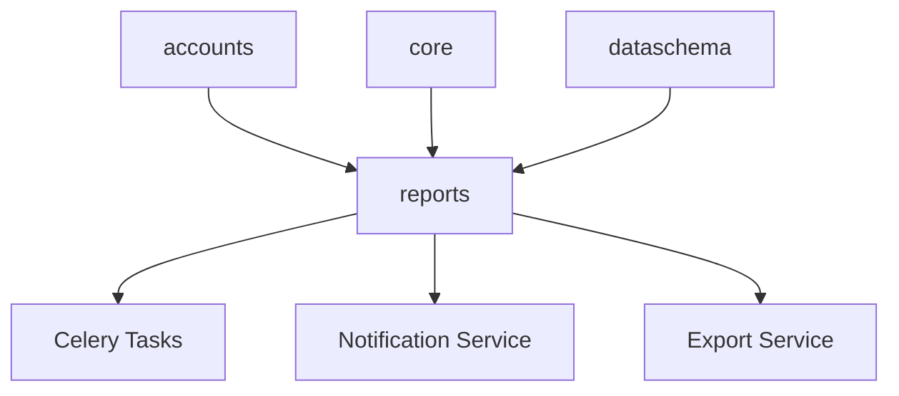
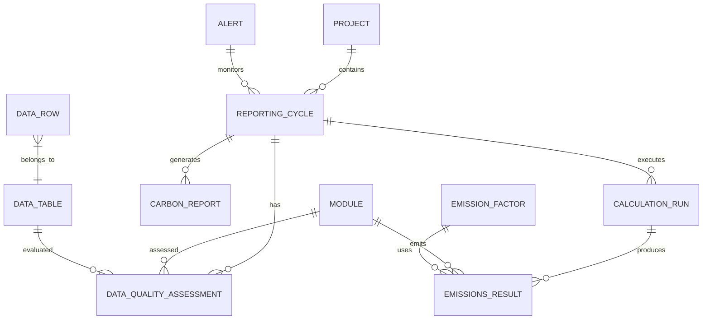

# Carbon Report Manager - Design & Implementation Plan

> **Author**: Expert Carbon Accounting Architect  
> **Version**: 1.0  
> **Date**: January 2026  
> **Status**: Planning Phase

---

## Executive Summary

The **Report Manager** is a critical new module for the AASTMT Carbon Platform that orchestrates complete carbon accounting cycles—from data validation through calculation to report generation. It serves as the **intelligence layer** that transforms raw emissions data into actionable, auditable carbon reports.

### Core Value Proposition

| Capability | Business Impact |
|-----------|-----------------|
| **Automated Data Quality Checks** | Reduces manual review time by 80% |
| **Missing Data Detection** | Prevents incomplete reporting |
| **Outlier Identification** | Catches data entry errors early |
| **Calculation Engine** | Ensures consistent GHG Protocol compliance |
| **Report Generation** | Produces audit-ready documentation |

---

## 1. Architecture Overview

### 1.1 System Context

```
┌─────────────────────────────────────────────────────────────────────────────┐
│                          AASTMT Carbon Platform                             │
├─────────────────────────────────────────────────────────────────────────────┤
│                                                                             │
│  ┌──────────────┐    ┌──────────────┐    ┌──────────────────────────────┐  │
│  │  DataSchema  │───▶│   Reports    │───▶│     Report Outputs           │  │
│  │  (Raw Data)  │    │   Manager    │    │  • PDF Reports               │  │
│  └──────────────┘    │              │    │  • Excel Exports             │  │
│                      │  ┌────────┐  │    │  • Dashboard Widgets         │  │
│  ┌──────────────┐    │  │ Cycle  │  │    │  • API Endpoints             │  │
│  │    Core      │───▶│  │Manager │  │    └──────────────────────────────┘  │
│  │ (Projects/   │    │  └────────┘  │                                      │
│  │  Modules)    │    │              │    ┌──────────────────────────────┐  │
│  └──────────────┘    │  ┌────────┐  │    │    Notifications             │  │
│                      │  │Quality │  │───▶│  • Missing Data Alerts       │  │
│  ┌──────────────┐    │  │Engine  │  │    │  • Outlier Warnings          │  │
│  │  Accounts    │───▶│  └────────┘  │    │  • Completion Reminders      │  │
│  │  (RBAC)      │    │              │    └──────────────────────────────┘  │
│  └──────────────┘    │  ┌────────┐  │                                      │
│                      │  │Calc    │  │                                      │
│                      │  │Engine  │  │                                      │
│                      │  └────────┘  │                                      │
│                      └──────────────┘                                      │
│                                                                             │
└─────────────────────────────────────────────────────────────────────────────┘
```

### 1.2 Module Dependencies



---

## 2. Domain Model

### 2.1 Core Entities

#### ReportingCycle

The **ReportingCycle** represents a bounded time period for carbon accounting (typically annual, quarterly, or monthly).

```python
class ReportingCycle(models.Model):
    """
    A defined reporting period for carbon accounting.
    Aligns with GHG Protocol reporting requirements.
    """
    STATUS_CHOICES = [
        ('draft', 'Draft'),
        ('data_collection', 'Data Collection'),
        ('validation', 'Under Validation'),
        ('calculation', 'Calculating'),
        ('review', 'Under Review'),
        ('approved', 'Approved'),
        ('published', 'Published'),
        ('archived', 'Archived'),
    ]
    
    project = models.ForeignKey('core.Project', on_delete=models.CASCADE)
    name = models.CharField(max_length=100)  # e.g., "FY2025", "Q1 2026"
    cycle_type = models.CharField(max_length=20)  # annual, quarterly, monthly
    start_date = models.DateField()
    end_date = models.DateField()
    status = models.CharField(max_length=20, choices=STATUS_CHOICES, default='draft')
    
    # Metadata
    created_by = models.ForeignKey(User, on_delete=models.SET_NULL, null=True)
    created_at = models.DateTimeField(auto_now_add=True)
    approved_by = models.ForeignKey(User, on_delete=models.SET_NULL, null=True)
    approved_at = models.DateTimeField(null=True, blank=True)
    
    # Configuration
    emission_factors_version = models.CharField(max_length=50)  # Track EF version used
    calculation_methodology = models.JSONField(default=dict)  # GHG Protocol settings
```

#### DataQualityAssessment

Tracks the quality and completeness of data for each reporting cycle.

```python
class DataQualityAssessment(models.Model):
    """
    Comprehensive data quality analysis for a reporting cycle.
    """
    SEVERITY_CHOICES = [
        ('critical', 'Critical - Blocks Report'),
        ('warning', 'Warning - Needs Review'),
        ('info', 'Info - Optional Improvement'),
    ]
    
    reporting_cycle = models.ForeignKey(ReportingCycle, on_delete=models.CASCADE)
    module = models.ForeignKey('core.Module', on_delete=models.CASCADE)
    data_table = models.ForeignKey('dataschema.DataTable', on_delete=models.CASCADE)
    
    # Quality Metrics
    completeness_score = models.FloatField()  # 0-100%
    accuracy_score = models.FloatField()  # Based on outlier detection
    consistency_score = models.FloatField()  # Cross-reference checks
    timeliness_score = models.FloatField()  # Data freshness
    overall_score = models.FloatField()  # Weighted composite
    
    # Issue Tracking
    issues = models.JSONField(default=list)
    # [{"type": "missing", "field": "co2e", "rows": [1,2,3], "severity": "critical"}]
    
    assessed_at = models.DateTimeField(auto_now=True)
    assessed_by = models.ForeignKey(User, on_delete=models.SET_NULL, null=True)
```

#### CalculationRun

Records each calculation execution with full audit trail.

```python
class CalculationRun(models.Model):
    """
    Immutable record of a calculation execution.
    Enables audit trail and recalculation history.
    """
    STATUS_CHOICES = [
        ('pending', 'Pending'),
        ('running', 'Running'),
        ('completed', 'Completed'),
        ('failed', 'Failed'),
        ('cancelled', 'Cancelled'),
    ]
    
    reporting_cycle = models.ForeignKey(ReportingCycle, on_delete=models.CASCADE)
    run_number = models.PositiveIntegerField()  # Auto-increment per cycle
    
    status = models.CharField(max_length=20, choices=STATUS_CHOICES)
    started_at = models.DateTimeField()
    completed_at = models.DateTimeField(null=True)
    
    # Configuration snapshot (immutable record of what was calculated)
    input_data_snapshot = models.JSONField()  # Hash or summary of input data
    emission_factors_used = models.JSONField()  # EF values at calculation time
    methodology_config = models.JSONField()
    
    # Results
    results = models.JSONField(null=True)
    error_log = models.TextField(blank=True)
    
    triggered_by = models.ForeignKey(User, on_delete=models.SET_NULL, null=True)
```

#### EmissionsResult

Stores calculated emissions with full granularity.

```python
class EmissionsResult(models.Model):
    """
    Calculated emissions result at module level.
    Aggregatable to scope and project totals.
    """
    calculation_run = models.ForeignKey(CalculationRun, on_delete=models.CASCADE)
    module = models.ForeignKey('core.Module', on_delete=models.CASCADE)
    
    # GHG Protocol Categories
    scope = models.PositiveSmallIntegerField()  # 1, 2, 3
    category = models.CharField(max_length=50)  # e.g., "stationary_combustion"
    subcategory = models.CharField(max_length=50, blank=True)
    
    # Emissions by Gas (tonnes)
    co2_tonnes = models.DecimalField(max_digits=15, decimal_places=4)
    ch4_tonnes = models.DecimalField(max_digits=15, decimal_places=4)
    n2o_tonnes = models.DecimalField(max_digits=15, decimal_places=4)
    hfcs_tonnes = models.DecimalField(max_digits=15, decimal_places=4, default=0)
    pfcs_tonnes = models.DecimalField(max_digits=15, decimal_places=4, default=0)
    sf6_tonnes = models.DecimalField(max_digits=15, decimal_places=4, default=0)
    nf3_tonnes = models.DecimalField(max_digits=15, decimal_places=4, default=0)
    
    # Total CO2e (using GWP values)
    co2e_tonnes = models.DecimalField(max_digits=15, decimal_places=4)
    
    # Data Quality
    data_quality_rating = models.CharField(max_length=20)  # high/medium/low
    uncertainty_percentage = models.FloatField(null=True)
    
    # Calculation details for audit
    calculation_details = models.JSONField()  # Activity data × EF = result
```

#### CarbonReport

The final generated report artifact.

```python
class CarbonReport(models.Model):
    """
    Generated carbon report with versioning and approval workflow.
    """
    REPORT_TYPES = [
        ('inventory', 'GHG Inventory Report'),
        ('verification', 'Verification Report'),
        ('disclosure', 'CDP/GRI Disclosure'),
        ('internal', 'Internal Management Report'),
        ('summary', 'Executive Summary'),
    ]
    
    reporting_cycle = models.ForeignKey(ReportingCycle, on_delete=models.CASCADE)
    calculation_run = models.ForeignKey(CalculationRun, on_delete=models.CASCADE)
    
    report_type = models.CharField(max_length=20, choices=REPORT_TYPES)
    version = models.PositiveIntegerField(default=1)
    
    # Content
    title = models.CharField(max_length=200)
    executive_summary = models.TextField()
    methodology_notes = models.TextField()
    
    # Generated Files
    pdf_file = models.FileField(upload_to='reports/pdf/', null=True)
    excel_file = models.FileField(upload_to='reports/excel/', null=True)
    json_data = models.JSONField()  # Machine-readable structured data
    
    # Workflow
    status = models.CharField(max_length=20)  # draft, review, approved, published
    generated_at = models.DateTimeField(auto_now_add=True)
    generated_by = models.ForeignKey(User, on_delete=models.SET_NULL, null=True)
    reviewed_by = models.ForeignKey(User, on_delete=models.SET_NULL, null=True)
    approved_by = models.ForeignKey(User, on_delete=models.SET_NULL, null=True)
```

### 2.2 Entity Relationship Diagram



---

## 3. Calculation Engine

### 3.1 GHG Protocol Calculation Framework

The calculation engine implements the GHG Protocol Corporate Standard methodology:

```
CO₂e = Activity Data × Emission Factor × GWP
```

### 3.2 Calculation Pipeline

```python
class CalculationPipeline:
    """
    Orchestrates the multi-step calculation process.
    """
    
    def __init__(self, reporting_cycle: ReportingCycle):
        self.cycle = reporting_cycle
        self.run = None
        
    def execute(self) -> CalculationRun:
        """
        Execute complete calculation pipeline.
        """
        self.run = self._create_run()
        
        try:
            # Step 1: Data Validation
            self._validate_data()
            
            # Step 2: Scope 1 Direct Emissions
            scope1_results = self._calculate_scope1()
            
            # Step 3: Scope 2 Energy Emissions
            scope2_results = self._calculate_scope2()
            
            # Step 4: Scope 3 Value Chain
            scope3_results = self._calculate_scope3()
            
            # Step 5: Aggregate and Store
            self._store_results(scope1_results + scope2_results + scope3_results)
            
            # Step 6: Generate Quality Report
            self._assess_quality()
            
            self.run.status = 'completed'
            self.run.save()
            
        except CalculationError as e:
            self.run.status = 'failed'
            self.run.error_log = str(e)
            self.run.save()
            raise
            
        return self.run
```

### 3.3 Emission Factor Management

```python
class EmissionFactorService:
    """
    Manages emission factors with versioning and source tracking.
    """
    
    def get_factor(self, 
                   category: str, 
                   fuel_type: str = None,
                   region: str = None,
                   year: int = None) -> EmissionFactor:
        """
        Retrieve the appropriate emission factor based on hierarchy:
        1. Organization-specific (if defined)
        2. Regional/National
        3. IPCC Default
        """
        pass
        
    def validate_factors(self, cycle: ReportingCycle) -> List[Issue]:
        """
        Check that all required EFs are available for calculation.
        """
        pass
```

---

## 4. Data Quality Engine

### 4.1 Quality Check Framework

The Data Quality Engine performs comprehensive validation:

| Check Type | Description | Example |
|-----------|-------------|---------|
| **Completeness** | Required fields have values | `co2e_emissions` is not null |
| **Validity** | Values within expected ranges | Fuel consumption > 0 |
| **Consistency** | Cross-field logic checks | End date > Start date |
| **Accuracy** | Outlier detection | Value within 3σ of mean |
| **Timeliness** | Data freshness | Entry within reporting period |

### 4.2 Missing Data Detection

```python
class MissingDataDetector:
    """
    Identifies gaps in data coverage for reporting requirements.
    """
    
    def analyze(self, cycle: ReportingCycle) -> MissingDataReport:
        """
        Comprehensive missing data analysis.
        """
        report = MissingDataReport(cycle=cycle)
        
        for module in cycle.project.modules.all():
            # Check for expected data entries
            expected = self._get_expected_entries(module, cycle)
            actual = self._get_actual_entries(module, cycle)
            
            missing = expected - actual
            
            for entry in missing:
                report.add_issue(
                    module=module,
                    issue_type='missing_entry',
                    description=f"No data for {entry.period}",
                    severity='critical' if entry.required else 'warning'
                )
                
        return report
```

### 4.3 Outlier Detection

```python
class OutlierDetector:
    """
    Statistical outlier detection for emissions data.
    """
    
    def detect(self, data_table: DataTable, field: str) -> List[OutlierIssue]:
        """
        Identify statistical outliers using multiple methods.
        """
        values = self._get_field_values(data_table, field)
        
        outliers = []
        
        # Method 1: Z-Score (for normal distributions)
        z_outliers = self._z_score_detection(values, threshold=3.0)
        
        # Method 2: IQR (robust to non-normal)
        iqr_outliers = self._iqr_detection(values, multiplier=1.5)
        
        # Method 3: Year-over-Year comparison
        yoy_outliers = self._yoy_comparison(values, threshold=0.5)
        
        # Combine and deduplicate
        return self._merge_outliers(z_outliers, iqr_outliers, yoy_outliers)
```

---

## 5. Alert & Notification System

### 5.1 Alert Types

| Alert Type | Trigger | Priority | Action Required |
|-----------|---------|----------|-----------------|
| Missing Data | Coverage < 90% | High | Add missing entries |
| Outlier Detected | Value > 3σ | Medium | Review and confirm |
| Deadline Approaching | T-7 days | High | Complete data entry |
| Calculation Failed | Error in calc | Critical | Fix data issues |
| Approval Required | Report ready | Medium | Review and approve |

### 5.2 Notification Preferences

```python
class NotificationPreference(models.Model):
    """
    User preferences for report notifications.
    """
    user = models.ForeignKey(User, on_delete=models.CASCADE)
    
    # Channel preferences
    email_enabled = models.BooleanField(default=True)
    in_app_enabled = models.BooleanField(default=True)
    
    # Alert type preferences
    missing_data_alerts = models.BooleanField(default=True)
    outlier_alerts = models.BooleanField(default=True)
    deadline_reminders = models.BooleanField(default=True)
    calculation_alerts = models.BooleanField(default=True)
    approval_requests = models.BooleanField(default=True)
    
    # Digest preferences
    daily_digest = models.BooleanField(default=False)
    weekly_summary = models.BooleanField(default=True)
```

---

## 6. API Design

### 6.1 REST Endpoints

```
# Reporting Cycles
GET     /api/reports/cycles/                    # List cycles
POST    /api/reports/cycles/                    # Create cycle
GET     /api/reports/cycles/{id}/               # Get cycle details
PATCH   /api/reports/cycles/{id}/               # Update cycle
POST    /api/reports/cycles/{id}/start/         # Start data collection
POST    /api/reports/cycles/{id}/calculate/     # Trigger calculation
POST    /api/reports/cycles/{id}/approve/       # Approve cycle

# Data Quality
GET     /api/reports/cycles/{id}/quality/       # Quality assessment
GET     /api/reports/cycles/{id}/missing/       # Missing data report
GET     /api/reports/cycles/{id}/outliers/      # Outlier report
POST    /api/reports/cycles/{id}/validate/      # Run validation

# Calculations
GET     /api/reports/cycles/{id}/runs/          # Calculation history
GET     /api/reports/runs/{id}/                 # Run details
GET     /api/reports/runs/{id}/results/         # Calculation results

# Reports
GET     /api/reports/cycles/{id}/reports/       # Generated reports
POST    /api/reports/cycles/{id}/generate/      # Generate report
GET     /api/reports/{id}/download/             # Download report
POST    /api/reports/{id}/approve/              # Approve report

# Alerts
GET     /api/reports/alerts/                    # User's alerts
POST    /api/reports/alerts/{id}/acknowledge/   # Acknowledge alert
GET     /api/reports/alerts/settings/           # Notification preferences
PATCH   /api/reports/alerts/settings/           # Update preferences
```

### 6.2 Key Response Formats

```json
// GET /api/reports/cycles/{id}/quality/
{
  "cycle_id": 1,
  "overall_score": 87.5,
  "status": "needs_attention",
  "summary": {
    "total_modules": 15,
    "complete_modules": 12,
    "modules_with_issues": 3
  },
  "by_scope": [
    {"scope": 1, "completeness": 95.0, "issues": 2},
    {"scope": 2, "completeness": 100.0, "issues": 0},
    {"scope": 3, "completeness": 72.0, "issues": 8}
  ],
  "critical_issues": [
    {
      "module": "Business Travel",
      "type": "missing_data",
      "description": "No data for Q3 2025",
      "action": "Add travel records for July-September"
    }
  ],
  "assessed_at": "2026-01-12T10:30:00Z"
}
```

---

## 7. Frontend Components

### 7.1 Report Manager Dashboard

```jsx
// src/pages/ReportManagerPage.jsx

const ReportManagerPage = () => {
  return (
    <Box>
      {/* Cycle Selector & Status */}
      <CycleHeader 
        cycle={currentCycle}
        onCycleChange={handleCycleChange}
      />
      
      {/* Progress Overview */}
      <CycleProgressStepper 
        steps={['Draft', 'Data Collection', 'Validation', 'Calculation', 'Review', 'Published']}
        currentStep={cycle.status}
      />
      
      {/* Data Quality Dashboard */}
      <DataQualityPanel 
        qualityData={qualityAssessment}
        onIssueClick={navigateToIssue}
      />
      
      {/* Scope Summary Cards */}
      <Grid container spacing={3}>
        <Grid item xs={4}>
          <ScopeCard scope={1} data={scope1Summary} color="#10b981" />
        </Grid>
        <Grid item xs={4}>
          <ScopeCard scope={2} data={scope2Summary} color="#3b82f6" />
        </Grid>
        <Grid item xs={4}>
          <ScopeCard scope={3} data={scope3Summary} color="#f97316" />
        </Grid>
      </Grid>
      
      {/* Action Panel */}
      <ActionPanel 
        canCalculate={!hasBlockingIssues}
        onCalculate={triggerCalculation}
        onGenerateReport={generateReport}
      />
      
      {/* Alerts & Notifications */}
      <AlertsPanel alerts={activeAlerts} />
    </Box>
  );
};
```

### 7.2 Component Library

| Component | Purpose |
|-----------|---------|
| `CycleSelector` | Dropdown to switch between reporting cycles |
| `CycleProgressStepper` | Visual workflow status indicator |
| `DataQualityGauge` | Circular gauge showing quality score |
| `IssuesList` | List of data issues with severity badges |
| `MissingDataTable` | Tabular view of gaps with action buttons |
| `OutlierChart` | Scatter plot highlighting outliers |
| `CalculationHistory` | Timeline of calculation runs |
| `ReportPreview` | PDF/Excel preview modal |

---

## 8. Implementation Phases

### Phase 1: Foundation (Weeks 1-3)
**Goal**: Core models and basic CRUD

- [ ] Create `reports` Django app
- [ ] Implement `ReportingCycle` model and API
- [ ] Basic cycle management UI
- [ ] Database migrations
- [ ] Unit tests for models

### Phase 2: Data Quality (Weeks 4-6)
**Goal**: Quality assessment and alerting

- [ ] Implement `DataQualityAssessment` model
- [ ] Missing data detection algorithm
- [ ] Outlier detection service
- [ ] Alert model and notification system
- [ ] Quality dashboard UI

### Phase 3: Calculation Engine (Weeks 7-10)
**Goal**: GHG Protocol calculations

- [ ] Emission Factor model and management
- [ ] Calculation pipeline implementation
- [ ] Scope 1 calculators (combustion, fugitive, process)
- [ ] Scope 2 calculators (location/market-based)
- [ ] Scope 3 calculators (15 categories)
- [ ] Calculation history and audit trail

### Phase 4: Report Generation (Weeks 11-13)
**Goal**: Report creation and export

- [ ] Report templates (PDF, Excel)
- [ ] GHG Inventory report generator
- [ ] Executive summary generator
- [ ] Export service (multiple formats)
- [ ] Report approval workflow

### Phase 5: Polish & Integration (Weeks 14-16)
**Goal**: UX refinement and integration

- [ ] Dashboard widgets integration
- [ ] Email notification templates
- [ ] Performance optimization
- [ ] Comprehensive testing
- [ ] Documentation

---

## 9. Technical Specifications

### 9.1 Backend Stack

```yaml
Framework: Django 4.2+
Database: PostgreSQL 15
Task Queue: Celery + Redis
PDF Generation: WeasyPrint or ReportLab
Excel Generation: openpyxl
API: Django REST Framework
Testing: pytest + factory_boy
```

### 9.2 File Structure

```
backend/reports/
├── __init__.py
├── admin.py
├── apps.py
├── models/
│   ├── __init__.py
│   ├── cycle.py           # ReportingCycle
│   ├── quality.py         # DataQualityAssessment
│   ├── calculation.py     # CalculationRun, EmissionsResult
│   ├── report.py          # CarbonReport
│   ├── alert.py           # Alert, NotificationPreference
│   └── emission_factor.py # EmissionFactor
├── services/
│   ├── __init__.py
│   ├── quality_engine.py
│   ├── calculation_engine.py
│   ├── outlier_detector.py
│   ├── missing_data_detector.py
│   ├── report_generator.py
│   └── notification_service.py
├── serializers/
│   ├── __init__.py
│   ├── cycle.py
│   ├── quality.py
│   ├── calculation.py
│   └── report.py
├── views/
│   ├── __init__.py
│   ├── cycle.py
│   ├── quality.py
│   ├── calculation.py
│   └── report.py
├── tasks/
│   ├── __init__.py
│   ├── calculation_tasks.py
│   └── notification_tasks.py
├── templates/
│   ├── reports/
│   │   ├── inventory_report.html
│   │   └── executive_summary.html
│   └── emails/
│       ├── alert.html
│       └── digest.html
├── tests/
│   ├── __init__.py
│   ├── test_models.py
│   ├── test_quality_engine.py
│   ├── test_calculation_engine.py
│   └── test_api.py
├── urls.py
└── permissions.py
```

### 9.3 Frontend Structure

```
carbon-frontend/src/
├── pages/
│   ├── ReportManagerPage.jsx
│   ├── CycleDetailPage.jsx
│   ├── CalculationResultsPage.jsx
│   └── ReportViewerPage.jsx
├── components/
│   └── reports/
│       ├── CycleSelector.jsx
│       ├── CycleProgressStepper.jsx
│       ├── DataQualityGauge.jsx
│       ├── DataQualityPanel.jsx
│       ├── IssuesList.jsx
│       ├── MissingDataTable.jsx
│       ├── OutlierChart.jsx
│       ├── ScopeCard.jsx
│       ├── CalculationHistory.jsx
│       ├── ActionPanel.jsx
│       └── AlertsPanel.jsx
└── api/
    └── reports.js
```

---

## 10. Security & Permissions

### 10.1 RBAC Matrix

| Action | Admin | Manager | Analyst | Viewer |
|--------|:-----:|:-------:|:-------:|:------:|
| Create Cycle | ✅ | ✅ | ❌ | ❌ |
| Edit Cycle | ✅ | ✅ | ❌ | ❌ |
| Trigger Calculation | ✅ | ✅ | ❌ | ❌ |
| View Quality Report | ✅ | ✅ | ✅ | ✅ |
| Approve Report | ✅ | ❌ | ❌ | ❌ |
| Download Report | ✅ | ✅ | ✅ | ✅ |
| Manage Alerts | ✅ | ✅ | ✅ | ❌ |

### 10.2 Audit Requirements

All critical operations must be logged:
- Cycle status changes
- Calculation triggers
- Report approvals
- Data modifications during validation

---

## 11. Performance Considerations

### 11.1 Optimization Strategies

| Concern | Strategy |
|---------|----------|
| Large datasets | Pagination + lazy loading |
| Complex calculations | Background tasks (Celery) |
| Report generation | Async with progress tracking |
| Dashboard queries | Materialized views / caching |
| Quality checks | Incremental validation |

### 11.2 Caching Strategy

```python
# Cache quality scores for 5 minutes
@cache.memoize(timeout=300)
def get_cycle_quality_score(cycle_id: int) -> float:
    ...

# Invalidate on data changes
def on_data_change(sender, instance, **kwargs):
    cache.delete(f'quality_score_{instance.cycle_id}')
```

---

## 12. Success Metrics

| Metric | Target | Measurement |
|--------|--------|-------------|
| Data completeness detection | 99% accuracy | Automated tests |
| Calculation time (full cycle) | < 2 minutes | Performance benchmarks |
| Report generation | < 30 seconds | API response time |
| User adoption | 80% of projects | Usage analytics |
| Issue resolution time | < 24 hours | Alert → resolution tracking |

---

## 13. Risk Mitigation

| Risk | Impact | Mitigation |
|------|--------|------------|
| Incorrect calculations | High | Extensive test coverage, peer review |
| Performance degradation | Medium | Load testing, query optimization |
| Data loss | Critical | Immutable calculation records |
| Scope creep | Medium | Phased implementation, clear MVP |
| User resistance | Medium | Intuitive UI, gradual rollout |

---

## 14. Dependencies & Prerequisites

### Required Before Start
- [ ] Emission factor database design approved
- [ ] GHG Protocol methodology documented
- [ ] RBAC permissions finalized
- [ ] Celery/Redis infrastructure ready

### External Dependencies
- WeasyPrint for PDF generation
- openpyxl for Excel export
- Celery + Redis for task queue
- Email service (SMTP/SendGrid)

---

## 15. Next Steps

1. **Immediate**: Review and approve this design document
2. **Week 1**: Set up `reports` Django app skeleton
3. **Week 1**: Create database migrations
4. **Week 2**: Implement core models and basic API
5. **Week 3**: Build cycle management UI

---

## Appendix A: GHG Protocol Categories

### Scope 1 - Direct Emissions
1. Stationary combustion
2. Mobile combustion
3. Process emissions
4. Fugitive emissions

### Scope 2 - Indirect Energy
1. Purchased electricity
2. Purchased steam
3. Purchased heating
4. Purchased cooling

### Scope 3 - Value Chain
1. Purchased goods and services
2. Capital goods
3. Fuel- and energy-related activities
4. Upstream transportation
5. Waste generated in operations
6. Business travel
7. Employee commuting
8. Upstream leased assets
9. Downstream transportation
10. Processing of sold products
11. Use of sold products
12. End-of-life treatment
13. Downstream leased assets
14. Franchises
15. Investments

---

## Appendix B: Sample Calculation

```
Example: Scope 1 - Mobile Combustion (Company Vehicles)

Input Data:
- Fuel Type: Diesel
- Consumption: 10,000 liters
- Region: Egypt

Emission Factors (IPCC 2019):
- CO2: 2.68 kg/liter
- CH4: 0.00015 kg/liter
- N2O: 0.00015 kg/liter

GWP Values (AR6):
- CO2: 1
- CH4: 27.9
- N2O: 273

Calculation:
CO2 = 10,000 × 2.68 = 26,800 kg = 26.8 tonnes
CH4 = 10,000 × 0.00015 = 1.5 kg = 0.0015 tonnes
N2O = 10,000 × 0.00015 = 1.5 kg = 0.0015 tonnes

CO2e = 26.8 × 1 + 0.0015 × 27.9 + 0.0015 × 273
     = 26.8 + 0.042 + 0.410
     = 27.25 tonnes CO2e
```

---

*Document maintained by the Carbon Platform Architecture Team*
