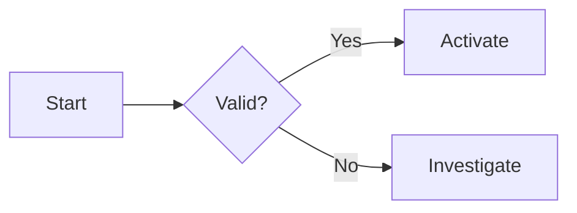
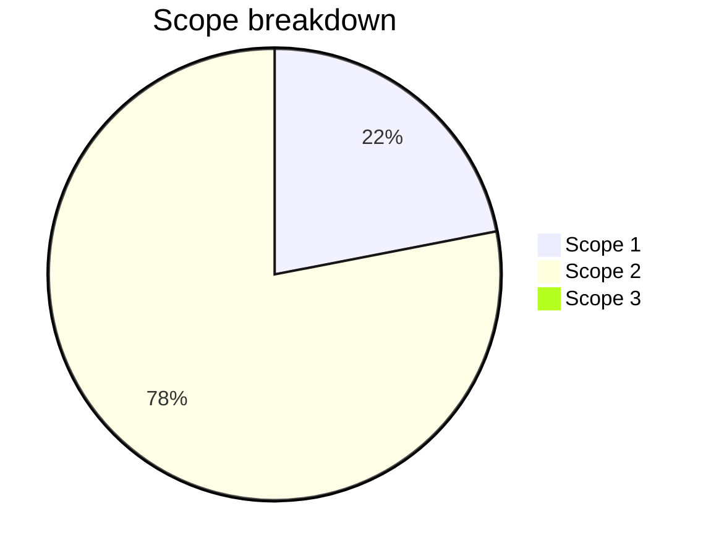
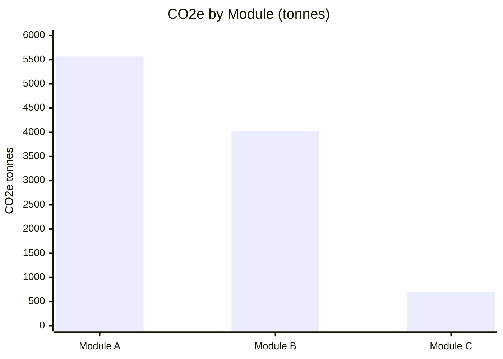

# Rich content rendering — worked examples

These are the full, worked examples for the `rich-content-rendering` guidance
skill. Loaded on demand (progressive disclosure) — they stay out of the
always-on prompt.

## Tables

GFM Markdown tables render as styled, striped tables. Leave a blank line before
the table, and put the header row, the `|---|---|` delimiter row, and EVERY data
row each on its OWN line:

| Position | Employees |
|----------|-----------|
| Driver   | 52        |
| Floorman | 22        |

A correctly formed module-breakdown table looks like:

| Module | Calculations | CO₂e (kg) | CO₂e (t) |
|--------|-------------|-----------|---------|
| Module A | 47 | 5,586,304 | 5,566 |
| Module B | 84 | 4,023,122 | 4,023 |

One data row per line — never collapse rows onto one line (a single-line table
renders as raw `|` text, not a table).

## Code

Fenced blocks render with syntax highlighting, a language badge, and a copy
button. Always format JSON with 2-space indentation and line breaks:

```json
{
  "name": "Example Rule",
  "type": "threshold",
  "params": {
    "operator": "gt",
    "value": 0
  }
}
```

## Diagrams

A ```mermaid fenced block renders as a live diagram (flowchart, sequenceDiagram,
stateDiagram-v2, classDiagram, pie, gantt, ...). The opening ```mermaid fence
MUST start on its OWN line, preceded by a blank line; the closing ``` MUST be on
its own line too. Put every mermaid directive on its own line. You CAN draw
diagrams — never say you cannot.



## Data charts

When the answer holds 3+ comparable numeric records, emit a Mermaid chart IN
ADDITION to a table:

- Use ```mermaid pie for parts-of-a-whole (scope %, category shares that sum to 100%).
- Use ```mermaid xychart-beta with `bar` for magnitudes across independent categories.
- Use ```mermaid xychart-beta with `line` for trends over time.
- Keep x-axis labels short; use a hyphen instead of an em-dash. One `bar` line
  holds ALL values comma-separated. Every directive goes on its own line.





Never write `axis x`, `axis y`, or per-point `bar x: 1 y: 2.51` lines — use
exactly the `x-axis [...]` / `y-axis "..." 0 --> N` / `bar [...]` form above.

## Math, figures, links

- **Math** — `$inline$` and `$$block$$` render with KaTeX.
- **Figures** — images with a title render with a caption below them.
- **Links** — internal platform routes (starting with `/`) render as in-app links.
