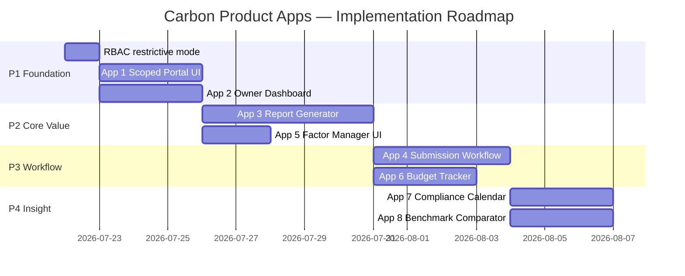

# Carbon Product Apps — Architecture & Portfolio Plan

> **Status:** Approved direction for Phase 2 carbon-specific application layer  
> **Prerequisite:** Data Trust Core Phase 1 — ✅ COMPLETE (326 tests passing)  
> **Author:** Architect  
> **Date:** 2026-07-21

---

## 1. Readiness Assessment — Is the Core Ready?

**Short answer: YES. The platform is ready to host carbon product apps.**

### What's solid (don't rebuild)

| Foundation | Status | Notes |
|---|---|---|
| `ScopedRole` + `OrgUnit` tree RBAC | ✅ Production-ready | `get_descendant_ids()` drives all scoping |
| Org-scoped `get_queryset()` | ✅ In all ViewSets | catalog, mdm, dq all filter by user's org_units |
| `ReportingPeriod` lifecycle | ✅ Already complete | draft→open→locked→submitted→verified→closed |
| `CalculationRule` auto-calc | ✅ Working | Field → EmissionFactor auto-trigger |
| `Calculation` with full audit trail | ✅ Working | scope, category, reporting_period, module FKs |
| DQ metrics API (org-scoped) | ✅ `DQMetricsView` | Already scoped to user's org_units |
| GovernanceEvent audit trail | ✅ Emitted on all CRUD | `emit_governance_event()` in all ViewSets |
| Structured JSON logging + correlation IDs | ✅ Track E complete | `X-Correlation-ID` header on all responses |
| Swagger/OpenAPI documentation | ✅ Rich descriptions | All endpoints documented |

### What's permissive (tighten before prod)

- `get_queryset()` in all ViewSets uses **permissive mode**: users with no org_units assigned see *all* data. Before deploying the scoped data owner portal, flip to **restrictive mode** (return empty queryset if no org_units).
- No `org_unit` filter on `Calculation` queryset yet — emissions results are only scoped via `module.org_unit` (indirect). Direct filtering needs a service-layer method.

### What's missing (build now)

- No dedicated **scoped data owner UI experience** — admins and data owners use the same screens.
- No **report generation service** — `ReportingPeriod` and `Calculation` models exist but no export/aggregation API.
- No **emission factor management UI** — factors are admin-only via Django admin.
- No **carbon budget / target tracker** — `ReportingPeriod.is_baseline` exists but no target model.

---

## 2. Carbon App Portfolio

### Architecture overview

```
┌─────────────────────────────────────────────────────────────────────┐
│  CARBON PRODUCT APPS (org-unit scoped, emissions domain)            │
│                                                                      │
│  App 1: Scoped Data Owner Portal    App 2: Scoped Owner Dashboard    │
│  App 3: Report Generator            App 4: Data Submission Workflow  │
│  App 5: Emission Factor Manager     App 6: Carbon Budget Tracker     │
│  App 7: Compliance Calendar         App 8: Benchmark Comparator      │
└──────────────────▲──────────────────────────────────────────────────┘
                   │ consumes via REST (ScopedRole-protected)
┌──────────────────┴──────────────────────────────────────────────────┐
│  DATA TRUST CORE — catalog / mdm / dq  (domain-agnostic)            │
│  dataschema engine · accounts RBAC · core OrgUnit/Module            │
│  emissions: Calculation, EmissionFactor, ReportingPeriod, GWP       │
└─────────────────────────────────────────────────────────────────────┘
```

---

## 3. App Designs

### App 1 — Scoped Data Owner Portal

**What it is:** A dedicated frontend experience for data stewards and campus data owners. A Smart Village user sees ONLY Smart Village domains, org units, data assets, and DQ status. Colleges and unrelated departments are invisible.

**User story:** *"As the Facilities data owner at Smart Village campus, when I log in I see only Smart Village data — my modules, my assets, my quality scores, my audit history."*

**Backend requirements:**

| Endpoint | Status | Gap |
|---|---|---|
| `GET /catalog/assets/?org_unit=...` | ✅ Exists | Tighten to restrictive mode |
| `GET /catalog/domains/?org_unit=...` | ✅ Exists | Already filtered |
| `GET /dq/metrics/` | ✅ Exists | `DQMetricsView` org-scoped |
| `GET /mdm/org-units/?scope=my_subtree` | ✅ Exists | `OrgUnitViewSet` |
| `GET /catalog/governance-events/?org_unit=...` | ✅ Exists | Filter by scope |
| Switch restrictive mode | ❌ Missing | `get_queryset()` change in all ViewSets |

**Frontend requirements:**
- New route: `/data-owner/` (role-gated to `data_owner` perspective)
- `DataOwnerShell` layout — simpler sidebar showing only scoped navigation
- `ScopedAssetsBrowser` — asset list with search, filtered to user's org_unit subtree
- `ScopedDomainCards` — domain tiles with asset count + quality badge
- `MyScopeSelector` — if user has multiple org_unit assignments, a picker at top

**Key design decisions:**
- Reuse `FilteredDataGrid` + `BaseDetailPage` components (no new pattern)
- Route guard: `RequireScope` — redirect users with no org_units to an "awaiting access" page
- The portal is an *additional entry point*, not a replacement for the full admin UI

---

### App 2 — Scoped Data Owner Dashboard

**What it is:** KPI-driven dashboard for a campus data owner. Shows: emissions this period, data quality score, pending submissions, recent activity — all scoped to the user's org_unit subtree.

**User story:** *"At a glance, I see: my campus submitted 1,240 tCO2e this month, data quality is 87%, 3 tables have missing data, and 2 governance policies are due."*

**New backend API needed:** `GET /emissions/owner-dashboard/?org_unit=<id>&period=<id>`

```json
{
  "org_unit": {"id": 5, "name": "Smart Village Campus"},
  "reporting_period": {"id": 2, "name": "FY 2025", "status": "open"},
  "emissions": {
    "total_co2e_tonne": 1240.5,
    "scope1_tonne": 320.1,
    "scope2_tonne": 850.4,
    "scope3_tonne": 70.0,
    "calculation_count": 1847,
    "vs_previous_period_pct": -3.2
  },
  "data_quality": {
    "avg_quality_score": 87.3,
    "passing_assets": 12,
    "warning_assets": 3,
    "failing_assets": 1
  },
  "submissions": {
    "modules_total": 5,
    "modules_with_data": 4,
    "modules_pending": 1,
    "last_submission_at": "2026-07-18T10:32:00Z"
  },
  "recent_events": [...]
}
```

**Backend location:** New view in `emissions/views.py` — `OwnerDashboardView`  
**RBAC:** Filtered by `request.user` → `scoped_roles` → `org_unit` subtree  
**Frontend:** Route `/data-owner/dashboard` — MUI metric cards + mini trend chart

---

### App 3 — Report Generator

**What it is:** A configurable reporting tool. Data owners and admins configure a reporting cycle, select scope (org_unit subtree + GHG scopes 1/2/3), choose what to calculate from, then preview and export.

**Key insight: `ReportingPeriod` already exists** — the model has full lifecycle, start/end dates, period_type, and status. The Report Generator is a UI + API layer *on top of* what's already built.

**Configuration contract (what the user defines):**

```
Cycle definition:
  - name: "FY 2026 Annual Report"
  - period: select existing ReportingPeriod OR define custom start/end
  - period_type: annual | quarterly | monthly | custom

Scope definition:
  - org_unit: select campus/department (subtree included)
  - ghg_scopes: [ ] Scope 1  [ ] Scope 2  [ ] Scope 3
  - categories: all | select [electricity, transport, ...]

Source definition:
  - calculation_source: "from Calculations table" (default) | "from raw DataRows + rules"
  - include_unverified: false (default)
  - emission_factor_version: latest | as-of-date

Output:
  - format: JSON | CSV | PDF summary
  - grouping: by module | by category | by month | by scope
  - include_DQ_status: true/false
```

**New backend needed:** `POST /emissions/reports/generate/`  
**New model needed:** `ReportConfig` — saves configuration for reuse  
**Output service:** `generate_report(config)` → aggregates `Calculation` records, joins `ReportingPeriod`, filters by org_unit subtree, groups per config

**Frontend:** Step wizard:
1. `PeriodStep` — select/define reporting cycle
2. `ScopeStep` — org unit + GHG scope selection
3. `SourceStep` — data sources, filters
4. `PreviewStep` — summary table, total CO2e by scope
5. `ExportStep` — download CSV/JSON, preview PDF

---

### App 4 — Data Submission Workflow (Expert Suggestion)

**What it is:** A guided data entry experience for non-technical campus staff. Instead of the raw `DataTableGrid`, they get a wizard-style form with field validation, progress tracking, and a submit-for-review action.

**Why it matters:** AASTMT has staff at multiple campuses who are not data professionals. The raw schema manager is too complex for them. This app abstracts it.

**New backend needed:**
- `POST /emissions/submissions/` — creates a `DataSubmission` record wrapping a `DataTable` + `ReportingPeriod`
- `POST /emissions/submissions/{id}/submit/` — transitions status to `submitted`
- `POST /emissions/submissions/{id}/approve/` or `reject/` — steward review

**New model:** `DataSubmission`
```python
class DataSubmission(models.Model):
    data_table = ForeignKey(DataTable)
    reporting_period = ForeignKey(ReportingPeriod)
    org_unit = ForeignKey(OrgUnit)
    submitted_by = ForeignKey(User)
    reviewed_by = ForeignKey(User, null=True)
    status = CharField(choices=['draft','submitted','approved','rejected','revision_requested'])
    submitted_at = DateTimeField(null=True)
    reviewed_at = DateTimeField(null=True)
    notes = TextField(blank=True)
```

**Frontend:** `/data-owner/submit/:moduleId` — replaces raw DataTableGrid with guided form

---

### App 5 — Emission Factor Management UI (Expert Suggestion)

**What it is:** A governed UI for managing `EmissionFactor` records, replacing the Django admin. Supports searching by category/scope/year, editing factor values with before/after audit trail, and versioning (new factor with `valid_from` date).

**Why it matters:** Emission factors change yearly (IPCC AR6, EPA eGRID updates). Right now they live in Django admin and seed scripts. Data stewards need to update them without touching code.

**Backend already exists:** `EmissionFactor` model is complete  
**New needed:** Full DRF ViewSet for `EmissionFactor` (currently only read via calculations)  
**Frontend:** Route `/catalog/emission-factors` — standard `FilteredDataGrid` with edit drawer

---

### App 6 — Carbon Budget Tracker (Expert Suggestion)

**What it is:** Set reduction targets per org_unit and track actual progress vs. target across reporting periods. Shows: baseline year emissions, current year, target % reduction, gap to target.

**New model needed:** `CarbonTarget`
```python
class CarbonTarget(models.Model):
    org_unit = ForeignKey(OrgUnit)
    baseline_period = ForeignKey(ReportingPeriod, related_name='baseline_targets')
    target_period = ForeignKey(ReportingPeriod, related_name='target_periods')
    scope = PositiveSmallIntegerField(choices=[1,2,3], null=True)  # null = all scopes
    reduction_pct = DecimalField()  # e.g. 30.0 = 30% reduction vs baseline
    target_co2e_tonne = DecimalField()  # computed from baseline × (1 - reduction_pct/100)
    notes = TextField(blank=True)
    created_by = ForeignKey(User)
```

**Frontend:** Bar chart: baseline vs actual vs target, per period. Traffic-light indicator.

---

### App 7 — Compliance Calendar (Expert Suggestion)

**What it is:** Deadline management for data submissions. Each `ReportingPeriod` gets deadlines per org_unit (e.g., "Smart Village electricity data due by Jan 15, 2026"). Automated status showing: overdue / on-track / submitted.

**New model needed:** `SubmissionDeadline`
```python
class SubmissionDeadline(models.Model):
    reporting_period = ForeignKey(ReportingPeriod)
    org_unit = ForeignKey(OrgUnit)
    module = ForeignKey(Module, null=True)  # specific module deadline
    due_date = DateField()
    reminder_days_before = PositiveIntegerField(default=7)
    status = CharField(choices=['pending','submitted','overdue','waived'])
```

**Frontend:** Calendar view + table view showing all deadlines. Color-coded by status.

---

### App 8 — Benchmark Comparator (Expert Suggestion)

**What it is:** Compare emissions intensity across campuses and against external benchmarks (e.g., Egyptian grid average, IPCC sectoral benchmarks). Helps management ask: "Is Smart Village's electricity intensity better or worse than Abu Qir?"

**No new models needed** — queries existing `Calculation` + `OrgUnit` data  
**New needed:** Aggregation API `GET /emissions/benchmarks/?metric=electricity_intensity&period=<id>`  
**Frontend:** Horizontal bar chart comparing org_units on chosen metric (kgCO2e/sqm, kgCO2e/person, etc.)

---

## 4. Implementation Sequence

```
Priority 1 — Immediate (unlocks all other apps)
  ├── Tighten RBAC restrictive mode (5 ViewSets, ~30 min backend)
  ├── App 1: Scoped Data Owner Portal (frontend only, backend ready)
  └── App 2: Scoped Data Owner Dashboard (1 new backend view + frontend)

Priority 2 — Carbon value delivery
  ├── App 3: Report Generator (ReportConfig model + generate service + UI wizard)
  └── App 5: Emission Factor Management UI (ViewSet + CRUD frontend page)

Priority 3 — Workflow & governance
  ├── App 4: Data Submission Workflow (DataSubmission model + approval flow + guided UI)
  └── App 6: Carbon Budget Tracker (CarbonTarget model + dashboard widget)

Priority 4 — Insight layer
  ├── App 7: Compliance Calendar (SubmissionDeadline model + calendar UI)
  └── App 8: Benchmark Comparator (aggregation API + comparison chart)
```



---

## 5. Data Model Gap Summary

| Model | App | Location | Status |
|---|---|---|---|
| `ReportConfig` | App 3 | `emissions/` | ❌ New |
| `DataSubmission` | App 4 | `emissions/` | ❌ New |
| `CarbonTarget` | App 6 | `emissions/` | ❌ New |
| `SubmissionDeadline` | App 7 | `emissions/` | ❌ New |
| `EmissionFactor` ViewSet | App 5 | `emissions/views.py` | ❌ Missing DRF endpoint |
| `OwnerDashboardView` | App 2 | `emissions/views.py` | ❌ New view |
| `generate_report()` service | App 3 | `emissions/services.py` | ❌ New service |

All new models go in `emissions/` (the Carbon app). Zero changes to `catalog`/`mdm`/`dq` core.

---

## 6. RBAC — Restrictive Mode Fix (Pre-requisite)

In all 5 ViewSets that use permissive mode, change `get_queryset()` to:

```python
# BEFORE (permissive — users with no org_units see everything)
org_units = _get_user_org_units(request.user)
if not org_units:
    return Model.objects.all()  # ← REMOVE THIS

# AFTER (restrictive — users with no org_units see nothing)
org_units = _get_user_org_units(request.user)
if not org_units:
    return Model.objects.none()  # ← CORRECT
```

**Files to change:**
- [`backend/dq/views.py`](backend/dq/views.py:68) — `FieldProfileViewSet.get_queryset()`
- [`backend/dq/views.py`](backend/dq/views.py:95) — `TableProfileViewSet.get_queryset()`
- [`backend/dq/views.py`](backend/dq/views.py:123) — `DQRuleViewSet.get_queryset()`
- [`backend/catalog/views.py`](backend/catalog/views.py) — `AssetProfileViewSet.get_queryset()`
- [`backend/mdm/views.py`](backend/mdm/views.py:512) — `OrgUnitViewSet.get_queryset()`

**Exception:** Super-admin users (`is_staff=True`) should bypass this and still see everything.

---

## 7. Frontend Architecture Notes

- **Reuse all existing components** — `BaseDetailPage`, `FilteredDataGrid`, `MetricCard`, `StandardDataGrid`
- **New route namespace** `/data-owner/` — separate from `/catalog/` admin routes
- **Role-gated routes** — use `RequireScope` wrapper (to be created) that checks `user.scoped_roles.exists()`
- **carbonTheme.js** — all new pages use existing MUI theme, no new theme needed
- **API layer** — new `carbon-frontend/src/api/emissions.js` functions for owner dashboard + report generator

---

## 8. Parallel Execution Plan

The P1 work can run in two parallel tracks:

**Backend Worker:** RBAC restrictive mode + `OwnerDashboardView` + `ReportConfig` model + `generate_report()` service  
**Frontend Worker:** Scoped Data Owner Portal UI + Owner Dashboard page (uses existing DQ metrics API)

These have zero dependencies on each other — backend and frontend workers proceed simultaneously, exactly as with Track E + DQ Dashboard UI.
